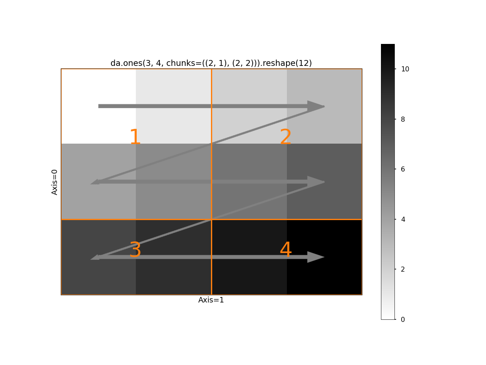
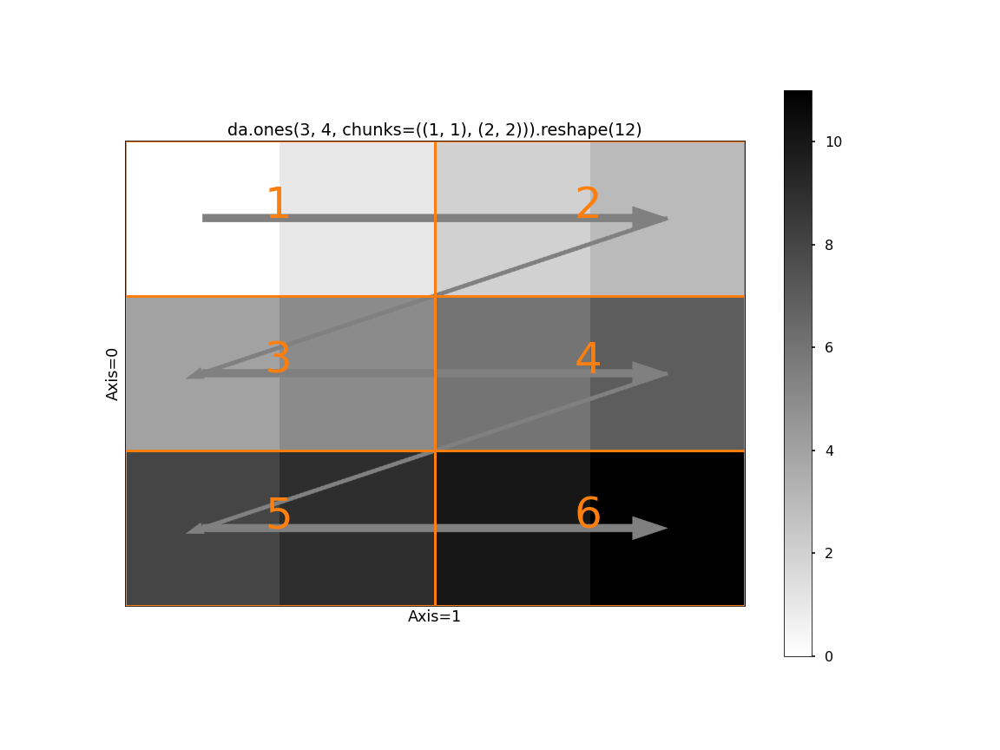
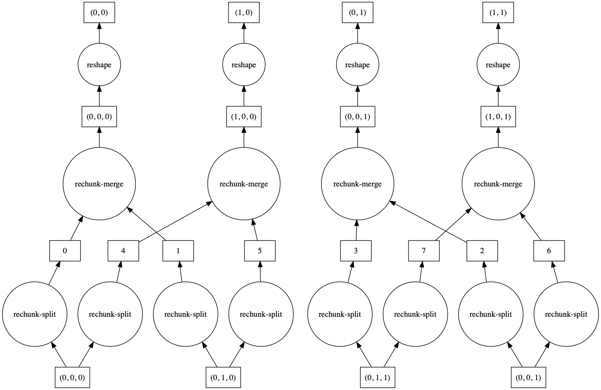
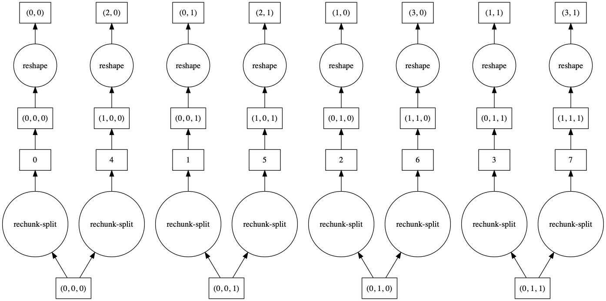

.. _array.chunks:

Chunks
======

Dask arrays are composed of many NumPy (or NumPy-like) arrays. How these arrays
are arranged can significantly affect performance.  For example, for a square
array you might arrange your chunks along rows, along columns, or in a more
square-like fashion. Different arrangements of NumPy arrays will be faster or
slower for different algorithms.

Thinking about and controlling chunking is important to optimize advanced
algorithms.

Specifying Chunk shapes
-----------------------

We always specify a ``chunks`` argument to tell dask.array how to break up the
underlying array into chunks.  We can specify ``chunks`` in a variety of ways:

1.  A uniform dimension size like ``1000``, meaning chunks of size ``1000`` in each dimension
2.  A uniform chunk shape like ``(1000, 2000, 3000)``, meaning chunks of size ``1000`` in the
    first axis, ``2000`` in the second axis, and ``3000`` in the third
3.  Fully explicit sizes of all blocks along all dimensions,
    like ``((1000, 1000, 500), (400, 400), (5, 5, 5, 5, 5))``
4.  A dictionary specifying chunk size per dimension like ``{0: 1000, 1: 2000,
    2: 3000}``.  This is just another way of writing the forms 2 and 3 above

Your chunks input will be normalized and stored in the third and most explicit
form.  Note that ``chunks`` stands for "chunk shape" rather than "number of
chunks", so specifying ``chunks=1`` means that you will have many chunks,
each with exactly one element.

For performance, a good choice of ``chunks`` follows the following rules:

1.  A chunk should be small enough to fit comfortably in memory.  We'll
    have many chunks in memory at once
2.  A chunk must be large enough so that computations on that chunk take
    significantly longer than the 1ms overhead per task that Dask scheduling
    incurs.  A task should take longer than 100ms
3.  Chunk sizes between 10MB-1GB are common, depending on the availability of
    RAM and the duration of computations
4.  Chunks should align with the computation that you want to do.

    For example, if you plan to frequently slice along a particular dimension,
    then it's more efficient if your chunks are aligned so that you have to
    touch fewer chunks.  If you want to add two arrays, then its convenient if
    those arrays have matching chunks patterns

5.  Chunks should align with your storage, if applicable.

    Array data formats are often chunked as well.  When loading or saving data,
    if is useful to have Dask array chunks that are aligned with the chunking
    of your storage, often an even multiple times larger in each direction

Unknown Chunks
--------------

Some arrays have unknown chunk sizes.  This arises whenever the size of an
array depends on lazy computations that we haven't yet performed like the
following:

.. code-block:: python

   >>> x = da.from_array(np.random.randn(100), chunks=20)
   >>> x += 0.1
   >>> y = x[x > 0]  # don't know how many values are greater than 0 ahead of time

Operations like the above result in arrays with unknown shapes and unknown
chunk sizes.  Unknown values within shape or chunks are designated using
``np.nan`` rather than an integer.  These arrays support many (but not all)
operations.  In particular, operations like slicing are not possible and will
result in an error.

.. code-block:: python

   >>> y.shape
   (np.nan,)
   >>> y[4]
   ...
   ValueError: Array chunk sizes unknown

   A possible solution: https://docs.dask.org/en/latest/array-chunks.html#unknown-chunks.
   Summary: to compute chunks sizes, use

       x.compute_chunk_sizes()  # for Dask Array
       ddf.to_dask_array(lengths=True)  # for Dask DataFrame ddf

Using :func:`~dask.array.Array.compute_chunk_sizes`  allows this example run:

.. code-block:: python

   >>> y.compute_chunk_sizes()
   dask.array<..., chunksize=(19,), ...>
   >>> y.shape
   (44,)
   >>> y[4].compute()
   0.78621774046566

Note that :func:`~dask.array.Array.compute_chunk_sizes` immediately performs computation and
modifies the array in-place.

Unknown chunksizes also occur when using a Dask DataFrame to create a Dask array:

.. code-block:: python

   >>> ddf = dask.dataframe.from_pandas(...)
   >>> ddf.to_dask_array()
   dask.array<..., shape=(nan, 2), ..., chunksize=(nan, 2)>

Using :func:`~dask.dataframe.DataFrame.to_dask_array` resolves this issue:

.. code-block:: python

   >>> ddf.to_dask_array(lengths=True)
   dask.array<..., shape=(100, 2), ..., chunksize=(20, 2)>

More details on :func:`~dask.dataframe.DataFrame.to_dask_array` are in mentioned in how to create a Dask
array from a Dask DataFrame in the :doc:`documentation on Dask array creation
<array-creation>`.

Chunks Examples
---------------

In this example we show how different inputs for ``chunks=`` cut up the following array::

   1 2 3 4 5 6
   7 8 9 0 1 2
   3 4 5 6 7 8
   9 0 1 2 3 4
   5 6 7 8 9 0
   1 2 3 4 5 6

Here, we show how different ``chunks=`` arguments split the array into different blocks

**chunks=3**: Symmetric blocks of size 3::

   1 2 3  4 5 6
   7 8 9  0 1 2
   3 4 5  6 7 8

   9 0 1  2 3 4
   5 6 7  8 9 0
   1 2 3  4 5 6

**chunks=2**: Symmetric blocks of size 2::

   1 2  3 4  5 6
   7 8  9 0  1 2

   3 4  5 6  7 8
   9 0  1 2  3 4

   5 6  7 8  9 0
   1 2  3 4  5 6

**chunks=(3, 2)**: Asymmetric but repeated blocks of size ``(3, 2)``::

   1 2  3 4  5 6
   7 8  9 0  1 2
   3 4  5 6  7 8

   9 0  1 2  3 4
   5 6  7 8  9 0
   1 2  3 4  5 6

**chunks=(1, 6)**: Asymmetric but repeated blocks of size ``(1, 6)``::

   1 2 3 4 5 6

   7 8 9 0 1 2

   3 4 5 6 7 8

   9 0 1 2 3 4

   5 6 7 8 9 0

   1 2 3 4 5 6

**chunks=((2, 4), (3, 3))**: Asymmetric and non-repeated blocks::

   1 2 3  4 5 6
   7 8 9  0 1 2

   3 4 5  6 7 8
   9 0 1  2 3 4
   5 6 7  8 9 0
   1 2 3  4 5 6

**chunks=((2, 2, 1, 1), (3, 2, 1))**: Asymmetric and non-repeated blocks::

   1 2 3  4 5  6
   7 8 9  0 1  2

   3 4 5  6 7  8
   9 0 1  2 3  4

   5 6 7  8 9  0

   1 2 3  4 5  6

**Discussion**

The latter examples are rarely provided by users on original data but arise from complex slicing and broadcasting operations.  Generally people use the simplest form until they need more complex forms.  The choice of chunks should align with the computations you want to do.

For example, if you plan to take out thin slices along the first dimension, then you might want to make that dimension skinnier than the others.  If you plan to do linear algebra, then you might want more symmetric blocks.

Loading Chunked Data
--------------------

Modern NDArray storage formats like HDF5, NetCDF, TIFF, and Zarr, allow arrays
to be stored in chunks or tiles so that blocks of data can be pulled out
efficiently without having to seek through a linear data stream.  It is best to
align the chunks of your Dask array with the chunks of your underlying data
store.

However, data stores often chunk more finely than is ideal for Dask array, so
it is common to choose a chunking that is a multiple of your storage chunk
size, otherwise you might incur high overhead.

For example, if you are loading a data store that is chunked in blocks of
``(100, 100)``, then you might choose a chunking more like ``(1000, 2000)`` that
is larger, but still evenly divisible by ``(100, 100)``.  Data storage
technologies will be able to tell you how their data is chunked.

Rechunking
----------

.. currentmodule:: dask.array

.. autosummary:: rechunk

Sometimes you need to change the chunking layout of your data.  For example,
perhaps it comes to you chunked row-wise, but you need to do an operation that
is much faster if done across columns.  You can change the chunking with the
``rechunk`` method.

.. code-block:: python

   x = x.rechunk((50, 1000))

Rechunking across axes can be expensive and incur a lot of communication, but
Dask array has fairly efficient algorithms to accomplish this.

You can pass rechunk any valid chunking form:

.. code-block:: python

   x = x.rechunk(1000)
   x = x.rechunk((50, 1000))
   x = x.rechunk({0: 50, 1: 1000})

.. _array-chunks.reshaping:

Reshaping
---------

The efficiency of :func:`dask.array.reshape` can depend strongly on the chunking
of the input array. In reshaping operations, there's the concept of "fast-moving"
or "high" axes. For a 2d array the second axis (``axis=1``) is the fastest-moving,
followed by the first. This means that if we draw a line indicating how values
are filled, we move across the "columns" first (along ``axis=1``), and then down
to the next row. Consider ``np.ones((3, 4)).reshape(12)``:

.. image:: images/reshape.png
   :alt: Visual representation of a 2-dimensional (3 rows by 4 colurmns) NumPy array being reshaped to 1 dimension (12 columns by 1 row). Arrows indicate the order in which values from the original array are copied to the new array, moving across the columns in axis 1 first before moving down to the next row in axis 0.

Now consider the impact of Dask's chunking on this operation. If the slow-moving
axis (just ``axis=0`` in this case) has chunks larger than size 1, we run into
a problem.

The first block has a shape ``(2, 2)``. Following the rules of ``reshape`` we
take the two values from the first row of block 1. But then we cross a chunk
boundary (from 1 to 2) while we still have two "unused" values in the first
block. There's no way to line up the input blocks with the output shape. We
need to somehow rechunk the input to be compatible with the output shape. We
have two options

1. Merge chunks using the logic in :meth:`dask.array.rechunk`. This avoids
   making two many tasks / blocks, at the cost of some communication and
   larger intermediates. This is the default behavior.
2. Use ``da.reshape(x, shape, merge_chunks=False)`` to avoid merging chunks
   by *splitting the input*. In particular, we can rechunk all the
   slow-moving axes to have a chunksize of 1. This avoids
   communication and moving around large amounts of data, at the cost of
   a larger task graph (potentially much larger, since the number of chunks
   on the slow-moving axes will equal the length of those axes.).

Visually, here's the second option:

Which if these is better depends on your problem. If communication is very
expensive and your data is relatively small along the slow-moving axes, then
``merge_chunks=False`` may be better. Let's compare the task graphs of these
two on a problem reshaping a 3-d array to a 2-d, where the input array doesn't
have ``chunksize=1`` on the slow-moving axes.

.. code-block:: python

   >>> a = da.from_array(np.arange(24).reshape(2, 3, 4), chunks=((2,), (2, 1), (2, 2)))
   >>> a
   dask.array<array, shape=(2, 3, 4), dtype=int64, chunksize=(2, 2, 2), chunktype=numpy.ndarray>
   >>> a.reshape(6, 4).visualize()

.. code-block:: python

   >>> a.reshape(6, 4, merge_chunks=False).visualize()

By default, some intermediate chunks chunks are merged, leading to a more complicated task
graph. With ``merge_chunks=False`` we split the input chunks (leading to more overall tasks,
depending on the size of the array) but avoid later communication.

Automatic Chunking
------------------

Chunks also includes three special values:

1.  ``-1``: no chunking along this dimension
2.  ``None``: no change to the chunking along this dimension (useful for rechunk)
3.  ``"auto"``: allow the chunking in this dimension to accommodate ideal chunk sizes

So, for example, one could rechunk a 3D array to have no chunking along the zeroth
dimension, but still have sensible chunk sizes as follows:

.. code-block:: python

   x = x.rechunk({0: -1, 1: 'auto', 2: 'auto'})

Or one can allow *all* dimensions to be auto-scaled to get to a good chunk
size:

.. code-block:: python

   x = x.rechunk('auto')

Automatic chunking expands or contracts all dimensions marked with ``"auto"``
to try to reach chunk sizes with a number of bytes equal to the config value
``array.chunk-size``, which is set to 128MiB by default, but which you can
change in your :doc:`configuration <configuration>`.

.. code-block:: python

   >>> dask.config.get('array.chunk-size')
   '128MiB'

Automatic rechunking tries to respect the median chunk shape of the
auto-rescaled dimensions, but will modify this to accommodate the shape of the
full array (can't have larger chunks than the array itself) and to find
chunk shapes that nicely divide the shape.

These values can also be used when creating arrays with operations like
``dask.array.ones`` or ``dask.array.from_array``

.. code-block:: python

   >>> dask.array.ones((10000, 10000), chunks=(-1, 'auto'))
   dask.array<wrapped, shape=(10000, 10000), dtype=float64, chunksize=(10000, 1250), chunktype=numpy.ndarray>
