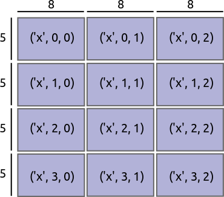

Internal Design
===============

Overview
--------

Dask arrays define a large array with a grid of blocks of smaller arrays.
These arrays may be concrete, or functions that produce arrays.  We define a
Dask array with the following components

*  A Dask graph with a special set of keys designating blocks
   such as ``('x', 0, 0), ('x', 0, 1), ...`` (See :doc:`Dask graph
   documentation <graphs>` for more details.)
*  A sequence of chunk sizes along each dimension called ``chunks``,
   for example ``((5, 5, 5, 5), (8, 8, 8))``
*  A name to identify which keys in the dask graph refer to this array, like
   ``'x'``
*  A NumPy dtype

Example
~~~~~~~

.. code-block:: python

   >>> import dask.array as da
   >>> x = da.arange(0, 15, chunks=(5,))

   >>> x.name
   'arange-539766a'

   >>> x.dask  # somewhat simplified
   {('arange-539766a', 0): (np.arange, 0, 5),
    ('arange-539766a', 1): (np.arange, 5, 10),
    ('arange-539766a', 2): (np.arange, 10, 15)}

   >>> x.chunks
   ((5, 5, 5),)

   >>> x.dtype
   dtype('int64')

Keys of the Dask graph
----------------------

By special convention we refer to each block of the array with a tuple of the
form ``(name, i, j, k)`` for ``i, j, k`` being the indices of the block,
ranging from ``0`` to the number of blocks in that dimension.  The dask graph
must hold key-value pairs referring to these keys.  It likely also holds other
key-value pairs required to eventually compute the desired values, for example

.. code-block:: python

   {
    ('x', 0, 0): (add, 1, ('y', 0, 0)),
    ('x', 0, 1): (add, 1, ('y', 0, 1)),
    ...
    ('y', 0, 0): (getitem, dataset, (slice(0, 1000), slice(0, 1000))),
    ('y', 0, 1): (getitem, dataset, (slice(0, 1000), slice(1000, 2000)))
    ...
   }

The name of an ``Array`` object can be found in the ``name`` attribute.  One
can get a nested list of keys with the ``._keys()`` method.  One can flatten
down this list with ``dask.array.core.flatten()``; this is sometimes useful
when building new dictionaries.

Chunks
------

We also store the size of each block along each axis.  This is a tuple of
tuples such that the length of the outer tuple is equal to the dimension and
the lengths of the inner tuples are equal to the number of blocks along each
dimension.  In the example illustrated above this value is as follows::

    chunks = ((5, 5, 5, 5), (8, 8, 8))

Note that these numbers do not necessarily need to be regular.  We often create
regularly sized grids but blocks change shape after complex slicing.  Beware
that some operations do expect certain symmetries in the block-shapes.  For
example matrix multiplication requires that blocks on each side have
anti-symmetric shapes.

Some ways in which ``chunks`` reflects properties of our array

1.  ``len(x.chunks) == x.ndim``: The length of chunks is the number of dimensions
2.  ``tuple(map(sum, x.chunks)) == x.shape``: The sum of each internal chunk, is the
    length of that dimension.
3.  The length of each internal chunk is the number of keys in that dimension.
    For instance, for ``chunks == ((a, b), (d, e, f))`` and name == ``'x'``
    our array has tasks with the following keys::

       ('x', 0, 0), ('x', 0, 1), ('x', 0, 2)
       ('x', 1, 0), ('x', 1, 1), ('x', 1, 2)

Create an Array Object
----------------------

So to create an ``da.Array`` object we need a dictionary with these special
keys ::

    dsk = {('x', 0, 0): ...}

a name specifying to which keys this array refers ::

    name = 'x'

and a chunks tuple::

    chunks = ((5, 5, 5, 5), (8, 8, 8))

Then one can construct an array::

    x = da.Array(dsk, name, chunks)

So ``dask.array`` operations update dask graphs, update dtypes, and track chunk
shapes.

Example - ``eye`` function
--------------------------

As an example lets build the ``np.eye`` function for ``dask.array`` to make the
identity matrix

.. code-block:: python

   def eye(n, blocksize):
       chunks = ((blocksize,) * (n // blocksize),
                 (blocksize,) * (n // blocksize))

       name = 'eye' + next(tokens)  # unique identifier

       dsk = {(name, i, j): (np.eye, blocksize)
                            if i == j else
                            (np.zeros, (blocksize, blocksize))
                for i in range(n // blocksize)
                for j in range(n // blocksize)}

       dtype = np.eye(0).dtype  # take dtype default from numpy

       return dask.array.Array(dsk, name, chunks, dtype)
