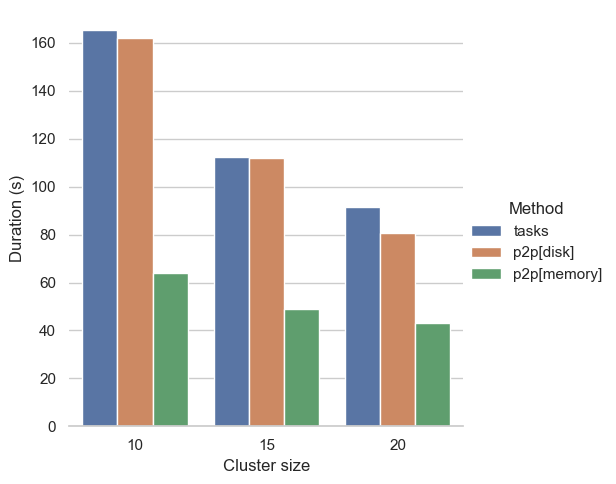

Changelog
=========

.. _v2024.6.2:

2024.6.2
--------

This is a patch release to update an issue with ``dask`` and ``distributed``
version pinning in the 2024.6.1 release.

.. dropdown:: Additional changes

  - Get docs build passing (:pr:`11184`) `James Bourbeau`_
  - ``profile._f_lineno``: handle ``next_line`` being ``None`` in Python 3.13 (:pr:`8710`) `Adam Williamson`_

.. _v2024.6.1:

2024.6.1
--------

Highlights
^^^^^^^^^^

This release includes a critical fix that fixes a deadlock that can arise
when dependencies of root-ish tasks are rescheduled, e.g. due to a worker being
lost.

See :pr-distributed:`8703` by `Hendrik Makait`_ for more details.

.. dropdown:: Additional changes

  - Cache global query-planning config (:pr:`11183`) `Richard (Rick) Zamora`_
  - Python 3.13 fixes (:pr:`11185`) `Adam Williamson`_
  - Fix ``test_map_freq_to_period_start`` for ``pandas=3`` (:pr:`11181`) `James Bourbeau`_
  - Bump release-drafter/release-drafter from 5 to 6 (:pr-distributed:`8699`)


.. _v2024.6.0:

2024.6.0
--------

Highlights
^^^^^^^^^^

memmap array tokenization
"""""""""""""""""""""""""
Tokenizing ``memmap`` arrays will now avoid materializing the array into memory.

See :pr:`11161` by `Florian Jetter`_ for more details.


.. dropdown:: Additional changes

  - Fix ``test_dt_accessor`` with query planning disabled (:pr:`11177`) `James Bourbeau`_
  - Use ``packaging.version.Version`` (:pr:`11171`) `James Bourbeau`_
  - Remove deprecated ``dask.compatibility`` module (:pr:`11172`) `James Bourbeau`_
  - Ensure compatibility for ``xarray.NamedArray`` (:pr:`11168`) `Hendrik Makait`_
  - Estimate sizes of ``xarray`` collections (:pr:`11166`) `Florian Jetter`_
  - Add section about futures and variables (:pr:`11164`) `Florian Jetter`_
  - Update docs for combined Dask community meeting info (:pr:`11159`) `Sarah Charlotte Johnson`_

  - Avoid rounding error in ``test_prometheus_collect_count_total_by_cost_multipliers`` (:pr-distributed:`8687`) `Hendrik Makait`_
  - Log key collision count in ``update_graph`` log event (:pr-distributed:`8692`) `Hendrik Makait`_
  - Automate GitHub Releases when new tags are pushed (:pr-distributed:`8626`) `Jacob Tomlinson`_
  - Fix log event with multiple topics (:pr-distributed:`8691`) `Hendrik Makait`_
  - Rename ``safe`` to ``expected`` in ``Scheduler.remove_worker`` (:pr-distributed:`8686`) `Hendrik Makait`_
  - Log event during failure (:pr-distributed:`8663`) `Hendrik Makait`_
  - Eagerly update aggregate statistics for ``TaskPrefix`` instead of calculating them on-demand (:pr-distributed:`8681`) `Hendrik Makait`_
  - Improve graph submission time for P2P rechunking by avoiding unpack recursion into indices (:pr-distributed:`8672`) `Florian Jetter`_
  - Add safe keyword to ``remove-worker`` event (:pr-distributed:`8647`) `alex-rakowski`_
  - Improved errors and reduced logging for P2P RPC calls (:pr-distributed:`8666`) `Hendrik Makait`_
  - Adjust P2P tests for ``dask-expr`` (:pr-distributed:`8662`) `Hendrik Makait`_
  - Iterate over copy of ``Server.digests_total_since_heartbeat`` to avoid ``RuntimeError`` (:pr-distributed:`8670`) `Hendrik Makait`_
  - Log task state in Compute Failed (:pr-distributed:`8668`) `Hendrik Makait`_
  - Add Prometheus gauge for task groups (:pr-distributed:`8661`) `Hendrik Makait`_
  - Fix too strict assertion in shuffle code for ``pandas`` subclasses (:pr-distributed:`8667`) `Joris Van den Bossche`_
  - Reduce noise from erring tasks that are not supposed to be running (:pr-distributed:`8664`) `Hendrik Makait`_


.. _v2024.5.2:

2024.5.2
--------

This release primarily contains minor bug fixes.

.. dropdown:: Additional changes

  - Fix nightly Zarr installation in CI (:pr:`11151`) `James Bourbeau`_
  - Add python 3.11 build to GPU CI (:pr:`11135`) `Charles Blackmon-Luca`_
  - Update gpuCI ``RAPIDS_VER`` to ``24.08`` (:pr:`11141`)
  - Update ``test_groupby_grouper_dispatch`` (:pr:`11144`) `Richard (Rick) Zamora`_
  - Bump ``JamesIves/github-pages-deploy-action`` from 4.6.0 to 4.6.1 (:pr:`11136`)
  - Unskip ``test_array_function_sparse`` with new ``sparse`` release (:pr:`11139`) `James Bourbeau`_
  - Fix ``test_parse_dates_multi_column`` on ``pandas=3`` (:pr:`11132`) `James Bourbeau`_
  - Don't draft release notes for tagged commits (:pr:`11138`) `Jacob Tomlinson`_

  - Reduce task group count for partial P2P rechunks (:pr-distributed:`8655`) `Hendrik Makait`_
  - Update gpuCI ``RAPIDS_VER`` to ``24.08`` (:pr-distributed:`8652`)
  - Submit collections metadata to scheduler (:pr-distributed:`8612`) `Florian Jetter`_
  - Fix indent in code example in ``task-launch.rst`` (:pr-distributed:`8650`) `Ray Bell`_
  - Avoid multiple ``WorkerState`` sphinx error (:pr-distributed:`8643`) `James Bourbeau`_


.. _v2024.5.1:

2024.5.1
--------

Highlights
^^^^^^^^^^

NumPy 2.0 support
"""""""""""""""""
This release contains compatibility updates for the upcoming NumPy 2.0 release.

See :pr:`11096` by `Benjamin Zaitlen`_  and :pr:`11106` by `James Bourbeau`_ for more details.

Increased Zarr store support
""""""""""""""""""""""""""""
This release contains adds support for ``MutableMapping``-backed Zarr stores like
:py:class:`zarr.storage.DirectoryStore`, etc.

See :pr:`10422` by `Greg M. Fleishman`_ for more details.

.. dropdown:: Additional changes

  - Minor updates to ML page (:pr:`11129`) `James Bourbeau`_
  - Skip failing ``sparse`` test on 0.15.2 (:pr:`11131`) `James Bourbeau`_
  - Make sure nightly ``pyarrow`` is installed in upstream CI build (:pr:`11121`) `James Bourbeau`_
  - Add initial draft of ML overview document (:pr:`11114`) `Matthew Rocklin`_
  - Test query-planning in gpuCI (:pr:`11060`) `Richard (Rick) Zamora`_
  - Avoid ``pytest`` error when skipping NumPy 2.0 tests  (:pr:`11110`) `James Bourbeau`_
  - Use nightly ``h5py`` in upstream CI build (:pr:`11108`) `James Bourbeau`_
  - Use nightly ``scikit-image`` in upstream CI build (:pr:`11107`) `James Bourbeau`_
  - Bump ``actions/checkout`` from 4.1.4 to 4.1.5 (:pr:`11105`)
  - Enable parquet append tests after fix (:pr:`11104`) `Patrick Hoefler`_
  - Skip ``fastparquet`` tests for ``numpy`` 2 (:pr:`11103`) `Patrick Hoefler`_
  - Fix misspelling found by codespell (:pr:`11097`) `Dimitri Papadopoulos Orfanos`_
  - Fix doc build (:pr:`11099`) `Patrick Hoefler`_
  - Clean up ``percentiles_summary`` logic (:pr:`11094`) `Richard (Rick) Zamora`_
  - Apply ``ruff/flake8-implicit-str-concat`` rule ISC001 (:pr:`11098`) `Dimitri Papadopoulos Orfanos`_

  - Fix clocks on Windows with Python 3.13 (:pr-distributed:`8642`) `Victor Stinner`_
  - Fix "Print host info" CI step on Mac OS (arm64) (:pr-distributed:`8638`) `Hendrik Makait`_

.. _v2024.5.0:

2024.5.0
--------

Highlights
^^^^^^^^^^

This release primarily contains minor bugfixes.

.. dropdown:: Additional changes

  - Don't link to ``click`` intersphinx dev version (:pr:`11091`) `M Bussonnier`_
  - Fix API doc links for some ``dask-expr`` expressions (:pr:`11092`) `Patrick Hoefler`_
  - Add ``dask-expr`` to upstream build (:pr:`11086`) `Patrick Hoefler`_
  - Add ``melt`` support when ``query-planning`` is enabled (:pr:`11088`) `Richard (Rick) Zamora`_
  - Skip dataframe/product when in ``numpy`` 2 envs (:pr:`11089`) `Benjamin Zaitlen`_
  - Add plots to illustrate what the optimizer does (:pr:`11072`) `Patrick Hoefler`_
  - Fixup ``pandas`` upstream tests (:pr:`11085`) `Patrick Hoefler`_
  - Bump ``conda-incubator/setup-miniconda`` from 3.0.3 to 3.0.4 (:pr:`11084`)
  - Bump ``actions/checkout`` from 4.1.3 to 4.1.4 (:pr:`11083`)
  - Fix CI after ``pytest`` changes (:pr:`11082`) `Patrick Hoefler`_
  - Fixup tests for more efficient ``dask-expr`` implementation (:pr:`11071`) `Patrick Hoefler`_
  - Generalize ``clear_known_categories`` utility (:pr:`11059`) `Richard (Rick) Zamora`_
  - Bump ``JamesIves/github-pages-deploy-action`` from 4.5.0 to 4.6.0 (:pr:`11062`)
  - Bump ``release-drafter/release-drafter`` from 5 to 6 (:pr:`11063`)
  - Bump ``actions/checkout`` from 4.1.2 to 4.1.3 (:pr:`11061`)
  - Update GPU CI ``RAPIDS_VER`` to 24.06, disable query planning  (:pr:`11045`) `Charles Blackmon-Luca`_

  - Move tests (:pr-distributed:`8631`) `Hendrik Makait`_
  - Bump ``actions/checkout`` from 4.1.2 to 4.1.3 (:pr-distributed:`8628`)

.. _v2024.4.2:

2024.4.2
--------

Highlights
^^^^^^^^^^

Trivial Merge Implementation
""""""""""""""""""""""""""""

The Query Optimizer will inspect quires to determine if a ``merge(...)`` or
``groupby(...).apply(...)`` requires a shuffle. A shuffle can be avoided, if the
DataFrame was shuffled on the same columns in a previous step without any operations
in between that change the partitioning layout or the relevant values in each
partition.

.. code-block:: python

    >>> result = df.merge(df2, on="a")
    >>> result = result.merge(df3, on="a")

The Query optimizer will identify that ``result`` was previously shuffled on ``"a"`` as
well and thus only shuffle ``df3`` in the second merge operation before doing a blockwise
merge.

Auto-partitioning in ``read_parquet``
"""""""""""""""""""""""""""""""""""""

The Query Optimizer will automatically repartition datasets read from Parquet files
if individual partitions are too small. This will reduce the number of partitions in
consequentially also the size of the task graph.

The Optimizer aims to produce partitions of at least 75MB and will combine multiple files
together if necessary to reach this threshold. The value can be configured by using

.. code-block:: python

    >>> dask.config.set({"dataframe.parquet.minimum-partition-size": 100_000_000})

The value is given in bytes. The default threshold is relatively conservative to avoid
memory issues on worker nodes with a relatively small amount of memory per thread.

.. dropdown:: Additional changes

  - Add GitHub Releases automation (:pr:`11057`) `Jacob Tomlinson`_
  - Add changelog entries for new release (:pr:`11058`) `Patrick Hoefler`_
  - Reinstate try/except block in ``_bind_property`` (:pr:`11049`) `Lawrence Mitchell`_
  - Fix link for query planning docs (:pr:`11054`) `Patrick Hoefler`_
  - Add config parameter for parquet file size (:pr:`11052`) `Patrick Hoefler`_
  - Update ``percentile`` docstring (:pr:`11053`) `Abel Aoun`_
  - Add docs for query optimizer (:pr:`11043`) `Patrick Hoefler`_
  - Assignment of np.ma.masked to obect-type Array (:pr:`9627`) `David Hassell`_
  - Don't error if ``dask_expr`` is not installed (:pr:`11048`) `Simon Høxbro Hansen`_
  - Adjust ``test_set_index`` for "cudf" backend (:pr:`11029`) `Richard (Rick) Zamora`_
  - Use ``to/from_legacy_dataframe`` instead of ``to/from_dask_dataframe`` (:pr:`11025`) `Richard (Rick) Zamora`_
  - Tokenize bag ``groupby`` keys (:pr:`10734`) `Charles Stern`_
  - Add lazy "cudf" registration for p2p-related dispatch functions (:pr:`11040`) `Richard (Rick) Zamora`_

  - Collect ``memray`` profiles on exception (:pr-distributed:`8625`) `Florian Jetter`_
  - Ensure ``inproc`` properly emulates serialization protocol (:pr-distributed:`8622`) `Florian Jetter`_
  - Relax test stats profiling2 (:pr-distributed:`8621`) `Florian Jetter`_
  - Restart workers when ``worker-ttl`` expires (:pr-distributed:`8538`) `crusaderky`_
  - Use ``monotonic`` for deadline test (:pr-distributed:`8620`) `Florian Jetter`_
  - Fix race condition for published futures with annotations (:pr-distributed:`8577`) `Florian Jetter`_
  - Scatter by worker instead of ``worker`` -> ``nthreads`` (:pr-distributed:`8590`) `Miles`_
  - Send log-event if worker is restarted because of memory pressure (:pr-distributed:`8617`) `Patrick Hoefler`_
  - Do not print xfailed tests in CI (:pr-distributed:`8619`) `Florian Jetter`_
  - ensure workers are not downscaled when participating in p2p (:pr-distributed:`8610`) `Florian Jetter`_
  - Run against stable ``fsspec`` (:pr-distributed:`8615`) `Florian Jetter`_


.. _v2024.4.1:

2024.4.1
--------

This is a minor bugfix release that that fixes an error when importing
``dask.dataframe`` with Python 3.11.9.

See :pr:`11035` and :pr:`11039` from `Richard (Rick) Zamora`_ for details.

.. dropdown:: Additional changes

  - Remove skips for named aggregations (:pr:`11036`) `Patrick Hoefler`_
  - Don't deep-copy read-only buffers on unpickle (:pr-distributed:`8609`) `crusaderky`_
  - Add ``dask-expr`` to ``dask`` conda recipe (:pr-distributed:`8601`) `Charles Blackmon-Luca`_


.. _v2024.4.0:

2024.4.0
--------

Highlights
^^^^^^^^^^

Query planning fixes
""""""""""""""""""""
This release contains a variety of bugfixes in Dask DataFrame's new
query planner.


GPU metric dashboard fixes
""""""""""""""""""""""""""
GPU memory and utilization dashboard functionality has been restored.
Previously these plots were unintentionally left blank.

See :pr-distributed:`8572` from `Benjamin Zaitlen`_ for details.


.. dropdown:: Additional changes

  - Build nightlies on tag releases (:pr:`11014`) `Charles Blackmon-Luca`_
  - Remove ``xfail`` tracebacks from test suite (:pr:`11028`) `Patrick Hoefler`_
  - Fix CI for upstream ``pandas`` changes (:pr:`11027`) `Patrick Hoefler`_
  - Fix ``value_counts`` raising if branch exists of nans only (:pr:`11023`) `Patrick Hoefler`_
  - Enable custom expressions in ``dask_cudf`` (:pr:`11013`) `Richard (Rick) Zamora`_
  - Raise ``ImportError`` instead of ``ValueError`` when ``dask-expr`` cannot be imported (:pr:`11007`) `James Lamb`_
  - Add HypersSpy to ``ecosystem.rst`` (:pr:`11008`) `Jonas Lähnemann`_
  - Add Hugging Face ``hf://`` to the list of ``fsspec`` compatible remote services (:pr:`11012`) `Quentin Lhoest`_
  - Bump ``actions/checkout`` from 4.1.1 to 4.1.2 (:pr:`11009`)

  - Refresh documentation for annotations and spans (:pr-distributed:`8593`) `crusaderky`_
  - Fixup deprecation warning from ``pandas`` (:pr-distributed:`8564`) `Patrick Hoefler`_
  - Add Python 3.11 to GPU CI matrix (:pr-distributed:`8598`) `Charles Blackmon-Luca`_
  - Deadline to use a monotonic timer (:pr-distributed:`8597`) `crusaderky`_
  - Update gpuCI ``RAPIDS_VER`` to ``24.06`` (:pr-distributed:`8588`)
  - Refactor ``restart()`` and ``restart_workers()`` (:pr-distributed:`8550`) `crusaderky`_
  - Bump ``actions/checkout`` from 4.1.1 to 4.1.2 (:pr-distributed:`8587`)
  - Fix ``bokeh`` deprecations (:pr-distributed:`8594`) `Miles`_
  - Fix flaky test: ``test_shutsdown_cleanly`` (:pr-distributed:`8582`) `Miles`_
  - Include type in failed ``sizeof`` warning (:pr-distributed:`8580`) `James Bourbeau`_


.. _v2024.3.1:

2024.3.1
--------

This is a minor release that primarily demotes an exception to a warning if
``dask-expr`` is not installed when upgrading.


.. dropdown:: Additional changes

  - Only warn if ``dask-expr`` is not installed (:pr:`11003`) `Florian Jetter`_
  - Fix typos found by codespell (:pr:`10993`) `Dimitri Papadopoulos Orfanos`_
  - Extra CI job with ``dask-expr`` disabled (:pr-distributed:`8583`) `crusaderky`_
  - Fix worker dashboard proxy (:pr-distributed:`8528`) `Miles`_
  - Fix flaky ``test_restart_waits_for_new_workers`` (:pr-distributed:`8573`) `crusaderky`_
  - Fix flaky ``test_raise_on_incompatible_partitions`` (:pr-distributed:`8571`) `crusaderky`_


.. _v2024.3.0:

2024.3.0
--------

Released on March 11, 2024

Highlights
^^^^^^^^^^

Query planning
""""""""""""""

This release is enabling query planning by default for all users of
``dask.dataframe``.

The query planning functionality represents a rewrite of the ``DataFrame`` using
``dask-expr``. This is a drop-in replacement and we expect that most users will
not have to adjust any of their code.
Any feedback can be reported on the Dask `issue tracker <https://github.com/dask/dask/issues>`_ or on the `query planning feedback issue <https://github.com/dask/dask/issues/10995>`_.

If you are encountering any issues you are still able to opt-out by setting

.. code-block:: python

    >>> import dask
    >>> dask.config.set({'dataframe.query-planning': False})


Sunset of Pandas 1.X support
""""""""""""""""""""""""""""

The new query planning backend is requiring at least pandas ``2.0``. This pandas
version will automatically be installed if you are installing from conda or if
you are installing using `dask[complete]` or `dask[dataframe]` from pip.

The legacy DataFrame implementation is still supporting pandas ``1.X`` if you
install ``dask`` without extras.


.. dropdown:: Additional changes

  - Update tests for pandas nightlies with dask-expr (:pr:`10989`) `Patrick Hoefler`_
  - Use dask-expr docs as main reference docs for DataFrames (:pr:`10990`) `Patrick Hoefler`_
  - Adjust from_array test for dask-expr (:pr:`10988`) `Patrick Hoefler`_
  - Unskip ``to_delayed`` test (:pr:`10985`) `Patrick Hoefler`_
  - Bump conda-incubator/setup-miniconda from 3.0.1 to 3.0.3 (:pr:`10978`)
  - Fix bug when enabling dask-expr (:pr:`10977`) `Patrick Hoefler`_
  - Update docs and requirements for dask-expr and remove warning (:pr:`10976`) `Patrick Hoefler`_
  - Fix numpy 2 compatibility with ogrid usage (:pr:`10929`) `David Hoese`_
  - Turn on dask-expr switch (:pr:`10967`) `Patrick Hoefler`_
  - Force initializing the random seed with the same byte order interpret… (:pr:`10970`) `Elliott Sales de Andrade`_
  - Use correct encoding for line terminator when reading CSV (:pr:`10972`) `Elliott Sales de Andrade`_
  - perf: do not unnecessarily recalculate input/output indices in _optimize_blockwise (:pr:`10966`) `Lindsey Gray`_
  - Adjust tests for string option in dask-expr (:pr:`10968`) `Patrick Hoefler`_
  - Adjust tests for array conversion in dask-expr (:pr:`10973`) `Patrick Hoefler`_
  - TST: Fix sizeof tests on 32bit (:pr:`10971`) `Elliott Sales de Andrade`_
  - TST: Add missing skip for pyarrow (:pr:`10969`) `Elliott Sales de Andrade`_
  - Implement dask-expr conversion for ``bag.to_dataframe`` (:pr:`10963`) `Patrick Hoefler`_
  - Fix dask-expr import errors (:pr:`10964`) `Miles`_
  - Clean up Sphinx documentation for ``dask.config`` (:pr:`10959`) `crusaderky`_
  - Use stdlib ``importlib.metadata`` on Python 3.12+ (:pr:`10955`) `wim glenn`_
  - Cast partitioning_index to smaller size (:pr:`10953`) `Florian Jetter`_
  - Reuse dask/dask groupby Aggregation (:pr:`10952`) `Patrick Hoefler`_
  - ensure tokens on futures are unique (:pr-distributed:`8569`) `Florian Jetter`_
  - Don't obfuscate fine performance metrics failures (:pr-distributed:`8568`) `crusaderky`_
  - Mark shuffle fast tasks in dask-expr (:pr-distributed:`8563`) `crusaderky`_
  - Weigh gilknocker Prometheus metric by duration (:pr-distributed:`8558`) `crusaderky`_
  - Fix scheduler transition error on `memory->erred` (:pr-distributed:`8549`) `Hendrik Makait`_
  - Make CI happy again (:pr-distributed:`8560`) `Miles`_
  - Fix flaky test_Future_release_sync (:pr-distributed:`8562`) `crusaderky`_
  - Fix flaky `test_flaky_connect_recover_with_retry` (:pr-distributed:`8556`) `Hendrik Makait`_
  - typing tweaks in scheduler.py (:pr-distributed:`8551`) `crusaderky`_
  - Bump conda-incubator/setup-miniconda from 3.0.2 to 3.0.3 (:pr-distributed:`8553`)
  - Install dask-expr on CI (:pr-distributed:`8552`) `Hendrik Makait`_
  - P2P shuffle can drop partition column before writing to disk (:pr-distributed:`8531`) `Hendrik Makait`_
  - Better logging for worker removal (:pr-distributed:`8517`) `crusaderky`_
  - Add indicator support to merge (:pr-distributed:`8539`) `Patrick Hoefler`_
  - Bump conda-incubator/setup-miniconda from 3.0.1 to 3.0.2 (:pr-distributed:`8535`)
  - Avoid iteration error when getting module path (:pr-distributed:`8533`) `James Bourbeau`_
  - Ignore stdlib threading module in code collection (:pr-distributed:`8532`) `James Bourbeau`_
  - Fix excessive logging on P2P retry (:pr-distributed:`8511`) `Hendrik Makait`_
  - Prevent typos in retire_workers parameters (:pr-distributed:`8524`) `crusaderky`_
  - Cosmetic cleanup of test_steal (backport from #8185) (:pr-distributed:`8509`) `crusaderky`_
  - Fix flaky test_compute_per_key (:pr-distributed:`8521`) `crusaderky`_
  - Fix flaky test_no_workers_timeout_queued (:pr-distributed:`8523`) `crusaderky`_


.. _v2024.2.1:

2024.2.1
--------

Released on February 23, 2024

Highlights
^^^^^^^^^^

Allow silencing dask.DataFrame deprecation warning
""""""""""""""""""""""""""""""""""""""""""""""""""

The last release contained a ``DeprecationWarning`` that alerts users to an
upcoming switch of ``dask.dafaframe`` to use the new backend with support for
query planning (see also :issue:`10934`).

This ``DeprecationWarning`` is triggered in import of the ``dask.dataframe``
module and the community raised concerns about this being to verbose.

It is now possible to silence this warning

.. code::

    # via Python
    >>> dask.config.set({'dataframe.query-planning-warning': False})

    # via CLI
    dask config set dataframe.query-planning-warning False


See :pr:`10936` and :pr:`10925` from `Miles`_ for details.

More robust distributed scheduler for rare key collisions
"""""""""""""""""""""""""""""""""""""""""""""""""""""""""

Blockwise fusion optimization can cause a task key collision that is not being
handled properly by the distributed scheduler (see :issue:`9888`). Users will
typically notice this by seeing one of various internal exceptions that cause a
system deadlock or critical failure. While this issue could not be fixed, the
scheduler now implements a mechanism that should mitigate most occurences and
issues a warning if the issue is detected.

See :pr-distributed:`8185` from `crusaderky`_ and `Florian Jetter`_ for details.

Over the course of this, various improvements to ``tokenization`` have been
implemented. See :pr:`10913`, :pr:`10884`, :pr:`10919`, :pr:`10896` and
primarily :pr:`10883` from  `crusaderky`_ for more details.

More robust adaptive scaling on large clusters
""""""""""""""""""""""""""""""""""""""""""""""

Adaptive scaling could previously lose data during downscaling if many tasks had
to be moved. This typically, but not exclusively, occured on large clusters and
would manifest as a recomputation of tasks and could cause clusters to oscillate
between up- and downscaling without ever finishing.


See :pr-distributed:`8522` from `crusaderky`_ for more details.


.. dropdown:: Additional changes

  - Remove flaky fastparquet test (:pr:`10948`) `Patrick Hoefler`_
  - Enable Aggregation from dask-expr (:pr:`10947`) `Patrick Hoefler`_
  - Update tests for assign change in dask-expr (:pr:`10944`) `Patrick Hoefler`_
  - Adjust for pandas large string change (:pr:`10942`) `Patrick Hoefler`_
  - Fix flaky test_describe_empty (:pr:`10943`) `crusaderky`_
  - Use Python 3.12 as reference environment (:pr:`10939`) `crusaderky`_
  - [Cosmetic] Clean up temp paths in test_config.py (:pr:`10938`) `crusaderky`_
  - [CLI] ``dask config set`` and ``dask config find`` updates. (:pr:`10930`) `Miles`_
  - combine_first when a chunk is full of NaNs (:pr:`10932`) `crusaderky`_
  - Correctly parse lowercase true/false config from CLI (:pr:`10926`) `crusaderky`_
  - ``dask config get`` fix when printing `None` values (:pr:`10927`) `crusaderky`_
  - query-planning can't be None (:pr:`10928`) `crusaderky`_
  - Add ``dask config set`` (:pr:`10921`) `Miles`_
  - Make nunique faster again (:pr:`10922`) `Patrick Hoefler`_
  - Clean up some Cython warnings handling (:pr:`10924`) `crusaderky`_
  - Bump pre-commit/action from 3.0.0 to 3.0.1 (:pr:`10920`)
  - Raise and avoid data loss of meta provided to P2P shuffle is wrong (:pr-distributed:`8520`) `Florian Jetter`_
  - Fix gpuci: np.product is deprecated (:pr-distributed:`8518`) `crusaderky`_
  - Update gpuCI ``RAPIDS_VER`` to ``24.04`` (:pr-distributed:`8471`)
  - Unpin ipywidgets on Python 3.12 (:pr-distributed:`8516`) `crusaderky`_
  - Keep old dependencies on run_spec collision (:pr-distributed:`8512`) `crusaderky`_
  - Trivial mypy fix (:pr-distributed:`8513`) `crusaderky`_
  - Ensure large payload can be serialized and sent over comms (:pr-distributed:`8507`) `Florian Jetter`_
  - Allow large graph warning threshold to be configured (:pr-distributed:`8508`) `Florian Jetter`_
  - Tokenization-related test tweaks (backport from #8185) (:pr-distributed:`8499`) `crusaderky`_
  - Tweaks to ``update_graph`` (backport from #8185) (:pr-distributed:`8498`) `crusaderky`_
  - AMM: test incremental retirements (:pr-distributed:`8501`) `crusaderky`_
  - Suppress dask-expr warning in CI (:pr-distributed:`8505`) `crusaderky`_
  - Ignore dask-expr warning in CI (:pr-distributed:`8504`) `James Bourbeau`_
  - Improve tests for P2P stable ordering (:pr-distributed:`8458`) `Hendrik Makait`_
  - Bump pre-commit/action from 3.0.0 to 3.0.1 (:pr-distributed:`8503`)


.. _v2024.2.0:

2024.2.0
--------

Released on February 9, 2024

Highlights
^^^^^^^^^^

Deprecate Dask DataFrame implementation
"""""""""""""""""""""""""""""""""""""""
The current Dask DataFrame implementation is deprecated.
In a future release, Dask DataFrame will use new implementation that
contains several improvements including a logical query planning.
The user-facing DataFrame API will remain unchanged.

The new implementation is already available and can be enabled by
installing the ``dask-expr`` library:

.. code-block:: bash

    $ pip install dask-expr

and turning the query planning option on:

.. code-block:: python

    >>> import dask
    >>> dask.config.set({'dataframe.query-planning': True})
    >>> import dask.dataframe as dd

API documentation for the new implementation is available at
https://docs.dask.org/en/stable/dataframe-api.html

Any feedback can be reported on the Dask issue tracker
https://github.com/dask/dask/issues

See :pr:`10912` from `Patrick Hoefler`_ for details.

Improved tokenization
"""""""""""""""""""""
This release contains several improvements to Dask's object tokenization logic.
More objects now produce deterministic tokens, which can lead to improved performance
through caching of intermediate results.

See :pr:`10898`, :pr:`10904`, :pr:`10876`, :pr:`10874`, and :pr:`10865` from `crusaderky`_ for details.


.. dropdown:: Additional changes

  - Fix inplace modification on read-only arrays for string conversion (:pr:`10886`) `Patrick Hoefler`_
  - Add changelog entry for ``dask-expr`` (:pr:`10915`) `Patrick Hoefler`_
  - Fix ``leftsemi`` merge for ``cudf`` (:pr:`10914`) `Patrick Hoefler`_
  - Slight update to ``dask-expr`` warning (:pr:`10916`) `James Bourbeau`_
  - Improve performance for ``groupby.nunique`` (:pr:`10910`) `Patrick Hoefler`_
  - Add configuration for ``leftsemi`` merges in ``dask-expr`` (:pr:`10908`) `Patrick Hoefler`_
  - Adjust assign test for ``dask-expr`` (:pr:`10907`) `Patrick Hoefler`_
  - Avoid ``pytest.warns`` in ``test_to_datetime`` for GPU CI (:pr:`10902`) `Richard (Rick) Zamora`_
  - Update deployment options in docs homepage (:pr:`10901`) `James Bourbeau`_
  - Fix typo in dataframe docs (:pr:`10900`) `Matthew Rocklin`_
  - Bump ``peter-evans/create-pull-request`` from 5 to 6 (:pr:`10894`)
  - Fix mimesis API ``>=13.1.0`` - use ``random.randint`` (:pr:`10888`) `Miles`_
  - Adjust invalid test (:pr:`10897`) `Patrick Hoefler`_
  - Pickle ``da.argwhere`` and ``da.count_nonzero`` (:pr:`10885`) `crusaderky`_
  - Fix ``dask-expr`` tests after singleton pr (:pr:`10892`) `Patrick Hoefler`_
  - Set lower bound version for ``s3fs`` (:pr:`10889`) `Miles`_
  - Add a couple of ``dask-expr`` fixes for new parquet cache (:pr:`10880`) `Florian Jetter`_
  - Update deployment documentation (:pr:`10882`) `Matthew Rocklin`_
  - Start with ``dask-expr`` doc build (:pr:`10879`) `Patrick Hoefler`_
  - Test tokenization of static and class methods (:pr:`10872`) `crusaderky`_
  - Add ``distributed.print`` and ``distributed.warn`` to API docs (:pr:`10878`) `James Bourbeau`_
  - Run macos ci on M1 architecture (:pr:`10877`) `Patrick Hoefler`_
  - Update tests for ``dask-expr`` (:pr:`10838`) `Patrick Hoefler`_
  - Update parquet tests to align with ``dask-expr`` fixes (:pr:`10851`) `Richard (Rick) Zamora`_
  - Fix regression in ``test_graph_manipulation`` (:pr:`10873`) `crusaderky`_
  - Adjust ``pytest`` errors for dask-expr ci (:pr:`10871`) `Patrick Hoefler`_
  - Set upper bound version for ``numba`` when ``pandas<2.1`` (:pr:`10890`) `Miles`_
  - Deprecate ``method`` parameter in ``DataFrame.fillna`` (:pr:`10846`) `Miles`_
  - Remove warning filter from ``pyproject.toml`` (:pr:`10867`) `Patrick Hoefler`_
  - Skip ``test_append_with_partition`` for fastparquet (:pr:`10828`) `Patrick Hoefler`_
  - Fix ``pytest`` 8 issues (:pr:`10868`) `Patrick Hoefler`_
  - Adjust test for support of median in ``Groupby.aggregate`` in ``dask-expr`` (2/2) (:pr:`10870`) `Hendrik Makait`_
  - Allow length of ascending to be larger than one in ``sort_values`` (:pr:`10864`) `Florian Jetter`_
  - Allow other message raised in Python 3.9 (:pr:`10862`) `Hendrik Makait`_

  - Don't crash when getting computation code in pathological cases (:pr-distributed:`8502`) `James Bourbeau`_
  - Bump ``peter-evans/create-pull-request`` from 5 to 6 (:pr-distributed:`8494`)
  - fix test of ``cudf`` spilling metrics (:pr-distributed:`8478`) `Mads R. B. Kristensen`_
  - Upgrade to ``pytest`` 8 (:pr-distributed:`8482`) `crusaderky`_
  - Fix ``test_two_consecutive_clients_share_results`` (:pr-distributed:`8484`) `crusaderky`_
  - Client word mix-up (:pr-distributed:`8481`) `templiert`_


.. _v2024.1.1:

2024.1.1
--------

Released on January 26, 2024

Highlights
^^^^^^^^^^

Pandas 2.2 and Scipy 1.12 support
"""""""""""""""""""""""""""""""""
This release contains compatibility updates for the latest ``pandas`` and ``scipy`` releases.

See :pr:`10834`, :pr:`10849`, :pr:`10845`, and :pr-distributed:`8474` from `crusaderky`_ for details.

Deprecations
""""""""""""
- Deprecate ``convert_dtype`` in ``apply`` (:pr:`10827`) `Miles`_
- Deprecate ``axis`` in ``DataFrame.rolling`` (:pr:`10803`) `Miles`_
- Deprecate ``out=`` and ``dtype=`` parameter in most DataFrame methods (:pr:`10800`) `crusaderky`_
- Deprecate ``axis`` in ``groupby`` cumulative transformers (:pr:`10796`) `Miles`_
- Rename ``shuffle`` to ``shuffle_method`` in remaining methods (:pr:`10797`) `Miles`_

.. dropdown:: Additional changes

  - Add recommended deployment options to deployment docs (:pr:`10866`) `James Bourbeau`_
  - Improve ``_agg_finalize`` to confirm to output expectation (:pr:`10835`) `Hendrik Makait`_
  - Implement deterministic tokenization for hlg (:pr:`10817`) `Patrick Hoefler`_
  - Refactor: move tests for ``tokenize()`` to its own module (:pr:`10863`) `crusaderky`_
  - Update DataFrame examples section (:pr:`10856`) `James Bourbeau`_
  - Temporarily pin ``mimesis<13.1.0`` (:pr:`10860`) `James Bourbeau`_
  - Trivial cosmetic tweaks to ``_testing.py`` (:pr:`10857`) `crusaderky`_
  - Unskip and adjust tests for ``groupby``-aggregate with ``median`` using ``dask-expr`` (:pr:`10832`) `Hendrik Makait`_
  - Fix test for ``sizeof(pd.MultiIndex)`` in upstream CI (:pr:`10850`) `crusaderky`_
  - ``numpy`` 2.0: fix slicing by ``uint64`` array (:pr:`10854`) `crusaderky`_
  - Rename ``numpy`` version constants to match ``pandas`` (:pr:`10843`) `crusaderky`_
  - Bump ``actions/cache`` from 3 to 4 (:pr:`10852`)
  - Update gpuCI ``RAPIDS_VER`` to ``24.04`` (:pr:`10841`)
  - Fix deprecations in doctest (:pr:`10844`) `crusaderky`_
  - Changed ``dtype`` arithmetics in ``numpy`` 2.x (:pr:`10831`) `crusaderky`_
  - Adjust tests for ``median`` support in ``dask-expr`` (:pr:`10839`) `Patrick Hoefler`_
  - Adjust tests for ``median`` support in ``groupby-aggregate`` in ``dask-expr`` (:pr:`10840`) `Hendrik Makait`_
  - ``numpy`` 2.x: fix ``std()`` on ``MaskedArray`` (:pr:`10837`) `crusaderky`_
  - Fail ``dask-expr`` ci if tests fail (:pr:`10829`) `Patrick Hoefler`_
  - Activate ``query_planning`` when exporting tests (:pr:`10833`) `Patrick Hoefler`_
  - Expose dataframe tests (:pr:`10830`) `Patrick Hoefler`_
  - ``numpy`` 2: deprecations in n-dimensional ``fft`` functions (:pr:`10821`) `crusaderky`_
  - Generalize ``CreationDispatch`` for ``dask-expr`` (:pr:`10794`) `Richard (Rick) Zamora`_
  - Remove circular import when ``dask-expr`` enabled (:pr:`10824`) `Miles`_
  - Minor[CI]: ``publish-test-results`` not marked as failed (:pr:`10825`) `Miles`_
  - Fix more tests to use ``pytest.warns()`` (:pr:`10818`) `Michał Górny`_
  - ``np.unique()``: inverse is shaped in ``numpy`` 2 (:pr:`10819`) `crusaderky`_
  - Pin ``test_split_adaptive_files`` to ``pyarrow`` engine (:pr:`10820`) `Patrick Hoefler`_
  - Adjust remaining tests in ``dask/dask`` (:pr:`10813`) `Patrick Hoefler`_
  - Restrict test to Arrow only (:pr:`10814`) `Patrick Hoefler`_
  - Filter warnings from ``std`` test (:pr:`10815`) `Patrick Hoefler`_
  - Adjust mostly indexing tests (:pr:`10790`) `Patrick Hoefler`_
  - Updates to deployment docs (:pr:`10778`) `Sarah Charlotte Johnson`_
  - Unblock documentation build (:pr:`10807`) `Miles`_
  - Adjust ``test_to_datetime`` for ``dask-expr`` compatibility `Hendrik Makait`_
  - Upstream CI tweaks (:pr:`10806`) `crusaderky`_
  - Improve tests for ``to_numeric`` (:pr:`10804`) `Hendrik Makait`_
  - Fix test-report cache key indent (:pr:`10798`) `Miles`_
  - Add test-report workflow (:pr:`10783`) `Miles`_

  - Handle matrix subclass serialization (:pr-distributed:`8480`) `Florian Jetter`_
  - Use smallest data type for partition column in P2P (:pr-distributed:`8479`) `Florian Jetter`_
  - ``pandas`` 2.2: fix ``test_dataframe_groupby_tasks`` (:pr-distributed:`8475`) `crusaderky`_
  - Bump ``actions/cache`` from 3 to 4 (:pr-distributed:`8477`)
  - ``pandas`` 2.2 vs. ``pyarrow`` 14: deprecated ``DatetimeTZBlock`` (:pr-distributed:`8476`) `crusaderky`_
  - ``pandas`` 2.2.0: Deprecated frequency alias ``M`` in favor of ``ME`` (:pr-distributed:`8473`) `Hendrik Makait`_
  - Fix docs build (:pr-distributed:`8472`) `Hendrik Makait`_
  - Fix P2P-based joins with explicit ``npartitions`` (:pr-distributed:`8470`) `Hendrik Makait`_
  - Ignore ``dask-expr`` in ``test_report.py`` script (:pr-distributed:`8464`) `Miles`_
  - Nit: hardcode Python version in test report environment (:pr-distributed:`8462`) `crusaderky`_
  - Change ``test_report.py`` - skip bad artifacts in ``dask/dask`` (:pr-distributed:`8461`) `Miles`_
  - Replace all occurrences of ``sys.is_finalizing`` (:pr-distributed:`8449`) `Florian Jetter`_

.. _v2024.1.0:

2024.1.0
--------

Released on January 12, 2024

Highlights
^^^^^^^^^^

Partial rechunks within P2P
"""""""""""""""""""""""""""
P2P rechunking now utilizes the relationships between input and output chunks.
For situations that do not require all-to-all data transfer, this may significantly
reduce the runtime and memory/disk footprint. It also enables task culling.

See :pr-distributed:`8330` from `Hendrik Makait`_ for details.

Fastparquet engine deprecated
"""""""""""""""""""""""""""""
The ``fastparquet`` Parquet engine has been deprecated. Users should migrate to the ``pyarrow``
engine by `installing PyArrow <https://arrow.apache.org/docs/python/install.html>`_ and removing
``engine="fastparquet"`` in ``read_parquet`` or ``to_parquet`` calls.

See :pr:`10743` from `crusaderky`_ for details.

Improved serialization for arbitrary data
"""""""""""""""""""""""""""""""""""""""""
This release improves serialization robustness for arbitrary data. Previously there were
some cases where serialization could fail for non-``msgpack`` serializable data.
In those cases we now fallback to using ``pickle``.

See :pr:`8447` from `Hendrik Makait`_ for details.

Additional deprecations
"""""""""""""""""""""""
- Deprecate ``shuffle`` keyword in favour of ``shuffle_method`` for DataFrame methods (:pr:`10738`) `Hendrik Makait`_
- Deprecate automatic argument inference in ``repartition`` (:pr:`10691`) `Patrick Hoefler`_
- Deprecate ``compute`` parameter in ``set_index`` (:pr:`10784`) `Miles`_
- Deprecate ``inplace`` in ``eval`` (:pr:`10785`) `Miles`_
- Deprecate ``Series.view`` (:pr:`10754`) `Miles`_
- Deprecate ``npartitions="auto"`` for ``set_index`` & ``sort_values`` (:pr:`10750`) `Miles`_

.. dropdown:: Additional changes

  - Avoid shortcut in tasks shuffle that let to data loss (:pr:`10763`) `Patrick Hoefler`_
  - Ignore data tasks when ordering (:pr:`10706`) `Florian Jetter`_
  - Add ``get_dummies`` from ``dask-expr`` (:pr:`10791`) `Patrick Hoefler`_
  - Adjust IO tests for ``dask-expr`` migration (:pr:`10776`) `Patrick Hoefler`_
  - Remove deprecation warning about ``sort`` and ``split_out`` in ``groupby`` (:pr:`10788`) `Patrick Hoefler`_
  - Address ``pandas`` deprecations (:pr:`10789`) `Patrick Hoefler`_
  - Import ``distributed`` only once in ``get_scheduler`` (:pr:`10771`) `Florian Jetter`_
  - Simplify GitHub actions (:pr:`10781`) `crusaderky`_
  - Add unit test overview (:pr:`10769`) `Miles`_
  - Clean up redundant bits in CI (:pr:`10768`) `crusaderky`_
  - Update tests for ``ufunc`` (:pr:`10773`) `Patrick Hoefler`_
  - Use ``pytest.mark.skipif(DASK_EXPR_ENABLED)`` (:pr:`10774`) `crusaderky`_
  - Adjust shuffle tests for ``dask-expr`` (:pr:`10759`) `Patrick Hoefler`_
  - Fix some deprecation warnings from ``pandas`` (:pr:`10749`) `Patrick Hoefler`_
  - Adjust shuffle tests for ``dask-expr`` (:pr:`10762`) `Patrick Hoefler`_
  - Update ``pre-commit`` (:pr:`10767`) `Hendrik Makait`_
  - Clean up config switches in CI (:pr:`10766`) `crusaderky`_
  - Improve exception for ``validate_key`` (:pr:`10765`) `Hendrik Makait`_
  - Handle ``datetimeindexes`` in ``set_index`` with unknown divisions (:pr:`10757`) `Patrick Hoefler`_
  - Add hashing for decimals (:pr:`10758`) `Patrick Hoefler`_
  - Review tests for ``is_monotonic`` (:pr:`10756`) `crusaderky`_
  - Change argument order in ``value_counts_aggregate`` (:pr:`10751`) `Patrick Hoefler`_
  - Adjust some groupby tests for ``dask-expr`` (:pr:`10752`) `Patrick Hoefler`_
  - Restrict mimesis to ``< 12`` for 3.9 build (:pr:`10755`) `Patrick Hoefler`_
  - Don't evaluate config in skip condition (:pr:`10753`) `Patrick Hoefler`_
  - Adjust some tests to be compatible with ``dask-expr`` (:pr:`10714`) `Patrick Hoefler`_
  - Make ``dask.array.utils`` functions more generic to other Dask Arrays (:pr:`10676`) `Matthew Rocklin`_
  - Remove duplciate "single machine" section (:pr:`10747`) `Matthew Rocklin`_
  - Tweak ORC ``engine=`` parameter (:pr:`10746`) `crusaderky`_
  - Add pandas 3.0 deprecations and migration prep for ``dask-expr`` (:pr:`10723`) `Miles`_
  - Add task graph animation to docs homepage (:pr:`10730`) `Sarah Charlotte Johnson`_
  - Use new Xarray logo (:pr:`10729`) `James Bourbeau`_
  - Update tab styling on "10 Minutes to Dask" page (:pr:`10728`) `James Bourbeau`_
  - Update environment file upload step in CI (:pr:`10726`) `James Bourbeau`_
  - Don't duplicate unobserved categories in GroupBy.nunqiue if ``split_out>1`` (:pr:`10716`) `Patrick Hoefler`_
  - Changelog entry for ``dask.order`` update (:pr:`10715`) `Florian Jetter`_
  - Relax redundant-key check in ``_check_dsk`` (:pr:`10701`) `Richard (Rick) Zamora`_

  - Fix ``test_report.py`` (:pr-distributed:`8459`) `Miles`_
  - Revert ``pickle`` change (:pr-distributed:`8456`) `Florian Jetter`_
  - Adapt ``test_report.py`` to support ``dask/dask`` repository (:pr-distributed:`8450`) `Miles`_
  - Maintain stable ordering for P2P shuffling (:pr-distributed:`8453`) `Hendrik Makait`_
  - Add no worker timeout for scheduler (:pr-distributed:`8371`) `FTang21`_
  - Allow tests workflow to be dispatched manually by maintainers (:pr-distributed:`8445`) `Erik Sundell`_
  - Make scheduler-related transition functionality private (:pr-distributed:`8448`) `Hendrik Makait`_
  - Update ``pre-commit`` hooks (:pr-distributed:`8444`) `Hendrik Makait`_
  - Do not always check if ``__main__ in result`` when pickling (:pr-distributed:`8443`) `Florian Jetter`_
  - Delegate ``wait_for_workers`` to cluster instances only when implemented (:pr-distributed:`8441`) `Erik Sundell`_
  - Extend sleep in ``test_pandas`` (:pr-distributed:`8440`) `Julian Gilbey`_
  - Avoid deprecated ``shuffle`` keyword (:pr-distributed:`8439`) `Hendrik Makait`_
  - Shuffle metrics 4/4: Remove bespoke diagnostics (:pr-distributed:`8367`) `crusaderky`_
  - Do not run ``gilknocker`` in testsuite (:pr-distributed:`8423`) `Florian Jetter`_
  - Tweak ``abstractmethods`` (:pr-distributed:`8427`) `crusaderky`_
  - Shuffle metrics 3/4: Capture background metrics (:pr-distributed:`8366`) `crusaderky`_
  - Shuffle metrics 2/4: Add background metrics (:pr-distributed:`8365`) `crusaderky`_
  - Shuffle metrics 1/4: Add foreground metrics (:pr-distributed:`8364`) `crusaderky`_
  - Bump ``actions/upload-artifact`` from 3 to 4 (:pr-distributed:`8420`)
  - Fix ``test_merge_p2p_shuffle_reused_dataframe_with_different_parameters`` (:pr-distributed:`8422`) `Hendrik Makait`_
  - Expand ``Client.upload_file`` docs example (:pr-distributed:`8313`) `Miles`_
  - Improve logging in P2P's scheduler plugin (:pr-distributed:`8410`) `Hendrik Makait`_
  - Re-enable ``test_decide_worker_coschedule_order_neighbors`` (:pr-distributed:`8402`) `Florian Jetter`_
  - Add cuDF spilling statistics to RMM/GPU memory plot (:pr-distributed:`8148`) `Charles Blackmon-Luca`_
  - Fix inconsistent hashing for Nanny-spawned workers (:pr-distributed:`8400`) `Charles Stern`_
  - Do not allow workers to downscale if they are running long-running tasks (e.g. ``worker_client``) (:pr-distributed:`7481`) `Florian Jetter`_
  - Fix flaky ``test_subprocess_cluster_does_not_depend_on_logging`` (:pr-distributed:`8417`) `crusaderky`_

.. _v2023.12.1:

2023.12.1
---------

Released on December 15, 2023

Highlights
^^^^^^^^^^

Logical Query Planning now available for Dask DataFrames
""""""""""""""""""""""""""""""""""""""""""""""""""""""""

Dask DataFrames are now much more performant by using a logical query planner.
This feature is currently off by default, but can be turned on with:

.. code:: python

    dask.config.set({"dataframe.query-planning": True})

You also need to have ``dask-expr`` installed:

.. code:: bash

    pip install dask-expr

We've seen promising performance improvements so far, see
`this blog post <https://blog.coiled.io/blog/dask-expr-tpch-dask.html>`__
and `these regularly updated benchmarks <https://tpch.coiled.io>`__  for more information.
A more detailed explanation of how the query optimizer works can be found in
`this blog post <https://blog.coiled.io/blog/dask-expr-introduction.html>`__.

This feature is still under active development
and the `API <https://github.com/dask-contrib/dask-expr#api-coverage>`__ isn't stable yet,
so breaking changes can occur. We expect to make the query optimizer the default early next year.

See :pr:`10634` from `Patrick Hoefler`_ for details.

Dtype inference in ``read_parquet``
"""""""""""""""""""""""""""""""""""

``read_parquet`` will now infer the Arrow types ``pa.date32()``, ``pa.date64()`` and
``pa.decimal()`` as a ``ArrowDtype`` in pandas. These dtypes are backed by the
original Arrow array, and thus avoid the conversion to NumPy object. Additionally,
``read_parquet`` will no longer infer nested and binary types as strings, they will
be stored in NumPy object arrays.

See :pr:`10698` and :pr:`10705` from `Patrick Hoefler`_ for details.

Scheduling improvements to reduce memory usage
""""""""""""""""""""""""""""""""""""""""""""""

This release includes a major rewrite to a core part of our scheduling logic. It
includes a new approach to the topological sorting algorithm in ``dask.order``
which determines the order in which tasks are run. Improper ordering is known to
be a major contributor to too large cluster memory pressure.

Updates in this release fix a couple of performance regressions that were introduced
in the release ``2023.10.0`` (see :pr:`10535`). Generally, computations should now
be much more eager to release data if it is no longer required in memory.

See :pr:`10660`, :pr:`10697` from `Florian Jetter`_ for details.

Improved P2P-based merging robustness and performance
"""""""""""""""""""""""""""""""""""""""""""""""""""""

This release contains several updates that fix a possible deadlock introduced in
2023.9.2 and improve the robustness of P2P-based merging when the cluster is
dynamically scaling up.

See :pr-distributed:`8415`, :pr-distributed:`8416`, and :pr-distributed:`8414` from `Hendrik Makait`_ for details.


Removed disabling pickle option
"""""""""""""""""""""""""""""""

The ``distributed.scheduler.pickle`` configuration option is no longer supported.
As of the 2023.4.0 release, ``pickle`` is used to transmit task graphs, so can no
longer be disabled. We now raise an informative error when ``distributed.scheduler.pickle``
is set to ``False``.

See :pr-distributed:`8401` from `Florian Jetter`_ for details.


.. dropdown:: Additional changes

  - Add changelog entry for recent P2P merge fixes (:pr:`10712`) `Hendrik Makait`_
  - Update DataFrame page (:pr:`10710`) `Matthew Rocklin`_
  - Add changelog entry for ``dask-expr`` switch (:pr:`10704`) `Patrick Hoefler`_
  - Improve changelog entry for ``PipInstall`` changes (:pr:`10711`) `Hendrik Makait`_
  - Remove PR labeler (:pr:`10709`) `James Bourbeau`_
  - Add ``.__wrapped__`` to ``Delayed`` object (:pr:`10695`) `Andrew S. Rosen`_
  - Bump ``actions/labeler`` from 4.3.0 to 5.0.0 (:pr:`10689`)
  - Bump ``actions/stale`` from 8 to 9 (:pr:`10690`)
  - [Dask.order] Remove non-runnable leaf nodes from ordering (:pr:`10697`) `Florian Jetter`_
  - Update installation docs (:pr:`10699`) `Matthew Rocklin`_
  - Fix software environment link in docs (:pr:`10700`) `James Bourbeau`_
  - Avoid converting non-strings to arrow strings for read_parquet (:pr:`10692`) `Patrick Hoefler`_
  - Bump ``xarray-contrib/issue-from-pytest-log`` from 1.2.7 to 1.2.8 (:pr:`10687`)
  - Fix ``tokenize`` for ``pd.DateOffset`` (:pr:`10664`) `jochenott`_
  - Bugfix for writing empty array to zarr (:pr:`10506`) `Ben`_
  - Docs update, fixup styling, mention free (:pr:`10679`) `Matthew Rocklin`_
  - Update deployment docs (:pr:`10680`) `Matthew Rocklin`_
  - Dask.order rewrite using a critical path approach (:pr:`10660`) `Florian Jetter`_
  - Avoid substituting keys that occur multiple times (:pr:`10646`) `Florian Jetter`_
  - Add missing image to docs (:pr:`10694`) `Matthew Rocklin`_
  - Bump ``actions/setup-python`` from 4 to 5 (:pr:`10688`)
  - Update landing page (:pr:`10674`) `Matthew Rocklin`_
  - Make meta check simpler in dispatch (:pr:`10638`) `Patrick Hoefler`_
  - Pin PR Labeler (:pr:`10675`) `Matthew Rocklin`_
  - Reorganize docs index a bit (:pr:`10669`) `Matthew Rocklin`_
  - Bump ``actions/setup-java`` from 3 to 4 (:pr:`10667`)
  - Bump ``conda-incubator/setup-miniconda`` from 2.2.0 to 3.0.1 (:pr:`10668`)
  - Bump ``xarray-contrib/issue-from-pytest-log`` from 1.2.6 to 1.2.7 (:pr:`10666`)
  - Fix ``test_categorize_info`` with nightly ``pyarrow`` (:pr:`10662`) `James Bourbeau`_

  - Rewrite ``test_subprocess_cluster_does_not_depend_on_logging`` (:pr-distributed:`8409`) `Hendrik Makait`_
  - Avoid ``RecursionError`` when failing to pickle key in ``SpillBuffer`` and using ``tblib=3`` (:pr-distributed:`8404`) `Hendrik Makait`_
  - Allow tasks to override ``is_rootish`` heuristic  (:pr-distributed:`8412`) `Hendrik Makait`_
  - Remove GPU executor (:pr-distributed:`8399`) `Hendrik Makait`_
  - Do not rely on logging for subprocess cluster (:pr-distributed:`8398`) `Hendrik Makait`_
  - Update gpuCI ``RAPIDS_VER`` to ``24.02`` (:pr-distributed:`8384`)
  - Bump ``actions/setup-python`` from 4 to 5 (:pr-distributed:`8396`)
  - Ensure output chunks in P2P rechunking are distributed homogeneously (:pr-distributed:`8207`) `Florian Jetter`_
  - Trivial: fix typo (:pr-distributed:`8395`) `crusaderky`_
  - Bump ``JamesIves/github-pages-deploy-action`` from 4.4.3 to 4.5.0 (:pr-distributed:`8387`)
  - Bump ``conda-incubator/setup-miniconda from`` 3.0.0 to 3.0.1 (:pr-distributed:`8388`)


.. _v2023.12.0:

2023.12.0
---------

Released on December 1, 2023

Highlights
^^^^^^^^^^

PipInstall restart and environment variables
""""""""""""""""""""""""""""""""""""""""""""

The ``distributed.PipInstall`` plugin now has more robust restart logic and also supports
`environment variables <https://pip.pypa.io/en/stable/reference/requirements-file-format/#using-environment-variables>`_.

Below shows how users can use the ``distributed.PipInstall`` plugin and a ``TOKEN`` environment
variable to securely install a package from a private repository:

.. code:: python

  from dask.distributed import PipInstall
  plugin = PipInstall(packages=["private_package@git+https://${TOKEN}@github.com/dask/private_package.git])
  client.register_plugin(plugin)

See :pr-distributed:`8374`, :pr-distributed:`8357`, and :pr-distributed:`8343` from `Hendrik Makait`_ for details.


Bokeh 3.3.0 compatibility
"""""""""""""""""""""""""
This release contains compatibility updates for using ``bokeh>=3.3.0`` with proxied Dask dashboards.
Previously the contents of dashboard plots wouldn't be displayed.

See :pr-distributed:`8347` and :pr-distributed:`8381` from `Jacob Tomlinson`_ for details.


.. dropdown:: Additional changes

  - Add ``network`` marker to ``test_pyarrow_filesystem_option_real_data`` (:pr:`10653`) `Richard (Rick) Zamora`_
  - Bump GPU CI to CUDA 11.8 (:pr:`10656`) `Charles Blackmon-Luca`_
  - Tokenize ``pandas`` offsets deterministically (:pr:`10643`) `Patrick Hoefler`_
  - Add tokenize ``pd.NA`` functionality (:pr:`10640`) `Patrick Hoefler`_
  - Update gpuCI ``RAPIDS_VER`` to ``24.02`` (:pr:`10636`)
  - Fix precision handling in ``array.linalg.norm`` (:pr:`10556`) `joanrue`_
  - Add ``axis`` argument to ``DataFrame.clip`` and ``Series.clip`` (:pr:`10616`) `Richard (Rick) Zamora`_
  - Update changelog entry for in-memory rechunking (:pr:`10630`) `Florian Jetter`_
  - Fix flaky ``test_resources_reset_after_cancelled_task`` (:pr-distributed:`8373`) `crusaderky`_
  - Bump GPU CI to CUDA 11.8 (:pr-distributed:`8376`) `Charles Blackmon-Luca`_
  - Bump ``conda-incubator/setup-miniconda`` from 2.2.0 to 3.0.0 (:pr-distributed:`8372`)
  - Add debug logs to P2P scheduler plugin (:pr-distributed:`8358`) `Hendrik Makait`_
  - ``O(1)`` access for ``/info/task/`` endpoint (:pr-distributed:`8363`) `crusaderky`_
  - Remove stringification from shuffle annotations (:pr-distributed:`8362`) `crusaderky`_
  - Don't cast ``int`` metrics to ``float`` (:pr-distributed:`8361`) `crusaderky`_
  - Drop asyncio TCP backend (:pr-distributed:`8355`) `Florian Jetter`_
  - Add offload support to ``context_meter.add_callback`` (:pr-distributed:`8360`) `crusaderky`_
  - Test that ``sync()`` propagates contextvars (:pr-distributed:`8354`) `crusaderky`_
  - ``captured_context_meter`` (:pr-distributed:`8352`) `crusaderky`_
  - ``context_meter.clear_callbacks`` (:pr-distributed:`8353`) `crusaderky`_
  - Use ``@log_errors`` decorator (:pr-distributed:`8351`) `crusaderky`_
  - Fix ``test_statistical_profiling_cycle`` (:pr-distributed:`8356`) `Florian Jetter`_
  - Shuffle: don't parse dask.config at every RPC (:pr-distributed:`8350`) `crusaderky`_
  - Replace ``Client.register_plugin`` s ``idempotent`` argument with ``.idempotent`` attribute on plugins (:pr-distributed:`8342`) `Hendrik Makait`_
  - Fix test report generation (:pr-distributed:`8346`) `Hendrik Makait`_
  - Install ``pyarrow-hotfix`` on ``mindeps-pandas`` CI (:pr-distributed:`8344`) `Hendrik Makait`_
  - Reduce memory usage of scheduler process - optimize ``scheduler.py::TaskState`` class (:pr-distributed:`8331`) `Miles`_
  - Bump ``pre-commit`` linters (:pr-distributed:`8340`) `crusaderky`_
  - Update cuDF test with explicit ``dtype=object`` (:pr-distributed:`8339`) `Peter Andreas Entschev`_
  - Fix ``Cluster`` / ``SpecCluster`` calls to async close methods (:pr-distributed:`8327`) `Peter Andreas Entschev`_


.. _v2023.11.0:

2023.11.0
---------

Released on November 10, 2023

Highlights
^^^^^^^^^^

Zero-copy P2P Array Rechunking
""""""""""""""""""""""""""""""

Users should see significant performance improvements when using in-memory P2P array rechunking.
This is due to no longer copying underlying data buffers.

Below shows a simple example where we compare performance of different rechunking methods.

.. code:: python

  shape = (30_000, 6_000, 150) # 201.17 GiB
  input_chunks = (60, -1, -1) # 411.99 MiB
  output_chunks = (-1, 6, -1) # 205.99 MiB

  arr = da.random.random(size, chunks=input_chunks)
  with dask.config.set({
      "array.rechunk.method": "p2p",
      "distributed.p2p.disk": True,
  }):
      (
        da.random.random(size, chunks=input_chunks)
        .rechunk(output_chunks)
        .sum()
        .compute()
      )


    tasks, p2p with disk and p2p without disk on different cluster sizes. The
    graph shows that p2p without disk is up to 60% faster than the default
    tasks based approach.


See :pr-distributed:`8282`, :pr-distributed:`8318`, :pr-distributed:`8321` from `crusaderky`_ and
(:pr-distributed:`8322`) from `Hendrik Makait`_ for details.


Deprecating PyArrow <14.0.1
"""""""""""""""""""""""""""
``pyarrow<14.0.1`` usage is deprecated starting in this release. It's recommended for all users to upgrade their
version of ``pyarrow`` or install ``pyarrow-hotfix``. See `this CVE <https://www.cve.org/CVERecord?id=CVE-2023-47248>`_
for full details.

See :pr:`10622` from `Florian Jetter`_ for details.


Improved PyArrow filesystem for Parquet
"""""""""""""""""""""""""""""""""""""""
Using ``filesystem="arrow"`` when reading Parquet datasets now properly inferrs the correct cloud region
when accessing remote, cloud-hosted data.

See :pr:`10590` from `Richard (Rick) Zamora`_ for details.


Improve Type Reconciliation in P2P Shuffling
""""""""""""""""""""""""""""""""""""""""""""
See :pr-distributed:`8332` from `Hendrik Makait`_ for details.


.. dropdown:: Additional changes

    - Fix sporadic failure of ``test_dataframe::test_quantile`` (:pr:`10625`) `Miles`_
    - Bump minimum ``click`` to ``>=8.1`` (:pr:`10623`) `Jacob Tomlinson`_
    - Refactor ``test_quantile`` (:pr:`10620`) `Miles`_
    - Avoid ``PerformanceWarning`` for fragmented DataFrame (:pr:`10621`) `Patrick Hoefler`_
    - Generalize computation of ``NEW_*_VER`` in GPU CI updating workflow (:pr:`10610`) `Charles Blackmon-Luca`_
    - Switch to newer GPU CI images (:pr:`10608`) `Charles Blackmon-Luca`_
    - Remove double slash in ``fsspec`` tests (:pr:`10605`) `Mario Šaško`_
    - Reenable ``test_ucx_config_w_env_var`` (:pr-distributed:`8272`) `Peter Andreas Entschev`_
    - Don't share ``host_array`` when receiving from network (:pr-distributed:`8308`) `crusaderky`_
    - Generalize computation of ``NEW_*_VER`` in GPU CI updating workflow (:pr-distributed:`8319`) `Charles Blackmon-Luca`_
    - Switch to newer GPU CI images (:pr-distributed:`8316`) `Charles Blackmon-Luca`_
    - Minor updates to shuffle dashboard (:pr-distributed:`8315`) `Matthew Rocklin`_
    - Don't use ``bytearray().join`` (:pr-distributed:`8312`) `crusaderky`_
    - Reuse identical shuffles in P2P hash join (:pr-distributed:`8306`) `Hendrik Makait`_


.. _v2023.10.1:

2023.10.1
---------

Released on October 27, 2023

Highlights
^^^^^^^^^^

Python 3.12
"""""""""""
This release adds official support for Python 3.12.

See :pr:`10544` and :pr-distributed:`8223` from `Thomas Grainger`_ for details.

.. dropdown:: Additional changes

    - Avoid splitting parquet files to row groups as aggressively (:pr:`10600`) `Matthew Rocklin`_
    - Speed up ``normalize_chunks`` for common case (:pr:`10579`) `Martin Durant`_
    - Use Python 3.11 for upstream and doctests CI build (:pr:`10596`) `Thomas Grainger`_
    - Bump ``actions/checkout`` from 4.1.0 to 4.1.1 (:pr:`10592`)
    - Switch to PyTables ``HEAD`` (:pr:`10580`) `Thomas Grainger`_
    - Remove ``numpy.core`` warning filter, link to issue on ``pyarrow`` caused ``BlockManager`` warning (:pr:`10571`) `Thomas Grainger`_
    - Unignore and fix deprecated freq aliases (:pr:`10577`) `Thomas Grainger`_
    - Move ``register_assert_rewrite`` earlier in ``conftest`` to fix warnings (:pr:`10578`) `Thomas Grainger`_
    - Upgrade ``versioneer`` to 0.29 (:pr:`10575`) `Thomas Grainger`_
    - change ``test_concat_categorical`` to be non-strict (:pr:`10574`) `Thomas Grainger`_
    - Enable SciPy tests with NumPy 2.0 `Thomas Grainger`_
    - Enable tests for scikit-image with NumPy 2.0 (:pr:`10569`) `Thomas Grainger`_
    - Fix upstream build (:pr:`10549`) `Thomas Grainger`_
    - Add optimized code paths for ``drop_duplicates`` (:pr:`10542`) `Richard (Rick) Zamora`_
    - Support ``cudf`` backend in ``dd.DataFrame.sort_values`` (:pr:`10551`) `Richard (Rick) Zamora`_
    - Rename "GIL Contention" to just GIL in chart labels (:pr-distributed:`8305`) `Matthew Rocklin`_
    - Bump ``actions/checkout`` from 4.1.0 to 4.1.1 (:pr-distributed:`8299`)
    - Fix dashboard (:pr-distributed:`8293`) `Hendrik Makait`_
    - ``@log_errors`` for async tasks (:pr-distributed:`8294`) `crusaderky`_
    - Annotations and better tests for serialize_bytes (:pr-distributed:`8300`) `crusaderky`_
    - Temporarily xfail ``test_decide_worker_coschedule_order_neighbors`` to unblock CI (:pr-distributed:`8298`) `James Bourbeau`_
    - Skip ``xdist`` and ``matplotlib`` in code samples (:pr-distributed:`8290`) `Matthew Rocklin`_
    - Use ``numpy._core`` on ``numpy>=2.dev0`` (:pr-distributed:`8291`) `Thomas Grainger`_
    - Fix calculation of ``MemoryShardsBuffer.bytes_read`` (:pr-distributed:`8289`) `crusaderky`_
    - Allow P2P to store data in-memory (:pr-distributed:`8279`) `Hendrik Makait`_
    - Upgrade ``versioneer`` to 0.29 (:pr-distributed:`8288`) `Thomas Grainger`_
    - Allow ``ResourceLimiter`` to be unlimited (:pr-distributed:`8276`) `Hendrik Makait`_
    - Run ``pre-commit`` autoupdate (:pr-distributed:`8281`) `Thomas Grainger`_
    - Annotate instance variables for P2P layers (:pr-distributed:`8280`) `Hendrik Makait`_
    - Remove worker gracefully should not mark tasks as suspicious (:pr-distributed:`8234`) `Thomas Grainger`_
    - Add signal handling to ``dask spec`` (:pr-distributed:`8261`) `Thomas Grainger`_
    - Add typing for ``sync`` (:pr-distributed:`8275`) `Hendrik Makait`_
    - Better annotations for shuffle offload (:pr-distributed:`8277`) `crusaderky`_
    - Test minimum versions for p2p shuffle (:pr-distributed:`8270`) `crusaderky`_
    - Run coverage on test failures (:pr-distributed:`8269`) `crusaderky`_
    - Use ``aiohttp`` with extensions (:pr-distributed:`8274`) `Thomas Grainger`_


.. _v2023.10.0:

2023.10.0
---------

Released on October 13, 2023

Highlights
^^^^^^^^^^

Reduced memory pressure for multi array reductions
""""""""""""""""""""""""""""""""""""""""""""""""""
This release contains major updates to Dask's task graph scheduling logic.
The updates here significantly reduce memory pressure on array reductions.
We anticipate this will have a strong impact on the array computing community.

See :pr:`10535` from `Florian Jetter`_ for details.


Improved P2P shuffling robustness
"""""""""""""""""""""""""""""""""
There are several updates (listed below) that make P2P shuffling much more
robust and less likely to fail.

See :pr-distributed:`8262`, :pr-distributed:`8264`, :pr-distributed:`8242`, :pr-distributed:`8244`,
and :pr-distributed:`8235` from `Hendrik Makait`_ and :pr-distributed:`8124` from
`Charles Blackmon-Luca`_ for details.


Reduced scheduler CPU load for large graphs
"""""""""""""""""""""""""""""""""""""""""""
Users should see reduced CPU load on their scheduler when computing
large task graphs.

See :pr-distributed:`8238` and :pr:`10547` from `Florian Jetter`_ and
:pr-distributed:`8240` from `crusaderky`_ for details.


.. dropdown:: Additional changes

    - Dispatch the ``partd.Encode`` class used for disk-based shuffling (:pr:`10552`) `Richard (Rick) Zamora`_
    - Add documentation for hive partitioning (:pr:`10454`) `Richard (Rick) Zamora`_
    - Add typing to ``dask.order`` (:pr:`10553`) `Florian Jetter`_
    - Allow passing ``index_col=False`` in ``dd.read_csv`` (:pr:`9961`) `Michael Leslie`_
    - Tighten ``HighLevelGraph`` annotations (:pr:`10524`) `crusaderky`_
    - Support for latest ``ipykernel``/``ipywidgets`` (:pr-distributed:`8253`) `crusaderky`_
    - Check minimal ``pyarrow`` version for P2P merge (:pr-distributed:`8266`) `Hendrik Makait`_
    - Support for Python 3.12 (:pr-distributed:`8223`) `Thomas Grainger`_
    - Use ``memoryview.nbytes`` when warning on large graph send (:pr-distributed:`8268`) `crusaderky`_
    - Run tests without ``gilknocker`` (:pr-distributed:`8263`) `crusaderky`_
    - Disable ipv6 on MacOS CI (:pr-distributed:`8254`) `crusaderky`_
    - Clean up redundant minimum versions (:pr-distributed:`8251`) `crusaderky`_
    - Clean up use of ``BARRIER_PREFIX`` in scheduler plugin (:pr-distributed:`8252`) `crusaderky`_
    - Improve shuffle run handling in P2P's worker plugin (:pr-distributed:`8245`) `Hendrik Makait`_
    - Explicitly set ``charset=utf-8`` (:pr-distributed:`8250`) `crusaderky`_
    - Typing tweaks to :pr-distributed:`8239` (:pr-distributed:`8247`) `crusaderky`_
    - Simplify scheduler assertion (:pr-distributed:`8246`) `crusaderky`_
    - Improve typing (:pr-distributed:`8239`) `Hendrik Makait`_
    - Respect cgroups v2 "low" memory limit (:pr-distributed:`8243`) `Samantha Hughes`_
    - Fix ``PackageInstall`` by making it a scheduler plugin (:pr-distributed:`8142`) `Hendrik Makait`_
    - Xfail ``test_ucx_config_w_env_var`` (:pr-distributed:`8241`) `crusaderky`_
    - ``SpecCluster`` resilience to broken workers (:pr-distributed:`8233`) `crusaderky`_
    - Suppress ``SpillBuffer`` stack traces for cancelled tasks (:pr-distributed:`8232`) `crusaderky`_
    - Update annotations after stringification changes (:pr-distributed:`8195`) `crusaderky`_
    - Reduce max recursion depth of profile (:pr-distributed:`8224`) `crusaderky`_
    - Offload deeply nested objects (:pr-distributed:`8214`) `crusaderky`_
    - Fix flaky ``test_close_connections`` (:pr-distributed:`8231`) `crusaderky`_
    - Fix flaky ``test_popen_timeout`` (:pr-distributed:`8229`) `crusaderky`_
    - Fix flaky ``test_adapt_then_manual`` (:pr-distributed:`8228`) `crusaderky`_
    - Prevent collisions in ``SpillBuffer`` (:pr-distributed:`8226`) `crusaderky`_
    - Allow ``retire_workers`` to run concurrently (:pr-distributed:`8056`) `Florian Jetter`_
    - Fix HTML repr for ``TaskState`` objects (:pr-distributed:`8188`) `Florian Jetter`_
    - Fix ``AttributeError`` for ``builtin_function_or_method`` in ``profile.py`` (:pr-distributed:`8181`) `Florian Jetter`_
    - Fix flaky ``test_spans`` (v2) (:pr-distributed:`8222`) `crusaderky`_


.. _v2023.9.3:

2023.9.3
--------

Released on September 29, 2023

Highlights
^^^^^^^^^^

Restore previous configuration override behavior
""""""""""""""""""""""""""""""""""""""""""""""""
The 2023.9.2 release introduced an unintentional breaking change in
how configuration options are overriden in ``dask.config.get`` with
the ``override_with=`` keyword (see :issue:`10519`).
This release restores the previous behavior.

See :pr:`10521` from `crusaderky`_ for details.

Complex dtypes in Dask Array reductions
"""""""""""""""""""""""""""""""""""""""
This release includes improved support for using common reductions
in Dask Array (e.g. ``var``, ``std``, ``moment``) with complex dtypes.

See :pr:`10009` from `wkrasnicki`_ for details.

.. dropdown:: Additional changes

    - Bump ``actions/checkout`` from 4.0.0 to 4.1.0 (:pr:`10532`)
    - Match ``pandas`` reverting ``apply`` deprecation (:pr:`10531`) `James Bourbeau`_
    - Update gpuCI ``RAPIDS_VER`` to ``23.12`` (:pr:`10526`)
    - Temporarily skip failing tests with ``fsspec==2023.9.1`` (:pr:`10520`) `James Bourbeau`_

.. _v2023.9.2:

2023.9.2
--------

Released on September 15, 2023

Highlights
^^^^^^^^^^

P2P shuffling now raises when outdated PyArrow is installed
"""""""""""""""""""""""""""""""""""""""""""""""""""""""""""
Previously the default shuffling method would silently fallback from P2P
to task-based shuffling if an older version of ``pyarrow`` was installed.
Now we raise an informative error with the minimum required ``pyarrow``
version for P2P instead of silently falling back.

See :pr:`10496` from `Hendrik Makait`_ for details.

Deprecation cycle for admin.traceback.shorten
"""""""""""""""""""""""""""""""""""""""""""""
The 2023.9.0 release modified the ``admin.traceback.shorten`` configuration option
without introducing a deprecation cycle. This resulted in failures to create Dask
clusters in some cases. This release introduces a deprecation cycle for this configuration
change.

See :pr:`10509` from `crusaderky`_ for details.

.. dropdown:: Additional changes

    - Avoid materializing all iterators in ``delayed`` tasks (:pr:`10498`) `James Bourbeau`_
    - Overhaul deprecations system in ``dask.config`` (:pr:`10499`) `crusaderky`_
    - Remove unnecessary check in ``timeseries`` (:pr:`10447`) `Patrick Hoefler`_
    - Use ``register_plugin`` in tests (:pr:`10503`) `James Bourbeau`_
    - Make ``preserve_index`` explicit in ``pyarrow_schema_dispatch`` (:pr:`10501`) `Hendrik Makait`_
    - Add ``**kwargs`` support for ``pyarrow_schema_dispatch`` (:pr:`10500`) `Hendrik Makait`_
    - Centralize and type ``no_default`` (:pr:`10495`) `crusaderky`_


.. _v2023.9.1:

2023.9.1
--------

Released on September 6, 2023

.. note::
  This is a hotfix release that fixes a P2P shuffling bug introduced in the 2023.9.0
  release (see :pr:`10493`).

Enhancements
^^^^^^^^^^^^
- Stricter data type for dask keys (:pr:`10485`) `crusaderky`_
- Special handling for ``None`` in ``DASK_`` environment variables (:pr:`10487`) `crusaderky`_

Bug Fixes
^^^^^^^^^
- Fix ``_partitions`` ``dtype`` in ``meta`` for ``DataFrame.set_index`` and ``DataFrame.sort_values`` (:pr:`10493`) `Hendrik Makait`_
- Handle ``cached_property`` decorators in ``derived_from`` (:pr:`10490`) `Lawrence Mitchell`_

Maintenance
^^^^^^^^^^^
- Bump ``actions/checkout`` from 3.6.0 to 4.0.0 (:pr:`10492`)
- Simplify some tests that ``import distributed`` (:pr:`10484`) `crusaderky`_


.. _v2023.9.0:

2023.9.0
--------

Released on September 1, 2023

Bug Fixes
^^^^^^^^^
- Remove support for ``np.int64`` in keys (:pr:`10483`) `crusaderky`_
- Fix ``_partitions`` ``dtype`` in ``meta`` for shuffling (:pr:`10462`) `Hendrik Makait`_
- Don't use exception hooks to shorten tracebacks (:pr:`10456`) `crusaderky`_

Documentation
^^^^^^^^^^^^^
- Add ``p2p`` shuffle option to DataFrame docs (:pr:`10477`) `Patrick Hoefler`_

Maintenance
^^^^^^^^^^^
- Skip failing tests for ``pandas=2.1.0`` (:pr:`10488`) `Patrick Hoefler`_
- Update tests for ``pandas=2.1.0`` (:pr:`10439`) `Patrick Hoefler`_
- Enable ``pytest-timeout`` (:pr:`10482`) `crusaderky`_
- Bump ``actions/checkout`` from 3.5.3 to 3.6.0 (:pr:`10470`)


.. _v2023.8.1:

2023.8.1
--------

Released on August 18, 2023

Enhancements
^^^^^^^^^^^^
- Adding support for cgroup v2 to ``cpu_count`` (:pr:`10419`) `Johan Olsson`_
- Support multi-column ``groupby`` with ``sort=True`` and ``split_out>1`` (:pr:`10425`) `Richard (Rick) Zamora`_
- Add ``DataFrame.enforce_runtime_divisions`` method (:pr:`10404`) `Richard (Rick) Zamora`_
- Enable file ``mode="x"`` with a ``single_file=True`` for Dask DataFrame ``to_csv`` (:pr:`10443`) `Genevieve Buckley`_

Bug Fixes
^^^^^^^^^
- Fix ``ValueError`` when running ``to_csv`` in append mode with ``single_file`` as ``True`` (:pr:`10441`) `Ben`_

Maintenance
^^^^^^^^^^^
- Add default ``types_mapper`` to ``from_pyarrow_table_dispatch`` for ``pandas`` (:pr:`10446`) `Richard (Rick) Zamora`_


.. _v2023.8.0:

2023.8.0
--------

Released on August 4, 2023

Enhancements
^^^^^^^^^^^^
- Fix for ``make_timeseries`` performance regression (:pr:`10428`) `Irina Truong`_

Documentation
^^^^^^^^^^^^^
- Add ``distributed.print`` to debugging docs (:pr:`10435`) `James Bourbeau`_
- Documenting compatibility of NumPy functions with Dask functions (:pr:`9941`) `Chiara Marmo`_

Maintenance
^^^^^^^^^^^
- Use SPDX in ``license`` metadata (:pr:`10437`) `John A Kirkham`_
- Require ``dask[array]`` in ``dask[dataframe]`` (:pr:`10357`) `John A Kirkham`_
- Update gpuCI ``RAPIDS_VER`` to ``23.10`` (:pr:`10427`)
- Simplify compatibility code (:pr:`10426`) `Hendrik Makait`_
- Fix compatibility variable naming (:pr:`10424`) `Hendrik Makait`_
- Fix a few errors with upstream ``pandas`` and ``pyarrow`` (:pr:`10412`) `Irina Truong`_


.. _v2023.7.1:

2023.7.1
--------

Released on July 20, 2023

.. note::

  This release updates Dask DataFrame to automatically convert
  text data using ``object`` data types to ``string[pyarrow]``
  if ``pandas>=2`` and ``pyarrow>=12`` are installed.

  This should result in significantly reduced
  memory consumption and increased computation performance in many
  workflows that deal with text data.

  You can disable this change by setting the ``dataframe.convert-string``
  configuration value to ``False`` with

  .. code-block:: python

      dask.config.set({"dataframe.convert-string": False})


Enhancements
^^^^^^^^^^^^
- Convert to ``pyarrow`` strings if proper dependencies are installed (:pr:`10400`) `James Bourbeau`_
- Avoid ``repartition`` before ``shuffle`` for ``p2p`` (:pr:`10421`) `Patrick Hoefler`_
- API to generate random Dask DataFrames (:pr:`10392`) `Irina Truong`_
- Speed up ``dask.bag.Bag.random_sample`` (:pr:`10356`) `crusaderky`_
- Raise helpful ``ValueError`` for invalid time units (:pr:`10408`) `Nat Tabris`_
- Make ``repartition`` a no-op when divisions match (divisions provided as a list) (:pr:`10395`) `Nicolas Grandemange`_

Bug Fixes
^^^^^^^^^
- Use ``dataframe.convert-string`` in ``read_parquet`` token (:pr:`10411`) `James Bourbeau`_
- Category ``dtype`` is lost when concatenating ``MultiIndex`` (:pr:`10407`) `Irina Truong`_
- Fix ``FutureWarning: The provided callable...`` (:pr:`10405`) `Irina Truong`_
- Enable non-categorical hive-partition columns in ``read_parquet`` (:pr:`10353`) `Richard (Rick) Zamora`_
- ``concat`` ignoring ``DataFrame`` withouth columns (:pr:`10359`) `Patrick Hoefler`_


.. _v2023.7.0:

2023.7.0
--------

Released on July 7, 2023

Enhancements
^^^^^^^^^^^^
- Catch exceptions when attempting to load CLI entry points (:pr:`10380`) `Jacob Tomlinson`_

Bug Fixes
^^^^^^^^^
- Fix typo in ``_clean_ipython_traceback`` (:pr:`10385`) `Alexander Clausen`_
- Ensure that ``df`` is immutable after ``from_pandas`` (:pr:`10383`) `Patrick Hoefler`_
- Warn consistently for ``inplace`` in ``Series.rename`` (:pr:`10313`) `Patrick Hoefler`_

Documentation
^^^^^^^^^^^^^
- Add clarification about output shape and reshaping in rechunk documentation (:pr:`10377`) `Swayam Patil`_

Maintenance
^^^^^^^^^^^
- Simplify ``astype`` implementation (:pr:`10393`) `Patrick Hoefler`_
- Fix ``test_first_and_last`` to accommodate deprecated ``last`` (:pr:`10373`) `James Bourbeau`_
- Add ``level`` to ``create_merge_tree`` (:pr:`10391`) `Patrick Hoefler`_
- Do not derive from ``scipy.stats.chisquare`` docstring (:pr:`10382`) `Doug Davis`_


.. _v2023.6.1:

2023.6.1
--------

Released on June 26, 2023

Enhancements
^^^^^^^^^^^^
- Remove no longer supported ``clip_lower`` and ``clip_upper`` (:pr:`10371`) `Patrick Hoefler`_
- Support ``DataFrame.set_index(..., sort=False)`` (:pr:`10342`) `Miles`_
- Cleanup remote tracebacks (:pr:`10354`) `Irina Truong`_
- Add dispatching mechanisms for ``pyarrow.Table`` conversion (:pr:`10312`) `Richard (Rick) Zamora`_
- Choose P2P even if fusion is enabled (:pr:`10344`) `Hendrik Makait`_
- Validate that rechunking is possible earlier in graph generation (:pr:`10336`) `Hendrik Makait`_

Bug Fixes
^^^^^^^^^
- Fix issue with ``header`` passed to ``read_csv`` (:pr:`10355`) `GALI PREM SAGAR`_
- Respect ``dropna`` and ``observed`` in ``GroupBy.var`` and ``GroupBy.std`` (:pr:`10350`) `Patrick Hoefler`_
- Fix ``H5FD_lock`` error when writing to hdf with distributed client (:pr:`10309`) `Irina Truong`_
- Fix for ``total_mem_usage`` of ``bag.map()`` (:pr:`10341`) `Irina Truong`_

Deprecations
^^^^^^^^^^^^
- Deprecate ``DataFrame.fillna``/``Series.fillna`` with ``method`` (:pr:`10349`) `Irina Truong`_
- Deprecate ``DataFrame.first`` and ``Series.first`` (:pr:`10352`) `Irina Truong`_

Maintenance
^^^^^^^^^^^
- Deprecate ``numpy.compat`` (:pr:`10370`) `Irina Truong`_
- Fix annotations and spans leaking between threads (:pr:`10367`) `Irina Truong`_
- Use general kwargs in ``pyarrow_table_dispatch`` functions (:pr:`10364`) `Richard (Rick) Zamora`_
- Remove unnecessary ``try``/``except`` in ``isna`` (:pr:`10363`) `Patrick Hoefler`_
- ``mypy`` support for numpy 1.25 (:pr:`10362`) `crusaderky`_
- Bump ``actions/checkout`` from 3.5.2 to 3.5.3 (:pr:`10348`)
- Restore ``numba`` in ``upstream`` build (:pr:`10330`) `James Bourbeau`_
- Update nightly wheel index for ``pandas``/``numpy``/``scipy`` (:pr:`10346`) `Matthew Roeschke`_
- Add rechunk config values to yaml (:pr:`10343`) `Hendrik Makait`_


.. _v2023.6.0:

2023.6.0
--------

Released on June 9, 2023

Enhancements
^^^^^^^^^^^^
- Add missing ``not in`` predicate support to ``read_parquet`` (:pr:`10320`) `Richard (Rick) Zamora`_

Bug Fixes
^^^^^^^^^
- Fix for incorrect ``value_counts`` (:pr:`10323`) `Irina Truong`_
- Update empty ``describe`` top and freq values (:pr:`10319`) `James Bourbeau`_

Documentation
^^^^^^^^^^^^^
- Fix hetzner typo (:pr:`10332`) `Sarah Charlotte Johnson`_

Maintenance
^^^^^^^^^^^
- Test with ``numba`` and ``sparse`` on Python 3.11 (:pr:`10329`) `Thomas Grainger`_
- Remove ``numpy.find_common_type`` warning ignore (:pr:`10311`) `James Bourbeau`_
- Update gpuCI ``RAPIDS_VER`` to ``23.08`` (:pr:`10310`)


.. _v2023.5.1:

2023.5.1
--------

Released on May 26, 2023

.. note::

  This release drops support for Python 3.8. As of this release
  Dask supports Python 3.9, 3.10, and 3.11.
  See `this community issue <https://github.com/dask/community/issues/315>`_
  for more details.

Enhancements
^^^^^^^^^^^^
- Drop Python 3.8 support (:pr:`10295`) `Thomas Grainger`_
- Change Dask Bag partitioning scheme to improve cluster saturation (:pr:`10294`) `Jacob Tomlinson`_
- Generalize ``dd.to_datetime`` for GPU-backed collections, introduce ``get_meta_library`` utility (:pr:`9881`) `Charles Blackmon-Luca`_
- Add ``na_action`` to ``DataFrame.map`` (:pr:`10305`) `Patrick Hoefler`_
- Raise ``TypeError`` in ``DataFrame.nsmallest`` and ``DataFrame.nlargest`` when ``columns`` is not given (:pr:`10301`) `Patrick Hoefler`_
- Improve ``sizeof`` for ``pd.MultiIndex`` (:pr:`10230`) `Patrick Hoefler`_
- Support duplicated columns in a bunch of ``DataFrame`` methods (:pr:`10261`) `Patrick Hoefler`_
- Add ``numeric_only`` support to ``DataFrame.idxmin`` and ``DataFrame.idxmax`` (:pr:`10253`) `Patrick Hoefler`_
- Implement ``numeric_only`` support for ``DataFrame.quantile`` (:pr:`10259`) `Patrick Hoefler`_
- Add support for ``numeric_only=False`` in ``DataFrame.std`` (:pr:`10251`) `Patrick Hoefler`_
- Implement ``numeric_only=False`` for ``GroupBy.cumprod`` and ``GroupBy.cumsum`` (:pr:`10262`) `Patrick Hoefler`_
- Implement ``numeric_only`` for ``skew`` and ``kurtosis`` (:pr:`10258`) `Patrick Hoefler`_
- ``mask`` and ``where`` should accept a ``callable`` (:pr:`10289`) `Irina Truong`_
- Fix conversion from ``Categorical`` to ``pa.dictionary`` in ``read_parquet`` (:pr:`10285`) `Patrick Hoefler`_

Bug Fixes
^^^^^^^^^
- Spurious config on nested annotations (:pr:`10318`) `crusaderky`_
- Fix rechunking behavior for dimensions with known and unknown chunk sizes (:pr:`10157`) `Hendrik Makait`_
- Enable ``drop`` to support mismatched partitions (:pr:`10300`) `James Bourbeau`_
- Fix ``divisions`` construction for ``to_timestamp`` (:pr:`10304`) `Patrick Hoefler`_
- pandas ``ExtensionDtype`` raising in ``Series`` reduction operations (:pr:`10149`) `Patrick Hoefler`_
- Fix regression in ``da.random`` interface (:pr:`10247`) `Eray Aslan`_
- ``da.coarsen`` doesn't trim an empty chunk in meta (:pr:`10281`) `Irina Truong`_
- Fix dtype inference for ``engine="pyarrow"`` in ``read_csv`` (:pr:`10280`) `Patrick Hoefler`_

Documentation
^^^^^^^^^^^^^
- Add ``meta_from_array`` to API docs (:pr:`10306`) `Ruth Comer`_
- Update Coiled links (:pr:`10296`) `Sarah Charlotte Johnson`_
- Add docs for demo day (:pr:`10288`) `Matthew Rocklin`_

Maintenance
^^^^^^^^^^^
- Explicitly install ``anaconda-client`` from conda-forge when uploading conda nightlies (:pr:`10316`) `Charles Blackmon-Luca`_
- Configure ``isort`` to add ``from __future__ import annotations`` (:pr:`10314`) `Thomas Grainger`_
- Avoid ``pandas`` ``Series.__getitem__`` deprecation in tests (:pr:`10308`) `James Bourbeau`_
- Ignore ``numpy.find_common_type`` warning from ``pandas`` (:pr:`10307`) `James Bourbeau`_
- Add test to check that ``DataFrame.__setitem__`` does not modify ``df`` inplace (:pr:`10223`) `Patrick Hoefler`_
- Clean up default value of ``dropna`` in ``value_counts`` (:pr:`10299`) `Patrick Hoefler`_
- Add ``pytest-cov`` to ``test`` extra (:pr:`10271`) `James Bourbeau`_


.. _v2023.5.0:

2023.5.0
--------

Released on May 12, 2023

Enhancements
^^^^^^^^^^^^
- Implement ``numeric_only=False`` for ``GroupBy.corr`` and ``GroupBy.cov`` (:pr:`10264`) `Patrick Hoefler`_
- Add support for ``numeric_only=False`` in ``DataFrame.var`` (:pr:`10250`) `Patrick Hoefler`_
- Add ``numeric_only`` support to ``DataFrame.mode`` (:pr:`10257`) `Patrick Hoefler`_
- Add ``DataFrame.map`` to ``dask.DataFrame`` API (:pr:`10246`) `Patrick Hoefler`_
- Adjust for ``DataFrame.applymap`` deprecation and all ``NA`` ``concat`` behaviour change (:pr:`10245`) `Patrick Hoefler`_
- Enable ``numeric_only=False`` for ``DataFrame.count`` (:pr:`10234`) `Patrick Hoefler`_
- Disallow array input in mask/where (:pr:`10163`) `Irina Truong`_
- Support ``numeric_only=True`` in ``GroupBy.corr`` and ``GroupBy.cov`` (:pr:`10227`) `Patrick Hoefler`_
- Add ``numeric_only`` support to ``GroupBy.median`` (:pr:`10236`) `Patrick Hoefler`_
- Support ``mimesis=9`` in ``dask.datasets`` (:pr:`10241`) `James Bourbeau`_
- Add ``numeric_only`` support to ``min``, ``max`` and ``prod`` (:pr:`10219`) `Patrick Hoefler`_
- Add ``numeric_only=True`` support for ``GroupBy.cumsum`` and ``GroupBy.cumprod`` (:pr:`10224`) `Patrick Hoefler`_
- Add helper to unpack ``numeric_only`` keyword (:pr:`10228`) `Patrick Hoefler`_

Bug Fixes
^^^^^^^^^
- Fix ``clone`` + ``from_array`` failure (:pr:`10211`) `crusaderky`_
- Fix dataframe reductions for ea dtypes (:pr:`10150`) `Patrick Hoefler`_
- Avoid scalar conversion deprecation warning in ``numpy=1.25`` (:pr:`10248`) `James Bourbeau`_
- Make sure transform output has the same index as input (:pr:`10184`) `Irina Truong`_
- Fix ``corr`` and ``cov`` on a single-row partition (:pr:`9756`) `Irina Truong`_
- Fix ``test_groupby_numeric_only_supported`` and ``test_groupby_aggregate_categorical_observed`` upstream errors  (:pr:`10243`) `Irina Truong`_

Documentation
^^^^^^^^^^^^^
- Clean up futures docs (:pr:`10266`) `Matthew Rocklin`_
- Add ``Index`` API reference (:pr:`10263`) `hotpotato`_

Maintenance
^^^^^^^^^^^
- Warn when meta is passed to ``apply`` (:pr:`10256`) `Patrick Hoefler`_
- Remove ``imageio`` version restriction in CI (:pr:`10260`) `Patrick Hoefler`_
- Remove unused ``DataFrame`` variance methods (:pr:`10252`) `Patrick Hoefler`_
- Un-``xfail`` ``test_categories`` with ``pyarrow`` strings and ``pyarrow>=12`` (:pr:`10244`) `Irina Truong`_
- Bump gpuCI ``PYTHON_VER`` 3.8->3.9 (:pr:`10233`) `Charles Blackmon-Luca`_


.. _v2023.4.1:

2023.4.1
--------

Released on April 28, 2023

Enhancements
^^^^^^^^^^^^
- Implement ``numeric_only`` support for ``DataFrame.sum`` (:pr:`10194`) `Patrick Hoefler`_
- Add support for ``numeric_only=True`` in ``GroupBy`` operations (:pr:`10222`) `Patrick Hoefler`_
- Avoid deep copy in ``DataFrame.__setitem__`` for ``pandas`` 1.4 and up (:pr:`10221`) `Patrick Hoefler`_
- Avoid calling ``Series.apply`` with ``_meta_nonempty`` (:pr:`10212`) `Patrick Hoefler`_
- Unpin ``sqlalchemy`` and fix compatibility issues (:pr:`10140`) `Patrick Hoefler`_

Bug Fixes
^^^^^^^^^
- Partially revert default client discovery (:pr:`10225`) `Florian Jetter`_
- Support arrow dtypes in ``Index`` meta creation (:pr:`10170`) `Patrick Hoefler`_
- Repartitioning raises with extension dtype when truncating floats (:pr:`10169`) `Patrick Hoefler`_
- Adjust empty ``Index`` from ``fastparquet`` to ``object`` dtype (:pr:`10179`) `Patrick Hoefler`_

Documentation
^^^^^^^^^^^^^
- Update Kubernetes docs (:pr:`10232`) `Jacob Tomlinson`_
- Add ``DataFrame.reduction`` to API docs (:pr:`10229`) `James Bourbeau`_
- Add ``DataFrame.persist`` to docs and fix links (:pr:`10231`) `Patrick Hoefler`_
- Add documentation for ``GroupBy.transform`` (:pr:`10185`) `Irina Truong`_
- Fix formatting in random number generation docs (:pr:`10189`) `Eray Aslan`_

Maintenance
^^^^^^^^^^^
- Pin imageio to ``<2.28`` (:pr:`10216`) `Patrick Hoefler`_
- Add note about ``importlib_metadata`` backport (:pr:`10207`) `James Bourbeau`_
- Add ``xarray`` back to Python 3.11 CI builds (:pr:`10200`) `James Bourbeau`_
- Add ``mindeps`` build with all optional dependencies (:pr:`10161`) `Charles Blackmon-Luca`_
- Provide proper ``like`` value for ``array_safe`` in ``percentiles_summary`` (:pr:`10156`) `Charles Blackmon-Luca`_
- Avoid re-opening hdf file multiple times in ``read_hdf`` (:pr:`10205`) `Thomas Grainger`_
- Add merge tests on nullable columns (:pr:`10071`) `Charles Blackmon-Luca`_
- Fix coverage configuration (:pr:`10203`) `Thomas Grainger`_
- Remove ``is_period_dtype`` and ``is_sparse_dtype`` (:pr:`10197`) `Patrick Hoefler`_
- Bump ``actions/checkout`` from 3.5.0 to 3.5.2 (:pr:`10201`)
- Avoid deprecated ``is_categorical_dtype`` from `pandas` (:pr:`10180`) `Patrick Hoefler`_
- Adjust for deprecated ``is_interval_dtype`` and ``is_datetime64tz_dtype`` (:pr:`10188`) `Patrick Hoefler`_


.. _v2023.4.0:

2023.4.0
--------

Released on April 14, 2023

Enhancements
^^^^^^^^^^^^
- Override old default values in ``update_defaults`` (:pr:`10159`) `Gabe Joseph`_
- Add a CLI command to ``list`` and ``get`` a value from dask config (:pr:`9936`) `Irina Truong`_
- Handle string-based engine argument to ``read_json`` (:pr:`9947`) `Richard (Rick) Zamora`_
- Avoid deprecated ``GroupBy.dtypes`` (:pr:`10111`) `Irina Truong`_

Bug Fixes
^^^^^^^^^
- Revert ``grouper``-related changes (:pr:`10182`) `Irina Truong`_
- ``GroupBy.cov`` raising for non-numeric grouping column (:pr:`10171`) `Patrick Hoefler`_
- Updates for ``Index`` supporting ``numpy`` numeric dtypes (:pr:`10154`) `Irina Truong`_
- Preserve ``dtype`` for partitioning columns when read with ``pyarrow`` (:pr:`10115`) `Patrick Hoefler`_
- Fix annotations for ``to_hdf`` (:pr:`10123`) `Hendrik Makait`_
- Handle ``None`` column name when checking if columns are all numeric (:pr:`10128`) `Lawrence Mitchell`_
- Fix ``valid_divisions`` when passed a ``tuple`` (:pr:`10126`) `Brian Phillips`_
- Maintain annotations in ``DataFrame.categorize`` (:pr:`10120`) `Hendrik Makait`_
- Fix handling of missing min/max parquet statistics during filtering (:pr:`10042`) `Richard (Rick) Zamora`_

Deprecations
^^^^^^^^^^^^
- Deprecate ``use_nullable_dtypes=`` and add ``dtype_backend=`` (:pr:`10076`) `Irina Truong`_
- Deprecate ``convert_dtype`` in ``Series.apply`` (:pr:`10133`) `Irina Truong`_

Documentation
^^^^^^^^^^^^^
- Document ``Generator`` based random number generation (:pr:`10134`) `Eray Aslan`_

Maintenance
^^^^^^^^^^^
- Update ``dataframe.convert_string`` to ``dataframe.convert-string`` (:pr:`10191`) `Irina Truong`_
- Add ``python-cityhash`` to CI environments (:pr:`10190`) `Charles Blackmon-Luca`_
- Temporarily pin ``scikit-image`` to fix Windows CI (:pr:`10186`) `Patrick Hoefler`_
- Handle pandas deprecation warnings for ``to_pydatetime`` and ``apply`` (:pr:`10168`) `Patrick Hoefler`_
- Drop ``bokeh<3`` restriction (:pr:`10177`) `James Bourbeau`_
- Fix failing tests under copy-on-write (:pr:`10173`) `Patrick Hoefler`_
- Allow ``pyarrow`` CI to fail (:pr:`10176`) `James Bourbeau`_
- Switch to ``Generator`` for random number generation in ``dask.array`` (:pr:`10003`) `Eray Aslan`_
- Bump ``peter-evans/create-pull-request`` from 4 to 5 (:pr:`10166`)
- Fix flaky ``modf`` operation in ``test_arithmetic`` (:pr:`10162`) `Irina Truong`_
- Temporarily remove ``xarray`` from CI with ``pandas`` 2.0 (:pr:`10153`) `James Bourbeau`_
- Fix ``update_graph`` counting logic in ``test_default_scheduler_on_worker`` (:pr:`10145`) `James Bourbeau`_
- Fix documentation build with ``pandas`` 2.0 (:pr:`10138`) `James Bourbeau`_
- Remove ``dask/gpu`` from gpuCI update reviewers (:pr:`10135`) `Charles Blackmon-Luca`_
- Update gpuCI ``RAPIDS_VER`` to ``23.06`` (:pr:`10129`)
- Bump ``actions/stale`` from 6 to 8 (:pr:`10121`)
- Use declarative ``setuptools`` (:pr:`10102`) `Thomas Grainger`_
- Relax ``assert_eq`` checks on ``Scalar``-like objects (:pr:`10125`) `Matthew Rocklin`_
- Upgrade readthedocs config to ubuntu 22.04 and Python 3.11 (:pr:`10124`) `Thomas Grainger`_
- Bump ``actions/checkout`` from 3.4.0 to 3.5.0 (:pr:`10122`)
- Fix ``test_null_partition_pyarrow`` in ``pyarrow`` CI build (:pr:`10116`) `Irina Truong`_
- Drop distributed pack (:pr:`9988`) `Florian Jetter`_
- Make ``dask.compatibility`` private (:pr:`10114`) `Jacob Tomlinson`_


.. _v2023.3.2:

2023.3.2
--------

Released on March 24, 2023

Enhancements
^^^^^^^^^^^^
- Deprecate ``observed=False`` for ``groupby`` with categoricals (:pr:`10095`) `Irina Truong`_
- Deprecate ``axis=`` for some groupby operations (:pr:`10094`) `James Bourbeau`_
- The ``axis`` keyword in ``DataFrame.rolling/Series.rolling`` is deprecated (:pr:`10110`) `Irina Truong`_
- ``DataFrame._data`` deprecation in ``pandas`` (:pr:`10081`) `Irina Truong`_
- Use ``importlib_metadata`` backport to avoid CLI ``UserWarning`` (:pr:`10070`) `Thomas Grainger`_
- Port option parsing logic from ``dask.dataframe.read_parquet`` to ``to_parquet`` (:pr:`9981`) `Anton Loukianov`_

Bug Fixes
^^^^^^^^^
- Avoid using ``dd.shuffle`` in groupby-apply (:pr:`10043`) `Richard (Rick) Zamora`_
- Enable null hive partitions with ``pyarrow`` parquet engine (:pr:`10007`) `Richard (Rick) Zamora`_
- Support unknown shapes in ``*_like`` functions (:pr:`10064`) `Doug Davis`_

Documentation
^^^^^^^^^^^^^
- Add ``to_backend`` methods to API docs (:pr:`10093`) `Lawrence Mitchell`_
- Remove broken gpuCI link in developer docs (:pr:`10065`) `Charles Blackmon-Luca`_

Maintenance
^^^^^^^^^^^
- Configure readthedocs sphinx warnings as errors  (:pr:`10104`) `Thomas Grainger`_
- Un-``xfail`` ``test_division_or_partition`` with ``pyarrow`` strings active  (:pr:`10108`) `Irina Truong`_
- Un-``xfail`` ``test_different_columns_are_allowed`` with ``pyarrow`` strings active (:pr:`10109`) `Irina Truong`_
- Restore Entrypoints compatibility (:pr:`10113`) `Jacob Tomlinson`_
- Un-``xfail`` ``test_to_dataframe_optimize_graph`` with ``pyarrow`` strings active (:pr:`10087`) `Irina Truong`_
- Only run ``test_development_guidelines_matches_ci`` on editable install (:pr:`10106`) `Charles Blackmon-Luca`_
- Un-``xfail`` ``test_dataframe_cull_key_dependencies_materialized`` with ``pyarrow`` strings active (:pr:`10088`) `Irina Truong`_
- Install ``mimesis`` in CI environments (:pr:`10105`) `Charles Blackmon-Luca`_
- Fix for no module named ``ipykernel`` (:pr:`10101`) `Irina Truong`_
- Fix docs builds by installing ``ipykernel`` (:pr:`10103`) `Thomas Grainger`_
- Allow ``pyarrow`` build to continue on failures (:pr:`10097`) `James Bourbeau`_
- Bump ``actions/checkout`` from 3.3.0 to 3.4.0 (:pr:`10096`)
- Fix ``test_set_index_on_empty`` with ``pyarrow`` strings active  (:pr:`10054`) `Irina Truong`_
- Un-``xfail`` ``pyarrow`` pickling tests (:pr:`10082`) `James Bourbeau`_
- CI environment file cleanup (:pr:`10078`) `James Bourbeau`_
- Un-``xfail`` more ``pyarrow`` tests (:pr:`10066`) `Irina Truong`_
- Temporarily skip ``pyarrow_compat`` tests with `p`andas` 2.0 (:pr:`10063`) `James Bourbeau`_
- Fix ``test_melt`` with ``pyarrow`` strings active (:pr:`10052`) `Irina Truong`_
- Fix ``test_str_accessor`` with ``pyarrow`` strings active (:pr:`10048`) `James Bourbeau`_
- Fix ``test_better_errors_object_reductions`` with ``pyarrow`` strings active (:pr:`10051`) `James Bourbeau`_
- Fix ``test_loc_with_non_boolean_series`` with ``pyarrow`` strings active (:pr:`10046`) `James Bourbeau`_
- Fix ``test_values`` with ``pyarrow`` strings active (:pr:`10050`) `James Bourbeau`_
- Temporarily ``xfail`` ``test_upstream_packages_installed`` (:pr:`10047`) `James Bourbeau`_


.. _v2023.3.1:

2023.3.1
--------

Released on March 10, 2023

Enhancements
^^^^^^^^^^^^
- Support pyarrow strings in ``MultiIndex`` (:pr:`10040`) `Irina Truong`_
- Improved support for ``pyarrow`` strings (:pr:`10000`) `Irina Truong`_
- Fix flaky ``RuntimeWarning`` during array reductions (:pr:`10030`) `James Bourbeau`_
- Extend ``complete`` extras (:pr:`10023`) `James Bourbeau`_
- Raise an error with ``dataframe.convert-string=True`` and ``pandas<2.0`` (:pr:`10033`) `Irina Truong`_
- Rename shuffle/rechunk config option/kwarg to ``method`` (:pr:`10013`) `James Bourbeau`_
- Add initial support for converting ``pandas`` extension dtypes to arrays (:pr:`10018`) `James Bourbeau`_
- Remove ``randomgen`` support (:pr:`9987`) `Eray Aslan`_

Bug Fixes
^^^^^^^^^
- Skip rechunk when rechunking to the same chunks with unknown sizes (:pr:`10027`) `Hendrik Makait`_
- Custom utility to convert parquet filters to ``pyarrow`` expression (:pr:`9885`) `Richard (Rick) Zamora`_
- Consider ``numpy`` scalars and 0d arrays as scalars when padding (:pr:`9653`) `Justus Magin`_
- Fix parquet overwrite behavior after an adaptive ``read_parquet`` operation (:pr:`10002`) `Richard (Rick) Zamora`_

Documentation
^^^^^^^^^^^^^
- Add and update docs for Data Transfer section (:pr:`10022`) `Miles`_

Maintenance
^^^^^^^^^^^
- Remove stale hive-partitioning code from ``pyarrow`` parquet engine (:pr:`10039`) `Richard (Rick) Zamora`_
- Increase minimum supported ``pyarrow`` to 7.0 (:pr:`10024`) `James Bourbeau`_
- Revert "Prepare drop packunpack (:pr:`9994`) (:pr:`10037`) `Florian Jetter`_
- Have codecov wait for more builds before reporting (:pr:`10031`) `James Bourbeau`_
- Prepare drop packunpack (:pr:`9994`) `Florian Jetter`_
- Add CI job with ``pyarrow`` strings turned on (:pr:`10017`) `James Bourbeau`_
- Fix ``test_groupby_dropna_with_agg`` for ``pandas`` 2.0 (:pr:`10001`) `Irina Truong`_
- Fix ``test_pickle_roundtrip`` for ``pandas`` 2.0 (:pr:`10011`) `James Bourbeau`_


.. _v2023.3.0:

2023.3.0
--------

Released on March 1, 2023

Bug Fixes
^^^^^^^^^
- Bag must not pick p2p as shuffle default (:pr:`10005`) `Florian Jetter`_

Documentation
^^^^^^^^^^^^^
- Minor follow-up to P2P by default (:pr:`10008`) `James Bourbeau`_

Maintenance
^^^^^^^^^^^
- Add minimum version to optional ``jinja2`` dependency (:pr:`9999`) `Charles Blackmon-Luca`_


.. _v2023.2.1:

2023.2.1
--------

Released on February 24, 2023

.. note::

    This release changes the default DataFrame shuffle algorithm to ``p2p``
    to improve stability and performance. `Learn more here <https://blog.coiled.io/blog/shuffling-large-data-at-constant-memory.html?utm_source=dask-docs&utm_medium=changelog>`_
    and please provide any feedback `on this discussion <https://github.com/dask/distributed/discussions/7509>`_.

    If you encounter issues with this new algorithm, please see the :ref:`documentation <shuffle-methods>`
    for more information, and how to switch back to the old mode.


Enhancements
^^^^^^^^^^^^
- Enable P2P shuffling by default (:pr:`9991`) `Florian Jetter`_
- P2P rechunking (:pr:`9939`) `Hendrik Makait`_
- Efficient `dataframe.convert-string` support for `read_parquet` (:pr:`9979`) `Irina Truong`_
- Allow p2p shuffle kwarg for DataFrame merges (:pr:`9900`) `Florian Jetter`_
- Change ``split_row_groups`` default to "infer" (:pr:`9637`) `Richard (Rick) Zamora`_
- Add option for converting string data to use ``pyarrow`` strings (:pr:`9926`) `James Bourbeau`_
- Add support for multi-column ``sort_values`` (:pr:`8263`) `Charles Blackmon-Luca`_
- ``Generator`` based random-number generation in``dask.array`` (:pr:`9038`) `Eray Aslan`_
- Support ``numeric_only`` for simple groupby aggregations for ``pandas`` 2.0 compatibility (:pr:`9889`) `Irina Truong`_

Bug Fixes
^^^^^^^^^
- Fix profilers plot not being aligned to context manager enter time (:pr:`9739`) `David Hoese`_
- Relax dask.dataframe assert_eq type checks (:pr:`9989`) `Matthew Rocklin`_
- Restore ``describe`` compatibility for ``pandas`` 2.0 (:pr:`9982`) `James Bourbeau`_

Documentation
^^^^^^^^^^^^^
- Improving deploying Dask docs (:pr:`9912`) `Sarah Charlotte Johnson`_
- More docs for ``DataFrame.partitions`` (:pr:`9976`) `Tom Augspurger`_
- Update docs with more information on default Delayed scheduler (:pr:`9903`) `Guillaume Eynard-Bontemps`_
- Deployment Considerations documentation (:pr:`9933`) `Gabe Joseph`_

Maintenance
^^^^^^^^^^^
- Temporarily rerun flaky tests (:pr:`9983`) `James Bourbeau`_
- Update parsing of FULL_RAPIDS_VER/FULL_UCX_PY_VER (:pr:`9990`) `Charles Blackmon-Luca`_
- Increase minimum supported versions to ``pandas=1.3`` and ``numpy=1.21`` (:pr:`9950`) `James Bourbeau`_
- Fix ``std`` to work with ``numeric_only`` for ``pandas`` 2.0 (:pr:`9960`) `Irina Truong`_
- Temporarily ``xfail`` ``test_roundtrip_partitioned_pyarrow_dataset`` (:pr:`9977`) `James Bourbeau`_
- Fix copy on write failure in `test_idxmaxmin` (:pr:`9944`) `Patrick Hoefler`_
- Bump ``pre-commit`` versions (:pr:`9955`) `crusaderky`_
- Fix ``test_groupby_unaligned_index`` for ``pandas`` 2.0 (:pr:`9963`) `Irina Truong`_
- Un-``xfail`` ``test_set_index_overlap_2`` for ``pandas`` 2.0 (:pr:`9959`) `James Bourbeau`_
- Fix ``test_merge_by_index_patterns`` for ``pandas`` 2.0 (:pr:`9930`) `Irina Truong`_
- Bump jacobtomlinson/gha-find-replace from 2 to 3 (:pr:`9953`) `James Bourbeau`_
- Fix ``test_rolling_agg_aggregate`` for ``pandas`` 2.0 compatibility (:pr:`9948`) `Irina Truong`_
- Bump ``black`` to ``23.1.0`` (:pr:`9956`) `crusaderky`_
- Run GPU tests on python 3.8 & 3.10 (:pr:`9940`) `Charles Blackmon-Luca`_
- Fix ``test_to_timestamp`` for ``pandas`` 2.0 (:pr:`9932`) `Irina Truong`_
- Fix an error with ``groupby`` ``value_counts`` for ``pandas`` 2.0 compatibility (:pr:`9928`) `Irina Truong`_
- Config converter: replace all dashes with underscores (:pr:`9945`) `Jacob Tomlinson`_
- CI: use nightly wheel to install pyarrow in upstream test build (:pr:`9873`) `Joris Van den Bossche`_


.. _v2023.2.0:

2023.2.0
--------

Released on February 10, 2023

Enhancements
^^^^^^^^^^^^
- Update ``numeric_only`` default in ``quantile`` for ``pandas`` 2.0 (:pr:`9854`) `Irina Truong`_
- Make ``repartition`` a no-op when divisions match (:pr:`9924`) `James Bourbeau`_
- Update ``datetime_is_numeric`` behavior in ``describe`` for ``pandas`` 2.0 (:pr:`9868`) `Irina Truong`_
- Update ``value_counts`` to return correct name in ``pandas`` 2.0 (:pr:`9919`) `Irina Truong`_
- Support new ``axis=None`` behavior in ``pandas`` 2.0 for certain reductions (:pr:`9867`) `James Bourbeau`_
- Filter out all-nan ``RuntimeWarning`` at the chunk level for ``nanmin`` and ``nanmax`` (:pr:`9916`) `Julia Signell`_
- Fix numeric ``meta_nonempty`` index ``creation`` for ``pandas`` 2.0 (:pr:`9908`) `James Bourbeau`_
- Fix ``DataFrame.info()`` tests for ``pandas`` 2.0 (:pr:`9909`) `James Bourbeau`_

Bug Fixes
^^^^^^^^^
- Fix ``GroupBy.value_counts`` handling for multiple ``groupby`` columns (:pr:`9905`) `Charles Blackmon-Luca`_

Documentation
^^^^^^^^^^^^^
- Fix some outdated information/typos in development guide (:pr:`9893`) `Patrick Hoefler`_
- Add note about ``keep=False`` in ``drop_duplicates`` docstring (:pr:`9887`) `Jayesh Manani`_
- Add ``meta`` details to dask Array (:pr:`9886`) `Jayesh Manani`_
- Clarify task stream showing more rows than threads (:pr:`9906`) `Gabe Joseph`_

Maintenance
^^^^^^^^^^^
- Fix ``test_numeric_column_names`` for ``pandas`` 2.0 (:pr:`9937`) `Irina Truong`_
- Fix ``dask/dataframe/tests/test_utils_dataframe.py`` tests for ``pandas`` 2.0 (:pr:`9788`) `James Bourbeau`_
- Replace ``index.is_numeric`` with ``is_any_real_numeric_dtype`` for ``pandas`` 2.0 compatibility (:pr:`9918`) `Irina Truong`_
- Avoid ``pd.core`` import in dask utils (:pr:`9907`) `Matthew Roeschke`_
- Use label for ``upstream`` build on pull requests (:pr:`9910`) `James Bourbeau`_
- Broaden exception catching for ``sqlalchemy.exc.RemovedIn20Warning`` (:pr:`9904`) `James Bourbeau`_
- Temporarily restrict ``sqlalchemy < 2`` in CI (:pr:`9897`) `James Bourbeau`_
- Update ``isort`` version to 5.12.0 (:pr:`9895`) `Lawrence Mitchell`_
- Remove unused ``skiprows`` variable in ``read_csv`` (:pr:`9892`) `Patrick Hoefler`_


.. _v2023.1.1:

2023.1.1
--------

Released on January 27, 2023

Enhancements
^^^^^^^^^^^^
- Add ``to_backend`` method to ``Array`` and ``_Frame`` (:pr:`9758`) `Richard (Rick) Zamora`_
- Small fix for timestamp index divisions in ``pandas`` 2.0 (:pr:`9872`) `Irina Truong`_
- Add ``numeric_only`` to ``DataFrame.cov`` and ``DataFrame.corr`` (:pr:`9787`) `James Bourbeau`_
- Fixes related to ``group_keys`` default change in ``pandas`` 2.0 (:pr:`9855`) `Irina Truong`_
- ``infer_datetime_format`` compatibility for ``pandas`` 2.0  (:pr:`9783`) `James Bourbeau`_

Bug Fixes
^^^^^^^^^
- Fix serialization bug in ``BroadcastJoinLayer`` (:pr:`9871`) `Richard (Rick) Zamora`_
- Satisfy ``broadcast`` argument in ``DataFrame.merge`` (:pr:`9852`) `Richard (Rick) Zamora`_
- Fix ``pyarrow`` parquet columns statistics computation (:pr:`9772`) `aywandji`_

Documentation
^^^^^^^^^^^^^
- Fix "duplicate explicit target name" docs warning (:pr:`9863`) `Chiara Marmo`_
- Fix code formatting issue in "Defining a new collection backend" docs (:pr:`9864`) `Chiara Marmo`_
- Update dashboard documentation for memory plot (:pr:`9768`) `Jayesh Manani`_
- Add docs section about ``no-worker`` tasks (:pr:`9839`) `Florian Jetter`_

Maintenance
^^^^^^^^^^^
- Additional updates for detecting a ``distributed`` scheduler  (:pr:`9890`) `James Bourbeau`_
- Update gpuCI ``RAPIDS_VER`` to ``23.04`` (:pr:`9876`)
- Reverse precedence between collection and ``distributed`` default (:pr:`9869`) `Florian Jetter`_
- Update ``xarray-contrib/issue-from-pytest-log`` to version 1.2.6 (:pr:`9865`) `James Bourbeau`_
- Dont require dask config shuffle default (:pr:`9826`) `Florian Jetter`_
- Un-``xfail`` ``datetime64`` Parquet roundtripping tests for new ``fastparquet`` (:pr:`9811`) `James Bourbeau`_
- Add option to manually run ``upstream`` CI build (:pr:`9853`) `James Bourbeau`_
- Use custom timeout in CI builds (:pr:`9844`) `James Bourbeau`_
- Remove ``kwargs`` from ``make_blockwise_graph`` (:pr:`9838`) `Florian Jetter`_
- Ignore warnings on ``persist`` call in ``test_setitem_extended_API_2d_mask`` (:pr:`9843`) `Charles Blackmon-Luca`_
- Fix running S3 tests locally (:pr:`9833`) `James Bourbeau`_


.. _v2023.1.0:

2023.1.0
---------

Released on January 13, 2023

Enhancements
^^^^^^^^^^^^
- Use ``distributed`` default clients even if no config is set (:pr:`9808`) `Florian Jetter`_
- Implement ``ma.where`` and ``ma.nonzero`` (:pr:`9760`) `Erik Holmgren`_
- Update ``zarr`` store creation functions (:pr:`9790`) `Ryan Abernathey`_
- ``iteritems`` compatibility for ``pandas`` 2.0 (:pr:`9785`) `James Bourbeau`_
- Accurate ``sizeof`` for ``pandas`` ``string[python]`` dtype (:pr:`9781`) `crusaderky`_
- Deflate ``sizeof()`` of duplicate references to `pandas` object types (:pr:`9776`) `crusaderky`_
- ``GroupBy.__getitem__`` compatibility for ``pandas`` 2.0 (:pr:`9779`) `James Bourbeau`_
- ``append`` compatibility for ``pandas`` 2.0 (:pr:`9750`) `James Bourbeau`_
- ``get_dummies`` compatibility for ``pandas`` 2.0 (:pr:`9752`) `James Bourbeau`_
- ``is_monotonic`` compatibility for ``pandas`` 2.0 (:pr:`9751`) `James Bourbeau`_
- ``numpy=1.24`` compatability  (:pr:`9777`) `James Bourbeau`_

Documentation
^^^^^^^^^^^^^
- Remove duplicated ``encoding`` kwarg in docstring for ``to_json`` (:pr:`9796`) `Sultan Orazbayev`_
- Mention ``SubprocessCluster`` in ``LocalCluster`` documentation (:pr:`9784`) `Hendrik Makait`_
- Move Prometheus docs to ``dask/distributed`` (:pr:`9761`) `crusaderky`_

Maintenance
^^^^^^^^^^^
- Temporarily ignore ``RuntimeWarning`` in ``test_setitem_extended_API_2d_mask`` (:pr:`9828`) `James Bourbeau`_
- Fix flaky ``test_threaded.py::test_interrupt`` (:pr:`9827`) `Hendrik Makait`_
- Update ``xarray-contrib/issue-from-pytest-log`` in ``upstream`` report (:pr:`9822`) `James Bourbeau`_
- ``pip`` install dask on gpuCI builds (:pr:`9816`) `Charles Blackmon-Luca`_
- Bump ``actions/checkout`` from 3.2.0 to 3.3.0 (:pr:`9815`)
- Resolve ``sqlalchemy`` import failures in ``mindeps`` testing (:pr:`9809`) `Charles Blackmon-Luca`_
- Ignore ``sqlalchemy.exc.RemovedIn20Warning`` (:pr:`9801`) `Thomas Grainger`_
- ``xfail`` ``datetime64`` Parquet roundtripping tests for ``pandas`` 2.0 (:pr:`9786`) `James Bourbeau`_
- Remove ``sqlachemy`` 1.3 compatibility (:pr:`9695`) `McToel`_
- Reduce size of expected DoK sparse matrix (:pr:`9775`) `Elliott Sales de Andrade`_
- Remove executable flag from ``dask/dataframe/io/orc/utils.py`` (:pr:`9774`) `Elliott Sales de Andrade`_


.. _v2022.12.1:

2022.12.1
---------

Released on December 16, 2022

Enhancements
^^^^^^^^^^^^
- Support ``dtype_backend="pandas|pyarrow"`` configuration (:pr:`9719`) `James Bourbeau`_
- Support ``cupy.ndarray`` to ``cudf.DataFrame`` dispatching in ``dask.dataframe`` (:pr:`9579`) `Richard (Rick) Zamora`_
- Make filesystem-backend configurable in ``read_parquet`` (:pr:`9699`) `Richard (Rick) Zamora`_
- Serialize all ``pyarrow`` extension arrays efficiently (:pr:`9740`) `James Bourbeau`_

Bug Fixes
^^^^^^^^^
- Fix bug when repartitioning with ``tz``-aware datetime index (:pr:`9741`) `James Bourbeau`_
- Partial functions in aggs may have arguments (:pr:`9724`) `Irina Truong`_
- Add support for simple operation with ``pyarrow``-backed extension dtypes (:pr:`9717`) `James Bourbeau`_
- Rename columns correctly in case of ``SeriesGroupby`` (:pr:`9716`) `Lawrence Mitchell`_

Documentation
^^^^^^^^^^^^^
- Fix url link typo in collection backend doc (:pr:`9748`) `Shawn`_
- Update Prometheus docs (:pr:`9696`) `Hendrik Makait`_

Maintenance
^^^^^^^^^^^
- Add ``zarr`` to Python 3.11 CI environment (:pr:`9771`) `James Bourbeau`_
- Add support for Python 3.11 (:pr:`9708`) `Thomas Grainger`_
- Bump ``actions/checkout`` from 3.1.0 to 3.2.0 (:pr:`9753`)
- Avoid ``np.bool8`` deprecation warning (:pr:`9737`) `James Bourbeau`_
- Make sure dev packages aren't overwritten in ``upstream`` CI build (:pr:`9731`) `James Bourbeau`_
- Avoid adding ``data.h5`` and ``mydask.html`` files during tests (:pr:`9726`) `Thomas Grainger`_


.. _v2022.12.0:

2022.12.0
---------

Released on December 2, 2022

Enhancements
^^^^^^^^^^^^
- Remove statistics-based ``set_index`` logic from ``read_parquet`` (:pr:`9661`) `Richard (Rick) Zamora`_
- Add support for ``use_nullable_dtypes`` to ``dd.read_parquet`` (:pr:`9617`) `Ian Rose`_
- Fix ``map_overlap`` in order to accept pandas arguments (:pr:`9571`) `Fabien Aulaire`_
- Fix pandas 1.5+ ``FutureWarning`` in ``.str.split(..., expand=True)`` (:pr:`9704`) `Jacob Hayes`_
- Enable column projection for ``groupby`` slicing (:pr:`9667`) `Richard (Rick) Zamora`_
- Support duplicate column cum-functions (:pr:`9685`) `Ben`_
- Improve error message for failed backend dispatch call (:pr:`9677`) `Richard (Rick) Zamora`_

Bug Fixes
^^^^^^^^^
- Revise meta creation in arrow parquet engine (:pr:`9672`) `Richard (Rick) Zamora`_
- Fix ``da.fft.fft`` for array-like inputs (:pr:`9688`) `James Bourbeau`_
- Fix ``groupby`` -aggregation when grouping on an index by name (:pr:`9646`) `Richard (Rick) Zamora`_

Maintenance
^^^^^^^^^^^
- Avoid ``PytestReturnNotNoneWarning`` in ``test_inheriting_class`` (:pr:`9707`) `Thomas Grainger`_
- Fix flaky ``test_dataframe_aggregations_multilevel`` (:pr:`9701`) `Richard (Rick) Zamora`_
- Bump ``mypy`` version (:pr:`9697`) `crusaderky`_
- Disable dashboard in ``test_map_partitions_df_input`` (:pr:`9687`) `James Bourbeau`_
- Use latest ``xarray-contrib/issue-from-pytest-log`` in ``upstream`` build (:pr:`9682`) `James Bourbeau`_
- ``xfail`` ``ttest_1samp`` for upstream ``scipy`` (:pr:`9670`) `James Bourbeau`_
- Update gpuCI ``RAPIDS_VER`` to ``23.02`` (:pr:`9678`)


.. _v2022.11.1:

2022.11.1
---------

Released on November 18, 2022

Enhancements
^^^^^^^^^^^^
- Restrict ``bokeh=3`` support (:pr:`9673`) `Gabe Joseph`_
- Updates for ``fastparquet`` evolution (:pr:`9650`) `Martin Durant`_

Maintenance
^^^^^^^^^^^
- Update ``ga-yaml-parser`` step in gpuCI updating workflow  (:pr:`9675`) `Charles Blackmon-Luca`_
- Revert ``importlib.metadata`` workaround (:pr:`9658`) `James Bourbeau`_
- Fix ``mindeps-distributed`` CI build to handle ``numpy``/``pandas`` not being installed  (:pr:`9668`) `James Bourbeau`_


.. _v2022.11.0:

2022.11.0
---------

Released on November 15, 2022

Enhancements
^^^^^^^^^^^^
- Generalize ``from_dict`` implementation to allow usage from other backends (:pr:`9628`) `GALI PREM SAGAR`_

Bug Fixes
^^^^^^^^^
- Avoid ``pandas`` constructors in ``dask.dataframe.core`` (:pr:`9570`) `Richard (Rick) Zamora`_
- Fix ``sort_values`` with ``Timestamp`` data (:pr:`9642`) `James Bourbeau`_
- Generalize array checking and remove ``pd.Index`` call in ``_get_partitions`` (:pr:`9634`) `Benjamin Zaitlen`_
- Fix ``read_csv`` behavior for ``header=0`` and ``names`` (:pr:`9614`) `Richard (Rick) Zamora`_

Documentation
^^^^^^^^^^^^^
- Update dashboard docs for queuing (:pr:`9660`) `Gabe Joseph`_
- Remove ``import dask as d`` from docstrings (:pr:`9644`) `Matthew Rocklin`_
- Fix link to partitions docs in ``read_parquet`` docstring (:pr:`9636`) `qheuristics`_
- Add API doc links to ``array/bag/dataframe`` sections (:pr:`9630`) `Matthew Rocklin`_

Maintenance
^^^^^^^^^^^
- Use ``conda-incubator/setup-miniconda@v2.2.0`` (:pr:`9662`) `John A Kirkham`_
- Allow ``bokeh=3`` (:pr:`9659`) `James Bourbeau`_
- Run ``upstream`` build with Python 3.10 (:pr:`9655`) `James Bourbeau`_
- Pin ``pyyaml`` version in mindeps testing (:pr:`9640`) `Charles Blackmon-Luca`_
- Add ``pre-commit`` to catch ``breakpoint()`` (:pr:`9638`) `James Bourbeau`_
- Bump ``xarray-contrib/issue-from-pytest-log`` from 1.1 to 1.2 (:pr:`9635`)
- Remove ``blosc`` references (:pr:`9625`) `Naty Clementi`_
- Upgrade ``mypy`` and drop unused comments (:pr:`9616`) `Hendrik Makait`_
- Harden ``test_repartition_npartitions`` (:pr:`9585`) `Richard (Rick) Zamora`_


.. _v2022.10.2:

2022.10.2
---------

Released on October 31, 2022

This was a hotfix and has no changes in this repository.
The necessary fix was in dask/distributed, but we decided to bump this version
number for consistency.

.. _v2022.10.1:

2022.10.1
---------

Released on October 28, 2022

Enhancements
^^^^^^^^^^^^
- Enable named aggregation syntax (:pr:`9563`) `ChrisJar`_
- Add extension dtype support to ``set_index`` (:pr:`9566`) `James Bourbeau`_
- Redesigning the array HTML repr for clarity (:pr:`9519`) `Shingo OKAWA`_

Bug Fixes
^^^^^^^^^
- Fix ``merge`` with emtpy left DataFrame (:pr:`9578`) `Ian Rose`_

Documentation
^^^^^^^^^^^^^
- Add note about limiting thread oversubscription by default (:pr:`9592`) `James Bourbeau`_
- Use ``sphinx-click`` for ``dask`` CLI (:pr:`9589`) `James Bourbeau`_
- Fix Semaphore API docs (:pr:`9584`) `James Bourbeau`_
- Render meta description in ``map_overlap`` docstring (:pr:`9568`) `James Bourbeau`_

Maintenance
^^^^^^^^^^^
- Require Click 7.0+ in Dask (:pr:`9595`) `John A Kirkham`_
- Temporarily restrict ``bokeh<3`` (:pr:`9607`) `James Bourbeau`_
- Resolve ``importlib``-related failures in ``upstream`` CI (:pr:`9604`) `Charles Blackmon-Luca`_
- Improve ``upstream`` CI report (:pr:`9603`) `James Bourbeau`_
- Fix ``upstream`` CI report (:pr:`9602`) `James Bourbeau`_
- Remove ``setuptools`` host dep, add CLI entrypoint (:pr:`9600`) `Charles Blackmon-Luca`_
- More ``Backend`` dispatch class type annotations (:pr:`9573`) `Ian Rose`_


.. _v2022.10.0:

2022.10.0
---------

Released on October 14, 2022

New Features
^^^^^^^^^^^^
- Backend library dispatching for IO in Dask-Array and Dask-DataFrame (:pr:`9475`) `Richard (Rick) Zamora`_
- Add new CLI that is extensible (:pr:`9283`) `Doug Davis`_

Enhancements
^^^^^^^^^^^^
- Groupby median (:pr:`9516`) `Ian Rose`_
- Fix array copy not being a no-op (:pr:`9555`) `David Hoese`_
- Add support for string timedelta in ``map_overlap`` (:pr:`9559`) `Nicolas Grandemange`_
- Shuffle-based groupby for single functions (:pr:`9504`) `Ian Rose`_
- Make ``datetime.datetime`` tokenize idempotantly (:pr:`9532`) `Martin Durant`_
- Support tokenizing ``datetime.time`` (:pr:`9528`) `Tim Paine`_

Bug Fixes
^^^^^^^^^
- Avoid race condition in lazy dispatch registration (:pr:`9545`) `James Bourbeau`_
- Do not allow setitem to ``np.nan`` for ``int`` dtype (:pr:`9531`) `Doug Davis`_
- Stable demo column projection (:pr:`9538`) `Ian Rose`_
- Ensure ``pickle``-able binops in ``delayed`` (:pr:`9540`) `Ian Rose`_
- Fix project CSV columns when selecting (:pr:`9534`) `Martin Durant`_

Documentation
^^^^^^^^^^^^^
- Update Parquet best practice (:pr:`9537`) `Matthew Rocklin`_

Maintenance
^^^^^^^^^^^
- Restrict ``tiledb-py`` version to avoid CI failures  (:pr:`9569`) `James Bourbeau`_
- Bump ``actions/github-script`` from 3 to 6 (:pr:`9564`)
- Bump ``actions/stale`` from 4 to 6 (:pr:`9551`)
- Bump ``peter-evans/create-pull-request`` from 3 to 4 (:pr:`9550`)
- Bump ``actions/checkout`` from 2 to 3.1.0 (:pr:`9552`)
- Bump ``codecov/codecov-action`` from 1 to 3 (:pr:`9549`)
- Bump ``the-coding-turtle/ga-yaml-parser`` from 0.1.1 to 0.1.2 (:pr:`9553`)
- Move dependabot configuration file (:pr:`9547`) `James Bourbeau`_
- Add dependabot for GitHub actions (:pr:`9542`) `James Bourbeau`_
- Run mypy on Windows and Linux (:pr:`9530`) `crusaderky`_
- Update gpuCI ``RAPIDS_VER`` to ``22.12`` (:pr:`9524`)


.. _v2022.9.2:

2022.9.2
--------

Released on September 30, 2022

Enhancements
^^^^^^^^^^^^
- Remove factorization logic from array auto chunking (:pr:`9507`) `James Bourbeau`_

Documentation
^^^^^^^^^^^^^
- Add docs on running Dask in a standalone Python script (:pr:`9513`) `James Bourbeau`_
- Clarify custom-graph multiprocessing example (:pr:`9511`) `nouman`_

Maintenance
^^^^^^^^^^^
- Groupby sort upstream compatibility (:pr:`9486`) `Ian Rose`_

.. _v2022.9.1:

2022.9.1
--------

Released on September 16, 2022

New Features
^^^^^^^^^^^^
- Add ``DataFrame`` and ``Series`` ``median`` methods (:pr:`9483`) `James Bourbeau`_

Enhancements
^^^^^^^^^^^^
- Shuffle ``groupby`` default (:pr:`9453`) `Ian Rose`_
- Filter by list (:pr:`9419`) `Greg Hayes`_
- Added ``distributed.utils.key_split`` functionality to ``dask.utils.key_split`` (:pr:`9464`) `Luke Conibear`_

Bug Fixes
^^^^^^^^^
- Fix overlap so that ``set_index`` doesn't drop rows (:pr:`9423`) `Julia Signell`_
- Fix assigning pandas ``Series`` to column when ``ddf.columns.min()`` raises (:pr:`9485`) `Erik Welch`_
- Fix metadata comparison ``stack_partitions`` (:pr:`9481`) `James Bourbeau`_
- Provide default for ``split_out`` (:pr:`9493`) `Lawrence Mitchell`_

Deprecations
^^^^^^^^^^^^
- Allow ``split_out`` to be ``None``, which then defaults to ``1`` in ``groupby().aggregate()`` (:pr:`9491`) `Ian Rose`_

Documentation
^^^^^^^^^^^^^
- Fixing ``enforce_metadata`` documentation, not checking for dtypes (:pr:`9474`) `Nicolas Grandemange`_
- Fix ``it's`` --> ``its`` typo (:pr:`9484`) `Nat Tabris`_

Maintenance
^^^^^^^^^^^
- Workaround for parquet writing failure using some datetime series but not others (:pr:`9500`) `Ian Rose`_
- Filter out ``numeric_only`` warnings from ``pandas`` (:pr:`9496`) `James Bourbeau`_
- Avoid ``set_index(..., inplace=True)`` where not necessary (:pr:`9472`) `James Bourbeau`_
- Avoid passing groupby key list of length one (:pr:`9495`) `James Bourbeau`_
- Update ``test_groupby_dropna_cudf`` based on ``cudf`` support for ``group_keys`` (:pr:`9482`) `James Bourbeau`_
- Remove ``dd.from_bcolz`` (:pr:`9479`) `James Bourbeau`_
- Added ``flake8-bugbear`` to ``pre-commit`` hooks (:pr:`9457`) `Luke Conibear`_
- Bind loop variables in function definitions (``B023``) (:pr:`9461`) `Luke Conibear`_
- Added assert for comparisons (``B015``) (:pr:`9459`) `Luke Conibear`_
- Set top-level default shell in CI workflows (:pr:`9469`) `James Bourbeau`_
- Removed unused loop control variables (``B007``) (:pr:`9458`) `Luke Conibear`_
- Replaced ``getattr`` calls for constant attributes (``B009``) (:pr:`9460`) `Luke Conibear`_
- Pin ``libprotobuf`` to allow nightly ``pyarrow`` in the upstream CI build (:pr:`9465`) `Joris Van den Bossche`_
- Replaced mutable data structures for default arguments (``B006``) (:pr:`9462`) `Luke Conibear`_
- Changed ``flake8`` mirror and updated version (:pr:`9456`) `Luke Conibear`_


.. _v2022.9.0:

2022.9.0
--------

Released on September 2, 2022

Enhancements
^^^^^^^^^^^^
- Enable automatic column projection for ``groupby`` aggregations (:pr:`9442`) `Richard (Rick) Zamora`_
- Accept superclasses in NEP-13/17 dispatching (:pr:`6710`) `Gabe Joseph`_

Bug Fixes
^^^^^^^^^
- Rename ``by`` columns internally for cumulative operations on the same ``by`` columns (:pr:`9430`) `Pavithra Eswaramoorthy`_
- Fix ``get_group`` with categoricals (:pr:`9436`) `Pavithra Eswaramoorthy`_
- Fix caching-related ``MaterializedLayer.cull`` performance regression (:pr:`9413`) `Richard (Rick) Zamora`_

Documentation
^^^^^^^^^^^^^
- Add maintainer documentation page (:pr:`9309`) `James Bourbeau`_

Maintenance
^^^^^^^^^^^
- Revert skipped fastparquet test (:pr:`9439`) `Pavithra Eswaramoorthy`_
- ``tmpfile`` does not end files with period on empty extension (:pr:`9429`) `Hendrik Makait`_
- Skip failing fastparquet test with latest release (:pr:`9432`) `James Bourbeau`_


.. _v2022.8.1:

2022.8.1
--------

Released on August 19, 2022

New Features
^^^^^^^^^^^^
- Implement ``ma.*_like functions`` (:pr:`9378`) `Ruth Comer`_

Enhancements
^^^^^^^^^^^^
- Fuse compatible annotations (:pr:`9402`) `Ian Rose`_
- Shuffle-based groupby aggregation for high-cardinality groups (:pr:`9302`) `Richard (Rick) Zamora`_
- Unpack ``namedtuple`` (:pr:`9361`) `Hendrik Makait`_

Bug Fixes
^^^^^^^^^
- Fix ``SeriesGroupBy`` cumulative functions with ``axis=1`` (:pr:`9377`) `Pavithra Eswaramoorthy`_
- Sparse array reductions (:pr:`9342`) `Ian Rose`_
- Fix ``make_meta`` while using categorical column with index (:pr:`9348`) `Pavithra Eswaramoorthy`_
- Don't allow incompatible keywords in ``DataFrame.dropna`` (:pr:`9366`) `Naty Clementi`_
- Make ``set_index`` handle entirely empty dataframes (:pr:`8896`) `Julia Signell`_
- Improve ``dataclass`` handling in ``unpack_collections`` (:pr:`9345`) `Hendrik Makait`_
- Fix bag sampling when there are some smaller partitions (:pr:`9349`) `Ian Rose`_
- Add support for empty partitions to ``da.min``/``da.max`` functions (:pr:`9268`) `geraninam`_

Documentation
^^^^^^^^^^^^^
- Clarify that ``bind()`` etc. regenerate the keys (:pr:`9385`) `crusaderky`_
- Consolidate dashboard diagnostics documentation (:pr:`9357`) `Sarah Charlotte Johnson`_
- Remove outdated ``meta`` information `Pavithra Eswaramoorthy`_

Maintenance
^^^^^^^^^^^
- Use ``entry_points`` utility in ``sizeof`` (:pr:`9390`) `James Bourbeau`_
- Add ``entry_points`` compatibility utility (:pr:`9388`) `Jacob Tomlinson`_
- Upload environment file artifact for each CI build (:pr:`9372`) `James Bourbeau`_
- Remove ``werkzeug`` pin in CI (:pr:`9371`) `James Bourbeau`_
- Fix type annotations for ``dd.from_pandas`` and ``dd.from_delayed`` (:pr:`9362`) `Jordan Yap`_

.. _v2022.8.0:

2022.8.0
--------

Released on August 5, 2022

Enhancements
^^^^^^^^^^^^
- Ensure ``make_meta`` doesn't hold ref to data (:pr:`9354`) `Jim Crist-Harif`_
- Revise ``divisions`` logic in ``from_pandas`` (:pr:`9221`) `Richard (Rick) Zamora`_
- Warn if user sets index with existing index (:pr:`9341`) `Julia Signell`_
- Add ``keepdims`` keyword for ``da.average`` (:pr:`9332`) `Ruth Comer`_
- Change ``repr`` methods to avoid ``Layer`` materialization (:pr:`9289`) `Richard (Rick) Zamora`_

Bug Fixes
^^^^^^^^^
- Make sure ``order`` kwarg will not crash the ``astype`` method (:pr:`9317`) `Genevieve Buckley`_
- Fix bug for ``cumsum`` on cupy chunked dask arrays (:pr:`9320`) `Genevieve Buckley`_
- Match input and output structure in ``_sample_reduce`` (:pr:`9272`) `Pavithra Eswaramoorthy`_
- Include ``meta`` in array serialization (:pr:`9240`) `Frédéric BRIOL`_
- Fix ``Index.memory_usage`` (:pr:`9290`) `James Bourbeau`_
- Fix division calculation in ``dask.dataframe.io.from_dask_array`` (:pr:`9282`) `Jordan Yap`_

Documentation
^^^^^^^^^^^^^
- Fow to use kwargs with custom task graphs (:pr:`9322`) `Genevieve Buckley`_
- Add note to ``da.from_array`` about how the order is not preserved (:pr:`9346`) `Julia Signell`_
- Add I/O info for async functions (:pr:`9326`) `Logan Norman`_
- Tidy up docs snippet for futures IO functions (:pr:`9340`) `Julia Signell`_
- Use consistent variable names for pandas ``df`` and Dask ``ddf`` in ``dataframe-groupby.rst`` (:pr:`9304`) `ivojuroro`_
- Switch ``js-yaml`` for ``yaml.js`` in config converter (:pr:`9306`) `Jacob Tomlinson`_

Maintenance
^^^^^^^^^^^
- Update ``da.linalg.solve`` for SciPy 1.9.0 compatibility  (:pr:`9350`) `Pavithra Eswaramoorthy`_
- Update ``test_getitem_avoids_large_chunks_missing`` (:pr:`9347`) `Pavithra Eswaramoorthy`_
- Fix docs title formatting for "Extend ``sizeof``" `Doug Davis`_
- Import ``loop_in_thread`` fixture in tests (:pr:`9337`) `James Bourbeau`_
- Temporarily ``xfail`` ``test_solve_sym_pos`` (:pr:`9336`) `Pavithra Eswaramoorthy`_
- Fix small typo in 10 minutes to Dask page (:pr:`9329`) `Shaghayegh`_
- Temporarily pin ``werkzeug`` in CI to avoid test suite hanging  (:pr:`9325`) `James Bourbeau`_
- Add tests for ``cupy.angle()`` (:pr:`9312`) `Peter Andreas Entschev`_
- Update gpuCI ``RAPIDS_VER`` to ``22.10`` (:pr:`9314`)
- Add ``pandas[test]`` to ``test`` extra (:pr:`9110`) `Ben Beasley`_
- Add ``bokeh`` and ``scipy`` to ``upstream`` CI build (:pr:`9265`) `James Bourbeau`_


.. _v2022.7.1:

2022.7.1
--------

Released on July 22, 2022

Enhancements
^^^^^^^^^^^^
- Return Dask array if all axes are squeezed (:pr:`9250`) `Pavithra Eswaramoorthy`_
- Make cycle reported by toposort shorter (:pr:`9068`) `Erik Welch`_
- Unknown chunk slicing - raise informative error (:pr:`9285`) `Naty Clementi`_

Bug Fixes
^^^^^^^^^
- Fix bug in ``HighLevelGraph.cull`` (:pr:`9267`) `Richard (Rick) Zamora`_
- Sort categories (:pr:`9264`) `Pavithra Eswaramoorthy`_
- Use ``max`` (instead of ``sum``) for calculating ``warnsize`` (:pr:`9235`) `Pavithra Eswaramoorthy`_
- Fix bug when filtering on partitioned column with pyarrow (:pr:`9252`) `Richard (Rick) Zamora`_

Documentation
^^^^^^^^^^^^^
- Updated repartition documentation to add note about ``partition_size`` (:pr:`9288`) `Dylan Stewart`_
- Don't include docs in ``Array`` methods, just refer to module docs (:pr:`9244`) `Julia Signell`_
- Remove outdated reference to scheduler and worker dashboards (:pr:`9278`) `Pavithra Eswaramoorthy`_
- Fix a few typos (:pr:`9270`) `Tim Gates`_
- Adds an custom aggregate example using numpy methods (:pr:`9260`) `geraninam`_

Maintenance
^^^^^^^^^^^
- Add type annotations to ``dd.from_pandas`` and ``dd.from_delayed`` (:pr:`9237`) `Michael Milton`_
- Update ``calculate_divisions`` docstring (:pr:`9275`) `Tom Augspurger`_
- Update ``test_plot_multiple`` for upcoming ``bokeh`` release (:pr:`9261`) `James Bourbeau`_
- Add typing to common array properties (:pr:`9255`) `Illviljan`_


.. _v2022.7.0:

2022.7.0
--------

Released on July 8, 2022

Enhancements
^^^^^^^^^^^^
- Support ``pathlib.PurePath`` in ``normalize_token`` (:pr:`9229`) `Angus Hollands`_
- Add ``AttributeNotImplementedError`` for properties so IPython glob search works (:pr:`9231`) `Erik Welch`_
- ``map_overlap``: multiple dataframe handling (:pr:`9145`) `Fabien Aulaire`_
- Read entrypoints in ``dask.sizeof`` (:pr:`7688`) `Angus Hollands`_

Bug Fixes
^^^^^^^^^
- Fix ``TypeError: 'Serialize' object is not subscriptable`` when writing parquet dataset with ``Client(processes=False)`` (:pr:`9015`) `Lucas Miguel Ponce`_
- Correct dtypes when ``concat`` with an empty dataframe (:pr:`9193`) `Pavithra Eswaramoorthy`_

Documentation
^^^^^^^^^^^^^
- Highlight note about persist (:pr:`9234`) `Pavithra Eswaramoorthy`_
- Update release-procedure to include more detail and helpful commands (:pr:`9215`) `Julia Signell`_
- Better SEO for Futures and Dask vs. Spark pages (:pr:`9217`) `Sarah Charlotte Johnson`_

Maintenance
^^^^^^^^^^^
- Use ``math.prod`` instead of ``np.prod`` on lists, tuples, and iters (:pr:`9232`) `crusaderky`_
- Only import IPython if type checking (:pr:`9230`) `Florian Jetter`_
- Tougher mypy checks (:pr:`9206`) `crusaderky`_


.. _v2022.6.1:

2022.6.1
--------

Released on June 24, 2022

Enhancements
^^^^^^^^^^^^
- Dask in pyodide (:pr:`9053`) `Ian Rose`_
- Create ``dask.utils.show_versions`` (:pr:`9144`) `Sultan Orazbayev`_
- Better error message for unsupported numpy operations on dask.dataframe objects. (:pr:`9201`) `Julia Signell`_
- Add ``allow_rechunk`` kwarg to ``dask.array.overlap`` function (:pr:`7776`) `Genevieve Buckley`_
- Add minutes and hours to ``dask.utils.format_time`` (:pr:`9116`) `Matthew Rocklin`_
- More retries when writing parquet to remote filesystem (:pr:`9175`) `Ian Rose`_

Bug Fixes
^^^^^^^^^
- Timedelta deterministic hashing (:pr:`9213`) `Fabien Aulaire`_
- Enum deterministic hashing (:pr:`9212`) `Fabien Aulaire`_
- ``shuffle_group()``: avoid converting to arrays (:pr:`9157`) `Mads R. B. Kristensen`_

Deprecations
^^^^^^^^^^^^
- Deprecate extra ``format_time`` utility (:pr:`9184`) `James Bourbeau`_

Documentation
^^^^^^^^^^^^^
- Better SEO for 10 Minutes to Dask (:pr:`9182`) `Sarah Charlotte Johnson`_
- Better SEO for Delayed and Best Practices (:pr:`9194`) `Sarah Charlotte Johnson`_
- Include known inconsistency in DataFrame ``str.split`` accessor docstring  (:pr:`9177`) `Richard Pelgrim`_
- Add ``inconsistencies`` keyword to ``derived_from`` (:pr:`9192`) `Richard Pelgrim`_
- Add missing ``append`` in ``delayed`` best practices example (:pr:`9202`) `Ben`_
- Fix indentation in Best Practices (:pr:`9196`) `Sarah Charlotte Johnson`_
- Add link to `Genevieve Buckley`_'s blog on chunk sizes (:pr:`9199`) `Pavithra Eswaramoorthy`_
- Update ``to_csv`` docstring (:pr:`9094`) `Sarah Charlotte Johnson`_

Maintenance
^^^^^^^^^^^
- Update versioneer: change from using ``SafeConfigParser`` to ``ConfigParser`` (:pr:`9205`) `Thomas A Caswell`_
- Remove ipython hack in CI(:pr:`9200`) `crusaderky`_


.. _v2022.6.0:

2022.6.0
--------

Released on June 10, 2022

Enhancements
^^^^^^^^^^^^
- Add feature to show names of layer dependencies in HLG JupyterLab repr (:pr:`9081`) `Angelos Omirolis`_
- Add arrow schema extraction dispatch (:pr:`9169`) `GALI PREM SAGAR`_
- Add ``sort_results`` argument to ``assert_eq`` (:pr:`9130`) `Pavithra Eswaramoorthy`_
- Add weeks to ``parse_timedelta`` (:pr:`9168`) `Matthew Rocklin`_
- Warn that cloudpickle is not always deterministic (:pr:`9148`) `Pavithra Eswaramoorthy`_
- Switch parquet default engine (:pr:`9140`) `Jim Crist-Harif`_
- Use deterministic hashing with ``_iLocIndexer`` /  ``_LocIndexer`` (:pr:`9108`) `Fabien Aulaire`_
- Enfore consistent schema in ``to_parquet`` pyarrow (:pr:`9131`) `Jim Crist-Harif`_

Bug Fixes
^^^^^^^^^
- Fix ``pyarrow.StringArray`` pickle (:pr:`9170`) `Jim Crist-Harif`_
- Fix parallel metadata collection in pyarrow engine (:pr:`9165`) `Richard (Rick) Zamora`_
- Improve ``pyarrow`` partitioning logic (:pr:`9147`) `James Bourbeau`_
- ``pyarrow`` 8.0 partitioning fix (:pr:`9143`) `James Bourbeau`_

Documentation
^^^^^^^^^^^^^
- Better SEO for Installing Dask and Dask DataFrame Best Practices (:pr:`9178`) `Sarah Charlotte Johnson`_
- Update logos page in docs (:pr:`9167`) `Sarah Charlotte Johnson`_
- Add example using pandas Series to ``map_partition`` doctring (:pr:`9161`) `Alex-JG3`_
- Update docs theme for rebranding (:pr:`9160`) `Sarah Charlotte Johnson`_
- Better SEO for docs on Dask DataFrames (:pr:`9128`) `Sarah Charlotte Johnson`_

Maintenance
^^^^^^^^^^^
- Remove ensure_file from recommended practice for downstream libraries (:pr:`9171`) `Matthew Rocklin`_
- Test round-tripping DataFrame parquet I/O including pyspark (:pr:`9156`) `Ian Rose`_
- Try disabling HDF5 locking (:pr:`9154`) `Ian Rose`_
- Link best practices to DataFrame-parquet (:pr:`9150`) `Tom Augspurger`_
- Fix typo in ``map_partitions`` ``func`` parameter description (:pr:`9149`) `Christopher Akiki`_
- Un-``xfail`` ``test_groupby_grouper_dispatch`` (:pr:`9139`) `GALI PREM SAGAR`_
- Temporarily import cleanup fixture from distributed (:pr:`9138`) `James Bourbeau`_
- Simplify partitioning logic in pyarrow parquet engine (:pr:`9041`) `Richard (Rick) Zamora`_


.. _v2022.05.2:

2022.05.2
---------

Released on May 26, 2022

Enhancements
^^^^^^^^^^^^
- Add a dispatch for  non-pandas ``Grouper`` objects and use it in ``GroupBy`` (:pr:`9074`) `brandon-b-miller`_
- Error if ``read_parquet`` & ``to_parquet`` files intersect (:pr:`9124`) `Jim Crist-Harif`_
- Visualize task graphs using ``ipycytoscape`` (:pr:`9091`) `Ian Rose`_

Documentation
^^^^^^^^^^^^^
- Fix various typos (:pr:`9126`) `Ryan Russell`_

Maintenance
^^^^^^^^^^^
- Fix flaky ``test_filter_nonpartition_columns`` (:pr:`9127`) `Pavithra Eswaramoorthy`_
- Update gpuCI ``RAPIDS_VER`` to ``22.08`` (:pr:`9120`)
- Include ``conftest.py``` in sdists (:pr:`9115`) `Ben Beasley`_


.. _v2022.05.1:

2022.05.1
---------

Released on May 24, 2022

New Features
^^^^^^^^^^^^
- Add ``DataFrame.from_dict`` classmethod (:pr:`9017`) `Matthew Powers`_
- Add ``from_map`` function to Dask DataFrame (:pr:`8911`) `Richard (Rick) Zamora`_

Enhancements
^^^^^^^^^^^^
- Improve ``to_parquet`` error for appended divisions overlap (:pr:`9102`) `Jim Crist-Harif`_
- Enabled user-defined process-initializer functions (:pr:`9087`) `ParticularMiner`_
- Mention ``align_dataframes=False`` option in ``map_partitions`` error (:pr:`9075`) `Gabe Joseph`_
- Add kwarg ``enforce_ndim`` to ``dask.array.map_blocks()`` (:pr:`8865`) `ParticularMiner`_
- Implement ``Series.GroupBy.fillna`` / ``DataFrame.GroupBy.fillna`` methods (:pr:`8869`) `Pavithra Eswaramoorthy`_
- Allow ``fillna`` with Dask DataFrame (:pr:`8950`) `Pavithra Eswaramoorthy`_
- Update error message for assignment with 1-d dask array (:pr:`9036`) `Pavithra Eswaramoorthy`_
- Collection Protocol (:pr:`8674`) `Doug Davis`_
- Patch around ``pandas`` ``ArrowStringArray`` pickling (:pr:`9024`) `Jim Crist-Harif`_
- Band-aid for ``compute_as_if_collection`` (:pr:`8998`) `Ian Rose`_
- Add ``p2p`` shuffle option (:pr:`8836`) `Matthew Rocklin`_

Bug Fixes
^^^^^^^^^
- Fixup column projection with no columns (:pr:`9106`) `Jim Crist-Harif`_
- Blockwise cull NumPy ``dtype`` (:pr:`9100`) `Ian Rose`_
- Fix column-projection bug in ``from_map`` (:pr:`9078`) `Richard (Rick) Zamora`_
- Prevent nulls in index for non-numeric dtypes (:pr:`8963`) `Jorge López`_
- Fix ``is_monotonic`` methods for more than 8 partitions (:pr:`9019`) `Julia Signell`_
- Handle enumerate and generator inputs to ``from_map`` (:pr:`9066`) `Richard (Rick) Zamora`_
- Revert ``is_dask_collection``; back to previous implementation (:pr:`9062`) `Doug Davis`_
- Fix ``Blockwise.clone`` does not handle iterable literal arguments correctly (:pr:`8979`) `JSKenyon`_
- Array ``setitem`` hardmask (:pr:`9027`) `David Hassell`_
- Fix overlapping divisions error on append (:pr:`8997`) `Ian Rose`_

Deprecations
^^^^^^^^^^^^
- Add pre-deprecation warnings for  ``read_parquet`` kwargs ``chunksize`` and ``aggregate_files`` (:pr:`9052`) `Richard (Rick) Zamora`_

Documentation
^^^^^^^^^^^^^
- Document ``map_partitions`` handling of ``args`` vs ``kwargs``, usage of ``partition_info`` (:pr:`9084`) `Charles Blackmon-Luca`_
- Update custom collection documentation (leverage new collection protocol) (:pr:`9097`) `Doug Davis`_
- Better SEO for docs on creating and storing Dask DataFrames (:pr:`9098`) `Sarah Charlotte Johnson`_
- Clarify chunking in ``imread`` docstring (:pr:`9082`) `Genevieve Buckley`_
- Rearrange docs TOC (:pr:`9001`) `Matthew Rocklin`_
- Corrected ``map_blocks()`` docstring for kwarg ``enforce_ndim`` (:pr:`9071`) `ParticularMiner`_
- Update DataFrame SQL docs references to other libraries (:pr:`9077`) `Charles Blackmon-Luca`_
- Update page on creating and storing Dask DataFrames (:pr:`9025`) `Sarah Charlotte Johnson`_

Maintenance
^^^^^^^^^^^
- Include ``NUMPY_LICENSE.txt`` in license files (:pr:`9113`) `Ben Beasley`_
- Increase retries when installing nightly ``pandas`` (:pr:`9103`) `James Bourbeau`_
- Force nightly ``pyarrow`` in the upstream build (:pr:`9095`) `Joris Van den Bossche`_
- Improve object handling & testing of ``ensure_unicode`` (:pr:`9059`) `John A Kirkham`_
- Force nightly ``pyarrow`` in the upstream build (:pr:`8993`) `Joris Van den Bossche`_
- Additional check on ``is_dask_collection`` (:pr:`9054`) `Doug Davis`_
- Update ``ensure_bytes`` (:pr:`9050`) `John A Kirkham`_
- Add end of file pre-commit hook (:pr:`9045`) `James Bourbeau`_
- Add ``codespell`` pre-commit hook (:pr:`9040`) `James Bourbeau`_
- Remove the HDFS tests (:pr:`9039`) `Jim Crist-Harif`_
- Fix flaky ``test_reductions_2D`` (:pr:`9037`) `Jim Crist-Harif`_
- Prevent codecov from notifying of failure too soon (:pr:`9031`) `Jim Crist-Harif`_
- Only test on Python 3.9 on macos (:pr:`9029`) `Jim Crist-Harif`_
- Update ``to_timedelta`` default unit (:pr:`9010`) `Pavithra Eswaramoorthy`_


.. _v2022.05.0:

2022.05.0
---------

Released on May 2, 2022

Highlights
^^^^^^^^^^
This is a bugfix release for `this issue <https://github.com/dask/distributed/issues/6255>`_.

Documentation
^^^^^^^^^^^^^
- Add highlights section to 2022.04.2 release notes (:pr:`9012`) `James Bourbeau`_


.. _v2022.04.2:

2022.04.2
---------

Released on April 29, 2022

Highlights
^^^^^^^^^^
This release includes several deprecations/breaking API changes to
``dask.dataframe.read_parquet`` and ``dask.dataframe.to_parquet``:

- ``to_parquet`` no longer writes ``_metadata`` files by default. If you want to
  write a ``_metadata`` file, you can pass in ``write_metadata_file=True``.
- ``read_parquet`` now defaults to ``split_row_groups=False``, which results in one
  Dask dataframe partition per parquet file when reading in a parquet dataset.
  If you're working with large parquet files you may need to set
  ``split_row_groups=True`` to reduce your partition size.
- ``read_parquet`` no longer calculates divisions by default. If you require
  ``read_parquet`` to return dataframes with known divisions, please set
  ``calculate_divisions=True``.
- ``read_parquet`` has deprecated the ``gather_statistics`` keyword argument.
  Please use the ``calculate_divisions`` keyword argument instead.
- ``read_parquet`` has deprecated the ``require_extensions`` keyword argument.
  Please use the ``parquet_file_extension`` keyword argument instead.

New Features
^^^^^^^^^^^^
- Add ``removeprefix`` and ``removesuffix`` as ``StringMethods`` (:pr:`8912`) `Jorge López`_

Enhancements
^^^^^^^^^^^^
- Call ``fs.invalidate_cache`` in ``to_parquet`` (:pr:`8994`) `Jim Crist-Harif`_
- Change ``to_parquet`` default to ``write_metadata_file=None`` (:pr:`8988`) `Jim Crist-Harif`_
- Let arg reductions pass ``keepdims`` (:pr:`8926`) `Julia Signell`_
- Change ``split_row_groups`` default to ``False`` in ``read_parquet`` (:pr:`8981`) `Richard (Rick) Zamora`_
- Improve ``NotImplementedError`` message for ``da.reshape`` (:pr:`8987`) `Jim Crist-Harif`_
- Simplify ``to_parquet`` compute path (:pr:`8982`) `Jim Crist-Harif`_
- Raise an error if you try to use ``vindex`` with a Dask object (:pr:`8945`) `Julia Signell`_
- Avoid ``pre_buffer=True`` when a precache method is specified (:pr:`8957`) `Richard (Rick) Zamora`_
- ``from_dask_array`` uses ``blockwise`` instead of merging graphs (:pr:`8889`) `Bryan Weber`_
- Use ``pre_buffer=True`` for "pyarrow" Parquet engine (:pr:`8952`) `Richard (Rick) Zamora`_

Bug Fixes
^^^^^^^^^
- Handle ``dtype=None`` correctly in ``da.full`` (:pr:`8954`) `Tom White`_
- Fix ``dask-sql`` bug caused by ``blockwise`` fusion (:pr:`8989`) `Richard (Rick) Zamora`_
- ``to_parquet`` errors for non-string column names (:pr:`8990`) `Jim Crist-Harif`_
- Make sure ``da.roll`` works even if shape is 0 (:pr:`8925`) `Julia Signell`_
- Fix recursion error issue with ``set_index`` (:pr:`8967`) `Paul Hobson`_
- Stringify ``BlockwiseDepDict`` mapping values when ``produces_keys=True`` (:pr:`8972`) `Richard (Rick) Zamora`_
- Use `DataFram`eIOLayer` in ``DataFrame.from_delayed`` (:pr:`8852`) `Richard (Rick) Zamora`_
- Check that values for the ``in`` predicate in ``read_parquet`` are correct (:pr:`8846`) `Bryan Weber`_
- Fix bug for reduction of zero dimensional arrays (:pr:`8930`) `Tom White`_
- Specify ``dtype`` when deciding division using ``np.linspace`` in ``read_sql_query`` (:pr:`8940`) `Cheun Hong`_

Deprecations
^^^^^^^^^^^^
- Deprecate ``gather_statistics`` from ``read_parquet`` (:pr:`8992`) `Richard (Rick) Zamora`_
- Change ``require_extension`` to top-level ``parquet_file_extension`` ``read_parquet`` kwarg (:pr:`8935`) `Richard (Rick) Zamora`_

Documentation
^^^^^^^^^^^^^
- Update ``write_metadata_file`` discussion in documentation (:pr:`8995`) `Richard (Rick) Zamora`_
- Update ``DataFrame.merge`` docstring (:pr:`8966`) `Pavithra Eswaramoorthy`_
- Added description for parameter ``align_arrays`` in ``array.blockwise()`` (:pr:`8977`) `ParticularMiner`_
- ecommend not to use ``map_block(drop_axis=...)`` on chunked axes of an array (:pr:`8921`) `ParticularMiner`_
- Add copy button to code snippets in docs (:pr:`8956`) `James Bourbeau`_

Maintenance
^^^^^^^^^^^
- Pandas 1.5.0 compatibility (:pr:`8961`) `Ian Rose`_
- Add ``pytest-timeout`` to distributed envs on CI (:pr:`8986`) `Julia Signell`_
- Improve ``read_parquet`` docstring formatting (:pr:`8971`) `Bryan Weber`_
- Remove ``pytest.warns(None)`` (:pr:`8924`) `Pavithra Eswaramoorthy`_
- Document Python 3.10 as supported (:pr:`8976`) `Eray Aslan`_
- ``parse_timedelta`` option to enforce explicit unit (:pr:`8969`) `crusaderky`_
- ``mypy`` compatibility (:pr:`8854`) `Paul Hobson`_
- Add a docs page for Dask & Parquet (:pr:`8899`) `Jim Crist-Harif`_
- Adds configuration to ignore revs in blame (:pr:`8933`) `Bryan Weber`_

.. _v2022.04.1:

2022.04.1
---------

Released on April 15, 2022

New Features
^^^^^^^^^^^^
- Add missing NumPy ufuncs: ``abs``, ``left_shift``, ``right_shift``, ``positive``. (:pr:`8920`) `Tom White`_

Enhancements
^^^^^^^^^^^^
- Avoid collecting parquet metadata in pyarrow when ``write_metadata_file=False`` (:pr:`8906`) `Richard (Rick) Zamora`_
- Better error for failed wildcard path in ``dd.read_csv()`` (fixes #8878) (:pr:`8908`) `Roger Filmyer`_
- Return ``da.Array`` rather than ``dd.Series`` for non-ufunc elementwise functions on ``dd.Series`` (:pr:`8558`) `Julia Signell`_
- Let ``get_dummies`` use ``meta`` computation in ``map_partitions`` (:pr:`8898`) `Julia Signell`_
- Masked scalars input to ``da.from_array`` (:pr:`8895`) `David Hassell`_
- Raise ``ValueError`` in ``merge_asof`` for duplicate ``kwargs`` (:pr:`8861`) `Bryan Weber`_

Bug Fixes
^^^^^^^^^
- Make ``is_monotonic`` work when some partitions are empty (:pr:`8897`) `Julia Signell`_
- Fix custom getter in ``da.from_array`` when ``inline_array=False`` (:pr:`8903`) `Ian Rose`_
- Correctly handle dict-specification for rechunk. (:pr:`8859`) `Richard`_
- Fix ``merge_asof``: drop index column if ``left_on == right_on`` (:pr:`8874`) `Gil Forsyth`_

Deprecations
^^^^^^^^^^^^
- Warn users that ``engine='auto'`` will change in future (:pr:`8907`) `Jim Crist-Harif`_
- Remove ``pyarrow-legacy`` engine from parquet API (:pr:`8835`) `Richard (Rick) Zamora`_

Documentation
^^^^^^^^^^^^^
- Add note on missing parameter ``out`` for ``dask.array.dot`` (:pr:`8913`) `Francesco Andreuzzi`_
- Update ``DataFrame.query`` docstring (:pr:`8890`) `Pavithra Eswaramoorthy`_

Maintenance
^^^^^^^^^^^
- Don't test ``da.prod`` on large integer data (:pr:`8893`) `Jim Crist-Harif`_
- Add ``network`` marks to tests that fail without an internet connection (:pr:`8881`) `Paul Hobson`_
- Fix gpuCI GHA version (:pr:`8891`) `Charles Blackmon-Luca`_
- ``xfail``/``skip`` some flaky ``distributed`` tests (:pr:`8887`) `Jim Crist-Harif`_
- Remove unused (deprecated) code from ``ArrowDatasetEngine`` (:pr:`8885`) `Richard (Rick) Zamora`_
- Add mild typing to common utils functions, part 2 (:pr:`8867`) `crusaderky`_
- Documentation of Limitation of ``sample()`` (:pr:`8858`) `Nadiem Sissouno`_


.. _v2022.04.0:

2022.04.0
---------

Released on April 1, 2022

.. note::

    This is the first release with support for Python 3.10


New Features
^^^^^^^^^^^^
- Add Python 3.10 support (:pr:`8566`) `James Bourbeau`_

Enhancements
^^^^^^^^^^^^
- Add check on ``dtype.itemsize`` in order to produce a useful error (:pr:`8860`) `Davide Gavio`_
- Add mild typing to common utils functions (:pr:`8848`) `Matthew Rocklin`_
- Add sanity checks to ``divisions`` ``setter`` (:pr:`8806`) `Jim Crist-Harif`_
- Use ``Blockwise`` and ``map_partitions`` for more tasks (:pr:`8831`) `Bryan Weber`_

Bug Fixes
^^^^^^^^^
- Fix ``dataframe.merge_asof`` to preserve ``right_on`` column (:pr:`8857`) `Sarah Charlotte Johnson`_
- Fix "Buffer dtype mismatch" for pandas >= 1.3 on 32bit (:pr:`8851`) `Ben Greiner`_
- Fix slicing fusion by altering ``SubgraphCallable`` ``getter`` (:pr:`8827`) `Ian Rose`_

Deprecations
^^^^^^^^^^^^
- Remove support for PyPy (:pr:`8863`) `James Bourbeau`_
- Drop ``setuptools`` at runtime (:pr:`8855`) `crusaderky`_
- Remove ``dataframe.tseries.resample.getnanos`` (:pr:`8834`) `Sarah Charlotte Johnson`_

Documentation
^^^^^^^^^^^^^
- Organize diagnostic and performance docs (:pr:`8871`) `Naty Clementi`_
- Add image to explain ``drop_axis`` option of ``map_blocks`` (:pr:`8868`) `ParticularMiner`_

Maintenance
^^^^^^^^^^^
- Update gpuCI ``RAPIDS_VER`` to ``22.06`` (:pr:`8828`)
- Restore ``test_parquet`` in http (:pr:`8850`) `Bryan Weber`_
- Simplify gpuCI updating workflow (:pr:`8849`) `Charles Blackmon-Luca`_


.. _v2022.03.0:

2022.03.0
---------

Released on March 18, 2022

New Features
^^^^^^^^^^^^
- Bag: add implementation for reservoir sampling (:pr:`7636`) `Daniel Mesejo-León`_
- Add ``ma.count`` to Dask array (:pr:`8785`) `David Hassell`_
- Change ``to_parquet`` default to ``compression="snappy"`` (:pr:`8814`) `Jim Crist-Harif`_
- Add ``weights`` parameter to ``dask.array.reduction`` (:pr:`8805`) `David Hassell`_
- Add ``ddf.compute_current_divisions`` to get divisions on a sorted index or column (:pr:`8517`) `Julia Signell`_

Enhancements
^^^^^^^^^^^^
- Pass ``__name__`` and ``__doc__`` through on DelayedLeaf (:pr:`8820`) `Leo Gao`_
- Raise exception for not implemented merge ``how`` option (:pr:`8818`) `Naty Clementi`_
- Move ``Bag.map_partitions`` to ``Blockwise`` (:pr:`8646`) `Richard (Rick) Zamora`_
- Improve error messages for malformed config files (:pr:`8801`) `Jim Crist-Harif`_
- Revise column-projection optimization to capture common dask-sql patterns (:pr:`8692`) `Richard (Rick) Zamora`_
- Useful error for empty divisions (:pr:`8789`) `Pavithra Eswaramoorthy`_
- Scipy 1.8.0 compat: copy private classes into dask/array/stats.py (:pr:`8694`) `Julia Signell`_
- Raise warning when using multiple types of schedulers where one is ``distributed`` (:pr:`8700`) `Pedro Silva`_

Bug Fixes
^^^^^^^^^
- Fix bug in applying != filter in ``read_parquet`` (:pr:`8824`) `Richard (Rick) Zamora`_
- Fix ``set_index`` when directly passed a dask Index (:pr:`8680`) `Paul Hobson`_
- Quick fix for unbounded memory usage in tensordot  (:pr:`7980`) `Genevieve Buckley`_
- If hdf file is empty, don't fail on meta creation (:pr:`8809`) `Julia Signell`_
- Update ``clone_key("x")`` to retain prefix (:pr:`8792`) `crusaderky`_
- Fix "physical" column bug in pyarrow-based ``read_parquet`` (:pr:`8775`) `Richard (Rick) Zamora`_
- Fix ``groupby.shift`` bug caused by unsorted partitions after shuffle (:pr:`8782`) `kori73`_
- Fix serialization bug (:pr:`8786`) `Richard (Rick) Zamora`_

Deprecations
^^^^^^^^^^^^
- Bump diagnostics bokeh dependency to 2.4.2 (:pr:`8791`) `Charles Blackmon-Luca`_
- Deprecate ``bcolz`` support (:pr:`8754`) `Pavithra Eswaramoorthy`_
- Finish making ``map_overlap`` default boundary ``kwarg`` ``'none'`` (:pr:`8743`) `Genevieve Buckley`_

Documentation
^^^^^^^^^^^^^
- Custom collection example docs fix (:pr:`8807`) `Doug Davis`_
- Add ``Series.str``, ``Series.dt``, and ``Series.cat`` accessors to docs (:pr:`8757`) `Sarah Charlotte Johnson`_
- Fix docstring for ``ddf.compute_current_divisions`` (:pr:`8793`) `Julia Signell`_
- Dashboard docs on /status page  (:pr:`8648`) `Naty Clementi`_
- Clarify divisions ``kwarg`` in repartition docstring (:pr:`8781`) `Sarah Charlotte Johnson`_
- Update Docker images to use ghcr.io (:pr:`8774`) `Jacob Tomlinson`_

Maintenance
^^^^^^^^^^^
- Reduce gpuci ``pytest`` parallelism (:pr:`8826`) `GALI PREM SAGAR`_
- ``absolufy-imports`` - No relative imports - PEP8 (:pr:`8796`) `Julia Signell`_
- Tidy up ``assert_eq`` calls in array tests (:pr:`8812`) `Julia Signell`_
- Avoid ``pytest.warns(None)`` (:pr:`8718`) `LSturtew`_
- Fix ``test_describe_empty`` to work without global ``-Werror`` (:pr:`8291`) `Michał Górny`_
- Temporarily xfail graphviz tests on windows (:pr:`8794`) `Jim Crist-Harif`_
- Use ``packaging.parse`` for ``md5`` compatibility (:pr:`8763`) `James Bourbeau`_
- Make ``tokenize`` work in a FIPS 140-2 environment (:pr:`8762`) `Jim Crist-Harif`_
- Label issues and PRs on open with 'needs triage' (:pr:`8761`) `Julia Signell`_
- Add some extra test coverage (:pr:`8302`) `lrjball`_
- Specify action version and change from ``pull_request_target`` to ``pull_request`` (:pr:`8767`) `Julia Signell`_
- Make scheduler ``kwarg`` pass though to sub functions in ``da.assert_eq`` (:pr:`8755`) `Julia Signell`_


.. _v2022.02.1:

2022.02.1
---------

Released on February 25, 2022

New Features
^^^^^^^^^^^^
- Add  aggregate functions ``first`` and ``last`` to ``dask.dataframe.pivot_table`` (:pr:`8649`) `Knut Nordanger`_
- Add ``std()`` support for ``datetime64`` ``dtype`` for pandas-like objects (:pr:`8523`) `Ben Glossner`_
- Add materialized task counts to ``HighLevelGraph`` and ``Layer`` html reprs (:pr:`8589`) `kori73`_

Enhancements
^^^^^^^^^^^^
- Do not allow iterating a ``DataFrameGroupBy`` (:pr:`8696`) `Bryan Weber`_
- Fix missing newline after ``info()`` call on empty ``DataFrame`` (:pr:`8727`) `Naty Clementi`_
- Add ``groupby.compute`` as a not implemented method (:pr:`8734`) `Dranaxel`_
- Improve multi dataframe join performance (:pr:`8740`) `Holden Karau`_
- Include ``bool`` type for ``Index`` (:pr:`8732`) `Naty Clementi`_
- Allow ``ArrowDatasetEngine`` subclass to override pandas->arrow conversion also for partitioned write (:pr:`8741`) `Joris Van den Bossche`_
- Increase performance of k-diagonal extraction in ``da.diag()`` and ``da.diagonal()`` (:pr:`8689`) `ParticularMiner`_
- Change ``linspace`` creation to match numpy when num equal to 0 (:pr:`8676`) `Peter`_
- Tokenize ``dataclasses`` (:pr:`8557`) `Gabe Joseph`_
- Update ``tokenize`` to treat ``dict`` and ``kwargs`` differently (:pr:`8655`) `James Bourbeau`_

Bug Fixes
^^^^^^^^^
- Fix bug in ``dask.array.roll()`` for roll-shifts that match the size of the input array (:pr:`8723`) `ParticularMiner`_
- Fix for ``normalize_function`` ``dataclass`` methods (:pr:`8527`) `Sarah Charlotte Johnson`_
- Fix rechunking with zero-size-chunks (:pr:`8703`) `ParticularMiner`_
- Move creation of ``sqlalchemy`` connection for picklability (:pr:`8745`) `Julia Signell`_

Deprecations
^^^^^^^^^^^^
- Drop Python 3.7 (:pr:`8572`) `James Bourbeau`_
- Deprecate ``iteritems`` (:pr:`8660`) `James Bourbeau`_
- Deprecate ``dataframe.tseries.resample.getnanos`` (:pr:`8752`) `Sarah Charlotte Johnson`_
- Add deprecation warning for pyarrow-legacy engine (:pr:`8758`) `Richard (Rick) Zamora`_

Documentation
^^^^^^^^^^^^^
- Update link typos in changelog (:pr:`8717`) `James Bourbeau`_
- Clarify ``dask.visualize`` docstring (:pr:`8710`) `Dranaxel`_
- Update Docker example to use current best practices (:pr:`8731`) `Jacob Tomlinson`_
- Update docs to include ``distributed.Client.preload`` (:pr:`8679`) `Bryan Weber`_
- Document monthly social meeting (:pr:`8595`) `Thomas Grainger`_
- Add docs for Gen2 access with RBAC/ACL i.e. security principal (:pr:`8748`) `Martin Thøgersen`_
- Use Dask configuration extension from ``dask-sphinx-theme`` (:pr:`8751`) `Benjamin Zaitlen`_

Maintenance
^^^^^^^^^^^
- Unpin ``coverage`` in CI (:pr:`8690`) `James Bourbeau`_
- Add manual trigger for running test suite (:pr:`8716`) `James Bourbeau`_
- Xfail ``scheduler_HLG_unpack_import``; flaky test (:pr:`8724`) `Mike McCarty`_
- Temporarily remove ``scipy`` upstream CI build (:pr:`8725`) `James Bourbeau`_
- Bump pre-release version to be greater than stable releases (:pr:`8728`) `Charles Blackmon-Luca`_
- Move custom sort function logic to internal ``sort_values`` (:pr:`8571`) `Charles Blackmon-Luca`_
- Pin ``cloudpickle`` and ``scipy`` in docs requirements (:pr:`8737`) `Julia Signell`_
- Make the labeler not delete labels, and look for the docs at the right spot (:pr:`8746`) `Julia Signell`_
- Fix docs build warnings (:pr:`8432`) `Kristopher Overholt`_
- Update test status badge (:pr:`8747`) `James Bourbeau`_
- Fix parquet ``test_pandas_timestamp_overflow_pyarrow`` test (:pr:`8733`) `Joris Van den Bossche`_
- Only run PR builds on changes to relevant files (:pr:`8756`) `Charles Blackmon-Luca`_


.. _v2022.02.0:

2022.02.0
---------

Released on February 11, 2022

.. note::

    This is the last release with support for Python 3.7

New Features
^^^^^^^^^^^^
- Add ``region`` to ``to_zarr`` when using existing array (:pr:`8590`) `Chris Roat`_
- Add ``engine_kwargs`` support to ``dask.dataframe.to_sql`` (:pr:`8609`) `Amir Kadivar`_
- Add ``include_path_column`` arg to ``read_json`` (:pr:`8603`) `Bryan Weber`_
- Add ``expand_dims`` to Dask array (:pr:`8687`) `Tom White`_

Enhancements
^^^^^^^^^^^^
- Add scheduler option to ``assert_eq`` utilities (:pr:`8610`) `Xinrong Meng`_
- Fix eye inconsistency with NumPy for ``dtype=None`` (:pr:`8685`) `Tom White`_
- Fix concatenate inconsistency with NumPy for ``axis=None`` (:pr:`8686`) `Tom White`_
- Type annotations, part 1 (:pr:`8295`) `crusaderky`_
- Really allow any iterable to be passed as a ``meta`` (:pr:`8629`) `Julia Signell`_
- Use ``map_partitions`` (Blockwise) in ``to_parquet`` (:pr:`8487`) `Richard (Rick) Zamora`_

Bug Fixes
^^^^^^^^^
- Result of reducing an array should not depend on its chunk-structure (:pr:`8637`) `ParticularMiner`_
- Pass place-holder metadata to ``map_partitions`` in ACA code path (:pr:`8643`) `Richard (Rick) Zamora`_

Deprecations
^^^^^^^^^^^^
- Deprecate ``is_monotonic`` (:pr:`8653`) `James Bourbeau`_
- Remove some deprecations (:pr:`8605`) `James Bourbeau`_

Documentation
^^^^^^^^^^^^^
- Add Domino Data Lab to Hosted / managed Dask clusters (:pr:`8675`) `Ray Bell`_
- Fix inter-linking and remove deprecated function (:pr:`8715`) `Julia Signell`_
- Fix imbalanced backticks. (:pr:`8693`) `Matthias Bussonnier`_
- Add documentation for high level graph visualization (:pr:`8483`) `Genevieve Buckley`_
- Update documentation of ``ProgressBar`` ``out`` parameter (:pr:`8604`) `Pedro Silva`_
- Improve documentation of ``dask.config.set`` (:pr:`8705`) `crusaderky`_
- Revert mention to ``mypy`` among type checkers (:pr:`8699`) `crusaderky`_

Maintenance
^^^^^^^^^^^
- Update warning handling in ``get_dummies`` tests (:pr:`8651`) `James Bourbeau`_
- Add a github changelog template (:pr:`8714`) `Julia Signell`_
- Update year in LICENSE.txt (:pr:`8665`) `David Hoese`_
- Update ``pre-commit`` version  (:pr:`8691`) `James Bourbeau`_
- Include ``scipy`` in upstream CI build (:pr:`8681`) `James Bourbeau`_
- Temporarily pin ``scipy < 1.8.0`` in CI (:pr:`8683`) `James Bourbeau`_
- Pin ``scipy`` to less than 1.8.0 in GPU CI (:pr:`8698`) `Julia Signell`_
- Avoid ``pytest.warns(None)`` in ``test_multi.py`` (:pr:`8678`) `James Bourbeau`_
- Update GHA concurrent job cancellation (:pr:`8652`) `James Bourbeau`_
- Make ``test__get_paths`` robust to ``site.PREFIXES`` being set (:pr:`8644`) `James Bourbeau`_
- Bump gpuCI PYTHON_VER to 3.9 (:pr:`8642`) `Charles Blackmon-Luca`_


.. _v2022.01.1:

2022.01.1
---------

Released on January 28, 2022

New Features
^^^^^^^^^^^^
- Add ``dask.dataframe.series.view()`` (:pr:`8533`) `Pavithra Eswaramoorthy`_

Enhancements
^^^^^^^^^^^^
- Update ``tz`` for ``fastparquet`` + ``pandas`` 1.4.0 (:pr:`8626`) `Martin Durant`_
- Cleaning up misc tests for ``pandas`` compat (:pr:`8623`) `Julia Signell`_
- Moving to ``SQLAlchemy >= 1.4`` (:pr:`8158`) `McToel`_
- Pandas compat: Filter sparse warnings (:pr:`8621`) `Julia Signell`_
- Fail if ``meta`` is not a ``pandas`` object (:pr:`8563`) `Julia Signell`_
- Use ``fsspec.parquet`` module for better remote-storage ``read_parquet`` performance (:pr:`8339`) `Richard (Rick) Zamora`_
- Move DataFrame ACA aggregations to HLG (:pr:`8468`) `Richard (Rick) Zamora`_
- Add optional information about originating function call in ``DataFrameIOLayer`` (:pr:`8453`) `Richard (Rick) Zamora`_
- Blockwise array creation redux (:pr:`7417`) `Ian Rose`_
- Refactor config default search path retrieval (:pr:`8573`) `James Bourbeau`_
- Add ``optimize_graph`` flag to ``Bag.to_dataframe`` function (:pr:`8486`) `Maxim Lippeveld`_
- Make sure that delayed output operations still return lists of paths (:pr:`8498`) `Julia Signell`_
- Pandas compat: Fix ``to_frame`` ``name`` to not pass ``None`` (:pr:`8554`) `Julia Signell`_
- Pandas compat: Fix ``axis=None`` warning (:pr:`8555`) `Julia Signell`_
- Expand Dask YAML config search directories (:pr:`8531`) `abergou`_

Bug Fixes
^^^^^^^^^
- Fix ``groupby.cumsum`` with series grouped by index (:pr:`8588`) `Julia Signell`_
- Fix ``derived_from`` for ``pandas`` methods (:pr:`8612`) `Thomas J. Fan`_
- Enforce boolean ``ascending`` for ``sort_values`` (:pr:`8440`) `Charles Blackmon-Luca`_
- Fix parsing of ``__setitem__`` indices (:pr:`8601`) `David Hassell`_
- Avoid divide by zero in slicing  (:pr:`8597`) `Doug Davis`_

Deprecations
^^^^^^^^^^^^
- Downgrade ``meta`` error in (:pr:`8563`) to warning (:pr:`8628`) `Julia Signell`_
- Pandas compat: Deprecate ``append`` when ``pandas >= 1.4.0`` (:pr:`8617`) `Julia Signell`_

Documentation
^^^^^^^^^^^^^
- Replace outdated ``columns`` argument with ``meta`` in DataFrame constructor (:pr:`8614`) `kori73`_
- Refactor deploying docs (:pr:`8602`) `Jacob Tomlinson`_

Maintenance
^^^^^^^^^^^
- Pin ``coverage`` in CI (:pr:`8631`) `James Bourbeau`_
- Move ``cached_cumsum`` imports to be from ``dask.utils`` (:pr:`8606`) `James Bourbeau`_
- Update gpuCI ``RAPIDS_VER`` to ``22.04`` (:pr:`8600`)
- Update cocstring for ``from_delayed`` function  (:pr:`8576`) `Kirito1397`_
- Handle ``plot_width`` / ``plot_height`` deprecations (:pr:`8544`) `Bryan Van de Ven`_
- Remove unnecessary ``pyyaml`` ``importorskip`` (:pr:`8562`) `James Bourbeau`_
- Specify scheduler in DataFrame ``assert_eq`` (:pr:`8559`) `Gabe Joseph`_


.. _v2022.01.0:

2022.01.0
---------

Released on January 14, 2022

New Features
^^^^^^^^^^^^
- Add ``groupby.shift`` method (:pr:`8522`) `kori73`_
- Add ``DataFrame.nunique`` (:pr:`8479`) `Sarah Charlotte Johnson`_
- Add ``da.ndim`` to match ``np.ndim`` (:pr:`8502`) `Julia Signell`_

Enhancements
^^^^^^^^^^^^
- Only show ``percentile`` ``interpolation=`` keyword warning if NumPy version >= 1.22 (:pr:`8564`) `Julia Signell`_
- Raise ``PerformanceWarning`` when ``limit`` and ``"array.slicing.split-large-chunks"`` are ``None`` (:pr:`8511`) `Julia Signell`_
- Define ``normalize_seq`` function at import time (:pr:`8521`) `Illviljan`_
- Ensure that divisions are alway tuples (:pr:`8393`) `Charles Blackmon-Luca`_
- Allow a callable scheduler for ``bag.groupby`` (:pr:`8492`) `Julia Signell`_
- Save Zarr arrays with dask-on-ray scheduler (:pr:`8472`) `TnTo`_
- Make byte blocks more even in ``read_bytes`` (:pr:`8459`) `Martin Durant`_
- Improved the efficiency of ``matmul()`` by completely removing concatenation (:pr:`8423`) `ParticularMiner`_
- Limit max chunk size when reshaping dask arrays (:pr:`8124`) `Genevieve Buckley`_
- Changes for fastparquet superthrift (:pr:`8470`) `Martin Durant`_

Bug Fixes
^^^^^^^^^
- Fix boolean indices in array assignment (:pr:`8538`) `David Hassell`_
- Detect default ``dtype`` on array-likes (:pr:`8501`) `aeisenbarth`_
- Fix ``optimize_blockwise`` bug for duplicate dependency names (:pr:`8542`) `Richard (Rick) Zamora`_
- Update warnings for ``DataFrame.GroupBy.apply`` and transform (:pr:`8507`) `Sarah Charlotte Johnson`_
- Track HLG layer name in ``Delayed`` (:pr:`8452`) `Gabe Joseph`_
- Fix single item ``nanmin`` and ``nanmax`` reductions (:pr:`8484`) `Julia Signell`_
- Make ``read_csv`` with ``comment`` ``kwarg`` work even if there is a comment in the header (:pr:`8433`) `Julia Signell`_

Deprecations
^^^^^^^^^^^^
- Replace ``interpolation`` with ``method`` and ``method`` with ``internal_method`` (:pr:`8525`) `Julia Signell`_
- Remove daily stock demo utility (:pr:`8477`) `James Bourbeau`_

Documentation
^^^^^^^^^^^^^
- Add a join example in docs that be run with copy/paste (:pr:`8520`) `kori73`_
- Mention dashboard link in config (:pr:`8510`) `Ray Bell`_
- Fix changelog section hyperlinks (:pr:`8534`) `Aneesh Nema`_
- Hyphenate "single-machine scheduler" for consistency (:pr:`8519`) `Deepyaman Datta`_
- Normalize whitespace in doctests in ``slicing.py`` (:pr:`8512`) `Maren Westermann`_
- Best practices storage line typo (:pr:`8529`) `Michael Delgado`_
- Update figures (:pr:`8401`) `Sarah Charlotte Johnson`_
- Remove ``pyarrow``-only reference from ``split_row_groups`` in ``read_parquet`` docstring (:pr:`8490`) `Naty Clementi`_

Maintenance
^^^^^^^^^^^
- Remove obsolete ``LocalFileSystem`` tests that fail for ``fsspec>=2022.1.0`` (:pr:`8565`) `Richard (Rick) Zamora`_
- Tweak: "RuntimeWarning: invalid value encountered in reciprocal" (:pr:`8561`) `crusaderky`_
- Fix ``skipna=None`` for ``DataFrame.sem`` (:pr:`8556`) `Julia Signell`_
- Fix ``PANDAS_GT_140`` (:pr:`8552`) `Julia Signell`_
- Collections with HLG must always implement ``__dask_layers__`` (:pr:`8548`) `crusaderky`_
- Work around race condition in ``import llvmlite`` (:pr:`8550`) `crusaderky`_
- Set a minimum version for ``pyyaml`` (:pr:`8545`) `Gaurav Sheni`_
- Adding ``nodefaults`` to environments to fix ``tiledb`` + mac issue (:pr:`8505`) `Julia Signell`_
- Set ceiling for ``setuptools`` (:pr:`8509`) `Julia Signell`_
- Add workflow / recipe to generate Dask nightlies (:pr:`8469`) `Charles Blackmon-Luca`_
- Bump gpuCI ``CUDA_VER`` to 11.5 (:pr:`8489`) `Charles Blackmon-Luca`_


.. _v2021.12.0:

2021.12.0
---------

Released on December 10, 2021

New Features
^^^^^^^^^^^^
- Add ``Series`` and ``Index`` ``is_monotonic*`` methods (:pr:`8304`) `Daniel Mesejo-León`_

Enhancements
^^^^^^^^^^^^
- Blockwise ``map_partitions`` with ``partition_info`` (:pr:`8310`) `Gabe Joseph`_
- Better error message for length of array with unknown chunk sizes (:pr:`8436`) `Doug Davis`_
- Use ``by`` instead of ``index`` internally on the Groupby class (:pr:`8441`) `Julia Signell`_
- Allow custom sort functions for ``sort_values`` (:pr:`8345`) `Charles Blackmon-Luca`_
- Add warning to ``read_parquet`` when statistics and partitions are misaligned (:pr:`8416`) `Richard (Rick) Zamora`_
- Support ``where`` argument in ufuncs (:pr:`8253`) `mihir`_
- Make visualize more consistent with compute (:pr:`8328`) `JSKenyon`_

Bug Fixes
^^^^^^^^^
- Fix ``map_blocks`` not using own arguments in ``name`` generation (:pr:`8462`) `David Hoese`_
- Fix for index error with reading empty parquet file (:pr:`8410`) `Sarah Charlotte Johnson`_
- Fix nullable-dtype error when writing partitioned parquet data (:pr:`8400`) `Richard (Rick) Zamora`_
- Fix CSV header bug (:pr:`8413`) `Richard (Rick) Zamora`_
- Fix empty chunk causes exception in ``nanmin``/``nanmax`` (:pr:`8375`) `Boaz Mohar`_

Deprecations
^^^^^^^^^^^^
- Deprecate ``token`` keyword argument to ``map_blocks`` (:pr:`8464`) `James Bourbeau`_
- Deprecation warning for default value of boundary kwarg in ``map_overlap`` (:pr:`8397`) `Genevieve Buckley`_

Documentation
^^^^^^^^^^^^^
- Clarify ``block_info`` documentation (:pr:`8425`) `Genevieve Buckley`_
- Output from alt text sprint (:pr:`8456`) `Sarah Charlotte Johnson`_
- Update talks and presentations (:pr:`8370`) `Naty Clementi`_
- Update Anaconda link in "Paid support" section of docs (:pr:`8427`) `Martin Durant`_
- Fixed broken ``dask-gateway`` link in ``ecosystem.rst`` (:pr:`8424`) `ofirr`_
- Fix CuPy doctest error (:pr:`8412`) `Genevieve Buckley`_

Maintenance
^^^^^^^^^^^
- Bump Bokeh min version to 2.1.1 (:pr:`8431`) `Bryan Van de Ven`_
- Fix following ``fsspec=2021.11.1`` release (:pr:`8428`) `Martin Durant`_
- Add ``dask/ml.py`` to pytest exclude list (:pr:`8414`) `Genevieve Buckley`_
- Update gpuCI ``RAPIDS_VER`` to ``22.02`` (:pr:`8394`)
- Unpin ``graphviz``  and improve package management in environment-3.7 (:pr:`8411`) `Julia Signell`_


.. _v2021.11.2:

2021.11.2
---------

Released on November 19, 2021

- Only run gpuCI bump script daily (:pr:`8404`) `Charles Blackmon-Luca`_
- Actually ignore index when asked in ``assert_eq`` (:pr:`8396`) `Gabe Joseph`_
- Ensure single-partition join ``divisions`` is ``tuple`` (:pr:`8389`) `Charles Blackmon-Luca`_
- Try to make divisions behavior clearer (:pr:`8379`) `Julia Signell`_
- Fix typo in ``set_index`` ``partition_size`` parameter description (:pr:`8384`) `FredericOdermatt`_
- Use ``blockwise`` in ``single_partition_join`` (:pr:`8341`) `Gabe Joseph`_
- Use more explicit keyword arguments (:pr:`8354`) `Boaz Mohar`_
- Fix ``.loc`` of DataFrame with nullable boolean ``dtype`` (:pr:`8368`) `Marco Rossi`_
- Parameterize shuffle implementation in tests (:pr:`8250`) `Ian Rose`_
- Remove some doc build warnings (:pr:`8369`) `Boaz Mohar`_
- Include properties in array API docs (:pr:`8356`) `Julia Signell`_
- Fix Zarr for upstream (:pr:`8367`) `Julia Signell`_
- Pin ``graphviz`` to avoid issue with windows and Python 3.7 (:pr:`8365`) `Julia Signell`_
- Import ``graphviz.Diagraph`` from top of module, not from ``dot`` (:pr:`8363`) `Julia Signell`_


.. _v2021.11.1:

2021.11.1
---------

Released on November 8, 2021

Patch release to update ``distributed`` dependency to version ``2021.11.1``.


.. _v2021.11.0:

2021.11.0
---------

Released on November 5, 2021

- Fx ``required_extension`` behavior in ``read_parquet`` (:pr:`8351`) `Richard (Rick) Zamora`_
- Add ``align_dataframes`` to ``map_partitions`` to broadcast a dataframe passed as an arg (:pr:`6628`) `Julia Signell`_
- Better handling for arrays/series of keys in ``dask.dataframe.loc`` (:pr:`8254`) `Julia Signell`_
- Point users to Discourse (:pr:`8332`) `Ian Rose`_
- Add ``name_function`` option to ``to_parquet`` (:pr:`7682`) `Matthew Powers`_
- Get rid of ``environment-latest.yml`` and update to Python 3.9 (:pr:`8275`) `Julia Signell`_
- Require newer ``s3fs`` in CI (:pr:`8336`) `James Bourbeau`_
- Groupby Rolling (:pr:`8176`) `Julia Signell`_
- Add more ordering diagnostics to ``dask.visualize`` (:pr:`7992`) `Erik Welch`_
- Use ``HighLevelGraph`` optimizations for ``delayed`` (:pr:`8316`) `Ian Rose`_
- ``demo_tuples`` produces malformed ``HighLevelGraph`` (:pr:`8325`) `crusaderky`_
- Dask calendar should show events in local time (:pr:`8312`) `Genevieve Buckley`_
- Fix flaky ``test_interrupt`` (:pr:`8314`) `crusaderky`_
- Deprecate ``AxisError`` (:pr:`8305`) `crusaderky`_
- Fix name of cuDF in extension documentation. (:pr:`8311`) `Vyas Ramasubramani`_
- Add single eq operator (=) to parquet filters  (:pr:`8300`) `Ayush Dattagupta`_
- Improve support for Spark output in ``read_parquet`` (:pr:`8274`) `Richard (Rick) Zamora`_
- Add ``dask.ml`` module (:pr:`6384`) `Matthew Rocklin`_
- CI fixups (:pr:`8298`) `James Bourbeau`_
- Make slice errors match NumPy (:pr:`8248`) `Julia Signell`_
- Fix API docs misrendering with new sphinx theme (:pr:`8296`) `Julia Signell`_
- Replace ``block`` property with ``blockview`` for array-like operations on blocks (:pr:`8242`) `Davis Bennett`_
- Deprecate ``file_path`` and make it possible to save  from within a notebook (:pr:`8283`) `Julia Signell`_


.. _v2021.10.0:

2021.10.0
---------

Released on October 22, 2021

- ``da.store`` to create well-formed ``HighLevelGraph`` (:pr:`8261`) `crusaderky`_
- CI: force nightly ``pyarrow`` in the upstream build (:pr:`8281`) `Joris Van den Bossche`_
- Remove ``chest`` (:pr:`8279`) `James Bourbeau`_
- Skip doctests if optional dependencies are not installed (:pr:`8258`) `Genevieve Buckley`_
- Update ``tmpdir`` and ``tmpfile`` context manager docstrings (:pr:`8270`) `Daniel Mesejo-León`_
- Unregister callbacks in doctests (:pr:`8276`) `James Bourbeau`_
- Fix typo in docs (:pr:`8277`) `JoranDox`_
- Stale label GitHub action (:pr:`8244`) `Genevieve Buckley`_
- Client-shutdown method appears twice (:pr:`8273`) `German Shiklov`_
- Add pre-commit to test requirements (:pr:`8257`) `Genevieve Buckley`_
- Refactor ``read_metadata`` in ``fastparquet`` engine (:pr:`8092`) `Richard (Rick) Zamora`_
- Support ``Path`` objects in ``from_zarr`` (:pr:`8266`) `Samuel Gaist`_
- Make nested redirects work (:pr:`8272`) `Julia Signell`_
- Set ``memory_usage`` to ``True`` if ``verbose`` is ``True`` in info (:pr:`8222`) `Kinshuk Dua`_
- Remove individual API doc pages from sphinx toctree (:pr:`8238`) `James Bourbeau`_
- Ignore whitespace in gufunc ``signature`` (:pr:`8267`) `James Bourbeau`_
- Add workflow to update gpuCI (:pr:`8215`) `Charles Blackmon-Luca`_
- ``DataFrame.head`` shouldn't warn when there's one partition (:pr:`8091`) `Pankaj Patil`_
- Ignore arrow doctests if ``pyarrow`` not installed (:pr:`8256`) `Genevieve Buckley`_
- Fix ``debugging.html`` redirect (:pr:`8251`) `James Bourbeau`_
- Fix null sorting for single partition dataframes (:pr:`8225`) `Charles Blackmon-Luca`_
- Fix ``setup.html`` redirect (:pr:`8249`) `Florian Jetter`_
- Run ``pyupgrade`` in CI (:pr:`8246`) `crusaderky`_
- Fix label typo in upstream CI build (:pr:`8237`) `James Bourbeau`_
- Add support for "dependent" columns in DataFrame.assign (:pr:`8086`) `Suriya Senthilkumar`_
- add NumPy array of Dask keys to ``Array`` (:pr:`7922`) `Davis Bennett`_
- Remove unnecessary ``dask.multiprocessing`` import in docs (:pr:`8240`) `Ray Bell`_
- Adjust retrieving ``_max_workers`` from ``Executor`` (:pr:`8228`) `John A Kirkham`_
- Update function signatures in ``delayed`` best practices docs (:pr:`8231`) `Vũ Trung Đức`_
- Docs reoganization (:pr:`7984`) `Julia Signell`_
- Fix ``df.quantile`` on all missing data (:pr:`8129`) `Julia Signell`_
- Add ``tokenize.ensure-deterministic`` config option (:pr:`7413`) `Hristo Georgiev`_
- Use ``inclusive`` rather than ``closed`` with ``pandas>=1.4.0`` and ``pd.date_range`` (:pr:`8213`) `Julia Signell`_
- Add ``dask-gateway``, Coiled, and Saturn-Cloud to list of Dask setup tools (:pr:`7814`) `Kristopher Overholt`_
- Ensure existing futures get passed as deps when serializing ``HighLevelGraph`` layers (:pr:`8199`) `Jim Crist-Harif`_
- Make sure that the divisions of the single partition merge is left (:pr:`8162`) `Julia Signell`_
- Refactor ``read_metadata`` in ``pyarrow`` parquet engines (:pr:`8072`) `Richard (Rick) Zamora`_
- Support negative ``drop_axis`` in ``map_blocks`` and ``map_overlap`` (:pr:`8192`) `Gregory R. Lee`_
- Fix upstream tests (:pr:`8205`) `Julia Signell`_
- Add support for scalar item assignment by Series (:pr:`8195`) `Charles Blackmon-Luca`_
- Add some basic examples to doc strings on ``dask.bag`` ``all``, ``any``, ``count`` methods (:pr:`7630`) `Nathan Danielsen`_
- Don't have upstream report depend on commit message (:pr:`8202`) `James Bourbeau`_
- Ensure upstream CI cron job runs (:pr:`8200`) `James Bourbeau`_
- Use ``pytest.param`` to properly label param-specific GPU tests (:pr:`8197`) `Charles Blackmon-Luca`_
- Add ``test_set_index`` to tests ran on gpuCI (:pr:`8198`) `Charles Blackmon-Luca`_
- Suppress ``tmpfile`` OSError (:pr:`8191`) `James Bourbeau`_
- Use ``s.isna`` instead of ``pd.isna(s)`` in ``set_partitions_pre`` (fix cudf CI) (:pr:`8193`) `Charles Blackmon-Luca`_
- Open an issue for ``test-upstream`` failures (:pr:`8067`) `Wallace Reis`_
- Fix ``to_parquet`` bug in call to ``pyarrow.parquet.read_metadata`` (:pr:`8186`) `Richard (Rick) Zamora`_
- Add handling for null values in ``sort_values`` (:pr:`8167`) `Charles Blackmon-Luca`_
- Bump ``RAPIDS_VER`` for gpuCI (:pr:`8184`) `Charles Blackmon-Luca`_
- Dispatch walks MRO for lazily registered handlers (:pr:`8185`) `Jim Crist-Harif`_
- Configure SSHCluster instructions (:pr:`8181`) `Ray Bell`_
- Preserve ``HighLevelGraphs`` in ``DataFrame.from_delayed`` (:pr:`8174`) `Gabe Joseph`_
- Deprecate ``inplace`` argument for Dask series renaming (:pr:`8136`) `Marcel Coetzee`_
- Fix rolling for compatibility with ``pandas > 1.3.0`` (:pr:`8150`) `Julia Signell`_
- Raise error when ``setitem`` on unknown chunks (:pr:`8166`) `Julia Signell`_
- Include divisions when doing ``Index.to_series`` (:pr:`8165`) `Julia Signell`_


.. _v2021.09.1:

2021.09.1
---------

Released on September 21, 2021

- Fix ``groupby`` for future pandas (:pr:`8151`) `Julia Signell`_
- Remove warning filters in tests that are no longer needed (:pr:`8155`) `Julia Signell`_
- Add link to diagnostic visualize function in local diagnostic docs (:pr:`8157`) `David Hoese`_
- Add ``datetime_is_numeric`` to ``dataframe.describe`` (:pr:`7719`) `Julia Signell`_
- Remove references to ``pd.Int64Index`` in anticipation of deprecation (:pr:`8144`) `Julia Signell`_
- Use ``loc`` if needed for series ``__get_item__`` (:pr:`7953`) `Julia Signell`_
- Specifically ignore warnings on mean for empty slices (:pr:`8125`) `Julia Signell`_
- Skip ``groupby`` ``nunique`` test for pandas >= 1.3.3 (:pr:`8142`) `Julia Signell`_
- Implement ``ascending`` arg for ``sort_values`` (:pr:`8130`) `Charles Blackmon-Luca`_
- Replace ``operator.getitem``  (:pr:`8015`) `Naty Clementi`_
- Deprecate ``zero_broadcast_dimensions`` and ``homogeneous_deepmap`` (:pr:`8134`) `SnkSynthesis`_
- Add error if ``drop_index`` is negative (:pr:`8064`) `neel iyer`_
- Allow ``scheduler`` to be an ``Executor`` (:pr:`8112`) `John A Kirkham`_
- Handle ``asarray``/``asanyarray`` cases where ``like`` is a ``dask.Array`` (:pr:`8128`) `Peter Andreas Entschev`_
- Fix ``index_col`` duplication if ``index_col`` is type ``str`` (:pr:`7661`) `McToel`_
- Add ``dtype`` and ``order`` to ``asarray`` and ``asanyarray`` definitions (:pr:`8106`) `Julia Signell`_
- Deprecate ``dask.dataframe.Series.__contains__`` (:pr:`7914`) `Julia Signell`_
- Fix edge case with ``like``-arrays in ``_wrapped_qr`` (:pr:`8122`) `Peter Andreas Entschev`_
- Deprecate ``boundary_slice`` kwarg: ``kind`` for pandas compat (:pr:`8037`) `Julia Signell`_


.. _v2021.09.0:

2021.09.0
---------

Released on September 3, 2021

- Fewer open files (:pr:`7303`) `Julia Signell`_
- Add ``FileNotFound`` to expected http errors (:pr:`8109`) `Martin Durant`_
- Add ``DataFrame.sort_values`` to API docs (:pr:`8107`) `Benjamin Zaitlen`_
- Change to ``dask.order``: be more eager at times (:pr:`7929`) `Erik Welch`_
- Add pytest color to CI (:pr:`8090`) `James Bourbeau`_
- FIX: ``make_people`` works with ``processes`` scheduler (:pr:`8103`) `Dahn`_
- Adds ``deep`` param to Dataframe copy method and restrict it to ``False`` (:pr:`8068`) `João Paulo Lacerda`_
- Fix typo in configuration docs (:pr:`8104`) `Robert Hales`_
- Update formatting in ``DataFrame.query`` docstring (:pr:`8100`) `James Bourbeau`_
- Un-xfail ``sparse`` tests for 0.13.0 release (:pr:`8102`) `James Bourbeau`_
- Add axes property to DataFrame and Series (:pr:`8069`) `Jordan Jensen`_
- Add CuPy support in ``da.unique`` (values only) (:pr:`8021`) `Peter Andreas Entschev`_
- Unit tests for ``sparse.zeros_like`` (xfailed) (:pr:`8093`) `crusaderky`_
- Add explicit ``like`` kwarg support to array creation functions (:pr:`8054`) `Peter Andreas Entschev`_
- Separate Array and DataFrame mindeps builds (:pr:`8079`) `James Bourbeau`_
- Fork out ``percentile_dispatch`` to ``dask.array`` (:pr:`8083`) `GALI PREM SAGAR`_
- Ensure ``filepath`` exists in ``to_parquet`` (:pr:`8057`) `James Bourbeau`_
- Update scheduler plugin usage in ``test_scheduler_highlevel_graph_unpack_import`` (:pr:`8080`) `James Bourbeau`_
- Add ``DataFrame.shuffle`` to API docs (:pr:`8076`) `Martin Fleischmann`_
- Order requirements alphabetically (:pr:`8073`) `John A Kirkham`_


.. _v2021.08.1:

2021.08.1
---------

Released on August 20, 2021

- Add ``ignore_metadata_file`` option to ``read_parquet`` (``pyarrow-dataset`` and ``fastparquet`` support only) (:pr:`8034`) `Richard (Rick) Zamora`_
- Add reference to ``pytest-xdist`` in dev docs (:pr:`8066`) `Julia Signell`_
- Include ``tz`` in meta from ``to_datetime`` (:pr:`8000`) `Julia Signell`_
- CI Infra Docs (:pr:`7985`) `Benjamin Zaitlen`_
- Include invalid DataFrame key in ``assert_eq`` check (:pr:`8061`) `James Bourbeau`_
- Use ``__class__`` when creating DataFrames (:pr:`8053`) `Mads R. B. Kristensen`_
- Use development version of ``distributed`` in gpuCI build (:pr:`7976`) `James Bourbeau`_
- Ignore whitespace when gufunc ``signature`` (:pr:`8049`) `James Bourbeau`_
- Move pandas import and percentile dispatch refactor (:pr:`8055`) `GALI PREM SAGAR`_
- Add colors to represent high level layer types (:pr:`7974`) `Freyam Mehta`_
- Upstream instance fix (:pr:`8060`) `Jacob Tomlinson`_
- Add ``dask.widgets`` and migrate HTML reprs to ``jinja2`` (:pr:`8019`) `Jacob Tomlinson`_
- Remove ``wrap_func_like_safe``, not required with NumPy >= 1.17 (:pr:`8052`) `Peter Andreas Entschev`_
- Fix threaded scheduler memory backpressure regression (:pr:`8040`) `David Hoese`_
- Add percentile dispatch (:pr:`8029`) `GALI PREM SAGAR`_
- Use a publicly documented attribute ``obj`` in ``groupby`` rather than private ``_selected_obj`` (:pr:`8038`) `GALI PREM SAGAR`_
- Specify module to ``import rechunk`` from (:pr:`8039`) `Illviljan`_
- Use ``dict`` to store data for {nan,}arg{min,max} in certain cases (:pr:`8014`) `Peter Andreas Entschev`_
- Fix ``blocksize`` description formatting in ``read_pandas`` (:pr:`8047`) `Louis Maddox`_
- Fix "point" -> "pointers" typo in docs (:pr:`8043`) `David Chudzicki`_


.. _v2021.08.0:

2021.08.0
---------

Released on August 13, 2021

- Fix ``to_orc`` delayed compute behavior (:pr:`8035`) `Richard (Rick) Zamora`_
- Don't convert to low-level task graph in ``compute_as_if_collection`` (:pr:`7969`) `James Bourbeau`_
- Fix multifile read for hdf (:pr:`8033`) `Julia Signell`_
- Resolve warning in ``distributed`` tests (:pr:`8025`) `James Bourbeau`_
- Update ``to_orc`` collection name (:pr:`8024`) `James Bourbeau`_
- Resolve ``skipfooter`` problem (:pr:`7855`) `Ross`_
- Raise ``NotImplementedError`` for non-indexable arg passed to ``to_datetime`` (:pr:`7989`) `Doug Davis`_
- Ensure we error on warnings from ``distributed`` (:pr:`8002`) `James Bourbeau`_
- Added ``dict`` format in ``to_bag`` accessories of DataFrame (:pr:`7932`) `gurunath`_
- Delayed docs indirect dependencies (:pr:`8016`) `aa1371`_
- Add tooltips to graphviz high-level graphs (:pr:`7973`) `Freyam Mehta`_
- Close 2021 User Survey (:pr:`8007`) `Julia Signell`_
- Reorganize CuPy tests into multiple files (:pr:`8013`) `Peter Andreas Entschev`_
- Refactor and Expand Dask-Dataframe ORC API (:pr:`7756`) `Richard (Rick) Zamora`_
- Don't enforce columns if ``enforce=False`` (:pr:`7916`) `Julia Signell`_
- Fix ``map_overlap`` trimming behavior when ``drop_axis`` is not ``None`` (:pr:`7894`) `Gregory R. Lee`_
- Mark gpuCI CuPy test as flaky (:pr:`7994`) `Peter Andreas Entschev`_
- Avoid using ``Delayed`` in ``to_csv`` and ``to_parquet`` (:pr:`7968`) `Matthew Rocklin`_
- Removed redundant ``check_dtypes`` (:pr:`7952`) `gurunath`_
- Use ``pytest.warns`` instead of raises for checking parquet engine deprecation (:pr:`7993`) `Joris Van den Bossche`_
- Bump ``RAPIDS_VER`` in gpuCI to 21.10 (:pr:`7991`) `Charles Blackmon-Luca`_
- Add back ``pyarrow-legacy`` test coverage for ``pyarrow>=5`` (:pr:`7988`) `Richard (Rick) Zamora`_
- Allow ``pyarrow>=5`` in ``to_parquet`` and ``read_parquet`` (:pr:`7967`) `Richard (Rick) Zamora`_
- Skip CuPy tests requiring NEP-35 when NumPy < 1.20 is available (:pr:`7982`) `Peter Andreas Entschev`_
- Add ``tail`` and ``head`` to ``SeriesGroupby`` (:pr:`7935`) `Daniel Mesejo-León`_
- Update Zoom link for monthly meeting (:pr:`7979`) `James Bourbeau`_
- Add gpuCI build script (:pr:`7966`) `Charles Blackmon-Luca`_
- Deprecate ``daily_stock`` utility (:pr:`7949`) `James Bourbeau`_
- Add ``distributed.nanny`` to configuration reference docs (:pr:`7955`) `James Bourbeau`_
- Require NumPy 1.18+ & Pandas 1.0+ (:pr:`7939`) `John A Kirkham`_


.. _v2021.07.2:

2021.07.2
---------

Released on July 30, 2021

.. note::

  This is the last release with support for NumPy 1.17 and pandas 0.25.
  Beginning with the next release, NumPy 1.18 and pandas 1.0 will be the minimum
  supported versions.

- Add ``dask.array`` SVG to the HTML Repr (:pr:`7886`) `Freyam Mehta`_
- Avoid use of ``Delayed`` in ``to_parquet`` (:pr:`7958`) `Matthew Rocklin`_
- Temporarily pin ``pyarrow<5`` in CI (:pr:`7960`) `James Bourbeau`_
- Add deprecation warning for top-level ``ucx`` and ``rmm`` config values (:pr:`7956`) `James Bourbeau`_
- Remove skips from doctests (4 of 6) (:pr:`7865`) `Zhengnan Zhao`_
- Remove skips from doctests (5 of 6) (:pr:`7864`) `Zhengnan Zhao`_
- Adds missing prepend/append functionality to ``da.diff`` (:pr:`7946`) `Peter Andreas Entschev`_
- Change graphviz font family to sans (:pr:`7931`) `Freyam Mehta`_
- Fix read-csv name - when path is different, use different name for task (:pr:`7942`) `Julia Signell`_
- Update configuration reference for ``ucx`` and ``rmm`` changes (:pr:`7943`) `James Bourbeau`_
- Add meta support to ``__setitem__`` (:pr:`7940`) `Peter Andreas Entschev`_
- NEP-35 support for ``slice_with_int_dask_array`` (:pr:`7927`) `Peter Andreas Entschev`_
- Unpin fastparquet in CI (:pr:`7928`) `James Bourbeau`_
- Remove skips from doctests (3 of 6) (:pr:`7872`) `Zhengnan Zhao`_


.. _v2021.07.1:

2021.07.1
---------

Released on July 23, 2021

- Make array ``assert_eq`` check dtype (:pr:`7903`) `Julia Signell`_
- Remove skips from doctests (6 of 6) (:pr:`7863`) `Zhengnan Zhao`_
- Remove experimental feature warning from actors docs (:pr:`7925`) `Matthew Rocklin`_
- Remove skips from doctests (2 of 6) (:pr:`7873`) `Zhengnan Zhao`_
- Separate out Array and Bag API (:pr:`7917`) `Julia Signell`_
- Implement lazy ``Array.__iter__`` (:pr:`7905`) `Julia Signell`_
- Clean up places where we inadvertently iterate over arrays (:pr:`7913`) `Julia Signell`_
- Add ``numeric_only`` kwarg to DataFrame reductions (:pr:`7831`) `Julia Signell`_
- Add pytest marker for GPU tests (:pr:`7876`) `Charles Blackmon-Luca`_
- Add support for ``histogram2d`` in ``dask.array`` (:pr:`7827`) `Doug Davis`_
- Remove skips from doctests (1 of 6) (:pr:`7874`) `Zhengnan Zhao`_
- Add node size scaling to the Graphviz output for the high level graphs (:pr:`7869`) `Freyam Mehta`_
- Update old Bokeh links (:pr:`7915`) `Bryan Van de Ven`_
- Temporarily pin ``fastparquet`` in CI (:pr:`7907`) `James Bourbeau`_
- Add ``dask.array`` import to progress bar docs (:pr:`7910`) `Fabian Gebhart`_
- Use separate files for each DataFrame API function and method (:pr:`7890`) `Julia Signell`_
- Fix ``pyarrow-dataset`` ordering bug (:pr:`7902`) `Richard (Rick) Zamora`_
- Generalize unique aggregate (:pr:`7892`) `GALI PREM SAGAR`_
- Raise ``NotImplementedError`` when using ``pd.Grouper`` (:pr:`7857`) `Ruben van de Geer`_
- Add ``aggregate_files`` argument to enable multi-file partitions in ``read_parquet`` (:pr:`7557`) `Richard (Rick) Zamora`_
- Un-``xfail`` ``test_daily_stock`` (:pr:`7895`) `James Bourbeau`_
- Update access configuration docs (:pr:`7837`) `Naty Clementi`_
- Use packaging for version comparisons (:pr:`7820`) `Elliott Sales de Andrade`_
- Handle infinite loops in ``merge_asof`` (:pr:`7842`) `gerrymanoim`_


.. _v2021.07.0:

2021.07.0
---------

Released on July 9, 2021

- Include ``fastparquet`` in upstream CI build (:pr:`7884`) `James Bourbeau`_
- Blockwise: handle non-string constant dependencies  (:pr:`7849`) `Mads R. B. Kristensen`_
- ``fastparquet`` now supports new time types, including ns precision (:pr:`7880`) `Martin Durant`_
- Avoid ``ParquetDataset`` API when appending in ``ArrowDatasetEngine`` (:pr:`7544`) `Richard (Rick) Zamora`_
- Add retry logic to ``test_shuffle_priority`` (:pr:`7879`) `Richard (Rick) Zamora`_
- Use strict channel priority in CI (:pr:`7878`) `James Bourbeau`_
- Support nested ``dask.distributed`` imports (:pr:`7866`) `Matthew Rocklin`_
- Should check module name only, not the entire directory filepath (:pr:`7856`) `Genevieve Buckley`_
- Updates due to https://github.com/dask/fastparquet/pull/623 (:pr:`7875`) `Martin Durant`_
- ``da.eye`` fix for ``chunks=-1`` (:pr:`7854`) `Naty Clementi`_
- Temporarily xfail ``test_daily_stock`` (:pr:`7858`) `James Bourbeau`_
- Set priority annotations in ``SimpleShuffleLayer`` (:pr:`7846`) `Richard (Rick) Zamora`_
- Blockwise: stringify constant key inputs (:pr:`7838`) `Mads R. B. Kristensen`_
- Allow mixing dask and numpy arrays in ``@guvectorize`` (:pr:`6863`) `Julia Signell`_
- Don't sample dict result of a shuffle group when calculating its size (:pr:`7834`) `Florian Jetter`_
- Fix scipy tests (:pr:`7841`) `Julia Signell`_
- Deterministically tokenize ``datetime.date`` (:pr:`7836`) `James Bourbeau`_
- Add ``sample_rows`` to ``read_csv``-like (:pr:`7825`) `Martin Durant`_
- Fix typo in ``config.deserialize`` docstring (:pr:`7830`) `Geoffrey Lentner`_
- Remove warning filter in ``test_dataframe_picklable`` (:pr:`7822`) `James Bourbeau`_
- Improvements to ``histogramdd`` (for handling inputs that are sequences-of-arrays). (:pr:`7634`) `Doug Davis`_
- Make ``PY_VERSION`` private (:pr:`7824`) `James Bourbeau`_


.. _v2021.06.2:

2021.06.2
---------

Released on June 22, 2021

- ``layers.py`` compare ``parts_out`` with ``set(self.parts_out)`` (:pr:`7787`) `Genevieve Buckley`_
- Make ``check_meta`` understand pandas dtypes better (:pr:`7813`) `Julia Signell`_
- Remove "Educational Resources" doc page (:pr:`7818`) `James Bourbeau`_


.. _v2021.06.1:

2021.06.1
---------

Released on June 18, 2021

- Replace funding page with 'Supported By' section on dask.org (:pr:`7817`) `James Bourbeau`_
- Add initial deprecation utilities (:pr:`7810`) `James Bourbeau`_
- Enforce dtype conservation in ufuncs that explicitly use ``dtype=`` (:pr:`7808`) `Doug Davis`_
- Add Coiled to list of paid support organizations (:pr:`7811`) `Kristopher Overholt`_
- Small tweaks to the HTML repr for ``Layer`` & ``HighLevelGraph`` (:pr:`7812`) `Genevieve Buckley`_
- Add dark mode support to HLG HTML repr (:pr:`7809`) `Jacob Tomlinson`_
- Remove compatibility entries for old distributed (:pr:`7801`) `Elliott Sales de Andrade`_
- Implementation of HTML repr for ``HighLevelGraph`` layers (:pr:`7763`) `Genevieve Buckley`_
- Update default ``blockwise`` token to avoid DataFrame column name clash (:pr:`6546`) `James Bourbeau`_
- Use dispatch ``concat`` for ``merge_asof`` (:pr:`7806`) `Julia Signell`_
- Fix upstream freq tests (:pr:`7795`) `Julia Signell`_
- Use more context managers from the standard library (:pr:`7796`) `James Bourbeau`_
- Simplify skips in parquet tests (:pr:`7802`) `Elliott Sales de Andrade`_
- Remove check for outdated bokeh (:pr:`7804`) `Elliott Sales de Andrade`_
- More test coverage uploads (:pr:`7799`) `James Bourbeau`_
- Remove ``ImportError`` catching from ``dask/__init__.py`` (:pr:`7797`) `James Bourbeau`_
- Allow ``DataFrame.join()`` to take a list of DataFrames to merge with (:pr:`7578`) `Krishan Bhasin`_
- Fix maximum recursion depth exception in ``dask.array.linspace`` (:pr:`7667`) `Daniel Mesejo-León`_
- Fix docs links (:pr:`7794`) `Julia Signell`_
- Initial ``da.select()`` implementation and test (:pr:`7760`) `Gabriel Miretti`_
- Layers must implement ``get_output_keys`` method (:pr:`7790`) `Genevieve Buckley`_
- Don't include or expect ``freq`` in divisions (:pr:`7785`) `Julia Signell`_
- A ``HighLevelGraph`` abstract layer for ``map_overlap`` (:pr:`7595`) `Genevieve Buckley`_
- Always include kwarg name in ``drop`` (:pr:`7784`) `Julia Signell`_
- Only rechunk for median if needed (:pr:`7782`) `Julia Signell`_
- Add ``add_(prefix|suffix)`` to DataFrame and Series (:pr:`7745`) `tsuga`_
- Move ``read_hdf`` to ``Blockwise`` (:pr:`7625`) `Richard (Rick) Zamora`_
- Make ``Layer.get_output_keys`` officially an abstract method (:pr:`7775`) `Genevieve Buckley`_
- Non-dask-arrays and broadcasting in ``ravel_multi_index`` (:pr:`7594`) `Gabe Joseph`_
- Fix for paths ending with "/" in parquet overwrite (:pr:`7773`) `Martin Durant`_
- Fixing calling ``.visualize()`` with ``filename=None`` (:pr:`7740`) `Freyam Mehta`_
- Generate unique names for ``SubgraphCallable`` (:pr:`7637`) `Bruce Merry`_
- Pin ``fsspec`` to ``2021.5.0`` in CI (:pr:`7771`) `James Bourbeau`_
- Evaluate graph lazily if meta is provided in ``from_delayed`` (:pr:`7769`) `Florian Jetter`_
- Add ``meta`` support for ``DatetimeTZDtype`` (:pr:`7627`) `gerrymanoim`_
- Add dispatch label to automatic PR labeler (:pr:`7701`) `James Bourbeau`_
- Fix HDFS tests (:pr:`7752`) `Julia Signell`_


.. _v2021.06.0:

2021.06.0
---------

Released on June 4, 2021

- Remove abstract tokens from graph keys in ``rewrite_blockwise`` (:pr:`7721`) `Richard (Rick) Zamora`_
- Ensure correct column order in csv ``project_columns`` (:pr:`7761`) `Richard (Rick) Zamora`_
- Renamed inner loop variables to avoid duplication (:pr:`7741`) `Boaz Mohar`_
- Do not return delayed object from ``to_zarr`` (:pr:`7738`) `Chris Roat`
- Array: correct number of outputs in ``apply_gufunc`` (:pr:`7669`) `Gabe Joseph`_
- Rewrite ``da.fromfunction`` with ``da.blockwise`` (:pr:`7704`) `John A Kirkham`_
- Rename ``make_meta_util`` to ``make_meta`` (:pr:`7743`) `GALI PREM SAGAR`_
- Repartition before shuffle if the requested partitions are less than input partitions (:pr:`7715`) `Vibhu Jawa`_
- Blockwise: handle constant key inputs (:pr:`7734`) `Mads R. B. Kristensen`_
- Added raise to ``apply_gufunc`` (:pr:`7744`) `Boaz Mohar`_
- Show failing tests summary in CI (:pr:`7735`) `Genevieve Buckley`_
- ``sizeof`` sets in Python 3.9 (:pr:`7739`) `Mads R. B. Kristensen`_
- Warn if using pandas datetimelike string in ``dataframe.__getitem__`` (:pr:`7749`) `Julia Signell`_
- Highlight the ``client.dashboard_link`` (:pr:`7747`) `Genevieve Buckley`_
- Easier link for subscribing to the Google calendar (:pr:`7733`) `Genevieve Buckley`_
- Automatically show graph visualization in Jupyter notebooks (:pr:`7716`) `Genevieve Buckley`_
- Add ``autofunction`` for ``unify_chunks`` in API docs (:pr:`7730`) `James Bourbeau`_


.. _v2021.05.1:

2021.05.1
---------

Released on May 28, 2021

- Pandas compatibility (:pr:`7712`) `Julia Signell`_
- Fix ``optimize_dataframe_getitem`` bug (:pr:`7698`) `Richard (Rick) Zamora`_
- Update ``make_meta`` import in docs (:pr:`7713`) `Benjamin Zaitlen`_
- Implement ``da.searchsorted`` (:pr:`7696`) `Tom White`_
- Fix format string in error message (:pr:`7706`) `Jiaming Yuan`_
- Fix ``read_sql_table`` returning wrong result for single column loads (:pr:`7572`) `c-thiel`_
- Add slack join link in ``support.rst`` (:pr:`7679`) `Naty Clementi`_
- Remove unused alphabet variable (:pr:`7700`) `James Bourbeau`_
- Fix meta creation incase of ``object`` (:pr:`7586`) `GALI PREM SAGAR`_
- Add dispatch for ``union_categoricals`` (:pr:`7699`) `GALI PREM SAGAR`_
- Consolidate array ``Dispatch`` objects (:pr:`7505`) `James Bourbeau`_
- Move DataFrame ``dispatch.registers`` to their own file (:pr:`7503`) `Julia Signell`_
- Fix delayed with ``dataclasses`` where ``init=False`` (:pr:`7656`) `Julia Signell`_
- Allow a column to be named ``divisions`` (:pr:`7605`) `Julia Signell`_
- Stack nd array with unknown chunks (:pr:`7562`) `Chris Roat`_
- Promote the 2021 Dask User Survey (:pr:`7694`) `Genevieve Buckley`_
- Fix typo in ``DataFrame.set_index()`` (:pr:`7691`) `James Lamb`_
- Cleanup array API reference links (:pr:`7684`) `David Hoese`_
- Accept ``axis`` tuple for ``flip`` to be consistent with NumPy (:pr:`7675`) `Andrew Champion`_
- Bump ``pre-commit`` hook versions (:pr:`7676`) `James Bourbeau`_
- Cleanup ``to_zarr`` docstring (:pr:`7683`) `David Hoese`_
- Fix the docstring of ``read_orc`` (:pr:`7678`) `Justus Magin`_
- Doc ``ipyparallel`` & ``mpi4py`` ``concurrent.futures`` (:pr:`7665`) `John A Kirkham`_
- Update tests to support CuPy 9 (:pr:`7671`) `Peter Andreas Entschev`_
- Fix some ``HighLevelGraph`` documentation inaccuracies (:pr:`7662`) `Mads R. B. Kristensen`_
- Fix spelling in Series ``getitem`` error message (:pr:`7659`) `Maisie Marshall`_


.. _v2021.05.0:

2021.05.0
---------

Released on May 14, 2021

- Remove deprecated ``kind`` kwarg to comply with pandas 1.3.0 (:pr:`7653`) `Julia Signell`_
- Fix bug in DataFrame column projection (:pr:`7645`) `Richard (Rick) Zamora`_
- Merge global annotations when packing (:pr:`7565`) `Mads R. B. Kristensen`_
- Avoid ``inplace=`` in pandas ``set_categories`` (:pr:`7633`) `James Bourbeau`_
- Change the active-fusion default to ``False`` for Dask-Dataframe (:pr:`7620`) `Richard (Rick) Zamora`_
- Array: remove extraneous code from ``RandomState`` (:pr:`7487`) `Gabe Joseph`_
- Implement ``str.concat`` when ``others=None`` (:pr:`7623`) `Daniel Mesejo-León`_
- Fix ``dask.dataframe`` in sandboxed environments (:pr:`7601`) `Noah D. Brenowitz`_
- Support for ``cupyx.scipy.linalg`` (:pr:`7563`) `Benjamin Zaitlen`_
- Move ``timeseries`` and daily-stock to ``Blockwise`` (:pr:`7615`) `Richard (Rick) Zamora`_
- Fix bugs in broadcast join (:pr:`7617`) `Richard (Rick) Zamora`_
- Use ``Blockwise`` for DataFrame IO (parquet, csv, and orc) (:pr:`7415`) `Richard (Rick) Zamora`_
- Adding chunk & type information to Dask ``HighLevelGraph`` s (:pr:`7309`) `Genevieve Buckley`_
- Add ``pyarrow`` sphinx ``intersphinx_mapping`` (:pr:`7612`) `Ray Bell`_
- Remove skip on test freq (:pr:`7608`) `Julia Signell`_
- Defaults in ``read_parquet`` parameters (:pr:`7567`) `Ray Bell`_
- Remove ``ignore_abc_warning`` (:pr:`7606`) `Julia Signell`_
- Harden DataFrame merge between column-selection and index (:pr:`7575`) `Richard (Rick) Zamora`_
- Get rid of ``ignore_abc`` decorator (:pr:`7604`) `Julia Signell`_
- Remove kwarg validation for bokeh (:pr:`7597`) `Julia Signell`_
- Add ``loky`` example (:pr:`7590`) `Naty Clementi`_
- Delayed: ``nout`` when arguments become tasks (:pr:`7593`) `Gabe Joseph`_
- Update distributed version in mindep CI build (:pr:`7602`) `James Bourbeau`_
- Support all or no overlap between partition columns and real columns (:pr:`7541`) `Richard (Rick) Zamora`_


.. _v2021.04.1:

2021.04.1
---------

Released on April 23, 2021

- Handle ``Blockwise`` HLG pack/unpack for ``concatenate=True`` (:pr:`7455`) `Richard (Rick) Zamora`_
- ``map_partitions``: use tokenized info as name of the ``SubgraphCallable`` (:pr:`7524`) `Mads R. B. Kristensen`_
- Using ``tmp_path`` and ``tmpdir`` to avoid temporary files and directories hanging in the repo (:pr:`7592`) `Naty Clementi`_
- Contributing to docs (development guide) (:pr:`7591`) `Naty Clementi`_
- Add more packages to Python 3.9 CI build (:pr:`7588`) `James Bourbeau`_
- Array: Fix NEP-18 dispatching in finalize (:pr:`7508`) `Gabe Joseph`_
- Misc fixes for ``numpydoc`` (:pr:`7569`) `Matthias Bussonnier`_
- Avoid pandas ``level=`` keyword deprecation (:pr:`7577`) `James Bourbeau`_
- Map e.g. ``.repartition(freq="M")`` to ``.repartition(freq="MS")`` (:pr:`7504`) `Ruben van de Geer`_
- Remove hash seeding in parallel CI runs (:pr:`7128`) `Elliott Sales de Andrade`_
- Add defaults in parameters in ``to_parquet`` (:pr:`7564`) `Ray Bell`_
- Simplify transpose axes cleanup (:pr:`7561`) `Julia Signell`_
- Make ``ValueError in len(index_names) > 1`` explicit it's using ``fastparquet`` (:pr:`7556`) `Ray Bell`_
- Fix ``dict``-column appending for ``pyarrow`` parquet engines (:pr:`7527`) `Richard (Rick) Zamora`_
- Add a documentation auto label (:pr:`7560`) `Doug Davis`_
- Add ``dask.delayed.Delayed`` to docs so it can be referenced by other sphinx docs (:pr:`7559`) `Doug Davis`_
- Fix upstream ``idxmaxmin`` for uneven ``split_every`` (:pr:`7538`) `Julia Signell`_
- Make ``normalize_token`` for pandas ``Series``/``DataFrame`` future proof (no direct block access) (:pr:`7318`) `Joris Van den Bossche`_
- Redesigned ``__setitem__`` implementation (:pr:`7393`) `David Hassell`_
- ``histogram``, ``histogramdd`` improvements (docs; return consistencies) (:pr:`7520`) `Doug Davis`_
- Force nightly ``pyarrow`` in the upstream build (:pr:`7530`) `Joris Van den Bossche`_
- Fix Configuration Reference (:pr:`7533`) `Benjamin Zaitlen`_
- Use ``.to_parquet`` on ``dask.dataframe`` in doc string (:pr:`7528`) `Ray Bell`_
- Avoid double ``msgpack`` serialization of HLGs (:pr:`7525`) `Mads R. B. Kristensen`_
- Encourage usage of ``yaml.safe_load()`` in configuration doc (:pr:`7529`) `Hristo Georgiev`_
- Fix ``reshape`` bug. Add relevant test. Fixes #7171. (:pr:`7523`) `JSKenyon`_
- Support ``custom_metadata=`` argument in ``to_parquet`` (:pr:`7359`) `Richard (Rick) Zamora`_
- Clean some documentation warnings (:pr:`7518`) `Daniel Mesejo-León`_
- Getting rid of more docs warnings (:pr:`7426`) `Julia Signell`_
- Added ``product`` (alias of ``prod``) (:pr:`7517`) `Freyam Mehta`_
- Fix upstream ``__array_ufunc__`` tests (:pr:`7494`) `Julia Signell`_
- Escape from ``map_overlap`` to ``map_blocks`` if depth is zero (:pr:`7481`) `Genevieve Buckley`_
- Add ``check_type`` to array ``assert_eq`` (:pr:`7491`) `Julia Signell`_


.. _v2021.04.0:

2021.04.0
---------

Released on April 2, 2021

- Adding support for multidimensional histograms with ``dask.array.histogramdd`` (:pr:`7387`) `Doug Davis`_
- Update docs on number of threads and workers in default ``LocalCluster`` (:pr:`7497`) `cameron16`_
- Add labels automatically when certain files are touched in a PR (:pr:`7506`) `Julia Signell`_
- Extract ``ignore_order`` from ``kwargs`` (:pr:`7500`) `GALI PREM SAGAR`_
- Only provide installation instructions when distributed is missing (:pr:`7498`) `Matthew Rocklin`_
- Start adding ``isort`` (:pr:`7370`) `Julia Signell`_
- Add ``ignore_order`` parameter in ``dd.concat`` (:pr:`7473`) `Daniel Mesejo-León`_
- Use powers-of-two when displaying RAM (:pr:`7484`) `crusaderky`_
- Added License Classifier (:pr:`7485`) `Tom Augspurger`_
- Replace conda with mamba (:pr:`7227`) `crusaderky`_
- Fix typo in array docs (:pr:`7478`) `James Lamb`_
- Use ``concurrent.futures`` in local scheduler (:pr:`6322`) `John A Kirkham`_


.. _v2021.03.1:

2021.03.1
---------

Released on March 26, 2021

- Add a dispatch for ``is_categorical_dtype`` to handle non-pandas objects (:pr:`7469`) `brandon-b-miller`_
- Use ``multiprocessing.Pool`` in ``test_read_text`` (:pr:`7472`) `John A Kirkham`_
- Add missing ``meta`` kwarg to gufunc class (:pr:`7423`) `Peter Andreas Entschev`_
- Example for memory-mapped Dask array (:pr:`7380`) `Dieter Weber`_
- Fix NumPy upstream failures ``xfail`` pandas and fastparquet failures (:pr:`7441`) `Julia Signell`_
- Fix bug in repartition with freq (:pr:`7357`) `Ruben van de Geer`_
- Fix ``__array_function__`` dispatching for ``tril``/``triu`` (:pr:`7457`) `Peter Andreas Entschev`_
- Use ``concurrent.futures.Executors`` in a few tests (:pr:`7429`) `John A Kirkham`_
- Require NumPy >=1.16 (:pr:`7383`) `crusaderky`_
- Minor ``sort_values`` housekeeping (:pr:`7462`) `Ryan Williams`_
- Ensure natural sort order in parquet part paths (:pr:`7249`) `Ryan Williams`_
- Remove global env mutation upon running ``test_config.py`` (:pr:`7464`) `Hristo Georgiev`_
- Update NumPy intersphinx URL (:pr:`7460`) `Gabe Joseph`_
- Add ``rot90`` (:pr:`7440`) `Trevor Manz`_
- Update docs for required package for endpoint (:pr:`7454`) `Nick Vazquez`_
- Master -> main in ``slice_array`` docstring (:pr:`7453`) `Gabe Joseph`_
- Expand ``dask.utils.is_arraylike`` docstring (:pr:`7445`) `Doug Davis`_
- Simplify ``BlockwiseIODeps`` importing (:pr:`7420`) `Richard (Rick) Zamora`_
- Update layer annotation packing method (:pr:`7430`) `James Bourbeau`_
- Drop duplicate test in ``test_describe_empty`` (:pr:`7431`) `John A Kirkham`_
- Add ``Series.dot`` method to dataframe module (:pr:`7236`) `Madhu94`_
- Added df ``kurtosis``-method and testing (:pr:`7273`) `Jan Borchmann`_
- Avoid quadratic-time performance for HLG culling (:pr:`7403`) `Bruce Merry`_
- Temporarily skip problematic ``sparse`` test (:pr:`7421`) `James Bourbeau`_
- Update some CI workflow names (:pr:`7422`) `James Bourbeau`_
- Fix HDFS test (:pr:`7418`) `Julia Signell`_
- Make changelog subtitles match the hierarchy (:pr:`7419`) `Julia Signell`_
- Add support for normalize in ``value_counts`` (:pr:`7342`) `Julia Signell`_
- Avoid unnecessary imports for HLG Layer unpacking and materialization (:pr:`7381`) `Richard (Rick) Zamora`_
- Bincount fix slicing (:pr:`7391`) `Genevieve Buckley`_
- Add ``sliding_window_view`` (:pr:`7234`) `Deepak Cherian`_
- Fix typo in ``docs/source/develop.rst`` (:pr:`7414`) `Hristo Georgiev`_
- Switch documentation builds for PRs to readthedocs (:pr:`7397`) `James Bourbeau`_
- Adds ``sort_values`` to dask.DataFrame (:pr:`7286`) `gerrymanoim`_
- Pin ``sqlalchemy<1.4.0`` in CI (:pr:`7405`) `James Bourbeau`_
- Comment fixes (:pr:`7215`) `Ryan Williams`_
- Dead code removal / fixes (:pr:`7388`) `Ryan Williams`_
- Use single thread for ``pa.Table.from_pandas`` calls (:pr:`7347`) `Richard (Rick) Zamora`_
- Replace ``'container'`` with ``'image'`` (:pr:`7389`) `James Lamb`_
- DOC hyperlink repartition (:pr:`7394`) `Ray Bell`_
- Pass delimiter to ``fsspec`` in ``bag.read_text`` (:pr:`7349`) `Martin Durant`_
- Update ``read_hdf`` default mode to ``"r"`` (:pr:`7039`) `rs9w33`_
- Embed literals in ``SubgraphCallable`` when packing ``Blockwise`` (:pr:`7353`) `Mads R. B. Kristensen`_
- Update ``test_hdf.py`` to not reuse file handlers (:pr:`7044`) `rs9w33`_
- Require additional dependencies: cloudpickle, partd, fsspec, toolz (:pr:`7345`) `Julia Signell`_
- Prepare ``Blockwise`` + IO infrastructure (:pr:`7281`) `Richard (Rick) Zamora`_
- Remove duplicated imports from ``test_slicing.py`` (:pr:`7365`) `Hristo Georgiev`_
- Add test deps for pip development (:pr:`7360`) `Julia Signell`_
- Support int slicing for non-NumPy arrays (:pr:`7364`) `Peter Andreas Entschev`_
- Automatically cancel previous CI builds (:pr:`7348`) `James Bourbeau`_
- ``dask.array.asarray`` should handle case where ``xarray`` class is in top-level namespace (:pr:`7335`) `Tom White`_
- ``HighLevelGraph`` length without materializing layers (:pr:`7274`) `Gabe Joseph`_
- Drop support for Python 3.6 (:pr:`7006`) `James Bourbeau`_
- Fix fsspec usage in ``create_metadata_file`` (:pr:`7295`) `Richard (Rick) Zamora`_
- Change default branch from master to main (:pr:`7198`) `Julia Signell`_
- Add Xarray to CI software environment (:pr:`7338`) `James Bourbeau`_
- Update repartition argument name in error text (:pr:`7336`) `Eoin Shanaghy`_
- Run upstream tests based on commit message (:pr:`7329`) `James Bourbeau`_
- Use ``pytest.register_assert_rewrite`` on util modules (:pr:`7278`) `Bruce Merry`_
- Add example on using specific chunk sizes in ``from_array()`` (:pr:`7330`) `James Lamb`_
- Move NumPy skip into test (:pr:`7247`) `Julia Signell`_


.. _v2021.03.0:

2021.03.0
---------

Released on March 5, 2021

.. note::

    This is the first release with support for Python 3.9 and the
    last release with support for Python 3.6

- Bump minimum version of ``distributed`` (:pr:`7328`) `James Bourbeau`_
- Fix ``percentiles_summary`` with ``dask_cudf`` (:pr:`7325`) `Peter Andreas Entschev`_
- Temporarily revert recent ``Array.__setitem__`` updates (:pr:`7326`) `James Bourbeau`_
- ``Blockwise.clone`` (:pr:`7312`) `crusaderky`_
- NEP-35 duck array update (:pr:`7321`) `James Bourbeau`_
- Don't allow setting ``.name`` for array (:pr:`7222`) `Julia Signell`_
- Use nearest interpolation for creating percentiles of integer input (:pr:`7305`) `Kyle Barron`_
- Test ``exp`` with CuPy arrays (:pr:`7322`) `John A Kirkham`_
- Check that computed chunks have right size and dtype (:pr:`7277`) `Bruce Merry`_
- ``pytest.mark.flaky`` (:pr:`7319`) `crusaderky`_
- Contributing docs: add note to pull the latest git tags before pip installing Dask (:pr:`7308`) `Genevieve Buckley`_
- Support for Python 3.9 (:pr:`7289`) `crusaderky`_
- Add broadcast-based merge implementation (:pr:`7143`) `Richard (Rick) Zamora`_
- Add ``split_every`` to ``graph_manipulation`` (:pr:`7282`) `crusaderky`_
- Typo in optimize docs (:pr:`7306`) `Julius Busecke`_
- ``dask.graph_manipulation`` support for ``xarray.Dataset`` (:pr:`7276`) `crusaderky`_
- Add plot width and height support for Bokeh 2.3.0 (:pr:`7297`) `James Bourbeau`_
- Add NumPy functions ``tri``, ``triu_indices``, ``triu_indices_from``, ``tril_indices``, ``tril_indices_from`` (:pr:`6997`) `Illviljan`_
- Remove "cleanup" task in DataFrame on-disk shuffle (:pr:`7260`) `Sinclair Target`_
- Use development version of ``distributed`` in CI (:pr:`7279`) `James Bourbeau`_
- Moving high level graph pack/unpack Dask  (:pr:`7179`) `Mads R. B. Kristensen`_
- Improve performance of ``merge_percentiles`` (:pr:`7172`) `Ashwin Srinath`_
- DOC: add ``dask-sql`` and ``fugue`` (:pr:`7129`) `Ray Bell`_
- Example for working with categoricals and parquet (:pr:`7085`) `McToel`_
- Adds tree reduction to ``bincount`` (:pr:`7183`) `Thomas J. Fan`_
- Improve documentation of ``name`` in ``from_array`` (:pr:`7264`) `Bruce Merry`_
- Fix ``cumsum`` for empty partitions (:pr:`7230`) `Julia Signell`_
- Add ``map_blocks`` example to dask array creation docs (:pr:`7221`) `Julia Signell`_
- Fix performance issue in ``dask.graph_manipulation.wait_on()`` (:pr:`7258`) `crusaderky`_
- Replace coveralls with codecov.io (:pr:`7246`) `crusaderky`_
- Pin to a particular ``black`` rev in pre-commit (:pr:`7256`) `Julia Signell`_
- Minor typo in documentation: ``array-chunks.rst`` (:pr:`7254`) `Magnus Nord`_
- Fix bugs in ``Blockwise`` and ``ShuffleLayer`` (:pr:`7213`) `Richard (Rick) Zamora`_
- Fix parquet filtering bug for ``"pyarrow-dataset"`` with pyarrow-3.0.0 (:pr:`7200`) `Richard (Rick) Zamora`_
- ``graph_manipulation`` without NumPy (:pr:`7243`) `crusaderky`_
- Support for NEP-35 (:pr:`6738`) `Peter Andreas Entschev`_
- Avoid running unit tests during doctest CI build (:pr:`7240`) `James Bourbeau`_
- Run doctests on CI (:pr:`7238`) `Julia Signell`_
- Cleanup code quality on set arithmetics (:pr:`7196`) `crusaderky`_
- Add ``dask.array.delete`` (:pr:`7125`) `Julia Signell`_
- Unpin graphviz now that new conda-forge recipe is built (:pr:`7235`) `Julia Signell`_
- Don't use NumPy 1.20 from conda-forge on Mac (:pr:`7211`) `crusaderky`_
- ``map_overlap``: Don't rechunk axes without overlap (:pr:`7233`) `Deepak Cherian`_
- Pin graphviz to avoid issue with latest conda-forge build (:pr:`7232`) `Julia Signell`_
- Use ``html_css_files`` in docs for custom CSS (:pr:`7220`) `James Bourbeau`_
- Graph manipulation: ``clone``, ``bind``, ``checkpoint``, ``wait_on`` (:pr:`7109`) `crusaderky`_
- Fix handling of filter expressions in parquet ``pyarrow-dataset`` engine (:pr:`7186`) `Joris Van den Bossche`_
- Extend ``__setitem__`` to more closely match numpy (:pr:`7033`) `David Hassell`_
- Clean up Python 2 syntax (:pr:`7195`) `crusaderky`_
- Fix regression in ``Delayed._length`` (:pr:`7194`) `crusaderky`_
- ``__dask_layers__()`` tests and tweaks (:pr:`7177`) `crusaderky`_
- Properly convert ``HighLevelGraph`` in multiprocessing scheduler (:pr:`7191`) `Jim Crist-Harif`_
- Don't fail fast in CI (:pr:`7188`) `James Bourbeau`_


.. _v2021.02.0:

2021.02.0
---------

Released on February 5, 2021

- Add ``percentile`` support for NEP-35 (:pr:`7162`) `Peter Andreas Entschev`_
- Added support for ``Float64`` in column assignment (:pr:`7173`) `Nils Braun`_
- Coarsen rechunking error (:pr:`7127`) `Davis Bennett`_
- Fix upstream CI tests (:pr:`6896`) `Julia Signell`_
- Revise ``HighLevelGraph`` Mapping API (:pr:`7160`) `crusaderky`_
- Update low-level graph spec to use any hashable for keys (:pr:`7163`) `James Bourbeau`_
- Generically rebuild a collection with different keys (:pr:`7142`) `crusaderky`_
- Make easier to link issues in PRs (:pr:`7130`) `Ray Bell`_
- Add ``dask.array.append`` (:pr:`7146`) `D-Stacks`_
- Allow ``dask.array.ravel`` to accept ``array_like`` argument (:pr:`7138`) `D-Stacks`_
- Fixes link in array design doc (:pr:`7152`) `Thomas J. Fan`_
- Fix example of using ``blockwise`` for an outer product (:pr:`7119`) `Bruce Merry`_
- Deprecate ``HighlevelGraph.dicts`` in favor of ``.layers`` (:pr:`7145`) `Amit Kumar`_
- Align ``FastParquetEngine`` with pyarrow engines (:pr:`7091`) `Richard (Rick) Zamora`_
- Merge annotations (:pr:`7102`) `Ian Rose`_
- Simplify contents of parts list in ``read_parquet`` (:pr:`7066`) `Richard (Rick) Zamora`_
- ``check_meta(``): use ``__class__`` when checking DataFrame types (:pr:`7099`) `Mads R. B. Kristensen`_
- Cache several properties (:pr:`7104`) `Illviljan`_
- Fix parquet ``getitem`` optimization (:pr:`7106`) `Richard (Rick) Zamora`_
- Add cytoolz back to CI environment (:pr:`7103`) `James Bourbeau`_


.. _v2021.01.1:

2021.01.1
---------

Released on January 22, 2021

- Partially fix ``cumprod`` (:pr:`7089`) `Julia Signell`_
- Test pandas 1.1.x / 1.2.0 releases and pandas nightly (:pr:`6996`) `Joris Van den Bossche`_
- Use assign to avoid ``SettingWithCopyWarning`` (:pr:`7092`) `Julia Signell`_
- ``'mode'`` argument passed to ``bokeh.output_file()`` (:pr:`7034`) (:pr:`7075`) `patquem`_
- Skip empty partitions when doing ``groupby.value_counts`` (:pr:`7073`) `Julia Signell`_
- Add error messages to ``assert_eq()`` (:pr:`7083`) `James Lamb`_
- Make cached properties read-only (:pr:`7077`) `Illviljan`_


.. _v2021.01.0:

2021.01.0
---------

Released on January 15, 2021

- ``map_partitions`` with review comments (:pr:`6776`) `Kumar Bharath Prabhu`_
- Make sure that ``population`` is a real list (:pr:`7027`) `Julia Signell`_
- Propagate ``storage_options`` in ``read_csv`` (:pr:`7074`) `Richard (Rick) Zamora`_
- Remove all ``BlockwiseIO`` code (:pr:`7067`) `Richard (Rick) Zamora`_
- Fix CI (:pr:`7069`) `James Bourbeau`_
- Add option to control rechunking in ``reshape`` (:pr:`6753`) `Tom Augspurger`_
- Fix ``linalg.lstsq`` for complex inputs (:pr:`7056`) `Johnnie Gray`_
- Add ``compression='infer'`` default to ``read_csv`` (:pr:`6960`) `Richard (Rick) Zamora`_
- Revert parameter changes in ``svd_compressed`` #7003 (:pr:`7004`) `Eric Czech`_
- Skip failing s3 test (:pr:`7064`) `Martin Durant`_
- Revert ``BlockwiseIO`` (:pr:`7048`) `Richard (Rick) Zamora`_
- Add some cross-references to ``DataFrame.to_bag()`` and ``Series.to_bag()`` (:pr:`7049`) `Rob Malouf`_
- Rewrite ``matmul`` as ``blockwise`` without contraction/concatenate (:pr:`7000`) `Rafal Wojdyla`_
- Use ``functools.cached_property`` in ``da.shape`` (:pr:`7023`) `Illviljan`_
- Use meta value in series ``non_empty`` (:pr:`6976`) `Julia Signell`_
- Revert "Temporarly pin sphinx version to 3.3.1 (:pr:`7002`)" (:pr:`7014`) `Rafal Wojdyla`_
- Revert ``python-graphviz`` pinning (:pr:`7037`) `Julia Signell`_
- Accidentally committed print statement (:pr:`7038`) `Julia Signell`_
- Pass ``dropna`` and ``observed`` in ``agg`` (:pr:`6992`) `Julia Signell`_
- Add index to ``meta`` after ``.str.split`` with expand (:pr:`7026`) `Ruben van de Geer`_
- CI: test pyarrow 2.0 and nightly (:pr:`7030`) `Joris Van den Bossche`_
- Temporarily pin ``python-graphviz`` in CI (:pr:`7031`) `James Bourbeau`_
- Underline section in ``numpydoc`` (:pr:`7013`) `Matthias Bussonnier`_
- Keep normal optimizations when adding custom optimizations (:pr:`7016`) `Matthew Rocklin`_
- Temporarily pin sphinx version to 3.3.1 (:pr:`7002`) `Rafal Wojdyla`_
- DOC: Misc formatting (:pr:`6998`) `Matthias Bussonnier`_
- Add ``inline_array`` option to ``from_array`` (:pr:`6773`) `Tom Augspurger`_
- Revert "Initial pass at blockwise array creation routines (:pr:`6931)" (:pr:`6995`) `James Bourbeau`_
- Set ``npartitions`` in ``set_index`` (:pr:`6978`) `Julia Signell`_
- Upstream ``config`` serialization and inheritance (:pr:`6987`) `Jacob Tomlinson`_
- Bump the minimum time in ``test_minimum_time`` (:pr:`6988`) `Martin Durant`_
- Fix pandas ``dtype`` inference for ``read_parquet`` (:pr:`6985`) `Richard (Rick) Zamora`_
- Avoid data loss in ``set_index`` with ``sorted=True`` (:pr:`6980`) `Richard (Rick) Zamora`_
- Bugfix in ``read_parquet`` for handling un-named indices with ``index=False`` (:pr:`6969`) `Richard (Rick) Zamora`_
- Use ``__class__`` when comparing meta data (:pr:`6981`) `Mads R. B. Kristensen`_
- Comparing string versions won't always work (:pr:`6979`) `Rafal Wojdyla`_
- Fix :pr:`6925` (:pr:`6982`) `sdementen`_
- Initial pass at blockwise array creation routines (:pr:`6931`) `Ian Rose`_
- Simplify ``has_parallel_type()`` (:pr:`6927`) `Mads R. B. Kristensen`_
- Handle annotation unpacking in ``BlockwiseIO`` (:pr:`6934`) `Simon Perkins`_
- Avoid deprecated ``yield_fixture`` in ``test_sql.py`` (:pr:`6968`) `Richard (Rick) Zamora`_
- Remove bad graph logic in ``BlockwiseIO`` (:pr:`6933`) `Richard (Rick) Zamora`_
- Get config item if variable is ``None`` (:pr:`6862`) `Jacob Tomlinson`_
- Update ``from_pandas`` docstring (:pr:`6957`) `Richard (Rick) Zamora`_
- Prevent ``fuse_roots`` from clobbering annotations (:pr:`6955`) `Simon Perkins`_


.. _v2020.12.0:

2020.12.0
---------

Released on December 10, 2020

Highlights
^^^^^^^^^^

- Switched to `CalVer <https://calver.org/>`_ for versioning scheme.
- Introduced new APIs for ``HighLevelGraph`` to enable sending high-level representations of
  task graphs to the distributed scheduler.
- Introduced new ``HighLevelGraph`` layer objects including ``BasicLayer``, ``Blockwise``,
  ``BlockwiseIO``, ``ShuffleLayer``, and more.
- Added support for applying custom ``Layer``-level annotations like ``priority``, ``retries``,
  etc. with the ``dask.annotations`` context manager.
- Updated minimum supported version of pandas to 0.25.0 and NumPy to 1.15.1.
- Support for the ``pyarrow.dataset`` API to ``read_parquet``.
- Several fixes to Dask Array's SVD.

All changes
^^^^^^^^^^^

- Make ``observed`` kwarg optional (:pr:`6952`) `Julia Signell`_
- Min supported pandas 0.25.0 numpy 1.15.1 (:pr:`6895`) `Julia Signell`_
- Make order of categoricals unambiguous (:pr:`6949`) `Julia Signell`_
- Improve "pyarrow-dataset" statistics performance for ``read_parquet`` (:pr:`6918`) `Richard (Rick) Zamora`_
- Add ``observed`` keyword to ``groupby`` (:pr:`6854`) `Julia Signell`_
- Make sure ``include_path_column`` works when there are multiple partitions per file (:pr:`6911`) `Julia Signell`_
- Fix: ``array.overlap`` and ``array.map_overlap`` block sizes are incorrect when depth is an unsigned bit type (:pr:`6909`) `GFleishman`_
- Fix syntax error in HLG docs example (:pr:`6946`) `Mark`_
- Return a ``Bag`` from ``sample`` (:pr:`6941`) `Shang Wang`_
- Add ``ravel_multi_index`` (:pr:`6939`) `Illviljan`_
- Enable parquet metadata collection in parallel (:pr:`6921`) `Richard (Rick) Zamora`_
- Avoid using ``_file`` in ``progressbar`` if it is ``None`` (:pr:`6938`) `Mark Harfouche`_
- Add Zarr to upstream CI build (:pr:`6932`) `James Bourbeau`_
- Introduce ``BlockwiseIO`` layer (:pr:`6878`) `Richard (Rick) Zamora`_
- Transmit ``Layer`` Annotations to Scheduler (:pr:`6889`) `Simon Perkins`_
- Update opportunistic caching page to remove experimental warning (:pr:`6926`) `Timost`_
- Allow ``pyarrow >2.0.0`` (:pr:`6772`) `Richard (Rick) Zamora`_
- Support ``pyarrow.dataset`` API for ``read_parquet`` (:pr:`6534`) `Richard (Rick) Zamora`_
- Add more informative error message to ``da.coarsen`` when coarsening factors do not divide shape (:pr:`6908`) `Davis Bennett`_
- Only run the cron CI on ``dask/dask`` not forks (:pr:`6905`) `Jacob Tomlinson`_
- Add ``annotations`` to ``ShuffleLayers`` (:pr:`6913`) `Matthew Rocklin`_
- Temporarily xfail ``test_from_s3`` (:pr:`6915`) `James Bourbeau`_
- Added dataframe ``skew`` method (:pr:`6881`) `Jan Borchmann`_
- Fix ``dtype`` in array ``meta`` (:pr:`6893`) `Julia Signell`_
- Missing ``name`` arg in ``helm install ...`` (:pr:`6903`) `Ruben van de Geer`_
- Fix: exception when reading an item with filters (:pr:`6901`) `Martin Durant`_
- Add support for ``cupyx`` sparse to ``dask.array.dot`` (:pr:`6846`) `Akira Naruse`_
- Pin array mindeps up a bit to get the tests to pass [test-mindeps] (:pr:`6894`) `Julia Signell`_
- Update/remove pandas and numpy in mindeps (:pr:`6888`) `Julia Signell`_
- Fix ``ArrowEngine`` bug in use of ``clear_known_categories`` (:pr:`6887`) `Richard (Rick) Zamora`_
- Fix documentation about task scheduler (:pr:`6879`) `Zhengnan Zhao`_
- Add human relative time formatting utility (:pr:`6883`) `Jacob Tomlinson`_
- Possible fix for 6864 ``set_index`` issue (:pr:`6866`) `Richard (Rick) Zamora`_
- ``BasicLayer``: remove dependency arguments (:pr:`6859`) `Mads R. B. Kristensen`_
- Serialization of ``Blockwise`` (:pr:`6848`) `Mads R. B. Kristensen`_
- Address ``columns=[]`` bug (:pr:`6871`) `Richard (Rick) Zamora`_
- Avoid duplicate parquet schema communication (:pr:`6841`) `Richard (Rick) Zamora`_
- Add ``create_metadata_file`` utility for existing parquet datasets (:pr:`6851`) `Richard (Rick) Zamora`_
- Improve ordering for workloads with a common terminus (:pr:`6779`) `Tom Augspurger`_
- Stringify utilities (:pr:`6852`) `Mads R. B. Kristensen`_
- Add keyword ``overwrite=True`` to ``to_parquet`` to remove dangling files when overwriting a pyarrow ``Dataset``. (:pr:`6825`) `Greg Hayes`_
- Removed ``map_tasks()`` and ``map_basic_layers()`` (:pr:`6853`) `Mads R. B. Kristensen`_
- Introduce QR iteration to ``svd_compressed`` (:pr:`6813`) `RogerMoens`_
- ``__dask_distributed_pack__()`` now takes a ``client`` argument (:pr:`6850`) `Mads R. B. Kristensen`_
- Use ``map_partitions`` instead of ``delayed`` in ``set_index`` (:pr:`6837`) `Mads R. B. Kristensen`_
- Add doc hit for ``as_completed().update(futures)`` (:pr:`6817`) `manuels`_
- Bump GHA ``setup-miniconda`` version (:pr:`6847`) `Jacob Tomlinson`_
- Remove nans when setting sorted index (:pr:`6829`) `Rockwell Weiner`_
- Fix transpose of u in SVD (:pr:`6799`) `RogerMoens`_
- Migrate to GitHub Actions (:pr:`6794`) `Jacob Tomlinson`_
- Fix sphinx ``currentmodule`` usage (:pr:`6839`) `James Bourbeau`_
- Fix minimum dependencies CI builds (:pr:`6838`) `James Bourbeau`_
- Avoid graph materialization during ``Blockwise`` culling (:pr:`6815`) `Richard (Rick) Zamora`_
- Fixed typo (:pr:`6834`) `Devanshu Desai`_
- Use ``HighLevelGraph.merge`` in ``collections_to_dsk`` (:pr:`6836`) `Mads R. B. Kristensen`_
- Respect ``dtype`` in svd ``compression_matrix`` #2849 (:pr:`6802`) `RogerMoens`_
- Add blocksize to task name (:pr:`6818`) `Julia Signell`_
- Check for all-NaN partitions (:pr:`6821`) `Rockwell Weiner`_
- Change "institutional" SQL doc section to point to main SQL doc (:pr:`6823`) `Martin Durant`_
- Fix: ``DataFrame.join`` doesn't accept Series as other (:pr:`6809`) `David Katz`_
- Remove ``to_delayed`` operations from ``to_parquet`` (:pr:`6801`) `Richard (Rick) Zamora`_
- Layer annotation docstrings improvements (:pr:`6806`) `Simon Perkins`_
- Avro reader (:pr:`6780`) `Martin Durant`_
- Rechunk array if smallest chunk size is smaller than depth (:pr:`6708`) `Julia Signell`_
- Add Layer Annotations (:pr:`6767`) `Simon Perkins`_
- Add "view code" links to documentation (:pr:`6793`) `manuels`_
- Add optional IO-subgraph to ``Blockwise`` Layers (:pr:`6715`) `Richard (Rick) Zamora`_
- Add high level graph pack/unpack for distributed (:pr:`6786`) `Mads R. B. Kristensen`_
- Add missing methods of the Dataframe API (:pr:`6789`) `Stephannie Jimenez Gacha`_
- Add doc on managing environments (:pr:`6778`) `Martin Durant`_
- HLG: ``get_all_external_keys()`` (:pr:`6774`) `Mads R. B. Kristensen`_
- Avoid rechunking in reshape with ``chunksize=1`` (:pr:`6748`) `Tom Augspurger`_
- Try to make categoricals work on join (:pr:`6205`) `Julia Signell`_
- Fix some minor typos and trailing whitespaces in ``array-slice.rst`` (:pr:`6771`) `Magnus Nord`_
- Bugfix for parquet metadata writes of empty dataframe partitions (pyarrow)  (:pr:`6741`) `Callum Noble`_
- Document ``meta`` kwarg in ``map_blocks`` and ``map_overlap``. (:pr:`6763`) `Peter Andreas Entschev`_
- Begin experimenting with parallel prefix scan for ``cumsum`` and ``cumprod`` (:pr:`6675`) `Erik Welch`_
- Clarify differences in boolean indexing between dask and numpy arrays (:pr:`6764`) `Illviljan`_
- Efficient serialization of shuffle layers (:pr:`6760`) `James Bourbeau`_
- Config array optimize to skip fusion and return a HLG (:pr:`6751`) `Mads R. B. Kristensen`_
- Temporarily use ``pyarrow<2`` in CI (:pr:`6759`) `James Bourbeau`_
- Fix meta for ``min``/``max`` reductions (:pr:`6736`) `Peter Andreas Entschev`_
- Add 2D possibility to ``da.linalg.lstsq`` - mirroring numpy (:pr:`6749`) `Pascal Bourgault`_
- CI: Fixed bug causing flaky test failure in pivot (:pr:`6752`) `Tom Augspurger`_
- Serialization of layers (:pr:`6693`) `Mads R. B. Kristensen`_
- Add ``attrs`` property to Series/Dataframe (:pr:`6742`) `Illviljan`_
- Removed Mutable Default Argument (:pr:`6747`) `Mads R. B. Kristensen`_
- Adjust parquet ``ArrowEngine`` to allow more easy subclass for writing (:pr:`6505`) `Joris Van den Bossche`_
- Add ``ShuffleStage`` HLG Layer (:pr:`6650`) `Richard (Rick) Zamora`_
- Handle literal in ``meta_from_array`` (:pr:`6731`) `Peter Andreas Entschev`_
- Do balanced rechunking even if chunks are the same (:pr:`6735`) `Chris Roat`_
- Fix docstring ``DataFrame.set_index`` (:pr:`6739`) `Gil Forsyth`_
- Ensure ``HighLevelGraph`` layers always contain ``Layer`` instances (:pr:`6716`) `James Bourbeau`_
- Map on ``HighLevelGraph`` Layers (:pr:`6689`) `Mads R. B. Kristensen`_
- Update overlap ``*_like`` function calls and CuPy tests (:pr:`6728`) `Peter Andreas Entschev`_
- Fixes for ``svd`` with ``__array_function__`` (:pr:`6727`) `Peter Andreas Entschev`_
- Added doctest extension for documentation (:pr:`6397`) `Jim Circadian`_
- Minor fix to #5628 using @pentschev's suggestion (:pr:`6724`) `John A Kirkham`_
- Change type of Dask array when meta type changes (:pr:`5628`) `Matthew Rocklin`_
- Add ``az`` (:pr:`6719`) `Ray Bell`_
- HLG: ``get_dependencies()`` of single keys (:pr:`6699`) `Mads R. B. Kristensen`_
- Revert "Revert "Use HighLevelGraph layers everywhere in collections (:pr:`6510`)" (:pr:`6697`)" (:pr:`6707`) `Tom Augspurger`_
- Allow ``*_like`` array creation functions to respect input array type (:pr:`6680`) `Genevieve Buckley`_
- Update ``dask-sphinx-theme`` version (:pr:`6700`) `Gil Forsyth`_


.. _v2.30.0 / 2020-10-06:

2.30.0 / 2020-10-06
-------------------

Array
^^^^^

- Allow ``rechunk`` to evenly split into N chunks (:pr:`6420`) `Scott Sievert`_


.. _v2.29.0 / 2020-10-02:

2.29.0 / 2020-10-02
-------------------

Array
^^^^^

- ``_repr_html_``: color sides darker instead of drawing all the lines (:pr:`6683`) `Julia Signell`_
- Removes warning from ``nanstd`` and ``nanvar`` (:pr:`6667`) `Thomas J. Fan`_
- Get shape of output from original array - ``map_overlap`` (:pr:`6682`) `Julia Signell`_
- Replace ``np.searchsorted`` with ``bisect`` in indexing (:pr:`6669`) `Joachim B Haga`_

Bag
^^^

- Make sure subprocesses have a consistent hash for bag ``groupby`` (:pr:`6660`) `Itamar Turner-Trauring`_

Core
^^^^

- Revert "Use ``HighLevelGraph`` layers everywhere in collections (:pr:`6510`)" (:pr:`6697`) `Tom Augspurger`_
- Use ``pandas.testing`` (:pr:`6687`) `John A Kirkham`_
- Improve 128-bit floating-point skip in tests (:pr:`6676`) `Elliott Sales de Andrade`_

DataFrame
^^^^^^^^^

- Allow setting dataframe items using a bool dataframe (:pr:`6608`) `Julia Signell`_

Documentation
^^^^^^^^^^^^^

- Fix typo (:pr:`6692`) `garanews`_
- Fix a few typos (:pr:`6678`) `Pav A`_


.. _v2.28.0 / 2020-09-25:

2.28.0 / 2020-09-25
-------------------

Array
^^^^^

- Partially reverted changes to ``Array`` indexing that produces large changes.
  This restores the behavior from Dask 2.25.0 and earlier, with a warning
  when large chunks are produced. A configuration option is provided
  to avoid creating the large chunks, see :ref:`array.slicing.efficiency`.
  (:pr:`6665`) `Tom Augspurger`_
- Add ``meta`` to ``to_dask_array`` (:pr:`6651`) `Kyle Nicholson`_
- Fix :pr:`6631` and :pr:`6611` (:pr:`6632`) `Rafal Wojdyla`_
- Infer object in array reductions (:pr:`6629`) `Daniel Saxton`_
- Adding ``v_based`` flag for ``svd_flip`` (:pr:`6658`) `Eric Czech`_
- Fix flakey array ``mean`` (:pr:`6656`) `Sam Grayson`_

Core
^^^^

- Removed ``dsk`` equality check from ``SubgraphCallable.__eq__`` (:pr:`6666`) `Mads R. B. Kristensen`_
- Use ``HighLevelGraph`` layers everywhere in collections (:pr:`6510`) `Mads R. B. Kristensen`_
- Adds hash dunder method to ``SubgraphCallable`` for caching purposes (:pr:`6424`) `Andrew Fulton`_
- Stop writing commented out config files by default (:pr:`6647`) `Matthew Rocklin`_

DataFrame
^^^^^^^^^

- Add support for collect list aggregation via ``agg`` API (:pr:`6655`) `Madhur Tandon`_
- Slightly better error message (:pr:`6657`) `Julia Signell`_


.. _v2.27.0 / 2020-09-18:

2.27.0 / 2020-09-18
-------------------

Array
^^^^^

- Preserve ``dtype`` in ``svd`` (:pr:`6643`) `Eric Czech`_

Core
^^^^

- ``store()``: create a single HLG layer (:pr:`6601`) `Mads R. B. Kristensen`_
- Add pre-commit CI build (:pr:`6645`) `James Bourbeau`_
- Update ``.pre-commit-config`` to latest black. (:pr:`6641`) `Julia Signell`_
- Update super usage to remove Python 2 compatibility (:pr:`6630`) `Poruri Sai Rahul`_
- Remove u string prefixes (:pr:`6633`) `Poruri Sai Rahul`_

DataFrame
^^^^^^^^^

- Improve error message for ``to_sql`` (:pr:`6638`) `Julia Signell`_
- Use empty list as categories (:pr:`6626`) `Julia Signell`_

Documentation
^^^^^^^^^^^^^

- Add ``autofunction`` to array api docs for more ufuncs (:pr:`6644`) `James Bourbeau`_
- Add a number of missing ufuncs to ``dask.array`` docs (:pr:`6642`) `Ralf Gommers`_
- Add ``HelmCluster`` docs (:pr:`6290`) `Jacob Tomlinson`_


.. _v2.26.0 / 2020-09-11:

2.26.0 / 2020-09-11
-------------------

Array
^^^^^

- Backend-aware dtype inference for single-chunk svd (:pr:`6623`) `Eric Czech`_
- Make ``array.reduction`` docstring match for dtype (:pr:`6624`) `Martin Durant`_
- Set lower bound on compression level for ``svd_compressed`` using rows and cols (:pr:`6622`) `Eric Czech`_
- Improve SVD consistency and small array handling (:pr:`6616`) `Eric Czech`_
- Add ``svd_flip`` #6599 (:pr:`6613`) `Eric Czech`_
- Handle sequences containing dask Arrays (:pr:`6595`) `Gabe Joseph`_
- Avoid large chunks from ``getitem`` with lists (:pr:`6514`) `Tom Augspurger`_
- Eagerly slice numpy arrays in ``from_array`` (:pr:`6605`) `Deepak Cherian`_
- Restore ability to pickle dask arrays (:pr:`6594`) `Noah D. Brenowitz`_
- Add SVD support for short-and-fat arrays (:pr:`6591`) `Eric Czech`_
- Add simple chunk type registry and defer as appropriate to upcast types (:pr:`6393`) `Jon Thielen`_
- Align coarsen chunks by default (:pr:`6580`) `Deepak Cherian`_
- Fixup reshape on unknown dimensions and other testing fixes (:pr:`6578`) `Ryan Williams`_

Core
^^^^

- Add validation and fixes for ``HighLevelGraph`` dependencies (:pr:`6588`) `Mads R. B. Kristensen`_
- Fix linting issue (:pr:`6598`) `Tom Augspurger`_
- Skip ``bokeh`` version 2.0.0 (:pr:`6572`) `John A Kirkham`_

DataFrame
^^^^^^^^^

- Added bytes/row calculation when using meta (:pr:`6585`) `McToel`_
- Handle ``min_count`` in ``Series.sum`` / ``prod`` (:pr:`6618`) `Daniel Saxton`_
- Update ``DataFrame.set_index`` docstring (:pr:`6549`) `Timost`_
- Always compute 0 and 1 quantiles during quantile calculations (:pr:`6564`) `Erik Welch`_
- Fix wrong path when reading empty csv file (:pr:`6573`) `Abdulelah Bin Mahfoodh`_

Documentation
^^^^^^^^^^^^^

- Doc: Troubleshooting dashboard 404 (:pr:`6215`) `Kilian Lieret`_
- Fixup ``extraConfig`` example (:pr:`6625`) `Tom Augspurger`_
- Update supported Python versions (:pr:`6609`) `Julia Signell`_
- Document dask/daskhub helm chart (:pr:`6560`) `Tom Augspurger`_


.. _v2.25.0 / 2020-08-28:

2.25.0 / 2020-08-28
-------------------

Core
^^^^

- Compare key hashes in ``subs()`` (:pr:`6559`) `Mads R. B. Kristensen`_
- Rerun with latest ``black`` release (:pr:`6568`) `James Bourbeau`_
- License update (:pr:`6554`) `Tom Augspurger`_

DataFrame
^^^^^^^^^

- Add gs ``read_parquet`` example (:pr:`6548`) `Ray Bell`_

Documentation
^^^^^^^^^^^^^

- Remove version from documentation page names (:pr:`6558`) `James Bourbeau`_
- Update ``kubernetes-helm.rst`` (:pr:`6523`) `David Sheldon`_
- Stop 2020 survey (:pr:`6547`) `Tom Augspurger`_


.. _v2.24.0 / 2020-08-22:

2.24.0 / 2020-08-22
-------------------

Array
^^^^^

-   Fix setting random seed in tests. (:pr:`6518`) `Elliott Sales de Andrade`_
-   Support meta in apply gufunc (:pr:`6521`) `joshreback`_
-   Replace `cupy.sparse` with `cupyx.scipy.sparse` (:pr:`6530`) `John A Kirkham`_

Dataframe
^^^^^^^^^

-   Bump up tolerance for rolling tests (:pr:`6502`) `Julia Signell`_
-   Implement DatFrame.__len__ (:pr:`6515`) `Tom Augspurger`_
-   Infer arrow schema in to_parquet  (for ArrowEngine`) (:pr:`6490`) `Richard (Rick) Zamora`_
-   Fix parquet test when no pyarrow (:pr:`6524`) `Martin Durant`_
-   Remove problematic ``filter`` arguments in ArrowEngine (:pr:`6527`) `Richard (Rick) Zamora`_
-   Avoid schema validation by default in ArrowEngine (:pr:`6536`) `Richard (Rick) Zamora`_

Core
^^^^

-   Use unpack_collections in make_blockwise_graph (:pr:`6517`) `Thomas J. Fan`_
-   Move key_split() from optimization.py to utils.py (:pr:`6529`) `Mads R. B. Kristensen`_
-   Make tests run on moto server (:pr:`6528`) `Martin Durant`_


.. _v2.23.0 / 2020-08-14:

2.23.0 / 2020-08-14
-------------------

Array
^^^^^

- Reduce ``np.zeros``, ``ones``, and ``full`` array size with broadcasting (:pr:`6491`) `Matthias Bussonnier`_
- Add missing ``meta=`` for ``trim`` in ``map_overlap`` (:pr:`6494`) `Peter Andreas Entschev`_

Bag
^^^

- Bag repartition partition size (:pr:`6371`) `joshreback`_

Core
^^^^

- ``Scalar.__dask_layers__()`` to return ``self._name`` instead of ``self.key`` (:pr:`6507`) `Mads R. B. Kristensen`_
- Update dependencies correctly in ``fuse_root`` optimization (:pr:`6508`) `Mads R. B. Kristensen`_


DataFrame
^^^^^^^^^

- Adds ``items`` to dataframe (:pr:`6503`) `Thomas J. Fan`_
- Include compression in ``write_table`` call (:pr:`6499`) `Julia Signell`_
- Fixed warning in ``nonempty_series`` (:pr:`6485`) `Tom Augspurger`_
- Intelligently determine partitions based on type of first arg (:pr:`6479`) `Matthew Rocklin`_
- Fix pyarrow ``mkdirs`` (:pr:`6475`) `Julia Signell`_
- Fix duplicate parquet output in ``to_parquet`` (:pr:`6451`) `michaelnarodovitch`_

Documentation
^^^^^^^^^^^^^

- Fix documentation ``da.histogram`` (:pr:`6439`) `Roberto Panai`_
- Add ``agg`` ``nunique`` example (:pr:`6404`) `Ray Bell`_
- Fixed a few typos in the SQL docs (:pr:`6489`) `Mike McCarty`_
- Docs for SQLing (:pr:`6453`) `Martin Durant`_


.. _v2.22.0 / 2020-07-31:

2.22.0 / 2020-07-31
-------------------

Array
^^^^^

- Compatibility for NumPy dtype deprecation (:pr:`6430`) `Tom Augspurger`_

Core
^^^^

- Implement ``sizeof`` for some ``bytes``-like objects (:pr:`6457`) `John A Kirkham`_
- HTTP error for new ``fsspec`` (:pr:`6446`) `Martin Durant`_
- When ``RecursionError`` is raised, return uuid from ``tokenize`` function (:pr:`6437`) `Julia Signell`_
- Install deps of upstream-dev packages (:pr:`6431`) `Tom Augspurger`_
- Use updated link in ``setup.cfg`` (:pr:`6426`) `Zhengnan Zhao`_

DataFrame
^^^^^^^^^

- Add single quotes around column names if strings (:pr:`6471`) `Gil Forsyth`_
- Refactor ``ArrowEngine`` for better ``read_parquet`` performance (:pr:`6346`) `Richard (Rick) Zamora`_
- Add ``tolist`` dispatch (:pr:`6444`) `GALI PREM SAGAR`_
- Compatibility with pandas 1.1.0rc0 (:pr:`6429`) `Tom Augspurger`_
- Multi value pivot table (:pr:`6428`) `joshreback`_
- Duplicate argument definitions in ``to_csv`` docstring (:pr:`6411`) `Jun Han (Johnson) Ooi`_

Documentation
^^^^^^^^^^^^^

- Add utility to docs to convert YAML config to env vars and back (:pr:`6472`) `Jacob Tomlinson`_
- Fix parameter server rendering (:pr:`6466`) `Scott Sievert`_
- Fixes broken links (:pr:`6403`) `Jim Circadian`_
- Complete parameter server implementation in docs (:pr:`6449`) `Scott Sievert`_
- Fix typo (:pr:`6436`) `Jack Xiaosong Xu`_


.. _v2.21.0 / 2020-07-17:

2.21.0 / 2020-07-17
-------------------

Array
^^^^^

- Correct error message in ``array.routines.gradient()`` (:pr:`6417`) `johnomotani`_
- Fix blockwise concatenate for array with some ``dimension=1`` (:pr:`6342`) `Matthias Bussonnier`_

Bag
^^^

- Fix ``bag.take`` example (:pr:`6418`) `Roberto Panai`_

Core
^^^^

- Groups values in optimization pass should only be graph and keys -- not an optimization + keys (:pr:`6409`) `Benjamin Zaitlen`_
- Call custom optimizations once, with ``kwargs`` provided (:pr:`6382`) `Clark Zinzow`_
- Include ``pickle5`` for testing on Python 3.7 (:pr:`6379`) `John A Kirkham`_

DataFrame
^^^^^^^^^

- Correct typo in error message (:pr:`6422`) `Tom McTiernan`_
- Use ``pytest.warns`` to check for ``UserWarning`` (:pr:`6378`) `Richard (Rick) Zamora`_
- Parse ``bytes_per_chunk keyword`` from string (:pr:`6370`) `Matthew Rocklin`_

Documentation
^^^^^^^^^^^^^

- Numpydoc formatting (:pr:`6421`) `Matthias Bussonnier`_
- Unpin ``numpydoc`` following 1.1 release (:pr:`6407`) `Gil Forsyth`_
- Numpydoc formatting (:pr:`6402`) `Matthias Bussonnier`_
- Add instructions for using conda when installing code for development (:pr:`6399`) `Ray Bell`_
- Update ``visualize`` docstrings (:pr:`6383`) `Zhengnan Zhao`_


.. _v2.20.0 / 2020-07-02:

2.20.0 / 2020-07-02
-------------------

Array
^^^^^

- Register ``sizeof`` for numpy zero-strided arrays (:pr:`6343`) `Matthias Bussonnier`_
- Use ``concatenate_lookup`` in ``concatenate`` (:pr:`6339`) `John A Kirkham`_
- Fix rechunking of arrays with some zero-length dimensions (:pr:`6335`) `Matthias Bussonnier`_

DataFrame
^^^^^^^^^

- Dispatch ``iloc``` calls to ``getitem`` (:pr:`6355`) `Gil Forsyth`_
- Handle unnamed pandas ``RangeIndex`` in fastparquet engine (:pr:`6350`) `Richard (Rick) Zamora`_
- Preserve index when writing partitioned parquet datasets with pyarrow (:pr:`6282`) `Richard (Rick) Zamora`_
- Use ``ignore_index`` for pandas' ``group_split_dispatch`` (:pr:`6251`) `Richard (Rick) Zamora`_

Documentation
^^^^^^^^^^^^^

- Add doc describing argument (:pr:`6318`) `asmith26`_


.. _v2.19.0 / 2020-06-19:

2.19.0 / 2020-06-19
-------------------

Array
^^^^^

- Cast chunk sizes to python int ``dtype`` (:pr:`6326`) `Gil Forsyth`_
- Add ``shape=None`` to ``*_like()`` array creation functions (:pr:`6064`) `Anderson Banihirwe`_

Core
^^^^

- Update expected error msg for protocol difference in fsspec (:pr:`6331`) `Gil Forsyth`_
- Fix for floats < 1 in ``parse_bytes`` (:pr:`6311`) `Gil Forsyth`_
- Fix exception causes all over the codebase (:pr:`6308`) `Ram Rachum`_
- Fix duplicated tests (:pr:`6303`) `James Lamb`_
- Remove unused testing function (:pr:`6304`) `James Lamb`_

DataFrame
^^^^^^^^^

- Add high-level CSV Subgraph (:pr:`6262`) `Gil Forsyth`_
- Fix ``ValueError`` when merging an index-only 1-partition dataframe (:pr:`6309`) `Krishan Bhasin`_
- Make ``index.map`` clear divisions. (:pr:`6285`) `Julia Signell`_

Documentation
^^^^^^^^^^^^^

- Add link to 2020 survey (:pr:`6328`) `Tom Augspurger`_
- Update ``bag.rst`` (:pr:`6317`) `Ben Shaver`_


.. _v2.18.1 / 2020-06-09:

2.18.1 / 2020-06-09
-------------------

Array
^^^^^

- Don't try to set name on ``full`` (:pr:`6299`) `Julia Signell`_
- Histogram: support lazy values for range/bins (another way) (:pr:`6252`) `Gabe Joseph`_

Core
^^^^

- Fix exception causes in ``utils.py`` (:pr:`6302`) `Ram Rachum`_
- Improve performance of ``HighLevelGraph`` construction (:pr:`6293`) `Julia Signell`_

Documentation
^^^^^^^^^^^^^

- Now readthedocs builds unrelased features' docstrings (:pr:`6295`) `Antonio Ercole De Luca`_
- Add ``asyncssh`` intersphinx mappings (:pr:`6298`) `Jacob Tomlinson`_


.. _v2.18.0 / 2020-06-05:

2.18.0 / 2020-06-05
-------------------

Array
^^^^^

- Cast slicing index to dask array if same shape as original (:pr:`6273`) `Julia Signell`_
- Fix ``stack`` error message (:pr:`6268`) `Stephanie Gott`_
- ``full`` & ``full_like``: error on non-scalar ``fill_value`` (:pr:`6129`) `Huite`_
- Support for multiple arrays in ``map_overlap`` (:pr:`6165`) `Eric Czech`_
- Pad resample divisions so that edges are counted (:pr:`6255`) `Julia Signell`_

Bag
^^^

- Random sampling of k elements from a dask bag #4799 (:pr:`6239`) `Antonio Ercole De Luca`_

DataFrame
^^^^^^^^^

- Add ``dropna``, ``sort``, and ``ascending`` to ``sort_values`` (:pr:`5880`) `Julia Signell`_
- Generalize ``from_dask_array`` (:pr:`6263`) `GALI PREM SAGAR`_
- Add derived docstring for ``SeriesGroupby.nunique`` (:pr:`6284`) `Julia Signell`_
- Remove ``NotImplementedError`` in resample with rule  (:pr:`6274`) `Abdulelah Bin Mahfoodh`_
- Add ``dd.to_sql`` (:pr:`6038`) `Ryan Williams`_

Documentation
^^^^^^^^^^^^^

- Update remote data section (:pr:`6258`) `Ray Bell`_


.. _v2.17.2 / 2020-05-28:

2.17.2 / 2020-05-28
-------------------

Core
^^^^

- Re-add the ``complete`` extra (:pr:`6257`) `Jim Crist-Harif`_

DataFrame
^^^^^^^^^

- Raise error if ``resample`` isn't going to give right answer (:pr:`6244`) `Julia Signell`_


.. _v2.17.1 / 2020-05-28:

2.17.1 / 2020-05-28
-------------------

Array
^^^^^

- Empty array rechunk (:pr:`6233`) `Andrew Fulton`_

Core
^^^^

- Make ``pyyaml`` required (:pr:`6250`) `Jim Crist-Harif`_
- Fix install commands from ``ImportError`` (:pr:`6238`) `Gaurav Sheni`_
- Remove issue template (:pr:`6249`) `Jacob Tomlinson`_

DataFrame
^^^^^^^^^

- Pass ``ignore_index`` to ``dd_shuffle`` from ``DataFrame.shuffle`` (:pr:`6247`) `Richard (Rick) Zamora`_
- Cope with missing HDF keys (:pr:`6204`) `Martin Durant`_
- Generalize ``describe`` & ``quantile`` apis (:pr:`5137`) `GALI PREM SAGAR`_


.. _v2.17.0 / 2020-05-26:

2.17.0 / 2020-05-26
-------------------

Array
^^^^^

- Small improvements to ``da.pad`` (:pr:`6213`) `Mark Boer`_
- Return ``tuple`` if multiple outputs in ``dask.array.apply_gufunc``, add test to check for tuple (:pr:`6207`) `Kai Mühlbauer`_
- Support ``stack`` with unknown chunksizes (:pr:`6195`) `swapna`_

Bag
^^^

- Random Choice on Bags (:pr:`6208`) `Antonio Ercole De Luca`_

Core
^^^^

- Raise warning ``delayed.visualise()`` (:pr:`6216`) `Amol Umbarkar`_
- Ensure other pickle arguments work (:pr:`6229`) `John A Kirkham`_
- Overhaul ``fuse()`` config (:pr:`6198`) `crusaderky`_
- Update ``dask.order.order`` to consider "next" nodes using both FIFO and LIFO (:pr:`5872`) `Erik Welch`_

DataFrame
^^^^^^^^^

- Use 0 as ``fill_value`` for more agg methods (:pr:`6245`) `Julia Signell`_
- Generalize ``rearrange_by_column_tasks`` and add ``DataFrame.shuffle`` (:pr:`6066`) `Richard (Rick) Zamora`_
- Xfail ``test_rolling_numba_engine`` for newer numba and older pandas (:pr:`6236`) `James Bourbeau`_
- Generalize ``fix_overlap`` (:pr:`6240`) `GALI PREM SAGAR`_
- Fix ``DataFrame.shape`` with no columns (:pr:`6237`) `noreentry`_
- Avoid shuffle when setting a presorted index with overlapping divisions (:pr:`6226`) `Krishan Bhasin`_
- Adjust the Parquet engine classes to allow more easily subclassing (:pr:`6211`) `Marius van Niekerk`_
- Fix ``dd.merge_asof`` with ``left_on='col'`` & ``right_index=True`` (:pr:`6192`) `noreentry`_
- Disable warning for ``concat`` (:pr:`6210`) `Tung Dang`_
- Move ``AUTO_BLOCKSIZE`` out of ``read_csv`` signature (:pr:`6214`) `Jim Crist-Harif`_
- ``.loc`` indexing with callable (:pr:`6185`) `Endre Mark Borza`_
- Avoid apply in ``_compute_sum_of_squares`` for groupby std agg (:pr:`6186`) `Richard (Rick) Zamora`_
- Minor correction to ``test_parquet`` (:pr:`6190`) `Brian Larsen`_
- Adhering to the passed pat for delimeter join and fix error message (:pr:`6194`) `GALI PREM SAGAR`_
- Skip ``test_to_parquet_with_get`` if no parquet libs available (:pr:`6188`) `Scott Sanderson`_

Documentation
^^^^^^^^^^^^^

- Added documentation for ``distributed.Event`` class (:pr:`6231`) `Nils Braun`_
- Doc write to remote (:pr:`6124`) `Ray Bell`_


.. _v2.16.0 / 2020-05-08:

2.16.0 / 2020-05-08
-------------------

Array
^^^^^

- Fix array general-reduction name (:pr:`6176`) `Nick Evans`_
- Replace ``dim`` with ``shape`` in ``unravel_index`` (:pr:`6155`) `Julia Signell`_
- Moment: handle all elements being masked (:pr:`5339`) `Gabe Joseph`_

Core
^^^^

- Remove Redundant string concatenations in dask code-base (:pr:`6137`) `GALI PREM SAGAR`_
- Upstream compat (:pr:`6159`) `Tom Augspurger`_
- Ensure ``sizeof`` of dict and sequences returns an integer (:pr:`6179`) `James Bourbeau`_
- Estimate python collection sizes with random sampling (:pr:`6154`) `Florian Jetter`_
- Update test upstream (:pr:`6146`) `Tom Augspurger`_
- Skip test for mindeps build (:pr:`6144`) `Tom Augspurger`_
- Switch default multiprocessing context to "spawn" (:pr:`4003`) `Itamar Turner-Trauring`_
- Update manifest to include dask-schema (:pr:`6140`) `Benjamin Zaitlen`_

DataFrame
^^^^^^^^^

- Harden inconsistent-schema handling in pyarrow-based ``read_parquet`` (:pr:`6160`) `Richard (Rick) Zamora`_
- Add compute ``kwargs`` to methods that write data to disk (:pr:`6056`) `Krishan Bhasin`_
- Fix issue where ``unique`` returns an index like result from backends (:pr:`6153`) `GALI PREM SAGAR`_
- Fix internal error in ``map_partitions`` with collections (:pr:`6103`) `Tom Augspurger`_

Documentation
^^^^^^^^^^^^^

- Add phase of computation to index TOC (:pr:`6157`) `Benjamin Zaitlen`_
- Remove unused imports in scheduling script (:pr:`6138`) `James Lamb`_
- Fix indent (:pr:`6147`) `Martin Durant`_
- Add Tom's log config example (:pr:`6143`) `Martin Durant`_


.. _v2.15.0 / 2020-04-24:

2.15.0 / 2020-04-24
-------------------

Array
^^^^^

- Update ``dask.array.from_array`` to warn when passed a Dask collection (:pr:`6122`) `James Bourbeau`_
- Un-numpy like behaviour in ``dask.array.pad`` (:pr:`6042`) `Mark Boer`_
- Add support for ``repeats=0`` in ``da.repeat`` (:pr:`6080`) `James Bourbeau`_

Core
^^^^

- Fix yaml layout for schema (:pr:`6132`) `Benjamin Zaitlen`_
- Configuration Reference (:pr:`6069`) `Benjamin Zaitlen`_
- Add configuration option to turn off task fusion (:pr:`6087`) `Matthew Rocklin`_
- Skip pyarrow on windows (:pr:`6094`) `Tom Augspurger`_
- Set limit to maximum length of fused key (:pr:`6057`) `Lucas Rademaker`_
- Add test against #6062 (:pr:`6072`) `Martin Durant`_
- Bump checkout action to v2 (:pr:`6065`) `James Bourbeau`_

DataFrame
^^^^^^^^^

- Generalize categorical calls to support cudf ``Categorical`` (:pr:`6113`) `GALI PREM SAGAR`_
- Avoid reading ``_metadata`` on every worker (:pr:`6017`) `Richard (Rick) Zamora`_
- Use ``group_split_dispatch`` and ``ignore_index`` in ``apply_concat_apply`` (:pr:`6119`) `Richard (Rick) Zamora`_
- Handle new (dtype) pandas metadata with pyarrow (:pr:`6090`) `Richard (Rick) Zamora`_
- Skip ``test_partition_on_cats_pyarrow`` if pyarrow is not installed (:pr:`6112`) `James Bourbeau`_
- Update DataFrame len to handle columns with the same name (:pr:`6111`) `James Bourbeau`_
- ``ArrowEngine`` bug fixes and test coverage (:pr:`6047`) `Richard (Rick) Zamora`_
- Added mode (:pr:`5958`) `Adam Lewis`_

Documentation
^^^^^^^^^^^^^

- Update "helm install" for helm 3 usage (:pr:`6130`) `JulianWgs`_
- Extend preload documentation (:pr:`6077`) `Matthew Rocklin`_
- Fixed small typo in DataFrame ``map_partitions()`` docstring (:pr:`6115`) `Eugene Huang`_
- Fix typo: "double" should be times, not plus (:pr:`6091`) `David Chudzicki`_
- Fix first line of ``array.random.*`` docs (:pr:`6063`) `Martin Durant`_
- Add section about ``Semaphore`` in distributed (:pr:`6053`) `Florian Jetter`_


.. _v2.14.0 / 2020-04-03:

2.14.0 / 2020-04-03
-------------------

Array
^^^^^

- Added ``np.iscomplexobj`` implementation (:pr:`6045`) `Tom Augspurger`_

Core
^^^^

- Update ``test_rearrange_disk_cleanup_with_exception`` to pass without cloudpickle installed (:pr:`6052`) `James Bourbeau`_
- Fixed flaky ``test-rearrange`` (:pr:`5977`) `Tom Augspurger`_

DataFrame
^^^^^^^^^

- Use ``_meta_nonempty`` for dtype casting in ``stack_partitions`` (:pr:`6061`) `mlondschien`_
- Fix bugs in ``_metadata`` creation and filtering in parquet ``ArrowEngine`` (:pr:`6023`) `Richard (Rick) Zamora`_

Documentation
^^^^^^^^^^^^^

- DOC: Add name caveats (:pr:`6040`) `Tom Augspurger`_


.. _v2.13.0 / 2020-03-25:

2.13.0 / 2020-03-25
-------------------

Array
^^^^^

- Support ``dtype`` and other keyword arguments in ``da.random`` (:pr:`6030`) `Matthew Rocklin`_
- Register support for ``cupy`` sparse ``hstack``/``vstack`` (:pr:`5735`) `Corey J. Nolet`_
- Force ``self.name`` to ``str`` in ``dask.array`` (:pr:`6002`) `Chuanzhu Xu`_

Bag
^^^

- Set ``rename_fused_keys`` to ``None`` by default in ``bag.optimize`` (:pr:`6000`) `Lucas Rademaker`_

Core
^^^^

- Copy dict in ``to_graphviz`` to prevent overwriting (:pr:`5996`) `JulianWgs`_
- Stricter pandas ``xfail`` (:pr:`6024`) `Tom Augspurger`_
- Fix CI failures (:pr:`6013`) `James Bourbeau`_
- Update ``toolz`` to 0.8.2 and use ``tlz`` (:pr:`5997`) `Ryan Grout`_
- Move Windows CI builds to GitHub Actions (:pr:`5862`) `James Bourbeau`_

DataFrame
^^^^^^^^^

- Improve path-related exceptions in ``read_hdf`` (:pr:`6032`) `psimaj`_
- Fix ``dtype`` handling in ``dd.concat`` (:pr:`6006`) `mlondschien`_
- Handle cudf's leftsemi and leftanti joins (:pr:`6025`) `Richard J Zamora`_
- Remove unused ``npartitions`` variable in ``dd.from_pandas`` (:pr:`6019`) `Daniel Saxton`_
- Added shuffle to ``DataFrame.random_split`` (:pr:`5980`) `petiop`_

Documentation
^^^^^^^^^^^^^

- Fix indentation in scheduler-overview docs (:pr:`6022`) `Matthew Rocklin`_
- Update task graphs in optimize docs (:pr:`5928`) `Julia Signell`_
- Optionally get rid of intermediary boxes in visualize, and add more labels (:pr:`5976`) `Julia Signell`_


.. _v2.12.0 / 2020-03-06:

2.12.0 / 2020-03-06
-------------------

Array
^^^^^

- Improve reuse of temporaries with numpy (:pr:`5933`) `Bruce Merry`_
- Make ``map_blocks`` with ``block_info`` produce a ``Blockwise`` (:pr:`5896`) `Bruce Merry`_
- Optimize ``make_blockwise_graph`` (:pr:`5940`) `Bruce Merry`_
- Fix axes ordering in ``da.tensordot`` (:pr:`5975`) `Gil Forsyth`_
- Adds empty mode to ``array.pad`` (:pr:`5931`) `Thomas J. Fan`_

Core
^^^^

- Remove ``toolz.memoize`` dependency in ``dask.utils`` (:pr:`5978`) `Ryan Grout`_
- Close pool leaking subprocess (:pr:`5979`) `Tom Augspurger`_
- Pin ``numpydoc`` to ``0.8.0`` (fix double autoescape) (:pr:`5961`) `Gil Forsyth`_
- Register deterministic tokenization for ``range`` objects (:pr:`5947`) `James Bourbeau`_
- Unpin ``msgpack`` in CI (:pr:`5930`) `JAmes Bourbeau`_
- Ensure dot results are placed in unique files. (:pr:`5937`) `Elliott Sales de Andrade`_
- Add remaining optional dependencies to Travis 3.8 CI build environment (:pr:`5920`) `James Bourbeau`_

DataFrame
^^^^^^^^^

- Skip parquet ``getitem`` optimization for some keys (:pr:`5917`) `Tom Augspurger`_
- Add ``ignore_index`` argument to ``rearrange_by_column`` code path (:pr:`5973`) `Richard J Zamora`_
- Add DataFrame and Series ``memory_usage_per_partition`` methods (:pr:`5971`) `James Bourbeau`_
- ``xfail`` test_describe when using Pandas 0.24.2 (:pr:`5948`) `James Bourbeau`_
- Implement ``dask.dataframe.to_numeric`` (:pr:`5929`) `Julia Signell`_
- Add new error message content when columns are in a different order (:pr:`5927`) `Julia Signell`_
- Use shallow copy for assign operations when possible (:pr:`5740`) `Richard J Zamora`_

Documentation
^^^^^^^^^^^^^

- Changed above to below in ``dask.array.triu`` docs (:pr:`5984`) `Henrik Andersson`_
- Array slicing: fix typo in ``slice_with_int_dask_array`` error message (:pr:`5981`) `Gabe Joseph`_
- Grammar and formatting updates to docstrings (:pr:`5963`) `James Lamb`_
- Update develop doc with conda option (:pr:`5939`) `Ray Bell`_
- Update title of DataFrame extension docs (:pr:`5954`) `James Bourbeau`_
- Fixed typos in documentation (:pr:`5962`) `James Lamb`_
- Add original class or module as a ``kwarg`` on ``_bind_*`` methods (:pr:`5946`) `Julia Signell`_
- Add collect list example (:pr:`5938`) `Ray Bell`_
- Update optimization doc for python 3 (:pr:`5926`) `Julia Signell`_


.. _v2.11.0 / 2020-02-19:

2.11.0 / 2020-02-19
-------------------

Array
^^^^^

- Cache result of ``Array.shape`` (:pr:`5916`) `Bruce Merry`_
- Improve accuracy of ``estimate_graph_size`` for ``rechunk`` (:pr:`5907`) `Bruce Merry`_
- Skip rechunk steps that do not alter chunking (:pr:`5909`) `Bruce Merry`_
- Support ``dtype`` and other ``kwargs`` in ``coarsen`` (:pr:`5903`) `Matthew Rocklin`_
- Push chunk override from ``map_blocks`` into blockwise (:pr:`5895`) `Bruce Merry`_
- Avoid using ``rewrite_blockwise`` for a singleton (:pr:`5890`) `Bruce Merry`_
- Optimize ``slices_from_chunks`` (:pr:`5891`) `Bruce Merry`_
- Avoid unnecessary ``__getitem__`` in ``block()`` when chunks have correct dimensionality (:pr:`5884`) `Thomas Robitaille`_

Bag
^^^

- Add ``include_path`` option for ``dask.bag.read_text`` (:pr:`5836`) `Yifan Gu`_
- Fixes ``ValueError`` in delayed execution of bagged NumPy array (:pr:`5828`) `Surya Avala`_

Core
^^^^

- CI: Pin ``msgpack`` (:pr:`5923`) `Tom Augspurger`_
- Rename ``test_inner`` to ``test_outer`` (:pr:`5922`) `Shiva Raisinghani`_
- ``quote`` should quote dicts too (:pr:`5905`) `Bruce Merry`_
- Register a normalizer for literal (:pr:`5898`) `Bruce Merry`_
- Improve layer name synthesis for non-HLGs (:pr:`5888`) `Bruce Merry`_
- Replace flake8 pre-commit-hook with upstream (:pr:`5892`) `Julia Signell`_
- Call pip as a module to avoid warnings (:pr:`5861`) `Cyril Shcherbin`_
- Close ``ThreadPool`` at exit (:pr:`5852`) `Tom Augspurger`_
- Remove ``dask.dataframe`` import in tokenization code (:pr:`5855`) `James Bourbeau`_

DataFrame
^^^^^^^^^

- Require ``pandas>=0.23`` (:pr:`5883`) `Tom Augspurger`_
- Remove lambda from dataframe aggregation (:pr:`5901`) `Matthew Rocklin`_
- Fix exception chaining in ``dataframe/__init__.py`` (:pr:`5882`) `Ram Rachum`_
- Add support for reductions on empty dataframes (:pr:`5804`) `Shiva Raisinghani`_
- Expose ``sort=`` argument for groupby (:pr:`5801`) `Richard J Zamora`_
- Add ``df.empty`` property (:pr:`5711`) `rockwellw`_
- Use parquet read speed-ups from ``fastparquet.api.paths_to_cats``. (:pr:`5821`) `Igor Gotlibovych`_

Documentation
^^^^^^^^^^^^^

- Deprecate ``doc_wraps`` (:pr:`5912`) `Tom Augspurger`_
- Update array internal design docs for HighLevelGraph era (:pr:`5889`) `Bruce Merry`_
- Move over dashboard connection docs (:pr:`5877`) `Matthew Rocklin`_
- Move prometheus docs from distributed.dask.org (:pr:`5876`) `Matthew Rocklin`_
- Removing duplicated DO block at the end (:pr:`5878`) `K.-Michael Aye`_
- ``map_blocks`` see also (:pr:`5874`) `Tom Augspurger`_
- More derived from (:pr:`5871`) `Julia Signell`_
- Fix typo (:pr:`5866`) `Yetunde Dada`_
- Fix typo in ``cloud.rst`` (:pr:`5860`) `Andrew Thomas`_
- Add note pointing to code of conduct and diversity statement (:pr:`5844`) `Matthew Rocklin`_


.. _v2.10.1 / 2020-01-30:

2.10.1 / 2020-01-30
-------------------

- Fix Pandas 1.0 version comparison (:pr:`5851`) `Tom Augspurger`_
- Fix typo in distributed diagnostics documentation (:pr:`5841`) `Gerrit Holl`_


.. _v2.10.0 / 2020-01-28:

2.10.0 / 2020-01-28
-------------------

- Support for pandas 1.0's new ``BooleanDtype`` and ``StringDtype`` (:pr:`5815`) `Tom Augspurger`_
- Compatibility with pandas 1.0's API breaking changes and deprecations (:pr:`5792`) `Tom Augspurger`_
- Fixed non-deterministic tokenization of some extension-array backed pandas objects (:pr:`5813`) `Tom Augspurger`_
- Fixed handling of dataclass class objects in collections (:pr:`5812`) `Matteo De Wint`_
- Fixed resampling with tz-aware dates when one of the endpoints fell in a non-existent time (:pr:`5807`) `dfonnegra`_
- Delay initial Zarr dataset creation until the computation occurs (:pr:`5797`) `Chris Roat`_
- Use parquet dataset statistics in more cases with the ``pyarrow`` engine (:pr:`5799`) `Richard J Zamora`_
- Fixed exception in ``groupby.std()`` when some of the keys were large integers (:pr:`5737`) `H. Thomson Comer`_


.. _v2.9.2 / 2020-01-16:

2.9.2 / 2020-01-16
------------------

Array
^^^^^

- Unify chunks in ``broadcast_arrays`` (:pr:`5765`) `Matthew Rocklin`_

Core
^^^^

- ``xfail`` CSV encoding tests (:pr:`5791`) `Tom Augspurger`_
- Update order to handle empty dask graph (:pr:`5789`) `James Bourbeau`_
- Redo ``dask.order.order`` (:pr:`5646`) `Erik Welch`_

DataFrame
^^^^^^^^^

- Add transparent compression for on-disk shuffle with ``partd`` (:pr:`5786`) `Christian Wesp`_
- Fix ``repr`` for empty dataframes (:pr:`5781`) `Shiva Raisinghani`_
- Pandas 1.0.0RC0 compat (:pr:`5784`) `Tom Augspurger`_
- Remove buggy assertions (:pr:`5783`) `Tom Augspurger`_
- Pandas 1.0 compat (:pr:`5782`) `Tom Augspurger`_
- Fix bug in pyarrow-based ``read_parquet`` on partitioned datasets (:pr:`5777`) `Richard J Zamora`_
- Compat for pandas 1.0 (:pr:`5779`) `Tom Augspurger`_
- Fix groupby/mean error with with categorical index (:pr:`5776`) `Richard J Zamora`_
- Support empty partitions when performing cumulative aggregation (:pr:`5730`) `Matthew Rocklin`_
- ``set_index`` accepts single-item unnested list (:pr:`5760`) `Wes Roach`_
- Fixed partitioning in set index for ordered ``Categorical`` (:pr:`5715`) `Tom Augspurger`_

Documentation
^^^^^^^^^^^^^

- Note additional use case for ``normalize_token.register`` (:pr:`5766`) `Thomas A Caswell`_
- Update bag ``repartition`` docstring (:pr:`5772`) `Timost`_
- Small typos (:pr:`5771`) `Maarten Breddels`_
- Fix typo in Task Expectations docs (:pr:`5767`) `James Bourbeau`_
- Add docs section on task expectations to graph page (:pr:`5764`) `Devin Petersohn`_


.. _v2.9.1 / 2019-12-27:

2.9.1 / 2019-12-27
------------------

Array
^^^^^

-  Support Array.view with dtype=None (:pr:`5736`) `Anderson Banihirwe`_
-  Add dask.array.nanmedian (:pr:`5684`) `Deepak Cherian`_

Core
^^^^

-  xfail test_temporary_directory on Python 3.8 (:pr:`5734`) `James Bourbeau`_
-  Add support for Python 3.8 (:pr:`5603`) `James Bourbeau`_
-  Use id to dedupe constants in rewrite_blockwise (:pr:`5696`) `Jim Crist`_

DataFrame
^^^^^^^^^

-  Raise error when converting a dask dataframe scalar to a boolean (:pr:`5743`) `James Bourbeau`_
-  Ensure dataframe groupby-variance is greater than zero (:pr:`5728`) `Matthew Rocklin`_
-  Fix DataFrame.__iter__ (:pr:`5719`) `Tom Augspurger`_
-  Support Parquet filters in disjunctive normal form, like PyArrow (:pr:`5656`) `Matteo De Wint`_
-  Auto-detect categorical columns in ArrowEngine-based read_parquet (:pr:`5690`) `Richard J Zamora`_
-  Skip parquet getitem optimization tests if no engine found (:pr:`5697`) `James Bourbeau`_
-  Fix independent optimization of parquet-getitem (:pr:`5613`) `Tom Augspurger`_

Documentation
^^^^^^^^^^^^^

-  Update helm config doc (:pr:`5750`) `Ray Bell`_
-  Link to examples.dask.org in several places (:pr:`5733`) `Tom Augspurger`_
-  Add missing " in performance report example (:pr:`5724`) `James Bourbeau`_
-  Resolve several documentation build warnings (:pr:`5685`) `James Bourbeau`_
-  add info on performance_report (:pr:`5713`) `Benjamin Zaitlen`_
-  Add more docs disclaimers (:pr:`5710`) `Julia Signell`_
-  Fix simple typo: wihout -> without (:pr:`5708`) `Tim Gates`_
-  Update numpydoc dependency (:pr:`5694`) `James Bourbeau`_


.. _v2.9.0 / 2019-12-06:

2.9.0 / 2019-12-06
------------------

Array
^^^^^
- Fix ``da.std`` to work with NumPy arrays (:pr:`5681`) `James Bourbeau`_

Core
^^^^
- Register ``sizeof`` functions for Numba and RMM (:pr:`5668`) `John A Kirkham`_
- Update meeting time (:pr:`5682`) `Tom Augspurger`_

DataFrame
^^^^^^^^^
- Modify ``dd.DataFrame.drop`` to use shallow copy (:pr:`5675`) `Richard J Zamora`_
- Fix bug in ``_get_md_row_groups`` (:pr:`5673`) `Richard J Zamora`_
- Close sqlalchemy engine after querying DB (:pr:`5629`) `Krishan Bhasin`_
- Allow ``dd.map_partitions`` to not enforce meta (:pr:`5660`) `Matthew Rocklin`_
- Generalize ``concat_unindexed_dataframes`` to support cudf-backend (:pr:`5659`) `Richard J Zamora`_
- Add dataframe resample methods (:pr:`5636`) `Benjamin Zaitlen`_
- Compute length of dataframe as length of first column (:pr:`5635`) `Matthew Rocklin`_

Documentation
^^^^^^^^^^^^^
- Doc fixup (:pr:`5665`) `James Bourbeau`_
- Update doc build instructions (:pr:`5640`) `James Bourbeau`_
- Fix ADL link (:pr:`5639`) `Ray Bell`_
- Add documentation build (:pr:`5617`) `James Bourbeau`_


.. _v2.8.1 / 2019-11-22:

2.8.1 / 2019-11-22
------------------

Array
^^^^^
- Use auto rechunking in ``da.rechunk`` if no value given (:pr:`5605`) `Matthew Rocklin`_

Core
^^^^
- Add simple action to activate GH actions (:pr:`5619`) `James Bourbeau`_

DataFrame
^^^^^^^^^
- Fix "file_path_0" bug in ``aggregate_row_groups`` (:pr:`5627`) `Richard J Zamora`_
- Add ``chunksize`` argument to ``read_parquet`` (:pr:`5607`) `Richard J Zamora`_
- Change ``test_repartition_npartitions`` to support arch64 architecture (:pr:`5620`) `ossdev07`_
- Categories lost after groupby + agg (:pr:`5423`) `Oliver Hofkens`_
- Fixed relative path issue with parquet metadata file (:pr:`5608`) `Nuno Gomes Silva`_
- Enable gpu-backed covariance/correlation in dataframes (:pr:`5597`) `Richard J Zamora`_

Documentation
^^^^^^^^^^^^^
- Fix institutional faq and unknown doc warnings (:pr:`5616`) `James Bourbeau`_
- Add doc for some utils (:pr:`5609`) `Tom Augspurger`_
- Removes ``html_extra_path`` (:pr:`5614`) `James Bourbeau`_
- Fixed See Also referencence (:pr:`5612`) `Tom Augspurger`_


.. _v2.8.0 / 2019-11-14:

2.8.0 / 2019-11-14
------------------

Array
^^^^^
-  Implement complete dask.array.tile function (:pr:`5574`) `Bouwe Andela`_
-  Add median along an axis with automatic rechunking (:pr:`5575`) `Matthew Rocklin`_
-  Allow da.asarray to chunk inputs (:pr:`5586`) `Matthew Rocklin`_

Bag
^^^

-  Use key_split in Bag name (:pr:`5571`) `Matthew Rocklin`_

Core
^^^^
-  Switch Doctests to Py3.7 (:pr:`5573`) `Ryan Nazareth`_
-  Relax get_colors test to adapt to new Bokeh release (:pr:`5576`) `Matthew Rocklin`_
-  Add dask.blockwise.fuse_roots optimization (:pr:`5451`) `Matthew Rocklin`_
-  Add sizeof implementation for small dicts (:pr:`5578`) `Matthew Rocklin`_
-  Update fsspec, gcsfs, s3fs (:pr:`5588`) `Tom Augspurger`_

DataFrame
^^^^^^^^^
-  Add dropna argument to groupby (:pr:`5579`) `Richard J Zamora`_
-  Revert "Remove import of dask_cudf, which is now a part of cudf (:pr:`5568`)" (:pr:`5590`) `Matthew Rocklin`_

Documentation
^^^^^^^^^^^^^

-  Add best practice for dask.compute function (:pr:`5583`) `Matthew Rocklin`_
-  Create FUNDING.yml (:pr:`5587`) `Gina Helfrich`_
-  Add screencast for coordination primitives (:pr:`5593`) `Matthew Rocklin`_
-  Move funding to .github repo (:pr:`5589`) `Tom Augspurger`_
-  Update calendar link (:pr:`5569`) `Tom Augspurger`_


.. _v2.7.0 / 2019-11-08:

2.7.0 / 2019-11-08
------------------

This release drops support for Python 3.5

Array
^^^^^

-  Reuse code for assert_eq util method (:pr:`5496`) `Vijayant`_
-  Update da.array to always return a dask array (:pr:`5510`) `James Bourbeau`_
-  Skip transpose on trivial inputs (:pr:`5523`) `Ryan Abernathey`_
-  Avoid NumPy scalar string representation in tokenize (:pr:`5527`) `James Bourbeau`_
-  Remove unnecessary tiledb shape constraint (:pr:`5545`) `Norman Barker`_
-  Removes bytes from sparse array HTML repr (:pr:`5556`) `James Bourbeau`_

Core
^^^^

-  Drop Python 3.5 (:pr:`5528`) `James Bourbeau`_
-  Update the use of fixtures in distributed tests (:pr:`5497`) `Matthew Rocklin`_
-  Changed deprecated bokeh-port to dashboard-address (:pr:`5507`) `darindf`_
-  Avoid updating with identical dicts in ensure_dict (:pr:`5501`) `James Bourbeau`_
-  Test Upstream (:pr:`5516`) `Tom Augspurger`_
-  Accelerate reverse_dict (:pr:`5479`) `Ryan Grout`_
-  Update test_imports.sh (:pr:`5534`) `James Bourbeau`_
-  Support cgroups limits on cpu count in multiprocess and threaded schedulers (:pr:`5499`) `Albert DeFusco`_
-  Update minimum pyarrow version on CI (:pr:`5562`) `James Bourbeau`_
-  Make cloudpickle optional (:pr:`5511`) `crusaderky`_

DataFrame
^^^^^^^^^

-  Add an example of index_col usage (:pr:`3072`) `Bruno Bonfils`_
-  Explicitly use iloc for row indexing (:pr:`5500`) `Krishan Bhasin`_
-  Accept dask arrays on columns assignemnt (:pr:`5224`) `Henrique Ribeiro`-
-  Implement unique and value_counts for SeriesGroupBy (:pr:`5358`) `Scott Sievert`_
-  Add sizeof definition for pyarrow tables and columns (:pr:`5522`) `Richard J Zamora`_
-  Enable row-group task partitioning in pyarrow-based read_parquet (:pr:`5508`) `Richard J Zamora`_
-  Removes npartitions='auto' from dd.merge docstring (:pr:`5531`) `James Bourbeau`_
-  Apply enforce error message shows non-overlapping columns. (:pr:`5530`) `Tom Augspurger`_
-  Optimize meta_nonempty for repetitive dtypes (:pr:`5553`) `Petio Petrov`_
-  Remove import of dask_cudf, which is now a part of cudf (:pr:`5568`) `Mads R. B. Kristensen`_

Documentation
^^^^^^^^^^^^^

-  Make capitalization more consistent in FAQ docs (:pr:`5512`) `Matthew Rocklin`_
-  Add CONTRIBUTING.md (:pr:`5513`) `Jacob Tomlinson`_
-  Document optional dependencies (:pr:`5456`) `Prithvi MK`_
-  Update helm chart docs to reflect new chart repo (:pr:`5539`) `Jacob Tomlinson`_
-  Add Resampler to API docs (:pr:`5551`) `James Bourbeau`_
-  Fix typo in read_sql_table (:pr:`5554`) `Eric Dill`_
-  Add adaptive deployments screencast [skip ci] (:pr:`5566`) `Matthew Rocklin`_


.. _v2.6.0 / 2019-10-15:

2.6.0 / 2019-10-15
------------------

Core
^^^^

- Call ``ensure_dict`` on graphs before entering ``toolz.merge`` (:pr:`5486`) `Matthew Rocklin`_
- Consolidating hash dispatch functions (:pr:`5476`) `Richard J Zamora`_

DataFrame
^^^^^^^^^

- Support Python 3.5 in Parquet code (:pr:`5491`) `Benjamin Zaitlen`_
- Avoid identity check in ``warn_dtype_mismatch`` (:pr:`5489`) `Tom Augspurger`_
- Enable unused groupby tests (:pr:`3480`) `Jörg Dietrich`_
- Remove old parquet and bcolz dataframe optimizations (:pr:`5484`) `Matthew Rocklin`_
- Add getitem optimization for ``read_parquet`` (:pr:`5453`) `Tom Augspurger`_
- Use ``_constructor_sliced`` method to determine Series type (:pr:`5480`) `Richard J Zamora`_
- Fix map(series) for unsorted base series index (:pr:`5459`) `Justin Waugh`_
- Fix ``KeyError`` with Groupby label (:pr:`5467`) `Ryan Nazareth`_

Documentation
^^^^^^^^^^^^^

- Use Zoom meeting instead of appear.in (:pr:`5494`) `Matthew Rocklin`_
- Added curated list of resources (:pr:`5460`) `Javad`_
- Update SSH docs to include ``SSHCluster`` (:pr:`5482`) `Matthew Rocklin`_
- Update "Why Dask?" page (:pr:`5473`) `Matthew Rocklin`_
- Fix typos in docstrings (:pr:`5469`) `garanews`_


.. _v2.5.2 / 2019-10-04:

2.5.2 / 2019-10-04
------------------

Array
^^^^^

-  Correct chunk size logic for asymmetric overlaps (:pr:`5449`) `Ben Jeffery`_
-  Make da.unify_chunks public API (:pr:`5443`) `Matthew Rocklin`_

DataFrame
^^^^^^^^^

-  Fix dask.dataframe.fillna handling of Scalar object (:pr:`5463`) `Zhenqing Li`_

Documentation
^^^^^^^^^^^^^

-  Remove boxes in Spark comparison page (:pr:`5445`) `Matthew Rocklin`_
-  Add latest presentations (:pr:`5446`) `Javad`_
-  Update cloud documentation (:pr:`5444`) `Matthew Rocklin`_


.. _v2.5.0 / 2019-09-27:

2.5.0 / 2019-09-27
------------------

Core
^^^^

-  Add sentinel no_default to get_dependencies task (:pr:`5420`) `James Bourbeau`_
-  Update fsspec version (:pr:`5415`) `Matthew Rocklin`_
-  Remove PY2 checks (:pr:`5400`) `Jim Crist`_

DataFrame
^^^^^^^^^

-  Add option to not check meta in dd.from_delayed (:pr:`5436`) `Christopher J. Wright`_
-  Fix test_timeseries_nulls_in_schema failures with pyarrow master (:pr:`5421`) `Richard J Zamora`_
-  Reduce read_metadata output size in pyarrow/parquet (:pr:`5391`) `Richard J Zamora`_
-  Test numeric edge case for repartition with npartitions. (:pr:`5433`) `amerkel2`_
-  Unxfail pandas-datareader test (:pr:`5430`) `Tom Augspurger`_
-  Add DataFrame.pop implementation (:pr:`5422`) `Matthew Rocklin`_
-  Enable merge/set_index for cudf-based dataframes with cupy ``values`` (:pr:`5322`) `Richard J Zamora`_
-  drop_duplicates support for positional subset parameter (:pr:`5410`) `Wes Roach`_

Documentation
^^^^^^^^^^^^^

-  Add screencasts to array, bag, dataframe, delayed, futures and setup  (:pr:`5429`) (:pr:`5424`) `Matthew Rocklin`_
-  Fix delimeter parsing documentation (:pr:`5428`) `Mahmut Bulut`_
-  Update overview image (:pr:`5404`) `James Bourbeau`_


.. _v2.4.0 / 2019-09-13:

2.4.0 / 2019-09-13
------------------

Array
^^^^^

- Adds explicit ``h5py.File`` mode (:pr:`5390`) `James Bourbeau`_
- Provides method to compute unknown array chunks sizes (:pr:`5312`) `Scott Sievert`_
- Ignore runtime warning in Array ``compute_meta`` (:pr:`5356`) `estebanag`_
- Add ``_meta`` to ``Array.__dask_postpersist__`` (:pr:`5353`) `Benoit Bovy`_
- Fixup ``da.asarray`` and ``da.asanyarray`` for datetime64 dtype and xarray objects (:pr:`5334`) `Stephan Hoyer`_
- Add shape implementation (:pr:`5293`) `Tom Augspurger`_
- Add chunktype to array text repr (:pr:`5289`) `James Bourbeau`_
- Array.random.choice: handle array-like non-arrays (:pr:`5283`) `Gabe Joseph`_

Core
^^^^

- Remove deprecated code (:pr:`5401`) `Jim Crist`_
- Fix ``funcname`` when vectorized func has no ``__name__`` (:pr:`5399`) `James Bourbeau`_
- Truncate ``funcname`` to avoid long key names (:pr:`5383`) `Matthew Rocklin`_
- Add support for ``numpy.vectorize`` in ``funcname`` (:pr:`5396`) `James Bourbeau`_
- Fixed HDFS upstream test (:pr:`5395`) `Tom Augspurger`_
- Support numbers and None in ``parse_bytes``/``timedelta`` (:pr:`5384`) `Matthew Rocklin`_
- Fix tokenizing of subindexes on memmapped numpy arrays (:pr:`5351`) `Henry Pinkard`_
- Upstream fixups (:pr:`5300`) `Tom Augspurger`_

DataFrame
^^^^^^^^^

- Allow pandas to cast type of statistics (:pr:`5402`) `Richard J Zamora`_
- Preserve index dtype after applying ``dd.pivot_table`` (:pr:`5385`) `therhaag`_
- Implement explode for Series and DataFrame (:pr:`5381`) `Arpit Solanki`_
- ``set_index`` on categorical fails with less categories than partitions (:pr:`5354`) `Oliver Hofkens`_
- Support output to a single CSV file (:pr:`5304`) `Hongjiu Zhang`_
- Add ``groupby().transform()`` (:pr:`5327`) `Oliver Hofkens`_
- Adding filter kwarg to pyarrow dataset call (:pr:`5348`) `Richard J Zamora`_
- Implement and check compression defaults for parquet (:pr:`5335`) `Sarah Bird`_
- Pass sqlalchemy params to delayed objects (:pr:`5332`) `Arpit Solanki`_
- Fixing schema handling in arrow-parquet (:pr:`5307`) `Richard J Zamora`_
- Add support for DF and Series ``groupby().idxmin/max()`` (:pr:`5273`) `Oliver Hofkens`_
- Add correlation calculation and add test (:pr:`5296`) `Benjamin Zaitlen`_

Documentation
^^^^^^^^^^^^^

- Numpy docstring standard has moved (:pr:`5405`) `Wes Roach`_
- Reference correct NumPy array name (:pr:`5403`) `Wes Roach`_
- Minor edits to Array chunk documentation (:pr:`5372`) `Scott Sievert`_
- Add methods to API docs (:pr:`5387`) `Tom Augspurger`_
- Add namespacing to configuration example (:pr:`5374`) `Matthew Rocklin`_
- Add get_task_stream and profile to the diagnostics page (:pr:`5375`) `Matthew Rocklin`_
- Add best practice to load data with Dask (:pr:`5369`) `Matthew Rocklin`_
- Update ``institutional-faq.rst`` (:pr:`5345`) `DomHudson`_
- Add threads and processes note to the best practices (:pr:`5340`) `Matthew Rocklin`_
- Update cuDF links (:pr:`5328`) `James Bourbeau`_
- Fixed small typo with parentheses placement (:pr:`5311`) `Eugene Huang`_
- Update link in reshape docstring (:pr:`5297`) `James Bourbeau`_


.. _v2.3.0 / 2019-08-16:

2.3.0 / 2019-08-16
------------------

Array
^^^^^

- Raise exception when ``from_array`` is given a dask array (:pr:`5280`) `David Hoese`_
- Avoid adjusting gufunc's meta dtype twice (:pr:`5274`) `Peter Andreas Entschev`_
- Add ``meta=`` keyword to map_blocks and add test with sparse (:pr:`5269`) `Matthew Rocklin`_
- Add rollaxis and moveaxis (:pr:`4822`) `Tobias de Jong`_
- Always increment old chunk index (:pr:`5256`) `James Bourbeau`_
- Shuffle dask array (:pr:`3901`) `Tom Augspurger`_
- Fix ordering when indexing a dask array with a bool dask array (:pr:`5151`) `James Bourbeau`_

Bag
^^^

- Add workaround for memory leaks in bag generators (:pr:`5208`) `Marco Neumann`_

Core
^^^^

- Set strict xfail option (:pr:`5220`) `James Bourbeau`_
- test-upstream (:pr:`5267`) `Tom Augspurger`_
- Fixed HDFS CI failure (:pr:`5234`) `Tom Augspurger`_
- Error nicely if no file size inferred (:pr:`5231`) `Jim Crist`_
- A few changes to ``config.set`` (:pr:`5226`) `Jim Crist`_
- Fixup black string normalization (:pr:`5227`) `Jim Crist`_
- Pin NumPy in windows tests (:pr:`5228`) `Jim Crist`_
- Ensure parquet tests are skipped if fastparquet and pyarrow not installed (:pr:`5217`) `James Bourbeau`_
- Add fsspec to readthedocs (:pr:`5207`) `Matthew Rocklin`_
- Bump NumPy and Pandas to 1.17 and 0.25 in CI test (:pr:`5179`) `John A Kirkham`_

DataFrame
^^^^^^^^^

- Fix ``DataFrame.query`` docstring (incorrect numexpr API) (:pr:`5271`) `Doug Davis`_
- Parquet metadata-handling improvements (:pr:`5218`) `Richard J Zamora`_
- Improve messaging around sorted parquet columns for index (:pr:`5265`) `Martin Durant`_
- Add ``rearrange_by_divisions`` and ``set_index`` support for cudf (:pr:`5205`) `Richard J Zamora`_
- Fix ``groupby.std()`` with integer colum names (:pr:`5096`) `Nicolas Hug`_
- Add ``Series.__iter__`` (:pr:`5071`) `Blane`_
- Generalize ``hash_pandas_object`` to work for non-pandas backends (:pr:`5184`) `GALI PREM SAGAR`_
- Add rolling cov (:pr:`5154`) `Ivars Geidans`_
- Add columns argument in drop function (:pr:`5223`) `Henrique Ribeiro`_

Documentation
^^^^^^^^^^^^^

- Update institutional FAQ doc (:pr:`5277`) `Matthew Rocklin`_
- Add draft of institutional FAQ (:pr:`5214`) `Matthew Rocklin`_
- Make boxes for dask-spark page (:pr:`5249`) `Martin Durant`_
- Add motivation for shuffle docs (:pr:`5213`) `Matthew Rocklin`_
- Fix links and API entries for best-practices (:pr:`5246`) `Martin Durant`_
- Remove "bytes" (internal data ingestion) doc page (:pr:`5242`) `Martin Durant`_
- Redirect from our local distributed page to distributed.dask.org (:pr:`5248`) `Matthew Rocklin`_
- Cleanup API page (:pr:`5247`) `Matthew Rocklin`_
- Remove excess endlines from install docs (:pr:`5243`) `Matthew Rocklin`_
- Remove item list in phases of computation doc (:pr:`5245`) `Martin Durant`_
- Remove custom graphs from the TOC sidebar (:pr:`5241`) `Matthew Rocklin`_
- Remove experimental status of custom collections (:pr:`5236`) `James Bourbeau`_
- Adds table of contents to Why Dask? (:pr:`5244`) `James Bourbeau`_
- Moves bag overview to top-level bag page (:pr:`5240`) `James Bourbeau`_
- Remove use-cases in favor of stories.dask.org (:pr:`5238`) `Matthew Rocklin`_
- Removes redundant TOC information in index.rst (:pr:`5235`) `James Bourbeau`_
- Elevate dashboard in distributed diagnostics documentation (:pr:`5239`) `Martin Durant`_
- Updates "add" layer in HLG docs example (:pr:`5237`) `James Bourbeau`_
- Update GUFunc documentation (:pr:`5232`) `Matthew Rocklin`_


.. _v2.2.0 / 2019-08-01:

2.2.0 / 2019-08-01
------------------

Array
^^^^^

-  Use da.from_array(..., asarray=False) if input follows NEP-18 (:pr:`5074`) `Matthew Rocklin`_
-  Add missing attributes to from_array documentation (:pr:`5108`) `Peter Andreas Entschev`_
-  Fix meta computation for some reduction functions (:pr:`5035`) `Peter Andreas Entschev`_
-  Raise informative error in to_zarr if unknown chunks (:pr:`5148`) `James Bourbeau`_
-  Remove invalid pad tests (:pr:`5122`) `Tom Augspurger`_
-  Ignore NumPy warnings in compute_meta (:pr:`5103`) `Peter Andreas Entschev`_
-  Fix kurtosis calc for single dimension input array (:pr:`5177`) `@andrethrill`_
-  Support Numpy 1.17 in tests (:pr:`5192`) `Matthew Rocklin`_

Bag
^^^

-  Supply pool to bag test to resolve intermittent failure (:pr:`5172`) `Tom Augspurger`_

Core
^^^^

-  Base dask on fsspec (:pr:`5064`) (:pr:`5121`) `Martin Durant`_
-  Various upstream compatibility fixes (:pr:`5056`) `Tom Augspurger`_
-  Make distributed tests optional again. (:pr:`5128`) `Elliott Sales de Andrade`_
-  Fix HDFS in dask (:pr:`5130`) `Martin Durant`_
-  Ignore some more invalid value warnings. (:pr:`5140`) `Elliott Sales de Andrade`_

DataFrame
^^^^^^^^^

-  Fix pd.MultiIndex size estimate (:pr:`5066`) `Brett Naul`_
-  Generalizing has_known_categories (:pr:`5090`) `GALI PREM SAGAR`_
-  Refactor Parquet engine (:pr:`4995`) `Richard J Zamora`_
-  Add divide method to series and dataframe (:pr:`5094`) `msbrown47`_
-  fix flaky partd test (:pr:`5111`) `Tom Augspurger`_
-  Adjust is_dataframe_like to adjust for value_counts change (:pr:`5143`) `Tom Augspurger`_
-  Generalize rolling windows to support non-Pandas dataframes (:pr:`5149`) `Nick Becker`_
-  Avoid unnecessary aggregation in pivot_table (:pr:`5173`) `Daniel Saxton`_
-  Add column names to apply_and_enforce error message (:pr:`5180`) `Matthew Rocklin`_
-  Add schema keyword argument to to_parquet (:pr:`5150`) `Sarah Bird`_
-  Remove recursion error in accessors (:pr:`5182`) `Jim Crist`_
-  Allow fastparquet to handle gather_statistics=False for file lists (:pr:`5157`) `Richard J Zamora`_

Documentation
^^^^^^^^^^^^^

-  Adds NumFOCUS badge to the README (:pr:`5086`) `James Bourbeau`_
-  Update developer docs [ci skip] (:pr:`5093`) `Jim Crist`_
-  Document DataFrame.set_index computataion behavior `Natalya Rapstine`_
-  Use pip install . instead of calling setup.py (:pr:`5139`) `Matthias Bussonier`_
-  Close user survey (:pr:`5147`) `Tom Augspurger`_
-  Fix Google Calendar meeting link (:pr:`5155`) `Loïc Estève`_
-  Add docker image customization example (:pr:`5171`) `James Bourbeau`_
-  Update remote-data-services after fsspec (:pr:`5170`) `Martin Durant`_
-  Fix typo in spark.rst (:pr:`5164`) `Xavier Holt`_
-  Update setup/python docs for async/await API (:pr:`5163`) `Matthew Rocklin`_
-  Update Local Storage HPC documentation (:pr:`5165`) `Matthew Rocklin`_


.. _v2.1.0 / 2019-07-08:

2.1.0 / 2019-07-08
------------------

Array
^^^^^

- Add ``recompute=`` keyword to ``svd_compressed`` for lower-memory use (:pr:`5041`) `Matthew Rocklin`_
- Change ``__array_function__`` implementation for backwards compatibility (:pr:`5043`) `Ralf Gommers`_
- Added ``dtype`` and ``shape`` kwargs to ``apply_along_axis`` (:pr:`3742`) `Davis Bennett`_
- Fix reduction with empty tuple axis (:pr:`5025`) `Peter Andreas Entschev`_
- Drop size 0 arrays in ``stack`` (:pr:`4978`) `John A Kirkham`_

Core
^^^^

- Removes index keyword from pandas ``to_parquet`` call (:pr:`5075`) `James Bourbeau`_
- Fixes upstream dev CI build installation (:pr:`5072`) `James Bourbeau`_
- Ensure scalar arrays are not rendered to SVG (:pr:`5058`) `Willi Rath`_
- Environment creation overhaul (:pr:`5038`) `Tom Augspurger`_
- s3fs, moto compatibility (:pr:`5033`) `Tom Augspurger`_
- pytest 5.0 compat (:pr:`5027`) `Tom Augspurger`_

DataFrame
^^^^^^^^^

- Fix ``compute_meta`` recursion in blockwise (:pr:`5048`) `Peter Andreas Entschev`_
- Remove hard dependency on pandas in ``get_dummies`` (:pr:`5057`) `GALI PREM SAGAR`_
- Check dtypes unchanged when using ``DataFrame.assign`` (:pr:`5047`) `asmith26`_
- Fix cumulative functions on tables with more than 1 partition (:pr:`5034`) `tshatrov`_
- Handle non-divisible sizes in repartition (:pr:`5013`) `George Sakkis`_
- Handles timestamp and ``preserve_index`` changes in pyarrow (:pr:`5018`) `Richard J Zamora`_
- Fix undefined ``meta`` for ``str.split(expand=False)`` (:pr:`5022`) `Brett Naul`_
- Removed checks used for debugging ``merge_asof`` (:pr:`5011`) `Cody Johnson`_
- Don't use type when getting accessor in dataframes (:pr:`4992`) `Matthew Rocklin`_
- Add ``melt`` as a method of Dask DataFrame (:pr:`4984`) `Dustin Tindall`_
- Adds path-like support to ``to_hdf`` (:pr:`5003`) `James Bourbeau`_

Documentation
^^^^^^^^^^^^^

- Point to latest K8s setup article in JupyterHub docs (:pr:`5065`) `Sean McKenna`_
- Changes vizualize to visualize (:pr:`5061`) `David Brochart`_
- Fix ``from_sequence`` typo in delayed best practices (:pr:`5045`) `James Bourbeau`_
- Add user survey link to docs (:pr:`5026`) `James Bourbeau`_
- Fixes typo in optimization docs (:pr:`5015`) `James Bourbeau`_
- Update community meeting information (:pr:`5006`) `Tom Augspurger`_


.. _v2.0.0 / 2019-06-25:

2.0.0 / 2019-06-25
------------------

Array
^^^^^

-  Support automatic chunking in da.indices (:pr:`4981`) `James Bourbeau`_
-  Err if there are no arrays to stack (:pr:`4975`) `John A Kirkham`_
-  Asymmetrical Array Overlap (:pr:`4863`) `Michael Eaton`_
-  Dispatch concatenate where possible within dask array (:pr:`4669`) `Hameer Abbasi`_
-  Fix tokenization of memmapped numpy arrays on different part of same file (:pr:`4931`) `Henry Pinkard`_
-  Preserve NumPy condition in da.asarray to preserve output shape (:pr:`4945`) `Alistair Miles`_
-  Expand foo_like_safe usage (:pr:`4946`) `Peter Andreas Entschev`_
-  Defer order/casting einsum parameters to NumPy implementation (:pr:`4914`) `Peter Andreas Entschev`_
-  Remove numpy warning in moment calculation (:pr:`4921`) `Matthew Rocklin`_
-  Fix meta_from_array to support Xarray test suite (:pr:`4938`) `Matthew Rocklin`_
-  Cache chunk boundaries for integer slicing (:pr:`4923`) `Bruce Merry`_
-  Drop size 0 arrays in concatenate (:pr:`4167`) `John A Kirkham`_
-  Raise ValueError if concatenate is given no arrays (:pr:`4927`) `John A Kirkham`_
-  Promote types in `concatenate` using `_meta` (:pr:`4925`) `John A Kirkham`_
-  Add chunk type to html repr in Dask array (:pr:`4895`) `Matthew Rocklin`_
-  Add Dask Array._meta attribute (:pr:`4543`) `Peter Andreas Entschev`_
    -  Fix _meta slicing of flexible types (:pr:`4912`) `Peter Andreas Entschev`_
    -  Minor meta construction cleanup in concatenate (:pr:`4937`) `Peter Andreas Entschev`_
    -  Further relax Array meta checks for Xarray (:pr:`4944`) `Matthew Rocklin`_
    -  Support meta= keyword in da.from_delayed (:pr:`4972`) `Matthew Rocklin`_
    -  Concatenate meta along axis (:pr:`4977`) `John A Kirkham`_
    -  Use meta in stack (:pr:`4976`) `John A Kirkham`_
    -  Move blockwise_meta to more general compute_meta function (:pr:`4954`) `Matthew Rocklin`_
-  Alias .partitions to .blocks attribute of dask arrays (:pr:`4853`) `Genevieve Buckley`_
-  Drop outdated `numpy_compat` functions (:pr:`4850`) `John A Kirkham`_
-  Allow da.eye to support arbitrary chunking sizes with chunks='auto'  (:pr:`4834`) `Anderson Banihirwe`_
-  Fix CI warnings in dask.array tests (:pr:`4805`) `Tom Augspurger`_
-  Make map_blocks work with drop_axis + block_info (:pr:`4831`) `Bruce Merry`_
-  Add SVG image and table in Array._repr_html_ (:pr:`4794`) `Matthew Rocklin`_
-  ufunc: avoid __array_wrap__ in favor of __array_function__ (:pr:`4708`) `Peter Andreas Entschev`_
-  Ensure trivial padding returns the original array (:pr:`4990`) `John A Kirkham`_
-  Test ``da.block`` with 0-size arrays (:pr:`4991`) `John A Kirkham`_


Core
^^^^

-  **Drop Python 2.7** (:pr:`4919`) `Jim Crist`_
-  Quiet dependency installs in CI (:pr:`4960`) `Tom Augspurger`_
-  Raise on warnings in tests (:pr:`4916`) `Tom Augspurger`_
-  Add a diagnostics extra to setup.py (includes bokeh) (:pr:`4924`) `John A Kirkham`_
-  Add newline delimter keyword to OpenFile (:pr:`4935`) `btw08`_
-  Overload HighLevelGraphs values method (:pr:`4918`) `James Bourbeau`_
-  Add __await__ method to Dask collections (:pr:`4901`) `Matthew Rocklin`_
-  Also ignore AttributeErrors which may occur if snappy (not python-snappy) is installed (:pr:`4908`) `Mark Bell`_
-  Canonicalize key names in config.rename (:pr:`4903`) `Ian Bolliger`_
-  Bump minimum partd to 0.3.10 (:pr:`4890`) `Tom Augspurger`_
-  Catch async def SyntaxError (:pr:`4836`) `James Bourbeau`_
-  catch IOError in ensure_file (:pr:`4806`) `Justin Poehnelt`_
-  Cleanup CI warnings (:pr:`4798`) `Tom Augspurger`_
-  Move distributed's parse and format functions to dask.utils (:pr:`4793`) `Matthew Rocklin`_
-  Apply black formatting (:pr:`4983`) `James Bourbeau`_
-  Package license file in wheels (:pr:`4988`) `John A Kirkham`_


DataFrame
^^^^^^^^^

-  Add an optional partition_size parameter to repartition (:pr:`4416`) `George Sakkis`_
-  merge_asof and prefix_reduction (:pr:`4877`) `Cody Johnson`_
-  Allow dataframes to be indexed by dask arrays (:pr:`4882`) `Endre Mark Borza`_
-  Avoid deprecated message parameter in pytest.raises (:pr:`4962`) `James Bourbeau`_
-  Update test_to_records to test with lengths argument(:pr:`4515`) `asmith26`_
-  Remove pandas pinning in Dataframe accessors (:pr:`4955`) `Matthew Rocklin`_
-  Fix correlation of series with same names (:pr:`4934`) `Philipp S. Sommer`_
-  Map Dask Series to Dask Series (:pr:`4872`) `Justin Waugh`_
-  Warn in dd.merge on dtype warning (:pr:`4917`) `mcsoini`_
-  Add groupby Covariance/Correlation (:pr:`4889`) `Benjamin Zaitlen`_
-  keep index name with to_datetime (:pr:`4905`) `Ian Bolliger`_
-  Add Parallel variance computation for dataframes (:pr:`4865`) `Ksenia Bobrova`_
-  Add divmod implementation to arrays and dataframes (:pr:`4884`) `Henrique Ribeiro`_
-  Add documentation for dataframe reshape methods (:pr:`4896`) `tpanza`_
-  Avoid use of pandas.compat (:pr:`4881`) `Tom Augspurger`_
-  Added accessor registration for Series, DataFrame, and Index (:pr:`4829`) `Tom Augspurger`_
-  Add read_function keyword to read_json (:pr:`4810`) `Richard J Zamora`_
-  Provide full type name in check_meta (:pr:`4819`) `Matthew Rocklin`_
-  Correctly estimate bytes per row in read_sql_table (:pr:`4807`) `Lijo Jose`_
-  Adding support of non-numeric data to describe() (:pr:`4791`) `Ksenia Bobrova`_
-  Scalars for extension dtypes. (:pr:`4459`) `Tom Augspurger`_
-  Call head before compute in dd.from_delayed (:pr:`4802`) `Matthew Rocklin`_
-  Add support for rolling operations with larger window that partition size in DataFrames with Time-based index (:pr:`4796`) `Jorge Pessoa`_
-  Update groupby-apply doc with warning (:pr:`4800`) `Tom Augspurger`_
-  Change groupby-ness tests in `_maybe_slice` (:pr:`4786`) `Benjamin Zaitlen`_
-  Add master best practices document (:pr:`4745`) `Matthew Rocklin`_
-  Add document for how Dask works with GPUs (:pr:`4792`) `Matthew Rocklin`_
-  Add cli API docs (:pr:`4788`) `James Bourbeau`_
-  Ensure concat output has coherent dtypes (:pr:`4692`) `Guillaume Lemaitre`_
-  Fixes pandas_datareader dependencies installation (:pr:`4989`) `James Bourbeau`_
-  Accept pathlib.Path as pattern in read_hdf (:pr:`3335`) `Jörg Dietrich`_


Documentation
^^^^^^^^^^^^^

-  Move CLI API docs to relavant pages (:pr:`4980`) `James Bourbeau`_
-  Add to_datetime function to dataframe API docs `Matthew Rocklin`_
-  Add documentation entry for dask.array.ma.average (:pr:`4970`) `Bouwe Andela`_
-  Add bag.read_avro to bag API docs (:pr:`4969`) `James Bourbeau`_
-  Fix typo (:pr:`4968`) `mbarkhau`_
-  Docs: Drop support for Python 2.7 (:pr:`4932`) `Hugo`_
-  Remove requirement to modify changelog (:pr:`4915`) `Matthew Rocklin`_
-  Add documentation about meta column order (:pr:`4887`) `Tom Augspurger`_
-  Add documentation note in DataFrame.shift (:pr:`4886`) `Tom Augspurger`_
-  Docs: Fix typo (:pr:`4868`) `Paweł Kordek`_
-  Put do/don't into boxes for delayed best practice docs (:pr:`3821`) `Martin Durant`_
-  Doc fixups (:pr:`2528`) `Tom Augspurger`_
-  Add quansight to paid support doc section (:pr:`4838`) `Martin Durant`_
-  Add document for custom startup (:pr:`4833`) `Matthew Rocklin`_
-  Allow `utils.derive_from` to accept functions, apply across array (:pr:`4804`) `Martin Durant`_
-  Add "Avoid Large Partitions" section to best practices (:pr:`4808`) `Matthew Rocklin`_
-  Update URL for joblib to new website hosting their doc (:pr:`4816`) `Christian Hudon`_

.. _v1.2.2 / 2019-05-08:

1.2.2 / 2019-05-08
------------------

Array
^^^^^

- Clarify regions kwarg to array.store (:pr:`4759`) `Martin Durant`_
- Add dtype= parameter to da.random.randint (:pr:`4753`) `Matthew Rocklin`_
- Use "row major" rather than "C order" in docstring (:pr:`4452`) `@asmith26`_
- Normalize Xarray datasets to Dask arrays (:pr:`4756`) `Matthew Rocklin`_
- Remove normed keyword in da.histogram (:pr:`4755`) `Matthew Rocklin`_

Bag
^^^

- Add key argument to Bag.distinct (:pr:`4423`) `Daniel Severo`_

Core
^^^^

- Add core dask config file (:pr:`4774`) `Matthew Rocklin`_
- Add core dask config file to MANIFEST.in (:pr:`4780`) `James Bourbeau`_
- Enabling glob with HTTP file-system (:pr:`3926`) `Martin Durant`_
- HTTPFile.seek with whence=1 (:pr:`4751`) `Martin Durant`_
- Remove config key normalization (:pr:`4742`) `Jim Crist`_

DataFrame
^^^^^^^^^

- Remove explicit references to Pandas in dask.dataframe.groupby (:pr:`4778`) `Matthew Rocklin`_
- Add support for group_keys kwarg in DataFrame.groupby() (:pr:`4771`) `Brian Chu`_
- Describe doc (:pr:`4762`) `Martin Durant`_
- Remove explicit pandas check in cumulative aggregations (:pr:`4765`) `Nick Becker`_
- Added meta for read_json and test (:pr:`4588`) `Abhinav Ralhan`_
- Add test for dtype casting (:pr:`4760`) `Martin Durant`_
- Document alignment in map_partitions (:pr:`4757`) `Jim Crist`_
- Implement Series.str.split(expand=True) (:pr:`4744`) `Matthew Rocklin`_

Documentation
^^^^^^^^^^^^^

- Tweaks to develop.rst from trying to run tests (:pr:`4772`) `Christian Hudon`_
- Add document describing phases of computation (:pr:`4766`) `Matthew Rocklin`_
- Point users to Dask-Yarn from spark documentation (:pr:`4770`) `Matthew Rocklin`_
- Update images in delayed doc to remove labels (:pr:`4768`) `Martin Durant`_
- Explain intermediate storage for dask arrays (:pr:`4025`) `John A Kirkham`_
- Specify bash code-block in array best practices (:pr:`4764`) `James Bourbeau`_
- Add array best practices doc (:pr:`4705`) `Matthew Rocklin`_
- Update optimization docs now that cull is not automatic (:pr:`4752`) `Matthew Rocklin`_


.. _v1.2.1 / 2019-04-29:

1.2.1 / 2019-04-29
------------------

Array
^^^^^

-  Fix map_blocks with block_info and broadcasting (:pr:`4737`) `Bruce Merry`_
-  Make 'minlength' keyword argument optional in da.bincount (:pr:`4684`) `Genevieve Buckley`_
-  Add support for map_blocks with no array arguments (:pr:`4713`) `Bruce Merry`_
-  Add dask.array.trace (:pr:`4717`) `Danilo Horta`_
-  Add sizeof support for cupy.ndarray (:pr:`4715`) `Peter Andreas Entschev`_
-  Add name kwarg to from_zarr (:pr:`4663`) `Michael Eaton`_
-  Add chunks='auto' to from_array (:pr:`4704`) `Matthew Rocklin`_
-  Raise TypeError if dask array is given as shape for da.ones, zeros, empty or full (:pr:`4707`) `Genevieve Buckley`_
-  Add TileDB backend (:pr:`4679`) `Isaiah Norton`_

Core
^^^^

-  Delay long list arguments (:pr:`4735`) `Matthew Rocklin`_
-  Bump to numpy >= 1.13, pandas >= 0.21.0 (:pr:`4720`) `Jim Crist`_
-  Remove file "test" (:pr:`4710`) `James Bourbeau`_
-  Reenable development build, uses upstream libraries (:pr:`4696`) `Peter Andreas Entschev`_
-  Remove assertion in HighLevelGraph constructor (:pr:`4699`) `Matthew Rocklin`_

DataFrame
^^^^^^^^^

-  Change cum-aggregation last-nonnull-value algorithm (:pr:`4736`) `Nick Becker`_
-  Fixup series-groupby-apply (:pr:`4738`) `Jim Crist`_
-  Refactor array.percentile and dataframe.quantile to use t-digest (:pr:`4677`) `Janne Vuorela`_
-  Allow naive concatenation of sorted dataframes (:pr:`4725`) `Matthew Rocklin`_
-  Fix perf issue in dd.Series.isin (:pr:`4727`) `Jim Crist`_
-  Remove hard pandas dependency for melt by using methodcaller (:pr:`4719`) `Nick Becker`_
-  A few dataframe metadata fixes (:pr:`4695`) `Jim Crist`_
-  Add Dataframe.replace (:pr:`4714`) `Matthew Rocklin`_
-  Add 'threshold' parameter to pd.DataFrame.dropna (:pr:`4625`) `Nathan Matare`_

Documentation
^^^^^^^^^^^^^

-   Add warning about derived docstrings early in the docstring (:pr:`4716`) `Matthew Rocklin`_
-   Create dataframe best practices doc (:pr:`4703`) `Matthew Rocklin`_
-   Uncomment dask_sphinx_theme (:pr:`4728`) `James Bourbeau`_
-   Fix minor typo fix in a Queue/fire_and_forget example (:pr:`4709`) `Matthew Rocklin`_
-   Update from_pandas docstring to match signature (:pr:`4698`) `James Bourbeau`_

.. _v1.2.0 / 2019-04-12:

1.2.0 / 2019-04-12
------------------

Array
^^^^^

-  Fixed mean() and moment() on sparse arrays (:pr:`4525`) `Peter Andreas Entschev`_
-  Add test for NEP-18. (:pr:`4675`) `Hameer Abbasi`_
-  Allow None to say "no chunking" in normalize_chunks (:pr:`4656`) `Matthew Rocklin`_
-  Fix limit value in auto_chunks (:pr:`4645`) `Matthew Rocklin`_

Core
^^^^

-  Updated diagnostic bokeh test for compatibility with bokeh>=1.1.0 (:pr:`4680`) `Philipp Rudiger`_
-  Adjusts codecov's target/threshold, disable patch (:pr:`4671`) `Peter Andreas Entschev`_
-  Always start with empty http buffer, not None (:pr:`4673`) `Martin Durant`_

DataFrame
^^^^^^^^^

-  Propagate index dtype and name when create dask dataframe from array (:pr:`4686`) `Henrique Ribeiro`_
-  Fix ordering of quantiles in describe (:pr:`4647`) `gregrf`_
-  Clean up and document rearrange_column_by_tasks (:pr:`4674`) `Matthew Rocklin`_
-  Mark some parquet tests xfail (:pr:`4667`) `Peter Andreas Entschev`_
-  Fix parquet breakages with arrow 0.13.0 (:pr:`4668`) `Martin Durant`_
-  Allow sample to be False when reading CSV from a remote URL (:pr:`4634`) `Ian Rose`_
-  Fix timezone metadata inference on parquet load (:pr:`4655`) `Martin Durant`_
-  Use is_dataframe/index_like in dd.utils (:pr:`4657`) `Matthew Rocklin`_
-  Add min_count parameter to groupby sum method (:pr:`4648`) `Henrique Ribeiro`_
-  Correct quantile to handle unsorted quantiles (:pr:`4650`) `gregrf`_

Documentation
^^^^^^^^^^^^^

-  Add delayed extra dependencies to install docs (:pr:`4660`) `James Bourbeau`_


.. _v1.1.5 / 2019-03-29:

1.1.5 / 2019-03-29
------------------

Array
^^^^^

-  Ensure that we use the dtype keyword in normalize_chunks (:pr:`4646`) `Matthew Rocklin`_

Core
^^^^

-  Use recursive glob in LocalFileSystem (:pr:`4186`) `Brett Naul`_
-  Avoid YAML deprecation (:pr:`4603`)
-  Fix CI and add set -e (:pr:`4605`) `James Bourbeau`_
-  Support builtin sequence types in dask.visualize (:pr:`4602`)
-  unpack/repack orderedDict (:pr:`4623`) `Justin Poehnelt`_
-  Add da.random.randint to API docs (:pr:`4628`) `James Bourbeau`_
-  Add zarr to CI environment (:pr:`4604`) `James Bourbeau`_
-  Enable codecov (:pr:`4631`) `Peter Andreas Entschev`_

DataFrame
^^^^^^^^^

-  Support setting the index (:pr:`4565`)
-  DataFrame.itertuples accepts index, name kwargs (:pr:`4593`) `Dan O'Donovan`_
-  Support non-Pandas series in dd.Series.unique (:pr:`4599`) `Benjamin Zaitlen`_
-  Replace use of explicit type check with ._is_partition_type predicate (:pr:`4533`)
-  Remove additional pandas warnings in tests (:pr:`4576`)
-  Check object for name/dtype attributes rather than type (:pr:`4606`)
-  Fix comparison against pd.Series (:pr:`4613`) `amerkel2`_
-  Fixing warning from setting categorical codes to floats (:pr:`4624`) `Julia Signell`_
-  Fix renaming on index to_frame method (:pr:`4498`) `Henrique Ribeiro`_
-  Fix divisions when joining two single-partition dataframes (:pr:`4636`) `Justin Waugh`_
-  Warn if partitions overlap in compute_divisions (:pr:`4600`) `Brian Chu`_
-  Give informative meta= warning (:pr:`4637`) `Matthew Rocklin`_
-  Add informative error message to Series.__getitem__ (:pr:`4638`) `Matthew Rocklin`_
-  Add clear exception message when using index or index_col in read_csv (:pr:`4651`) `Álvaro Abella Bascarán`_

Documentation
^^^^^^^^^^^^^

-  Add documentation for custom groupby aggregations (:pr:`4571`)
-  Docs dataframe joins (:pr:`4569`)
-  Specify fork-based contributions  (:pr:`4619`) `James Bourbeau`_
-  correct to_parquet example in docs (:pr:`4641`) `Aaron Fowles`_
-  Update and secure several references (:pr:`4649`) `Søren Fuglede Jørgensen`_


.. _v1.1.4 / 2019-03-08:

1.1.4 / 2019-03-08
------------------

Array
^^^^^

-  Use mask selection in compress (:pr:`4548`) `John A Kirkham`_
-  Use `asarray` in `extract` (:pr:`4549`) `John A Kirkham`_
-  Use correct dtype when test concatenation. (:pr:`4539`) `Elliott Sales de Andrade`_
-  Fix CuPy tests or properly marks as xfail (:pr:`4564`) `Peter Andreas Entschev`_

Core
^^^^

-  Fix local scheduler callback to deal with custom caching (:pr:`4542`) `Yu Feng`_
-  Use parse_bytes in read_bytes(sample=...) (:pr:`4554`) `Matthew Rocklin`_

DataFrame
^^^^^^^^^

-  Fix up groupby-standard deviation again on object dtype keys (:pr:`4541`) `Matthew Rocklin`_
-  TST/CI: Updates for pandas 0.24.1 (:pr:`4551`) `Tom Augspurger`_
-  Add ability to control number of unique elements in timeseries (:pr:`4557`) `Matthew Rocklin`_
-  Add support in read_csv for parameter skiprows for other iterables (:pr:`4560`) `@JulianWgs`_

Documentation
^^^^^^^^^^^^^

-  DataFrame to Array conversion and unknown chunks (:pr:`4516`) `Scott Sievert`_
-  Add docs for random array creation (:pr:`4566`) `Matthew Rocklin`_
-  Fix typo in docstring (:pr:`4572`) `Shyam Saladi`_


.. _v1.1.3 / 2019-03-01:

1.1.3 / 2019-03-01
------------------

Array
^^^^^

-  Modify mean chunk functions to return dicts rather than arrays (:pr:`4513`) `Matthew Rocklin`_
-  Change sparse installation in CI for NumPy/Python2 compatibility (:pr:`4537`) `Matthew Rocklin`_

DataFrame
^^^^^^^^^

-  Make merge dispatchable on pandas/other dataframe types (:pr:`4522`) `Matthew Rocklin`_
-  read_sql_table - datetime index fix and  index type checking (:pr:`4474`) `Joe Corbett`_
-  Use generalized form of index checking (is_index_like) (:pr:`4531`) `Benjamin Zaitlen`_
-  Add tests for groupby reductions with object dtypes (:pr:`4535`) `Matthew Rocklin`_
-  Fixes #4467 : Updates time_series for pandas deprecation (:pr:`4530`) `@HSR05`_

Documentation
^^^^^^^^^^^^^

-  Add missing method to documentation index (:pr:`4528`) `Bart Broere`_


.. _v1.1.2 / 2019-02-25:

1.1.2 / 2019-02-25
------------------

Array
^^^^^

-  Fix another unicode/mixed-type edge case in normalize_array (:pr:`4489`) `Marco Neumann`_
-  Add dask.array.diagonal (:pr:`4431`) `Danilo Horta`_
-  Call asanyarray in unify_chunks (:pr:`4506`) `Jim Crist`_
-  Modify moment chunk functions to return dicts (:pr:`4519`) `Peter Andreas Entschev`_


Bag
^^^

-  Don't inline output keys in dask.bag (:pr:`4464`) `Jim Crist`_
-  Ensure that bag.from_sequence always includes at least one partition (:pr:`4475`) `Anderson Banihirwe`_
-  Implement out_type for bag.fold (:pr:`4502`) `Matthew Rocklin`_
-  Remove map from bag keynames (:pr:`4500`) `Matthew Rocklin`_
-  Avoid itertools.repeat in map_partitions (:pr:`4507`) `Matthew Rocklin`_


DataFrame
^^^^^^^^^

-  Fix relative path parsing on windows when using fastparquet (:pr:`4445`) `Janne Vuorela`_
-  Fix bug in pyarrow and hdfs (:pr:`4453`) (:pr:`4455`) `Michał Jastrzębski`_
-  df getitem with integer slices is not implemented (:pr:`4466`) `Jim Crist`_
-  Replace cudf-specific code with dask-cudf import (:pr:`4470`) `Matthew Rocklin`_
-  Avoid groupby.agg(callable) in groupby-var (:pr:`4482`) `Matthew Rocklin`_
-  Consider uint types as numerical in check_meta (:pr:`4485`) `Marco Neumann`_
-  Fix some typos in groupby comments (:pr:`4494`) `Daniel Saxton`_
-  Add error message around set_index(inplace=True) (:pr:`4501`) `Matthew Rocklin`_
-  meta_nonempty works with categorical index (:pr:`4505`) `Jim Crist`_
-  Add module name to expected meta error message (:pr:`4499`) `Matthew Rocklin`_
-  groupby-nunique works on empty chunk (:pr:`4504`) `Jim Crist`_
-  Propagate index metadata if not specified (:pr:`4509`) `Jim Crist`_

Documentation
^^^^^^^^^^^^^

-  Update docs to use ``from_zarr`` (:pr:`4472`) `John A Kirkham`_
-  DOC: add section of `Using Other S3-Compatible Services` for remote-data-services (:pr:`4405`) `Aploium`_
-  Fix header level of section in changelog (:pr:`4483`) `Bruce Merry`_
-  Add quotes to pip install [skip-ci] (:pr:`4508`) `James Bourbeau`_

Core
^^^^

-  Extend started_cbs AFTER state is initialized (:pr:`4460`) `Marco Neumann`_
-  Fix bug in HTTPFile._fetch_range with headers (:pr:`4479`) (:pr:`4480`) `Ross Petchler`_
-  Repeat optimize_blockwise for diamond fusion (:pr:`4492`) `Matthew Rocklin`_


.. _v1.1.1 / 2019-01-31:

1.1.1 / 2019-01-31
------------------

Array
^^^^^

-  Add support for cupy.einsum (:pr:`4402`) `Johnnie Gray`_
-  Provide byte size in chunks keyword (:pr:`4434`) `Adam Beberg`_
-  Raise more informative error for histogram bins and range (:pr:`4430`) `James Bourbeau`_

DataFrame
^^^^^^^^^

-  Lazily register more cudf functions and move to backends file (:pr:`4396`) `Matthew Rocklin`_
-  Fix ORC tests for pyarrow 0.12.0 (:pr:`4413`) `Jim Crist`_
-  rearrange_by_column: ensure that shuffle arg defaults to 'disk' if it's None in dask.config (:pr:`4414`) `George Sakkis`_
-  Implement filters for _read_pyarrow (:pr:`4415`) `George Sakkis`_
-  Avoid checking against types in is_dataframe_like (:pr:`4418`) `Matthew Rocklin`_
-  Pass username as 'user' when using pyarrow (:pr:`4438`) `Roma Sokolov`_

Delayed
^^^^^^^

-  Fix DelayedAttr return value (:pr:`4440`) `Matthew Rocklin`_

Documentation
^^^^^^^^^^^^^

-  Use SVG for pipeline graphic (:pr:`4406`) `John A Kirkham`_
-  Add doctest-modules to py.test documentation (:pr:`4427`) `Daniel Severo`_

Core
^^^^

-  Work around psutil 5.5.0 not allowing pickling Process objects `Janne Vuorela`_


.. _v1.1.0 / 2019-01-18:

1.1.0 / 2019-01-18
------------------

Array
^^^^^

-  Fix the average function when there is a masked array (:pr:`4236`) `Damien Garaud`_
-  Add allow_unknown_chunksizes to hstack and vstack (:pr:`4287`) `Paul Vecchio`_
-  Fix tensordot for 27+ dimensions (:pr:`4304`) `Johnnie Gray`_
-  Fixed block_info with axes. (:pr:`4301`) `Tom Augspurger`_
-  Use safe_wraps for matmul (:pr:`4346`) `Mark Harfouche`_
-  Use chunks="auto" in array creation routines (:pr:`4354`) `Matthew Rocklin`_
-  Fix np.matmul in dask.array.Array.__array_ufunc__ (:pr:`4363`) `Stephan Hoyer`_
-  COMPAT: Re-enable multifield copy->view change (:pr:`4357`) `Diane Trout`_
-  Calling np.dtype on a delayed object works (:pr:`4387`) `Jim Crist`_
-  Rework normalize_array for numpy data (:pr:`4312`) `Marco Neumann`_

DataFrame
^^^^^^^^^

-  Add fill_value support for series comparisons (:pr:`4250`) `James Bourbeau`_
-  Add schema name in read_sql_table for empty tables (:pr:`4268`) `Mina Farid`_
-  Adjust check for bad chunks in map_blocks (:pr:`4308`) `Tom Augspurger`_
-  Add dask.dataframe.read_fwf (:pr:`4316`) `@slnguyen`_
-  Use atop fusion in dask dataframe (:pr:`4229`) `Matthew Rocklin`_
-  Use parallel_types() in from_pandas (:pr:`4331`) `Matthew Rocklin`_
-  Change DataFrame._repr_data to method (:pr:`4330`) `Matthew Rocklin`_
-  Install pyarrow fastparquet for Appveyor (:pr:`4338`) `Gábor Lipták`_
-  Remove explicit pandas checks and provide cudf lazy registration (:pr:`4359`) `Matthew Rocklin`_
-  Replace isinstance(..., pandas) with is_dataframe_like (:pr:`4375`) `Matthew Rocklin`_
-  ENH: Support 3rd-party ExtensionArrays (:pr:`4379`) `Tom Augspurger`_
-  Pandas 0.24.0 compat (:pr:`4374`) `Tom Augspurger`_

Documentation
^^^^^^^^^^^^^

-  Fix link to 'map_blocks' function in array api docs (:pr:`4258`) `David Hoese`_
-  Add a paragraph on Dask-Yarn in the cloud docs (:pr:`4260`) `Jim Crist`_
-  Copy edit documentation (:pr:`4267`), (:pr:`4263`), (:pr:`4262`), (:pr:`4277`), (:pr:`4271`), (:pr:`4279`), (:pr:`4265`), (:pr:`4295`), (:pr:`4293`), (:pr:`4296`), (:pr:`4302`), (:pr:`4306`), (:pr:`4318`), (:pr:`4314`), (:pr:`4309`), (:pr:`4317`), (:pr:`4326`), (:pr:`4325`), (:pr:`4322`), (:pr:`4332`), (:pr:`4333`), `Miguel Farrajota`_
-  Fix typo in code example (:pr:`4272`) `Daniel Li`_
-  Doc: Update array-api.rst (:pr:`4259`) (:pr:`4282`) `Prabakaran Kumaresshan`_
-  Update hpc doc (:pr:`4266`) `Guillaume Eynard-Bontemps`_
-  Doc: Replace from_avro with read_avro in documents (:pr:`4313`) `Prabakaran Kumaresshan`_
-  Remove reference to "get" scheduler functions in docs (:pr:`4350`) `Matthew Rocklin`_
-  Fix typo in docstring (:pr:`4376`) `Daniel Saxton`_
-  Added documentation for dask.dataframe.merge (:pr:`4382`) `Jendrik Jördening`_

Core
^^^^

-  Avoid recursion in dask.core.get (:pr:`4219`) `Matthew Rocklin`_
-  Remove verbose flag from pytest setup.cfg (:pr:`4281`) `Matthew Rocklin`_
-  Support Pytest 4.0 by specifying marks explicitly (:pr:`4280`) `Takahiro Kojima`_
-  Add High Level Graphs (:pr:`4092`) `Matthew Rocklin`_
-  Fix SerializableLock locked and acquire methods (:pr:`4294`) `Stephan Hoyer`_
-  Pin boto3 to earlier version in tests to avoid moto conflict (:pr:`4276`) `Martin Durant`_
-  Treat None as missing in config when updating (:pr:`4324`) `Matthew Rocklin`_
-  Update Appveyor to Python 3.6 (:pr:`4337`) `Gábor Lipták`_
-  Use parse_bytes more liberally in dask.dataframe/bytes/bag (:pr:`4339`) `Matthew Rocklin`_
-  Add a better error message when cloudpickle is missing (:pr:`4342`) `Mark Harfouche`_
-  Support pool= keyword argument in threaded/multiprocessing get functions (:pr:`4351`) `Matthew Rocklin`_
-  Allow updates from arbitrary Mappings in config.update, not only dicts. (:pr:`4356`) `Stuart Berg`_
-  Move dask/array/top.py code to dask/blockwise.py (:pr:`4348`) `Matthew Rocklin`_
-  Add has_parallel_type (:pr:`4395`) `Matthew Rocklin`_
-  CI: Update Appveyor (:pr:`4381`) `Tom Augspurger`_
-  Ignore non-readable config files (:pr:`4388`) `Jim Crist`_


.. _v1.0.0 / 2018-11-28:

1.0.0 / 2018-11-28
------------------

Array
^^^^^

-  Add nancumsum/nancumprod unit tests (:pr:`4215`) `crusaderky`_

DataFrame
^^^^^^^^^

-  Add index to to_dask_dataframe docstring (:pr:`4232`) `James Bourbeau`_
-  Text and fix when appending categoricals with fastparquet (:pr:`4245`) `Martin Durant`_
-  Don't reread metadata when passing ParquetFile to read_parquet (:pr:`4247`) `Martin Durant`_

Documentation
^^^^^^^^^^^^^

-  Copy edit documentation (:pr:`4222`) (:pr:`4224`) (:pr:`4228`) (:pr:`4231`) (:pr:`4230`) (:pr:`4234`) (:pr:`4235`) (:pr:`4254`) `Miguel Farrajota`_
-  Updated doc for the new scheduler keyword (:pr:`4251`) `@milesial`_


Core
^^^^

-  Avoid a few warnings (:pr:`4223`) `Matthew Rocklin`_
-  Remove dask.store module (:pr:`4221`) `Matthew Rocklin`_
-  Remove AUTHORS.md `Jim Crist`_


.. _v0.20.2 / 2018-11-15:

0.20.2 / 2018-11-15
-------------------

Array
^^^^^

-  Avoid fusing dependencies of atop reductions (:pr:`4207`) `Matthew Rocklin`_

Dataframe
^^^^^^^^^

-  Improve memory footprint for dataframe correlation (:pr:`4193`) `Damien Garaud`_
-  Add empty DataFrame check to boundary_slice (:pr:`4212`) `James Bourbeau`_


Documentation
^^^^^^^^^^^^^

-  Copy edit documentation (:pr:`4197`) (:pr:`4204`) (:pr:`4198`) (:pr:`4199`) (:pr:`4200`) (:pr:`4202`) (:pr:`4209`) `Miguel Farrajota`_
-  Add stats module namespace (:pr:`4206`) `James Bourbeau`_
-  Fix link in dataframe documentation (:pr:`4208`) `James Bourbeau`_


.. _v0.20.1 / 2018-11-09:

0.20.1 / 2018-11-09
-------------------

Array
^^^^^

-  Only allocate the result space in wrapped_pad_func (:pr:`4153`) `John A Kirkham`_
-  Generalize expand_pad_width to expand_pad_value (:pr:`4150`) `John A Kirkham`_
-  Test da.pad with 2D linear_ramp case (:pr:`4162`) `John A Kirkham`_
-  Fix import for broadcast_to. (:pr:`4168`) `samc0de`_
-  Rewrite Dask Array's `pad` to add only new chunks (:pr:`4152`) `John A Kirkham`_
-  Validate index inputs to atop (:pr:`4182`) `Matthew Rocklin`_

Core
^^^^

-  Dask.config set and get normalize underscores and hyphens (:pr:`4143`) `James Bourbeau`_
-  Only subs on core collections, not subclasses (:pr:`4159`) `Matthew Rocklin`_
-  Add block_size=0 option to HTTPFileSystem. (:pr:`4171`) `Martin Durant`_
-  Add traverse support for dataclasses (:pr:`4165`) `Armin Berres`_
-  Avoid optimization on sharedicts without dependencies (:pr:`4181`) `Matthew Rocklin`_
-  Update the pytest version for TravisCI (:pr:`4189`) `Damien Garaud`_
-  Use key_split rather than funcname in visualize names (:pr:`4160`) `Matthew Rocklin`_

Dataframe
^^^^^^^^^

-  Add fix for  DataFrame.__setitem__ for index (:pr:`4151`) `Anderson Banihirwe`_
-  Fix column choice when passing list of files to fastparquet (:pr:`4174`) `Martin Durant`_
-  Pass engine_kwargs from read_sql_table to sqlalchemy (:pr:`4187`) `Damien Garaud`_

Documentation
^^^^^^^^^^^^^

-  Fix documentation in Delayed best practices example that returned an empty list (:pr:`4147`) `Jonathan Fraine`_
-  Copy edit documentation (:pr:`4164`) (:pr:`4175`) (:pr:`4185`) (:pr:`4192`) (:pr:`4191`) (:pr:`4190`) (:pr:`4180`) `Miguel Farrajota`_
-  Fix typo in docstring (:pr:`4183`) `Carlos Valiente`_


.. _v0.20.0 / 2018-10-26:

0.20.0 / 2018-10-26
-------------------

Array
^^^^^

-  Fuse Atop operations (:pr:`3998`), (:pr:`4081`) `Matthew Rocklin`_
-  Support da.asanyarray on dask dataframes (:pr:`4080`) `Matthew Rocklin`_
-  Remove unnecessary endianness check in datetime test (:pr:`4113`) `Elliott Sales de Andrade`_
-  Set name=False in array foo_like functions (:pr:`4116`) `Matthew Rocklin`_
-  Remove dask.array.ghost module (:pr:`4121`) `Matthew Rocklin`_
-  Fix use of getargspec in dask array (:pr:`4125`) `Stephan Hoyer`_
-  Adds dask.array.invert (:pr:`4127`), (:pr:`4131`) `Anderson Banihirwe`_
-  Raise informative error on arg-reduction on unknown chunksize (:pr:`4128`), (:pr:`4135`) `Matthew Rocklin`_
-  Normalize reversed slices in dask array (:pr:`4126`) `Matthew Rocklin`_

Bag
^^^

-  Add bag.to_avro (:pr:`4076`) `Martin Durant`_

Core
^^^^

-  Pull num_workers from config.get (:pr:`4086`), (:pr:`4093`) `James Bourbeau`_
-  Fix invalid escape sequences with raw strings (:pr:`4112`) `Elliott Sales de Andrade`_
-  Raise an error on the use of the get= keyword and set_options (:pr:`4077`) `Matthew Rocklin`_
-  Add import for Azure DataLake storage, and add docs (:pr:`4132`) `Martin Durant`_
-  Avoid collections.Mapping/Sequence (:pr:`4138`)  `Matthew Rocklin`_

Dataframe
^^^^^^^^^

-  Include index keyword in to_dask_dataframe (:pr:`4071`) `Matthew Rocklin`_
-  add support for duplicate column names (:pr:`4087`) `Jan Koch`_
-  Implement min_count for the DataFrame methods sum and prod (:pr:`4090`) `Bart Broere`_
-  Remove pandas warnings in concat (:pr:`4095`) `Matthew Rocklin`_
-  DataFrame.to_csv header option to only output headers in the first chunk (:pr:`3909`) `Rahul Vaidya`_
-  Remove Series.to_parquet (:pr:`4104`) `Justin Dennison`_
-  Avoid warnings and deprecated pandas methods (:pr:`4115`) `Matthew Rocklin`_
-  Swap 'old' and 'previous' when reporting append error (:pr:`4130`) `Martin Durant`_

Documentation
^^^^^^^^^^^^^

-  Copy edit documentation (:pr:`4073`), (:pr:`4074`), (:pr:`4094`), (:pr:`4097`), (:pr:`4107`), (:pr:`4124`), (:pr:`4133`), (:pr:`4139`) `Miguel Farrajota`_
-  Fix typo in code example (:pr:`4089`) `Antonino Ingargiola`_
-  Add pycon 2018 presentation (:pr:`4102`) `Javad`_
-  Quick description for gcsfs (:pr:`4109`) `Martin Durant`_
-  Fixed typo in docstrings of read_sql_table method (:pr:`4114`) `TakaakiFuruse`_
-  Make target directories in redirects if they don't exist (:pr:`4136`) `Matthew Rocklin`_


.. _v0.19.4 / 2018-10-09:

0.19.4 / 2018-10-09
-------------------

Array
^^^^^

-  Implement ``apply_gufunc(..., axes=..., keepdims=...)`` (:pr:`3985`) `Markus Gonser`_

Bag
^^^

-  Fix typo in datasets.make_people (:pr:`4069`) `Matthew Rocklin`_

Dataframe
^^^^^^^^^

-  Added `percentiles` options for `dask.dataframe.describe` method (:pr:`4067`) `Zhenqing Li`_
-  Add DataFrame.partitions accessor similar to Array.blocks (:pr:`4066`) `Matthew Rocklin`_

Core
^^^^

-  Pass get functions and Clients through scheduler keyword (:pr:`4062`) `Matthew Rocklin`_

Documentation
^^^^^^^^^^^^^

-  Fix Typo on hpc example. (missing `=` in kwarg). (:pr:`4068`) `Matthias Bussonier`_
-  Extensive copy-editing: (:pr:`4065`), (:pr:`4064`), (:pr:`4063`) `Miguel Farrajota`_


.. _v0.19.3 / 2018-10-05:

0.19.3 / 2018-10-05
-------------------

Array
^^^^^

-   Make da.RandomState extensible to other modules (:pr:`4041`) `Matthew Rocklin`_
-   Support unknown dims in ravel no-op case (:pr:`4055`) `Jim Crist`_
-   Add basic infrastructure for cupy (:pr:`4019`) `Matthew Rocklin`_
-   Avoid asarray and lock arguments for from_array(getitem) (:pr:`4044`) `Matthew Rocklin`_
-   Move local imports in `corrcoef` to global imports (:pr:`4030`) `John A Kirkham`_
-   Move local `indices` import to global import (:pr:`4029`) `John A Kirkham`_
-   Fix-up Dask Array's fromfunction w.r.t. dtype and kwargs (:pr:`4028`) `John A Kirkham`_
-   Don't use dummy expansion for trim_internal in overlapped (:pr:`3964`) `Mark Harfouche`_
-   Add unravel_index (:pr:`3958`) `John A Kirkham`_

Bag
^^^

-   Sort result in Bag.frequencies (:pr:`4033`) `Matthew Rocklin`_
-   Add support for npartitions=1 edge case in groupby (:pr:`4050`) `James Bourbeau`_
-   Add new random dataset for people (:pr:`4018`) `Matthew Rocklin`_
-   Improve performance of bag.read_text on small files (:pr:`4013`) `Eric Wolak`_
-   Add bag.read_avro (:pr:`4000`) (:pr:`4007`) `Martin Durant`_

Dataframe
^^^^^^^^^

-   Added an ``index`` parameter to :meth:`dask.dataframe.from_dask_array` for creating a dask DataFrame from a dask Array with a given index. (:pr:`3991`) `Tom Augspurger`_
-   Improve sub-classability of dask dataframe (:pr:`4015`) `Matthew Rocklin`_
-   Fix failing hdfs test [test-hdfs] (:pr:`4046`) `Jim Crist`_
-   fuse_subgraphs works without normal fuse (:pr:`4042`) `Jim Crist`_
-   Make path for reading many parquet files without prescan (:pr:`3978`) `Martin Durant`_
-   Index in dd.from_dask_array (:pr:`3991`) `Tom Augspurger`_
-   Making skiprows accept lists (:pr:`3975`) `Julia Signell`_
-   Fail early in fastparquet read for nonexistent column (:pr:`3989`) `Martin Durant`_

Core
^^^^

-   Add support for npartitions=1 edge case in groupby (:pr:`4050`) `James Bourbeau`_
-   Automatically wrap large arguments with dask.delayed in map_blocks/partitions (:pr:`4002`) `Matthew Rocklin`_
-   Fuse linear chains of subgraphs (:pr:`3979`) `Jim Crist`_
-   Make multiprocessing context configurable (:pr:`3763`) `Itamar Turner-Trauring`_

Documentation
^^^^^^^^^^^^^

-   Extensive copy-editing  (:pr:`4049`), (:pr:`4034`),  (:pr:`4031`), (:pr:`4020`), (:pr:`4021`), (:pr:`4022`), (:pr:`4023`), (:pr:`4016`), (:pr:`4017`), (:pr:`4010`), (:pr:`3997`), (:pr:`3996`), `Miguel Farrajota`_
-   Update shuffle method selection docs (:pr:`4048`) `James Bourbeau`_
-   Remove docs/source/examples, point to examples.dask.org (:pr:`4014`) `Matthew Rocklin`_
-   Replace readthedocs links with dask.org (:pr:`4008`) `Matthew Rocklin`_
-   Updates DataFrame.to_hdf docstring for returned values (:pr:`3992`) `James Bourbeau`_


.. _v0.19.2 / 2018-09-17:

0.19.2 / 2018-09-17
-------------------

Array
^^^^^

-  ``apply_gufunc`` implements automatic infer of functions output dtypes (:pr:`3936`) `Markus Gonser`_
-  Fix array histogram range error when array has nans (:pr:`3980`) `James Bourbeau`_
-  Issue 3937 follow up, int type checks. (:pr:`3956`) `Yu Feng`_
-  from_array: add @martindurant's explaining of how hashing is done for an array. (:pr:`3965`) `Mark Harfouche`_
-  Support gradient with coordinate (:pr:`3949`) `Keisuke Fujii`_

Core
^^^^

-  Fix use of has_keyword with partial in Python 2.7 (:pr:`3966`) `Mark Harfouche`_
-  Set pyarrow as default for HDFS (:pr:`3957`) `Matthew Rocklin`_

Documentation
^^^^^^^^^^^^^

-  Use dask_sphinx_theme (:pr:`3963`) `Matthew Rocklin`_
-  Use JupyterLab in Binder links from main page `Matthew Rocklin`_
-  DOC: fixed sphinx syntax (:pr:`3960`) `Tom Augspurger`_


.. _v0.19.1 / 2018-09-06:

0.19.1 / 2018-09-06
-------------------

Array
^^^^^

-  Don't enforce dtype if result has no dtype (:pr:`3928`) `Matthew Rocklin`_
-  Fix NumPy issubtype deprecation warning (:pr:`3939`) `Bruce Merry`_
-  Fix arg reduction tokens to be unique with different arguments (:pr:`3955`) `Tobias de Jong`_
-  Coerce numpy integers to ints in slicing code (:pr:`3944`) `Yu Feng`_
-  Linalg.norm ndim along axis partial fix (:pr:`3933`) `Tobias de Jong`_

Dataframe
^^^^^^^^^

-  Deterministic DataFrame.set_index (:pr:`3867`) `George Sakkis`_
-  Fix divisions in read_parquet when dealing with filters #3831 #3930 (:pr:`3923`) (:pr:`3931`)  `@andrethrill`_
-  Fixing returning type in categorical.as_known  (:pr:`3888`) `Sriharsha Hatwar`_
-  Fix DataFrame.assign for callables (:pr:`3919`) `Tom Augspurger`_
-  Include partitions with no width in repartition (:pr:`3941`) `Matthew Rocklin`_
-  Don't constrict stage/k dtype in dataframe shuffle (:pr:`3942`) `Matthew Rocklin`_

Documentation
^^^^^^^^^^^^^

-  DOC: Add hint on how to render task graphs horizontally (:pr:`3922`) `Uwe Korn`_
-  Add try-now button to main landing page (:pr:`3924`) `Matthew Rocklin`_


.. _v0.19.0 / 2018-08-29:

0.19.0 / 2018-08-29
-------------------

Array
^^^^^

-  Support coordinate in gradient (:pr:`3949`) `Keisuke Fujii`_
-  Fix argtopk split_every bug (:pr:`3810`) `crusaderky`_
-  Ensure result computing dask.array.isnull() always gives a numpy array (:pr:`3825`) `Stephan Hoyer`_
-  Support concatenate for scipy.sparse in dask array (:pr:`3836`) `Matthew Rocklin`_
-  Fix argtopk on 32-bit systems. (:pr:`3823`) `Elliott Sales de Andrade`_
-  Normalize keys in rechunk (:pr:`3820`) `Matthew Rocklin`_
-  Allow shape of dask.array to be a numpy array (:pr:`3844`) `Mark Harfouche`_
-  Fix numpy deprecation warning on tuple indexing (:pr:`3851`) `Tobias de Jong`_
-  Rename ghost module to overlap (:pr:`3830`) `Robert Sare`_
-  Re-add the ghost import to da __init__ (:pr:`3861`) `Jim Crist`_
-  Ensure copy preserves masked arrays (:pr:`3852`) `Tobias de Jong`_

DataFrame
^^^^^^^^^^

-  Added ``dtype`` and ``sparse`` keywords to :func:`dask.dataframe.get_dummies` (:pr:`3792`) `Tom Augspurger`_
-  Added :meth:`dask.dataframe.to_dask_array` for converting a Dask Series or DataFrame to a
   Dask Array, possibly with known chunk sizes (:pr:`3884`) `Tom Augspurger`
-  Changed the behavior for :meth:`dask.array.asarray` for dask dataframe and series inputs. Previously,
   the series was eagerly converted to an in-memory NumPy array before creating a dask array with known
   chunks sizes. This caused unexpectedly high memory usage. Now, no intermediate NumPy array is created,
   and a Dask array with unknown chunk sizes is returned (:pr:`3884`) `Tom Augspurger`
-  DataFrame.iloc (:pr:`3805`) `Tom Augspurger`_
-  When reading multiple paths, expand globs. (:pr:`3828`) `Irina Truong`_
-  Added index column name after resample (:pr:`3833`) `Eric Bonfadini`_
-  Add (lazy) shape property to dataframe and series (:pr:`3212`) `Henrique Ribeiro`_
-  Fix failing hdfs test [test-hdfs] (:pr:`3858`) `Jim Crist`_
-  Fixes for pyarrow 0.10.0 release (:pr:`3860`) `Jim Crist`_
-  Rename to_csv keys for diagnostics (:pr:`3890`) `Matthew Rocklin`_
-  Match pandas warnings for concat sort (:pr:`3897`) `Tom Augspurger`_
-  Include filename in read_csv (:pr:`3908`) `Julia Signell`_

Core
^^^^

-  Better error message on import when missing common dependencies (:pr:`3771`) `Danilo Horta`_
-  Drop Python 3.4 support (:pr:`3840`) `Jim Crist`_
-  Remove expired deprecation warnings (:pr:`3841`) `Jim Crist`_
-  Add DASK_ROOT_CONFIG environment variable (:pr:`3849`) `Joe Hamman`_
-  Don't cull in local scheduler, do cull in delayed (:pr:`3856`) `Jim Crist`_
-  Increase conda download retries (:pr:`3857`) `Jim Crist`_
-  Add python_requires and Trove classifiers (:pr:`3855`) `@hugovk`_
-  Fix collections.abc deprecation warnings in Python 3.7.0 (:pr:`3876`) `Jan Margeta`_
-  Allow dot jpeg to xfail in visualize tests (:pr:`3896`) `Matthew Rocklin`_
-  Add Python 3.7 to travis.yml (:pr:`3894`) `Matthew Rocklin`_
-  Add expand_environment_variables to dask.config (:pr:`3893`) `Joe Hamman`_

Docs
^^^^

-  Fix typo in import statement of diagnostics (:pr:`3826`) `John Mrziglod`_
-  Add link to YARN docs (:pr:`3838`) `Jim Crist`_
-  fix of minor typos in landing page index.html (:pr:`3746`) `Christoph Moehl`_
-  Update delayed-custom.rst (:pr:`3850`) `Anderson Banihirwe`_
-  DOC: clarify delayed docstring (:pr:`3709`) `Scott Sievert`_
-  Add new presentations (:pr:`3880`) `Javad`_
-  Add dask array normalize_chunks to documentation (:pr:`3878`) `Daniel Rothenberg`_
-  Docs: Fix link to snakeviz (:pr:`3900`) `Hans Moritz Günther`_
-  Add missing ` to docstring (:pr:`3915`) `@rtobar`_


.. _v0.18.2 / 2018-07-23:

0.18.2 / 2018-07-23
-------------------

Array
^^^^^

- Reimplemented ``argtopk`` to make it release the GIL (:pr:`3610`) `crusaderky`_
- Don't overlap on non-overlapped dimensions in ``map_overlap`` (:pr:`3653`) `Matthew Rocklin`_
- Fix ``linalg.tsqr`` for dimensions of uncertain length (:pr:`3662`) `Jeremy Chen`_
- Break apart uneven array-of-int slicing to separate chunks (:pr:`3648`) `Matthew Rocklin`_
- Align auto chunks to provided chunks, rather than shape (:pr:`3679`) `Matthew Rocklin`_
- Adds endpoint and retstep support for linspace (:pr:`3675`) `James Bourbeau`_
- Implement ``.blocks`` accessor (:pr:`3689`) `Matthew Rocklin`_
- Add ``block_info`` keyword to ``map_blocks`` functions (:pr:`3686`) `Matthew Rocklin`_
- Slice by dask array of ints (:pr:`3407`) `crusaderky`_
- Support ``dtype`` in ``arange`` (:pr:`3722`) `crusaderky`_
- Fix ``argtopk`` with uneven chunks (:pr:`3720`) `crusaderky`_
- Raise error when ``replace=False`` in ``da.choice`` (:pr:`3765`) `James Bourbeau`_
- Update chunks in ``Array.__setitem__`` (:pr:`3767`) `Itamar Turner-Trauring`_
- Add a ``chunksize`` convenience property (:pr:`3777`) `Jacob Tomlinson`_
- Fix and simplify array slicing behavior when ``step < 0`` (:pr:`3702`) `Ziyao Wei`_
- Ensure ``to_zarr`` with ``return_stored`` ``True`` returns a Dask Array (:pr:`3786`) `John A Kirkham`_

Bag
^^^

- Add ``last_endline`` optional parameter in ``to_textfiles`` (:pr:`3745`) `George Sakkis`_

Dataframe
^^^^^^^^^

- Add aggregate function for rolling objects (:pr:`3772`) `Gerome Pistre`_
- Properly tokenize cumulative groupby aggregations (:pr:`3799`) `Cloves Almeida`_

Delayed
^^^^^^^

- Add the ``@`` operator to the delayed objects (:pr:`3691`) `Mark Harfouche`_
- Add delayed best practices to documentation (:pr:`3737`) `Matthew Rocklin`_
- Fix ``@delayed`` decorator for methods and add tests (:pr:`3757`) `Ziyao Wei`_

Core
^^^^

- Fix extra progressbar (:pr:`3669`) `Mike Neish`_
- Allow tasks back onto ordering stack if they have one dependency (:pr:`3652`) `Matthew Rocklin`_
- Prefer end-tasks with low numbers of dependencies when ordering (:pr:`3588`) `Tom Augspurger`_
- Add ``assert_eq`` to top-level modules (:pr:`3726`) `Matthew Rocklin`_
- Test that dask collections can hold ``scipy.sparse`` arrays (:pr:`3738`) `Matthew Rocklin`_
- Fix setup of lz4 decompression functions (:pr:`3782`) `Elliott Sales de Andrade`_
- Add datasets module (:pr:`3780`) `Matthew Rocklin`_


.. _v0.18.1 / 2018-06-22:

0.18.1 / 2018-06-22
-------------------

Array
^^^^^

- ``from_array`` now supports scalar types and nested lists/tuples in input,
  just like all numpy functions do; it also produces a simpler graph when the
  input is a plain ndarray (:pr:`3568`) `crusaderky`_
- Fix slicing of big arrays due to cumsum dtype bug (:pr:`3620`) `Marco Rossi`_
- Add Dask Array implementation of pad (:pr:`3578`) `John A Kirkham`_
- Fix array random API examples (:pr:`3625`) `James Bourbeau`_
- Add average function to dask array (:pr:`3640`) `James Bourbeau`_
- Tokenize ghost_internal with axes (:pr:`3643`)  `Matthew Rocklin`_
- Add outer for Dask Arrays (:pr:`3658`) `John A Kirkham`_

DataFrame
^^^^^^^^^

- Add Index.to_series method (:pr:`3613`) `Henrique Ribeiro`_
- Fix missing partition columns in pyarrow-parquet (:pr:`3636`) `Martin Durant`_

Core
^^^^

- Minor tweaks to CI (:pr:`3629`) `crusaderky`_
- Add back dask.utils.effective_get (:pr:`3642`) `Matthew Rocklin`_
- DASK_CONFIG dictates config write location (:pr:`3621`) `Jim Crist`_
- Replace 'collections' key in unpack_collections with unique key (:pr:`3632`) `Yu Feng`_
- Avoid deepcopy in dask.config.set (:pr:`3649`) `Matthew Rocklin`_


.. _v0.18.0 / 2018-06-14:

0.18.0 / 2018-06-14
-------------------

Array
^^^^^

- Add to/from_zarr for Zarr-format datasets and arrays (:pr:`3460`) `Martin Durant`_
- Experimental addition of generalized ufunc support, ``apply_gufunc``, ``gufunc``, and
  ``as_gufunc`` (:pr:`3109`) (:pr:`3526`) (:pr:`3539`) `Markus Gonser`_
- Avoid unnecessary rechunking tasks (:pr:`3529`) `Matthew Rocklin`_
- Compute dtypes at runtime for fft (:pr:`3511`) `Matthew Rocklin`_
- Generate UUIDs for all da.store operations (:pr:`3540`) `Martin Durant`_
- Correct internal dimension of Dask's SVD (:pr:`3517`) `John A Kirkham`_
- BUG: do not raise IndexError for identity slice in array.vindex (:pr:`3559`) `Scott Sievert`_
- Adds `isneginf` and `isposinf` (:pr:`3581`) `John A Kirkham`_
- Drop Dask Array's `learn` module (:pr:`3580`) `John A Kirkham`_
- added sfqr (short-and-fat) as a counterpart to tsqr… (:pr:`3575`) `Jeremy Chen`_
- Allow 0-width chunks in dask.array.rechunk (:pr:`3591`) `Marc Pfister`_
- Document Dask Array's `nan_to_num` in public API (:pr:`3599`) `John A Kirkham`_
- Show block example (:pr:`3601`) `John A Kirkham`_
- Replace token= keyword with name= in map_blocks (:pr:`3597`) `Matthew Rocklin`_
- Disable locking in to_zarr (needed for using to_zarr in a distributed context) (:pr:`3607`) `John A Kirkham`_
- Support Zarr Arrays in `to_zarr`/`from_zarr` (:pr:`3561`) `John A Kirkham`_
- Added recursion to array/linalg/tsqr to better manage the single core bottleneck (:pr:`3586`) `Jeremy Chan`_
  (:pr:`3396`) `crusaderky`_

Dataframe
^^^^^^^^^

- Add to/read_json (:pr:`3494`) `Martin Durant`_
- Adds ``index`` to unsupported arguments for ``DataFrame.rename`` method (:pr:`3522`) `James Bourbeau`_
- Adds support to subset Dask DataFrame columns using ``numpy.ndarray``, ``pandas.Series``, and
  ``pandas.Index`` objects (:pr:`3536`) `James Bourbeau`_
- Raise error if meta columns do not match dataframe (:pr:`3485`) `Christopher Ren`_
- Add index to unsupprted argument for DataFrame.rename (:pr:`3522`) `James Bourbeau`_
- Adds support for subsetting DataFrames with pandas Index/Series and numpy ndarrays (:pr:`3536`) `James Bourbeau`_
- Dataframe sample method docstring fix (:pr:`3566`) `James Bourbeau`_
- fixes dd.read_json to infer file compression (:pr:`3594`) `Matt Lee`_
- Adds n to sample method (:pr:`3606`) `James Bourbeau`_
- Add fastparquet ParquetFile object support (:pr:`3573`) `@andrethrill`_

Bag
^^^

- Rename method= keyword to shuffle= in bag.groupby (:pr:`3470`) `Matthew Rocklin`_

Core
^^^^

- Replace get= keyword with scheduler= keyword (:pr:`3448`) `Matthew Rocklin`_
- Add centralized dask.config module to handle configuration for all Dask
  subprojects (:pr:`3432`) (:pr:`3513`) (:pr:`3520`) `Matthew Rocklin`_
- Add `dask-ssh` CLI Options and Description. (:pr:`3476`) `@beomi`_
- Read whole files fix regardless of header for HTTP (:pr:`3496`) `Martin Durant`_
- Adds synchronous scheduler syntax to debugging docs (:pr:`3509`) `James Bourbeau`_
- Replace dask.set_options with dask.config.set (:pr:`3502`) `Matthew Rocklin`_
- Update sphinx readthedocs-theme (:pr:`3516`) `Matthew Rocklin`_
- Introduce "auto" value for normalize_chunks (:pr:`3507`) `Matthew Rocklin`_
- Fix check in configuration with env=None (:pr:`3562`) `Simon Perkins`_
- Update sizeof definitions (:pr:`3582`) `Matthew Rocklin`_
- Remove --verbose flag from travis-ci (:pr:`3477`) `Matthew Rocklin`_
- Remove "da.random" from random array keys (:pr:`3604`) `Matthew Rocklin`_


.. _v0.17.5 / 2018-05-16:

0.17.5 / 2018-05-16
-------------------

Array
^^^^^

- Fix ``rechunk`` with chunksize of -1 in a dict (:pr:`3469`) `Stephan Hoyer`_
- ``einsum`` now accepts the ``split_every`` parameter (:pr:`3471`) `crusaderky`_
- Improved slicing performance (:pr:`3479`) `Yu Feng`_

DataFrame
^^^^^^^^^

- Compatibility with pandas 0.23.0 (:pr:`3499`) `Tom Augspurger`_


.. _v0.17.4 / 2018-05-03:

0.17.4 / 2018-05-03
-------------------

Dataframe
^^^^^^^^^

- Add support for indexing Dask DataFrames with string subclasses (:pr:`3461`) `James Bourbeau`_
- Allow using both sorted_index and chunksize in read_hdf (:pr:`3463`) `Pierre Bartet`_
- Pass filesystem to arrow piece reader (:pr:`3466`) `Martin Durant`_
- Switches to using dask.compat string_types (:pr:`3462`) `James Bourbeau`_


.. _v0.17.3 / 2018-05-02:

0.17.3 / 2018-05-02
-------------------

Array
^^^^^

- Add ``einsum`` for Dask Arrays (:pr:`3412`) `Simon Perkins`_
- Add ``piecewise`` for Dask Arrays (:pr:`3350`) `John A Kirkham`_
- Fix handling of ``nan`` in ``broadcast_shapes`` (:pr:`3356`) `John A Kirkham`_
- Add ``isin`` for dask arrays (:pr:`3363`). `Stephan Hoyer`_
- Overhauled ``topk`` for Dask Arrays: faster algorithm, particularly for large k's; added support
  for multiple axes, recursive aggregation, and an option to pick the bottom k elements instead.
  (:pr:`3395`) `crusaderky`_
- The ``topk`` API has changed from topk(k, array) to the more conventional topk(array, k).
  The legacy API still works but is now deprecated. (:pr:`2965`) `crusaderky`_
- New function ``argtopk`` for Dask Arrays (:pr:`3396`) `crusaderky`_
- Fix handling partial depth and boundary in ``map_overlap`` (:pr:`3445`) `John A Kirkham`_
- Add ``gradient`` for Dask Arrays (:pr:`3434`) `John A Kirkham`_

DataFrame
^^^^^^^^^

- Allow `t` as shorthand for `table` in `to_hdf` for pandas compatibility (:pr:`3330`) `Jörg Dietrich`_
- Added top level `isna` method for Dask DataFrames (:pr:`3294`) `Christopher Ren`_
- Fix selection on partition column on ``read_parquet`` for ``engine="pyarrow"`` (:pr:`3207`) `Uwe Korn`_
- Added DataFrame.squeeze method (:pr:`3366`) `Christopher Ren`_
- Added `infer_divisions` option to ``read_parquet`` to specify whether read engines should compute divisions (:pr:`3387`) `Jon Mease`_
- Added support for inferring division for ``engine="pyarrow"`` (:pr:`3387`) `Jon Mease`_
- Provide more informative error message for meta= errors (:pr:`3343`) `Matthew Rocklin`_
- add orc reader (:pr:`3284`) `Martin Durant`_
- Default compression for parquet now always Snappy, in line with pandas (:pr:`3373`) `Martin Durant`_
- Fixed bug in Dask DataFrame and Series comparisons with NumPy scalars (:pr:`3436`) `James Bourbeau`_
- Remove outdated requirement from repartition docstring (:pr:`3440`) `Jörg Dietrich`_
- Fixed bug in aggregation when only a Series is selected (:pr:`3446`) `Jörg Dietrich`_
- Add default values to make_timeseries (:pr:`3421`) `Matthew Rocklin`_

Core
^^^^

- Support traversing collections in persist, visualize, and optimize (:pr:`3410`) `Jim Crist`_
- Add schedule= keyword to compute and persist.  This replaces common use of the get= keyword (:pr:`3448`) `Matthew Rocklin`_


.. _v0.17.2 / 2018-03-21:

0.17.2 / 2018-03-21
-------------------

Array
^^^^^

- Add ``broadcast_arrays`` for Dask Arrays (:pr:`3217`) `John A Kirkham`_
- Add ``bitwise_*`` ufuncs (:pr:`3219`) `John A Kirkham`_
- Add optional ``axis`` argument to ``squeeze`` (:pr:`3261`) `John A Kirkham`_
- Validate inputs to atop (:pr:`3307`) `Matthew Rocklin`_
- Avoid calls to astype in concatenate if all parts have the same dtype (:pr:`3301`) `Martin Durant`_

DataFrame
^^^^^^^^^

- Fixed bug in shuffle due to aggressive truncation (:pr:`3201`) `Matthew Rocklin`_
- Support specifying categorical columns on ``read_parquet`` with ``categories=[…]`` for ``engine="pyarrow"`` (:pr:`3177`) `Uwe Korn`_
- Add ``dd.tseries.Resampler.agg`` (:pr:`3202`) `Richard Postelnik`_
- Support operations that mix dataframes and arrays (:pr:`3230`) `Matthew Rocklin`_
- Support extra Scalar and Delayed args in ``dd.groupby._Groupby.apply`` (:pr:`3256`) `Gabriele Lanaro`_

Bag
^^^

- Support joining against single-partitioned bags and delayed objects (:pr:`3254`) `Matthew Rocklin`_

Core
^^^^

- Fixed bug when using unexpected but hashable types for keys (:pr:`3238`) `Daniel Collins`_
- Fix bug in task ordering so that we break ties consistently with the key name (:pr:`3271`) `Matthew Rocklin`_
- Avoid sorting tasks in order when the number of tasks is very large (:pr:`3298`) `Matthew Rocklin`_


.. _v0.17.1 / 2018-02-22:

0.17.1 / 2018-02-22
-------------------

Array
^^^^^

- Corrected dimension chunking in indices (:issue:`3166`, :pr:`3167`) `Simon Perkins`_
- Inline ``store_chunk`` calls for ``store``'s ``return_stored`` option (:pr:`3153`) `John A Kirkham`_
- Compatibility with struct dtypes for NumPy 1.14.1 release (:pr:`3187`) `Matthew Rocklin`_

DataFrame
^^^^^^^^^

- Bugfix to allow column assignment of pandas datetimes(:pr:`3164`) `Max Epstein`_

Core
^^^^

- New file-system for HTTP(S), allowing direct loading from specific URLs (:pr:`3160`) `Martin Durant`_
- Fix bug when tokenizing partials with no keywords (:pr:`3191`) `Matthew Rocklin`_
- Use more recent LZ4 API (:pr:`3157`) `Thrasibule`_
- Introduce output stream parameter for progress bar (:pr:`3185`) `Dieter Weber`_


.. _v0.17.0 / 2018-02-09:

0.17.0 / 2018-02-09
-------------------

Array
^^^^^

- Added a support object-type arrays for nansum, nanmin, and nanmax (:issue:`3133`) `Keisuke Fujii`_
- Update error handling when len is called with empty chunks (:issue:`3058`) `Xander Johnson`_
- Fixes a metadata bug with ``store``'s ``return_stored`` option (:pr:`3064`) `John A Kirkham`_
- Fix a bug in ``optimization.fuse_slice`` to properly handle when first input is ``None`` (:pr:`3076`) `James Bourbeau`_
- Support arrays with unknown chunk sizes in percentile (:pr:`3107`) `Matthew Rocklin`_
- Tokenize scipy.sparse arrays and np.matrix (:pr:`3060`) `Roman Yurchak`_

DataFrame
^^^^^^^^^
- Support month timedeltas in repartition(freq=...) (:pr:`3110`) `Matthew Rocklin`_
- Avoid mutation in dataframe groupby tests (:pr:`3118`) `Matthew Rocklin`_
- ``read_csv``, ``read_table``, and ``read_parquet`` accept iterables of paths
  (:pr:`3124`) `Jim Crist`_
- Deprecates the ``dd.to_delayed`` *function* in favor of the existing method
  (:pr:`3126`) `Jim Crist`_
- Return dask.arrays from df.map_partitions calls when the UDF returns a numpy array (:pr:`3147`) `Matthew Rocklin`_
- Change handling of ``columns`` and ``index`` in ``dd.read_parquet`` to be more
  consistent, especially in handling of multi-indices (:pr:`3149`) `Jim Crist`_
- fastparquet append=True allowed to create new dataset (:pr:`3097`) `Martin Durant`_
- dtype rationalization for sql queries (:pr:`3100`) `Martin Durant`_

Bag
^^^

- Document ``bag.map_paritions`` function may receive either a list or generator. (:pr:`3150`) `Nir`_

Core
^^^^

- Change default task ordering to prefer nodes with few dependents and then
  many downstream dependencies (:pr:`3056`) `Matthew Rocklin`_
- Add color= option to visualize to color by task order (:pr:`3057`) (:pr:`3122`) `Matthew Rocklin`_
- Deprecate ``dask.bytes.open_text_files`` (:pr:`3077`) `Jim Crist`_
- Remove short-circuit hdfs reads handling due to maintenance costs. May be
  re-added in a more robust manner later (:pr:`3079`) `Jim Crist`_
- Add ``dask.base.optimize`` for optimizing multiple collections without
  computing. (:pr:`3071`) `Jim Crist`_
- Rename ``dask.optimize`` module to ``dask.optimization`` (:pr:`3071`) `Jim Crist`_
- Change task ordering to do a full traversal (:pr:`3066`) `Matthew Rocklin`_
- Adds an ``optimize_graph`` keyword to all ``to_delayed`` methods to allow
  controlling whether optimizations occur on conversion. (:pr:`3126`) `Jim Crist`_
- Support using ``pyarrow`` for hdfs integration (:pr:`3123`) `Jim Crist`_
- Move HDFS integration and tests into dask repo (:pr:`3083`) `Jim Crist`_
- Remove write_bytes (:pr:`3116`) `Jim Crist`_


.. _v0.16.1 / 2018-01-09:

0.16.1 / 2018-01-09
-------------------

Array
^^^^^

- Fix handling of scalar percentile values in ``percentile`` (:pr:`3021`) `James Bourbeau`_
- Prevent ``bool()`` coercion from calling compute (:pr:`2958`) `Albert DeFusco`_
- Add ``matmul`` (:pr:`2904`) `John A Kirkham`_
- Support N-D arrays with ``matmul`` (:pr:`2909`) `John A Kirkham`_
- Add ``vdot`` (:pr:`2910`) `John A Kirkham`_
- Explicit ``chunks`` argument for ``broadcast_to`` (:pr:`2943`) `Stephan Hoyer`_
- Add ``meshgrid`` (:pr:`2938`) `John A Kirkham`_ and (:pr:`3001`) `Markus Gonser`_
- Preserve singleton chunks in ``fftshift``/``ifftshift`` (:pr:`2733`) `John A Kirkham`_
- Fix handling of negative indexes in ``vindex`` and raise errors for out of bounds indexes (:pr:`2967`) `Stephan Hoyer`_
- Add ``flip``, ``flipud``, ``fliplr`` (:pr:`2954`) `John A Kirkham`_
- Add ``float_power`` ufunc (:pr:`2962`) (:pr:`2969`) `John A Kirkham`_
- Compatibility for changes to structured arrays in the upcoming NumPy 1.14 release (:pr:`2964`) `Tom Augspurger`_
- Add ``block`` (:pr:`2650`) `John A Kirkham`_
- Add ``frompyfunc`` (:pr:`3030`) `Jim Crist`_
- Add the ``return_stored`` option to ``store`` for chaining stored results (:pr:`2980`) `John A Kirkham`_

DataFrame
^^^^^^^^^

- Fixed naming bug in cumulative aggregations (:issue:`3037`) `Martijn Arts`_
- Fixed ``dd.read_csv`` when ``names`` is given but ``header`` is not set to ``None`` (:issue:`2976`) `Martijn Arts`_
- Fixed ``dd.read_csv`` so that passing instances of ``CategoricalDtype`` in ``dtype`` will result in known categoricals (:pr:`2997`) `Tom Augspurger`_
- Prevent ``bool()`` coercion from calling compute (:pr:`2958`) `Albert DeFusco`_
- ``DataFrame.read_sql()`` (:pr:`2928`) to an empty database tables returns an empty dask dataframe `Apostolos Vlachopoulos`_
- Compatibility for reading Parquet files written by PyArrow 0.8.0 (:pr:`2973`) `Tom Augspurger`_
- Correctly handle the column name (`df.columns.name`) when reading in ``dd.read_parquet`` (:pr:`2973`) `Tom Augspurger`_
- Fixed ``dd.concat`` losing the index dtype when the data contained a categorical (:issue:`2932`) `Tom Augspurger`_
- Add ``dd.Series.rename`` (:pr:`3027`) `Jim Crist`_
- ``DataFrame.merge()`` now supports merging on a combination of columns and the index (:pr:`2960`) `Jon Mease`_
- Removed the deprecated ``dd.rolling*`` methods, in preparation for their removal in the next pandas release (:pr:`2995`) `Tom Augspurger`_
- Fix metadata inference bug in which single-partition series were mistakenly special cased (:pr:`3035`) `Jim Crist`_
- Add support for ``Series.str.cat`` (:pr:`3028`) `Jim Crist`_

Core
^^^^

- Improve 32-bit compatibility (:pr:`2937`) `Matthew Rocklin`_
- Change task prioritization to avoid upwards branching (:pr:`3017`) `Matthew Rocklin`_


.. _v0.16.0 / 2017-11-17:

0.16.0 / 2017-11-17
-------------------

This is a major release.  It includes breaking changes, new protocols, and a
large number of bug fixes.

Array
^^^^^

- Add ``atleast_1d``, ``atleast_2d``, and ``atleast_3d`` (:pr:`2760`) (:pr:`2765`) `John A Kirkham`_
- Add ``allclose`` (:pr:`2771`) by `John A Kirkham`_
- Remove ``random.different_seeds`` from Dask Array API docs (:pr:`2772`) `John A Kirkham`_
- Deprecate ``vnorm`` in favor of ``dask.array.linalg.norm`` (:pr:`2773`) `John A Kirkham`_
- Reimplement ``unique`` to be lazy (:pr:`2775`) `John A Kirkham`_
- Support broadcasting of Dask Arrays with 0-length dimensions (:pr:`2784`) `John A Kirkham`_
- Add ``asarray`` and ``asanyarray`` to Dask Array API docs (:pr:`2787`) `James Bourbeau`_
- Support ``unique``'s ``return_*`` arguments (:pr:`2779`) `John A Kirkham`_
- Simplify ``_unique_internal`` (:pr:`2850`) (:pr:`2855`) `John A Kirkham`_
- Avoid removing some getter calls in array optimizations (:pr:`2826`) `Jim Crist`_

DataFrame
^^^^^^^^^

- Support ``pyarrow`` in ``dd.to_parquet`` (:pr:`2868`) `Jim Crist`_
- Fixed ``DataFrame.quantile`` and ``Series.quantile`` returning ``nan`` when missing values are present (:pr:`2791`) `Tom Augspurger`_
- Fixed ``DataFrame.quantile`` losing the result ``.name`` when ``q`` is a scalar (:pr:`2791`) `Tom Augspurger`_
- Fixed ``dd.concat`` return a ``dask.Dataframe`` when concatenating a single series along the columns, matching pandas' behavior (:pr:`2800`) `James Munroe`_
- Fixed default inplace parameter for ``DataFrame.eval`` to match the pandas defualt for pandas >= 0.21.0 (:pr:`2838`) `Tom Augspurger`_
- Fix exception when calling ``DataFrame.set_index`` on text column where one of the partitions was empty (:pr:`2831`) `Jesse Vogt`_
- Do not raise exception when calling ``DataFrame.set_index`` on empty dataframe (:pr:`2827`) `Jesse Vogt`_
- Fixed bug in ``Dataframe.fillna`` when filling with a ``Series`` value (:pr:`2810`) `Tom Augspurger`_
- Deprecate old argument ordering in ``dd.to_parquet`` to better match convention of putting the dataframe first (:pr:`2867`) `Jim Crist`_
- df.astype(categorical_dtype -> known categoricals (:pr:`2835`) `Jim Crist`_
- Test against Pandas release candidate (:pr:`2814`) `Tom Augspurger`_
- Add more tests for read_parquet(engine='pyarrow') (:pr:`2822`) `Uwe Korn`_
- Remove unnecessary map_partitions in aggregate (:pr:`2712`) `Christopher Prohm`_
- Fix bug calling sample on empty partitions (:pr:`2818`) `@xwang777`_
- Error nicely when parsing dates in read_csv (:pr:`2863`) `Jim Crist`_
- Cleanup handling of passing filesystem objects to PyArrow readers (:pr:`2527`) `@fjetter`_
- Support repartitioning even if there are no divisions (:pr:`2873`) `@Ced4`_
- Support reading/writing to hdfs using ``pyarrow`` in ``dd.to_parquet`` (:pr:`2894`, :pr:`2881`) `Jim Crist`_

Core
^^^^

-  Allow tuples as sharedict keys (:pr:`2763`) `Matthew Rocklin`_
-  Calling compute within a dask.distributed task defaults to distributed scheduler (:pr:`2762`) `Matthew Rocklin`_
-  Auto-import gcsfs when gcs:// protocol is used (:pr:`2776`) `Matthew Rocklin`_
-  Fully remove dask.async module, use dask.local instead (:pr:`2828`) `Thomas Caswell`_
-  Compatibility with bokeh 0.12.10 (:pr:`2844`) `Tom Augspurger`_
-  Reduce test memory usage (:pr:`2782`) `Jim Crist`_
-  Add Dask collection interface (:pr:`2748`) `Jim Crist`_
-  Update Dask collection interface during XArray integration (:pr:`2847`) `Matthew Rocklin`_
-  Close resource profiler process on __exit__ (:pr:`2871`) `Jim Crist`_
-  Fix S3 tests (:pr:`2875`) `Jim Crist`_
-  Fix port for bokeh dashboard in docs (:pr:`2889`) `Ian Hopkinson`_
-  Wrap Dask filesystems for PyArrow compatibility (:pr:`2881`) `Jim Crist`_


.. _v0.15.4 / 2017-10-06:

0.15.4 / 2017-10-06
-------------------

Array
^^^^^

-  ``da.random.choice`` now works with array arguments (:pr:`2781`)
-  Support indexing in arrays with np.int (fixes regression) (:pr:`2719`)
-  Handle zero dimension with rechunking (:pr:`2747`)
-  Support -1 as an alias for "size of the dimension" in ``chunks`` (:pr:`2749`)
-  Call mkdir in array.to_npy_stack (:pr:`2709`)

DataFrame
^^^^^^^^^

-  Added the `.str` accessor to Categoricals with string categories (:pr:`2743`)
-  Support int96 (spark) datetimes in parquet writer (:pr:`2711`)
-  Pass on file scheme to fastparquet (:pr:`2714`)
-  Support Pandas 0.21 (:pr:`2737`)

Bag
^^^

- Add tree reduction support for foldby (:pr:`2710`)


Core
^^^^

-  Drop s3fs from ``pip install dask[complete]`` (:pr:`2750`)


.. _v0.15.3 / 2017-09-24:

0.15.3 / 2017-09-24
-------------------

Array
^^^^^

-  Add masked arrays (:pr:`2301`)
-  Add ``*_like array creation functions`` (:pr:`2640`)
-  Indexing with unsigned integer array (:pr:`2647`)
-  Improved slicing with boolean arrays of different dimensions (:pr:`2658`)
-  Support literals in ``top`` and ``atop`` (:pr:`2661`)
-  Optional axis argument in cumulative functions (:pr:`2664`)
-  Improve tests on scalars with ``assert_eq`` (:pr:`2681`)
-  Fix norm keepdims (:pr:`2683`)
-  Add ``ptp`` (:pr:`2691`)
-  Add apply_along_axis (:pr:`2690`) and apply_over_axes (:pr:`2702`)

DataFrame
^^^^^^^^^

-  Added ``Series.str[index]`` (:pr:`2634`)
-  Allow the groupby by param to handle columns and index levels (:pr:`2636`)
-  ``DataFrame.to_csv`` and ``Bag.to_textfiles`` now return the filenames to
    which they have written (:pr:`2655`)
-  Fix combination of ``partition_on`` and ``append`` in ``to_parquet``
   (:pr:`2645`)
-  Fix for parquet file schemes (:pr:`2667`)
-  Repartition works with mixed categoricals (:pr:`2676`)

Core
^^^^

-  ``python setup.py test`` now runs tests (:pr:`2641`)
-  Added new cheatsheet (:pr:`2649`)
-  Remove resize tool in Bokeh plots (:pr:`2688`)


.. _v0.15.2 / 2017-08-25:

0.15.2 / 2017-08-25
-------------------

Array
^^^^^

-  Remove spurious keys from map_overlap graph (:pr:`2520`)
-  where works with non-bool condition and scalar values (:pr:`2543`) (:pr:`2549`)
-  Improve compress (:pr:`2541`) (:pr:`2545`) (:pr:`2555`)
-  Add argwhere, _nonzero, and where(cond) (:pr:`2539`)
-  Generalize vindex in dask.array to handle multi-dimensional indices (:pr:`2573`)
-  Add choose method (:pr:`2584`)
-  Split code into reorganized files (:pr:`2595`)
-  Add linalg.norm (:pr:`2597`)
-  Add diff, ediff1d (:pr:`2607`), (:pr:`2609`)
-  Improve dtype inference and reflection (:pr:`2571`)

Bag
^^^

-   Remove deprecated Bag behaviors (:pr:`2525`)

DataFrame
^^^^^^^^^

-  Support callables in assign (:pr:`2513`)
-  better error messages for read_csv (:pr:`2522`)
-  Add dd.to_timedelta (:pr:`2523`)
-  Verify metadata in from_delayed (:pr:`2534`) (:pr:`2591`)
-  Add DataFrame.isin (:pr:`2558`)
-  Read_hdf supports iterables of files (:pr:`2547`)

Core
^^^^

-  Remove bare ``except:`` blocks everywhere (:pr:`2590`)

.. _v0.15.1 / 2017-07-08:

0.15.1 / 2017-07-08
-------------------

-  Add storage_options to to_textfiles and to_csv (:pr:`2466`)
-  Rechunk and simplify rfftfreq (:pr:`2473`), (:pr:`2475`)
-  Better support ndarray subclasses (:pr:`2486`)
-  Import star in dask.distributed (:pr:`2503`)
-  Threadsafe cache handling with tokenization (:pr:`2511`)


.. _v0.15.0 / 2017-06-09:

0.15.0 / 2017-06-09
-------------------

Array
^^^^^

-  Add dask.array.stats submodule (:pr:`2269`)
-  Support ``ufunc.outer`` (:pr:`2345`)
-  Optimize fancy indexing by reducing graph overhead (:pr:`2333`) (:pr:`2394`)
-  Faster array tokenization using alternative hashes (:pr:`2377`)
-  Added the matmul ``@`` operator (:pr:`2349`)
-  Improved coverage of the ``numpy.fft`` module (:pr:`2320`) (:pr:`2322`) (:pr:`2327`) (:pr:`2323`)
-  Support NumPy's ``__array_ufunc__`` protocol (:pr:`2438`)

Bag
^^^

-  Fix bug where reductions on bags with no partitions would fail (:pr:`2324`)
-  Add broadcasting and variadic ``db.map`` top-level function.  Also remove
   auto-expansion of tuples as map arguments (:pr:`2339`)
-  Rename ``Bag.concat`` to ``Bag.flatten`` (:pr:`2402`)

DataFrame
^^^^^^^^^

-  Parquet improvements (:pr:`2277`) (:pr:`2422`)

Core
^^^^

-  Move dask.async module to dask.local (:pr:`2318`)
-  Support callbacks with nested scheduler calls (:pr:`2397`)
-  Support pathlib.Path objects as uris  (:pr:`2310`)


.. _v0.14.3 / 2017-05-05:

0.14.3 / 2017-05-05
-------------------

DataFrame
^^^^^^^^^

-  Pandas 0.20.0 support

.. _v0.14.2 / 2017-05-03:

0.14.2 / 2017-05-03
-------------------

Array
^^^^^

-  Add da.indices (:pr:`2268`), da.tile (:pr:`2153`), da.roll (:pr:`2135`)
-  Simultaneously support drop_axis and new_axis in da.map_blocks (:pr:`2264`)
-  Rechunk and concatenate work with unknown chunksizes (:pr:`2235`) and (:pr:`2251`)
-  Support non-numpy container arrays, notably sparse arrays (:pr:`2234`)
-  Tensordot contracts over multiple axes (:pr:`2186`)
-  Allow delayed targets in da.store (:pr:`2181`)
-  Support interactions against lists and tuples (:pr:`2148`)
-  Constructor plugins for debugging (:pr:`2142`)
-  Multi-dimensional FFTs (single chunk) (:pr:`2116`)

Bag
^^^

-  to_dataframe enforces consistent types (:pr:`2199`)

DataFrame
^^^^^^^^^

-  Set_index always fully sorts the index (:pr:`2290`)
-  Support compatibility with pandas 0.20.0 (:pr:`2249`), (:pr:`2248`), and (:pr:`2246`)
-  Support Arrow Parquet reader (:pr:`2223`)
-  Time-based rolling windows (:pr:`2198`)
-  Repartition can now create more partitions, not just less (:pr:`2168`)

Core
^^^^

-  Always use absolute paths when on POSIX file system (:pr:`2263`)
-  Support user provided graph optimizations (:pr:`2219`)
-  Refactor path handling (:pr:`2207`)
-  Improve fusion performance (:pr:`2129`), (:pr:`2131`), and (:pr:`2112`)


.. _v0.14.1 / 2017-03-22:

0.14.1 / 2017-03-22
-------------------

Array
^^^^^

-  Micro-optimize optimizations (:pr:`2058`)
-  Change slicing optimizations to avoid fusing raw numpy arrays (:pr:`2075`) (:pr:`2080`)
-  Dask.array operations now work on numpy arrays (:pr:`2079`)
-  Reshape now works in a much broader set of cases (:pr:`2089`)
-  Support deepcopy python protocol (:pr:`2090`)
-  Allow user-provided FFT implementations in ``da.fft`` (:pr:`2093`)

DataFrame
^^^^^^^^^

-  Fix to_parquet with empty partitions (:pr:`2020`)
-  Optional ``npartitions='auto'`` mode in ``set_index`` (:pr:`2025`)
-  Optimize shuffle performance (:pr:`2032`)
-  Support efficient repartitioning along time windows like ``repartition(freq='12h')`` (:pr:`2059`)
-  Improve speed of categorize (:pr:`2010`)
-  Support single-row dataframe arithmetic (:pr:`2085`)
-  Automatically avoid shuffle when setting index with a sorted column (:pr:`2091`)
-  Improve handling of integer-na handling in read_csv (:pr:`2098`)

Delayed
^^^^^^^

-  Repeated attribute access on delayed objects uses the same key (:pr:`2084`)

Core
^^^^

-   Improve naming of nodes in dot visuals to avoid generic ``apply``
    (:pr:`2070`)
-   Ensure that worker processes have different random seeds (:pr:`2094`)


.. _v0.14.0 / 2017-02-24:

0.14.0 / 2017-02-24
-------------------

Array
^^^^^

- Fix corner cases with zero shape and misaligned values in ``arange``
  (:pr:`1902`), (:pr:`1904`), (:pr:`1935`), (:pr:`1955`), (:pr:`1956`)
- Improve concatenation efficiency (:pr:`1923`)
- Avoid hashing in ``from_array`` if name is provided (:pr:`1972`)

Bag
^^^

- Repartition can now increase number of partitions (:pr:`1934`)
- Fix bugs in some reductions with empty partitions (:pr:`1939`), (:pr:`1950`),
  (:pr:`1953`)


DataFrame
^^^^^^^^^

- Support non-uniform categoricals (:pr:`1877`), (:pr:`1930`)
- Groupby cumulative reductions (:pr:`1909`)
- DataFrame.loc indexing now supports lists (:pr:`1913`)
- Improve multi-level groupbys (:pr:`1914`)
- Improved HTML and string repr for DataFrames (:pr:`1637`)
- Parquet append (:pr:`1940`)
- Add ``dd.demo.daily_stock`` function for teaching (:pr:`1992`)

Delayed
^^^^^^^

- Add ``traverse=`` keyword to delayed to optionally avoid traversing nested
  data structures (:pr:`1899`)
- Support Futures in from_delayed functions (:pr:`1961`)
- Improve serialization of decorated delayed functions (:pr:`1969`)

Core
^^^^

- Improve windows path parsing in corner cases (:pr:`1910`)
- Rename tasks when fusing (:pr:`1919`)
- Add top level ``persist`` function (:pr:`1927`)
- Propagate ``errors=`` keyword in byte handling (:pr:`1954`)
- Dask.compute traverses Python collections (:pr:`1975`)
- Structural sharing between graphs in dask.array and dask.delayed (:pr:`1985`)


.. _v0.13.0 / 2017-01-02:

0.13.0 / 2017-01-02
-------------------

Array
^^^^^

- Mandatory dtypes on dask.array.  All operations maintain dtype information
  and UDF functions like map_blocks now require a dtype= keyword if it can not
  be inferred.  (:pr:`1755`)
- Support arrays without known shapes, such as arises when slicing arrays with
  arrays or converting dataframes to arrays (:pr:`1838`)
- Support mutation by setting one array with another (:pr:`1840`)
- Tree reductions for covariance and correlations.  (:pr:`1758`)
- Add SerializableLock for better use with distributed scheduling (:pr:`1766`)
- Improved atop support (:pr:`1800`)
- Rechunk optimization (:pr:`1737`), (:pr:`1827`)

Bag
^^^

- Avoid wrong results when recomputing the same groupby twice (:pr:`1867`)

DataFrame
^^^^^^^^^

- Add ``map_overlap`` for custom rolling operations (:pr:`1769`)
- Add ``shift`` (:pr:`1773`)
- Add Parquet support (:pr:`1782`) (:pr:`1792`) (:pr:`1810`), (:pr:`1843`),
  (:pr:`1859`), (:pr:`1863`)
- Add missing methods combine, abs, autocorr, sem, nsmallest, first, last,
  prod, (:pr:`1787`)
- Approximate nunique (:pr:`1807`), (:pr:`1824`)
- Reductions with multiple output partitions (for operations like
  drop_duplicates) (:pr:`1808`), (:pr:`1823`) (:pr:`1828`)
- Add delitem and copy to DataFrames, increasing mutation support (:pr:`1858`)

Delayed
^^^^^^^

- Changed behaviour for ``delayed(nout=0)`` and ``delayed(nout=1)``:
  ``delayed(nout=1)`` does not default to ``out=None`` anymore, and
  ``delayed(nout=0)`` is also enabled. I.e. functions with return
  tuples of length 1 or 0 can be handled correctly. This is especially
  handy, if functions with a variable amount of outputs are wrapped by
  ``delayed``. E.g. a trivial example:
  ``delayed(lambda *args: args, nout=len(vals))(*vals)``

Core
^^^^

- Refactor core byte ingest (:pr:`1768`), (:pr:`1774`)
- Improve import time (:pr:`1833`)


.. _v0.12.0 / 2016-11-03:

0.12.0 / 2016-11-03
-------------------

DataFrame
^^^^^^^^^
- Return a series when functions given to ``dataframe.map_partitions`` return
  scalars (:pr:`1515`)
- Fix type size inference for series (:pr:`1513`)
- ``dataframe.DataFrame.categorize`` no longer includes missing values
  in the ``categories``. This is for compatibility with a `pandas change <https://github.com/pydata/pandas/pull/10929>`_ (:pr:`1565`)
- Fix head parser error in ``dataframe.read_csv`` when some lines have quotes
  (:pr:`1495`)
- Add ``dataframe.reduction`` and ``series.reduction`` methods to apply generic
  row-wise reduction to dataframes and series (:pr:`1483`)
- Add ``dataframe.select_dtypes``, which mirrors the `pandas method <https://pandas.pydata.org/pandas-docs/version/0.18.1/generated/pandas.DataFrame.select_dtypes.html>`_ (:pr:`1556`)
- ``dataframe.read_hdf`` now supports reading ``Series`` (:pr:`1564`)
- Support Pandas 0.19.0 (:pr:`1540`)
- Implement ``select_dtypes`` (:pr:`1556`)
- String accessor works with indexes (:pr:`1561`)
- Add pipe method to dask.dataframe (:pr:`1567`)
- Add ``indicator`` keyword to merge (:pr:`1575`)
- Support Series in ``read_hdf`` (:pr:`1575`)
- Support Categories with missing values (:pr:`1578`)
- Support inplace operators like ``df.x += 1`` (:pr:`1585`)
- Str accessor passes through args and kwargs (:pr:`1621`)
- Improved groupby support for single-machine multiprocessing scheduler
  (:pr:`1625`)
- Tree reductions (:pr:`1663`)
- Pivot tables (:pr:`1665`)
- Add clip (:pr:`1667`), align (:pr:`1668`), combine_first (:pr:`1725`), and
  any/all (:pr:`1724`)
- Improved handling of divisions on dask-pandas merges (:pr:`1666`)
- Add ``groupby.aggregate`` method (:pr:`1678`)
- Add ``dd.read_table`` function (:pr:`1682`)
- Improve support for multi-level columns (:pr:`1697`) (:pr:`1712`)
- Support 2d indexing in ``loc`` (:pr:`1726`)
- Extend ``resample`` to include DataFrames (:pr:`1741`)
- Support dask.array ufuncs on dask.dataframe objects (:pr:`1669`)


Array
^^^^^
- Add information about how ``dask.array`` ``chunks`` argument work (:pr:`1504`)
- Fix field access with non-scalar fields in ``dask.array`` (:pr:`1484`)
- Add concatenate= keyword to atop to concatenate chunks of contracted dimensions
- Optimized slicing performance (:pr:`1539`) (:pr:`1731`)
- Extend ``atop`` with a ``concatenate=`` (:pr:`1609`) ``new_axes=``
  (:pr:`1612`) and ``adjust_chunks=`` (:pr:`1716`) keywords
- Add clip (:pr:`1610`) swapaxes (:pr:`1611`) round (:pr:`1708`) repeat
- Automatically align chunks in ``atop``-backed operations (:pr:`1644`)
- Cull dask.arrays on slicing (:pr:`1709`)

Bag
^^^
- Fix issue with callables in ``bag.from_sequence`` being interpreted as
  tasks (:pr:`1491`)
- Avoid non-lazy memory use in reductions (:pr:`1747`)

Administration
^^^^^^^^^^^^^^

- Added changelog (:pr:`1526`)
- Create new threadpool when operating from thread (:pr:`1487`)
- Unify example documentation pages into one (:pr:`1520`)
- Add versioneer for git-commit based versions (:pr:`1569`)
- Pass through node_attr and edge_attr keywords in dot visualization
  (:pr:`1614`)
- Add continuous testing for Windows with Appveyor (:pr:`1648`)
- Remove use of multiprocessing.Manager (:pr:`1653`)
- Add global optimizations keyword to compute (:pr:`1675`)
- Micro-optimize get_dependencies (:pr:`1722`)


.. _v0.11.0 / 2016-08-24:

0.11.0 / 2016-08-24
-------------------

Major Points
^^^^^^^^^^^^

DataFrames now enforce knowing full metadata (columns, dtypes) everywhere.
Previously we would operate in an ambiguous state when functions lost dtype
information (such as ``apply``).  Now all dataframes always know their dtypes
and raise errors asking for information if they are unable to infer (which
they usually can).  Some internal attributes like ``_pd`` and
``_pd_nonempty`` have been moved.

The internals of the distributed scheduler have been refactored to
transition tasks between explicit states.  This improves resilience,
reasoning about scheduling, plugin operation, and logging.  It also makes
the scheduler code easier to understand for newcomers.

Breaking Changes
^^^^^^^^^^^^^^^^

- The ``distributed.s3`` and ``distributed.hdfs`` namespaces are gone.  Use
  protocols in normal methods like ``read_text('s3://...'`` instead.
- ``Dask.array.reshape`` now errs in some cases where previously it would have
  create a very large number of tasks


.. _v0.10.2 / 2016-07-27:

0.10.2 / 2016-07-27
-------------------

- More Dataframe shuffles now work in distributed settings, ranging from
  setting-index to hash joins, to sorted joins and groupbys.
- Dask passes the full test suite when run when under in Python's
  optimized-OO mode.
- On-disk shuffles were found to produce wrong results in some
  highly-concurrent situations, especially on Windows.  This has been resolved
  by a fix to the partd library.
- Fixed a growth of open file descriptors that occurred under large data
  communications
- Support ports in the ``--bokeh-whitelist`` option ot dask-scheduler to better
  routing of web interface messages behind non-trivial network settings
- Some improvements to resilience to worker failure (though other known
  failures persist)
- You can now start an IPython kernel on any worker for improved debugging and
  analysis
- Improvements to ``dask.dataframe.read_hdf``, especially when reading from
  multiple files and docs


.. _v0.10.0 / 2016-06-13:

0.10.0 / 2016-06-13
-------------------

Major Changes
^^^^^^^^^^^^^

- This version drops support for Python 2.6
- Conda packages are built and served from conda-forge
- The ``dask.distributed`` executables have been renamed from dfoo to dask-foo.
  For example dscheduler is renamed to dask-scheduler
- Both Bag and DataFrame include a preliminary distributed shuffle.

Bag
^^^

- Add task-based shuffle for distributed groupbys
- Add accumulate for cumulative reductions

DataFrame
^^^^^^^^^

- Add a task-based shuffle suitable for distributed joins, groupby-applys, and
  set_index operations.  The single-machine shuffle remains untouched (and
  much more efficient.)
- Add support for new Pandas rolling API with improved communication
  performance on distributed systems.
- Add ``groupby.std/var``
- Pass through S3/HDFS storage options in ``read_csv``
- Improve categorical partitioning
- Add eval, info, isnull, notnull for dataframes

Distributed
^^^^^^^^^^^

- Rename executables like dscheduler to dask-scheduler
- Improve scheduler performance in the many-fast-tasks case (important for
  shuffling)
- Improve work stealing to be aware of expected function run-times and data
  sizes.  The drastically increases the breadth of algorithms that can be
  efficiently run on the distributed scheduler without significant user
  expertise.
- Support maximum buffer sizes in streaming queues
- Improve Windows support when using the Bokeh diagnostic web interface
- Support compression of very-large-bytestrings in protocol
- Support clean cancellation of submitted futures in Joblib interface

Other
^^^^^

- All dask-related projects (dask, distributed, s3fs, hdfs, partd) are now
  building conda packages on conda-forge.
- Change credential handling in s3fs to only pass around delegated credentials
  if explicitly given secret/key.  The default now is to rely on managed
  environments.  This can be changed back by explicitly providing a keyword
  argument.  Anonymous mode must be explicitly declared if desired.


.. _v0.9.0 / 2016-05-11:

0.9.0 / 2016-05-11
------------------

API Changes
^^^^^^^^^^^

- ``dask.do`` and ``dask.value`` have been renamed to ``dask.delayed``
- ``dask.bag.from_filenames`` has been renamed to ``dask.bag.read_text``
- All S3/HDFS data ingest functions like ``db.from_s3`` or
  ``distributed.s3.read_csv`` have been moved into the plain ``read_text``,
  ``read_csv functions``, which now support protocols, like
  ``dd.read_csv('s3://bucket/keys*.csv')``

Array
^^^^^

- Add support for ``scipy.LinearOperator``
- Improve optional locking to on-disk data structures
- Change rechunk to expose the intermediate chunks

Bag
^^^

- Rename ``from_filename``\ s to ``read_text``
- Remove ``from_s3`` in favor of ``read_text('s3://...')``

DataFrame
^^^^^^^^^

- Fixed numerical stability issue for correlation and covariance
- Allow no-hash ``from_pandas`` for speedy round-trips to and from-pandas
  objects
- Generally reengineered ``read_csv`` to be more in line with Pandas behavior
- Support fast ``set_index`` operations for sorted columns

Delayed
^^^^^^^

- Rename ``do/value`` to ``delayed``
- Rename ``to/from_imperative`` to ``to/from_delayed``

Distributed
^^^^^^^^^^^

- Move s3 and hdfs functionality into the dask repository
- Adaptively oversubscribe workers for very fast tasks
- Improve PyPy support
- Improve work stealing for unbalanced workers
- Scatter data efficiently with tree-scatters

Other
^^^^^

- Add lzma/xz compression support
- Raise a warning when trying to split unsplittable compression types, like
  gzip or bz2
- Improve hashing for single-machine shuffle operations
- Add new callback method for start state
- General performance tuning


.. _v0.8.1 / 2016-03-11:

0.8.1 / 2016-03-11
------------------

Array
^^^^^

- Bugfix for range slicing that could periodically lead to incorrect results.
- Improved support and resiliency of ``arg`` reductions (``argmin``, ``argmax``, etc.)

Bag
^^^

- Add ``zip`` function

DataFrame
^^^^^^^^^

- Add ``corr`` and ``cov`` functions
- Add ``melt`` function
- Bugfixes for io to bcolz and hdf5


.. _v0.8.0 / 2016-02-20:

0.8.0 / 2016-02-20
------------------

Array
^^^^^

- Changed default array reduction split from 32 to 4
- Linear algebra, ``tril``, ``triu``, ``LU``, ``inv``, ``cholesky``,
  ``solve``, ``solve_triangular``, ``eye``, ``lstsq``, ``diag``, ``corrcoef``.

Bag
^^^

- Add tree reductions
- Add range function
- drop ``from_hdfs`` function (better functionality now exists in hdfs3 and
  distributed projects)

DataFrame
^^^^^^^^^

- Refactor ``dask.dataframe`` to include a full empty pandas dataframe as
  metadata.  Drop the ``.columns`` attribute on Series
- Add Series categorical accessor, series.nunique, drop the ``.columns``
  attribute for series.
- ``read_csv`` fixes (multi-column parse_dates, integer column names, etc. )
- Internal changes to improve graph serialization

Other
^^^^^

- Documentation updates
- Add from_imperative and to_imperative functions for all collections
- Aesthetic changes to profiler plots
- Moved the dask project to a new dask organization


.. _v0.7.6 / 2016-01-05:

0.7.6 / 2016-01-05
------------------

Array
^^^^^
- Improve thread safety
- Tree reductions
- Add ``view``, ``compress``, ``hstack``, ``dstack``, ``vstack`` methods
- ``map_blocks`` can now remove and add dimensions

DataFrame
^^^^^^^^^
- Improve thread safety
- Extend sampling to include replacement options

Imperative
^^^^^^^^^^
- Removed optimization passes that fused results.

Core
^^^^

- Removed ``dask.distributed``
- Improved performance of blocked file reading
- Serialization improvements
- Test Python 3.5


.. _v0.7.4 / 2015-10-23:

0.7.4 / 2015-10-23
------------------

This was mostly a bugfix release. Some notable changes:

- Fix minor bugs associated with the release of numpy 1.10 and pandas 0.17
- Fixed a bug with random number generation that would cause repeated blocks
  due to the birthday paradox
- Use locks in ``dask.dataframe.read_hdf`` by default to avoid concurrency
  issues
- Change ``dask.get`` to point to ``dask.async.get_sync`` by default
- Allow visualization functions to accept general graphviz graph options like
  rankdir='LR'
- Add reshape and ravel to ``dask.array``
- Support the creation of ``dask.arrays`` from ``dask.imperative`` objects

Deprecation
^^^^^^^^^^^

This release also includes a deprecation warning for ``dask.distributed``, which
will be removed in the next version.

Future development in distributed computing for dask is happening here:
https://distributed.dask.org . General feedback on that project is most
welcome from this community.


.. _v0.7.3 / 2015-09-25:

0.7.3 / 2015-09-25
------------------

Diagnostics
^^^^^^^^^^^
- A utility for profiling memory and cpu usage has been added to the
  ``dask.diagnostics`` module.

DataFrame
^^^^^^^^^
This release improves coverage of the pandas API. Among other things
it includes ``nunique``, ``nlargest``, ``quantile``. Fixes encoding issues
with reading non-ascii csv files. Performance improvements and  bug fixes
with resample. More flexible read_hdf with globbing. And many more. Various
bug fixes in ``dask.imperative`` and ``dask.bag``.


.. _v0.7.0 / 2015-08-15:

0.7.0 / 2015-08-15
------------------

DataFrame
^^^^^^^^^
This release includes significant bugfixes and alignment with the Pandas API.
This has resulted both from use and from recent involvement by Pandas core
developers.

- New operations: query, rolling operations, drop
- Improved operations: quantiles, arithmetic on full dataframes, dropna,
  constructor logic, merge/join, elemwise operations, groupby aggregations

Bag
^^^
- Fixed a bug in fold where with a null default argument

Array
^^^^^
- New operations: da.fft module, da.image.imread

Infrastructure
^^^^^^^^^^^^^^
- The array and dataframe collections create graphs with deterministic keys.
  These tend to be longer (hash strings) but should be consistent between
  computations.  This will be useful for caching in the future.
- All collections (Array, Bag, DataFrame) inherit from common subclass


.. _v0.6.1 / 2015-07-23:

0.6.1 / 2015-07-23
------------------

Distributed
^^^^^^^^^^^
- Improved (though not yet sufficient) resiliency for ``dask.distributed``
  when workers die

DataFrame
^^^^^^^^^
- Improved writing to various formats, including to_hdf, to_castra, and
  to_csv
- Improved creation of dask DataFrames from dask Arrays and Bags
- Improved support for categoricals and various other methods

Array
^^^^^
- Various bug fixes
- Histogram function

Scheduling
^^^^^^^^^^
- Added tie-breaking ordering of tasks within parallel workloads to
  better handle and clear intermediate results

Other
^^^^^
- Added the dask.do function for explicit construction of graphs with
  normal python code
- Traded pydot for graphviz library for graph printing to support Python3
- There is also a gitter chat room and a stackoverflow tag


.. _`crusaderky`: https://github.com/crusaderky
.. _`John A Kirkham`: https://github.com/jakirkham
.. _`Matthew Rocklin`: https://github.com/mrocklin
.. _`Jim Crist`: https://github.com/jcrist
.. _`James Bourbeau`: https://github.com/jrbourbeau
.. _`James Munroe`: https://github.com/jmunroe
.. _`Thomas Caswell`: https://github.com/tacaswell
.. _`Tom Augspurger`: https://github.com/tomaugspurger
.. _`Uwe Korn`: https://github.com/xhochy
.. _`Christopher Prohm`: https://github.com/chmp
.. _`@xwang777`: https://github.com/xwang777
.. _`@fjetter`: https://github.com/fjetter
.. _`@Ced4`: https://github.com/Ced4
.. _`Ian Hopkinson`: https://github.com/IanHopkinson
.. _`Stephan Hoyer`: https://github.com/shoyer
.. _`Albert DeFusco`: https://github.com/AlbertDeFusco
.. _`Markus Gonser`: https://github.com/magonser
.. _`Martijn Arts`: https://github.com/mfaafm
.. _`Jon Mease`: https://github.com/jonmmease
.. _`Xander Johnson`: https://github.com/metasyn
.. _`Nir`: https://github.com/nirizr
.. _`Keisuke Fujii`: https://github.com/fujiisoup
.. _`Roman Yurchak`: https://github.com/rth
.. _`Max Epstein`: https://github.com/MaxPowerWasTaken
.. _`Simon Perkins`: https://github.com/sjperkins
.. _`Richard Postelnik`: https://github.com/postelrich
.. _`Daniel Collins`: https://github.com/dancollins34
.. _`Gabriele Lanaro`: https://github.com/gabrielelanaro
.. _`Jörg Dietrich`: https://github.com/joergdietrich
.. _`Christopher Ren`: https://github.com/cr458
.. _`Martin Durant`: https://github.com/martindurant
.. _`Thrasibule`: https://github.com/thrasibule
.. _`Dieter Weber`: https://github.com/uellue
.. _`Apostolos Vlachopoulos`: https://github.com/avlahop
.. _`Jesse Vogt`: https://github.com/jessevogt
.. _`Pierre Bartet`: https://github.com/Pierre-Bartet
.. _`Scott Sievert`: https://github.com/stsievert
.. _`Jeremy Chen`: https://github.com/convexset
.. _`Marc Pfister`: https://github.com/drwelby
.. _`Matt Lee`: https://github.com/mathewlee11
.. _`Yu Feng`: https://github.com/rainwoodman
.. _`@andrethrill`: https://github.com/andrethrill
.. _`@beomi`: https://github.com/beomi
.. _`Henrique Ribeiro`: https://github.com/henriqueribeiro
.. _`Marco Rossi`: https://github.com/m-rossi
.. _`Itamar Turner-Trauring`: https://github.com/itamarst
.. _`Mike Neish`: https://github.com/neishm
.. _`Mark Harfouche`: https://github.com/hmaarrfk
.. _`George Sakkis`: https://github.com/gsakkis
.. _`Ziyao Wei`: https://github.com/ZiyaoWei
.. _`Jacob Tomlinson`: https://github.com/jacobtomlinson
.. _`Elliott Sales de Andrade`: https://github.com/QuLogic
.. _`Gerome Pistre`: https://github.com/GPistre
.. _`Cloves Almeida`: https://github.com/cjalmeida
.. _`Tobias de Jong`: https://github.com/tadejong
.. _`Irina Truong`: https://github.com/j-bennet
.. _`Eric Bonfadini`: https://github.com/eric-bonfadini
.. _`Danilo Horta`: https://github.com/horta
.. _`@hugovk`: https://github.com/hugovk
.. _`Jan Margeta`: https://github.com/jmargeta
.. _`John Mrziglod`: https://github.com/JohnMrziglod
.. _`Christoph Moehl`: https://github.com/cmohl2013
.. _`Anderson Banihirwe`: https://github.com/andersy005
.. _`Javad`: https://github.com/javad94
.. _`Daniel Rothenberg`: https://github.com/darothen
.. _`Hans Moritz Günther`: https://github.com/hamogu
.. _`@rtobar`: https://github.com/rtobar
.. _`Julia Signell`: https://github.com/jsignell
.. _`Sriharsha Hatwar`: https://github.com/Sriharsha-hatwar
.. _`Bruce Merry`: https://github.com/bmerry
.. _`Joe Hamman`: https://github.com/jhamman
.. _`Robert Sare`: https://github.com/rmsare
.. _`Jeremy Chan`: https://github.com/convexset
.. _`Eric Wolak`: https://github.com/epall
.. _`Miguel Farrajota`: https://github.com/farrajota
.. _`Zhenqing Li`: https://github.com/DigitalPig
.. _`Matthias Bussonier`: https://github.com/Carreau
.. _`Jan Koch`: https://github.com/datajanko
.. _`Bart Broere`: https://github.com/bartbroere
.. _`Rahul Vaidya`: https://github.com/rvaidya
.. _`Justin Dennison`: https://github.com/justin1dennison
.. _`Antonino Ingargiola`: https://github.com/tritemio
.. _`TakaakiFuruse`: https://github.com/TakaakiFuruse
.. _`samc0de`: https://github.com/samc0de
.. _`Armin Berres`: https://github.com/aberres
.. _`Damien Garaud`: https://github.com/geraud
.. _`Jonathan Fraine`: https://github.com/exowanderer
.. _`Carlos Valiente`: https://github.com/carletes
.. _`@milesial`: https://github.com/milesial
.. _`Paul Vecchio`: https://github.com/vecchp
.. _`Johnnie Gray`: https://github.com/jcmgray
.. _`Diane Trout`: https://github.com/detrout
.. _`Marco Neumann`: https://github.com/crepererum
.. _`Mina Farid`: https://github.com/minafarid
.. _`@slnguyen`: https://github.com/slnguyen
.. _`Gábor Lipták`: https://github.com/gliptak
.. _`David Hoese`: https://github.com/djhoese
.. _`Daniel Li`: https://github.com/li-dan
.. _`Prabakaran Kumaresshan`: https://github.com/nixphix
.. _`Daniel Saxton`: https://github.com/dsaxton
.. _`Jendrik Jördening`: https://github.com/jendrikjoe
.. _`Takahiro Kojima`: https://github.com/515hikaru
.. _`Stuart Berg`: https://github.com/stuarteberg
.. _`Guillaume Eynard-Bontemps`: https://github.com/guillaumeeb
.. _`Adam Beberg`: https://github.com/beberg
.. _`Roma Sokolov`: https://github.com/little-arhat
.. _`Daniel Severo`: https://github.com/dsevero
.. _`Michał Jastrzębski`: https://github.com/inc0
.. _`Janne Vuorela`: https://github.com/Dimplexion
.. _`Ross Petchler`: https://github.com/rpetchler
.. _`Aploium`: https://github.com/aploium
.. _`Peter Andreas Entschev`: https://github.com/pentschev
.. _`@JulianWgs`: https://github.com/JulianWgs
.. _`Shyam Saladi`: https://github.com/smsaladi
.. _`Joe Corbett`: https://github.com/jcorb
.. _`@HSR05`: https://github.com/HSR05
.. _`Benjamin Zaitlen`: https://github.com/quasiben
.. _`Brett Naul`: https://github.com/bnaul
.. _`Justin Poehnelt`: https://github.com/jpoehnelt
.. _`Dan O'Donovan`: https://github.com/danodonovan
.. _`amerkel2`: https://github.com/amerkel2
.. _`Justin Waugh`: https://github.com/bluecoconut
.. _`Brian Chu`: https://github.com/bchu
.. _`Álvaro Abella Bascarán`: https://github.com/alvaroabascar
.. _`Aaron Fowles`: https://github.com/aaronfowles
.. _`Søren Fuglede Jørgensen`: https://github.com/fuglede
.. _`Hameer Abbasi`: https://github.com/hameerabbasi
.. _`Philipp Rudiger`: https://github.com/philippjfr
.. _`gregrf`: https://github.com/gregrf
.. _`Ian Rose`: https://github.com/ian-r-rose
.. _`Genevieve Buckley`: https://github.com/GenevieveBuckley
.. _`Michael Eaton`: https://github.com/mpeaton
.. _`Isaiah Norton`: https://github.com/hnorton
.. _`Nick Becker`: https://github.com/beckernick
.. _`Nathan Matare`: https://github.com/nmatare
.. _`@asmith26`: https://github.com/asmith26
.. _`Abhinav Ralhan`: https://github.com/abhinavralhan
.. _`Christian Hudon`: https://github.com/chrish42
.. _`Alistair Miles`: https://github.com/alimanfoo
.. _`Henry Pinkard`: https://github.com/
.. _`Ian Bolliger`: https://github.com/bolliger32
.. _`Mark Bell`: https://github.com/MarkCBell
.. _`Cody Johnson`: https://github.com/codercody
.. _`Endre Mark Borza`: https://github.com/endremborza
.. _`asmith26`: https://github.com/asmith26
.. _`Philipp S. Sommer`: https://github.com/Chilipp
.. _`mcsoini`: https://github.com/mcsoini
.. _`Ksenia Bobrova`: https://github.com/almaleksia
.. _`tpanza`: https://github.com/tpanza
.. _`Richard J Zamora`: https://github.com/rjzamora
.. _`Lijo Jose`: https://github.com/lijose
.. _`btw08`: https://github.com/btw08
.. _`Jorge Pessoa`: https://github.com/jorge-pessoa
.. _`Guillaume Lemaitre`: https://github.com/glemaitre
.. _`Bouwe Andela`: https://github.com/bouweandela
.. _`mbarkhau`: https://github.com/mbarkhau
.. _`Hugo`: https://github.com/hugovk
.. _`Paweł Kordek`: https://github.com/kordek
.. _`Ralf Gommers`: https://github.com/rgommers
.. _`Davis Bennett`: https://github.com/d-v-b
.. _`Willi Rath`: https://github.com/willirath
.. _`David Brochart`: https://github.com/davidbrochart
.. _`GALI PREM SAGAR`: https://github.com/galipremsagar
.. _`tshatrov`: https://github.com/tshatrov
.. _`Dustin Tindall`: https://github.com/dustindall
.. _`Sean McKenna`: https://github.com/seanmck
.. _`msbrown47`: https://github.com/msbrown47
.. _`Natalya Rapstine`: https://github.com/natalya-patrikeeva
.. _`Loïc Estève`: https://github.com/lesteve
.. _`Xavier Holt`: https://github.com/xavi-ai
.. _`Sarah Bird`: https://github.com/birdsarah
.. _`Doug Davis`: https://github.com/douglasdavis
.. _`Nicolas Hug`: https://github.com/NicolasHug
.. _`Blane`: https://github.com/BlaneG
.. _`Ivars Geidans`: https://github.com/ivarsfg
.. _`Scott Sievert`: https://github.com/stsievert
.. _`estebanag`: https://github.com/estebanag
.. _`Benoit Bovy`: https://github.com/benbovy
.. _`Gabe Joseph`: https://github.com/gjoseph92
.. _`therhaag`: https://github.com/therhaag
.. _`Arpit Solanki`: https://github.com/arpit1997
.. _`Oliver Hofkens`: https://github.com/OliverHofkens
.. _`Hongjiu Zhang`: https://github.com/hongzmsft
.. _`Wes Roach`: https://github.com/WesRoach
.. _`DomHudson`: https://github.com/DomHudson
.. _`Eugene Huang`: https://github.com/eugeneh101
.. _`Christopher J. Wright`: https://github.com/CJ-Wright
.. _`Mahmut Bulut`: https://github.com/vertexclique
.. _`Ben Jeffery`: https://github.com/benjeffery
.. _`Ryan Nazareth`: https://github.com/ryankarlos
.. _`garanews`: https://github.com/garanews
.. _`Vijayant`: https://github.com/VijayantSoni
.. _`Ryan Abernathey`: https://github.com/rabernat
.. _`Norman Barker`: https://github.com/normanb
.. _`darindf`: https://github.com/darindf
.. _`Ryan Grout`: https://github.com/groutr
.. _`Krishan Bhasin`: https://github.com/KrishanBhasin
.. _`Albert DeFusco`: https://github.com/AlbertDeFusco
.. _`Bruno Bonfils`: https://github.com/asyd
.. _`Petio Petrov`: https://github.com/petioptrv
.. _`Mads R. B. Kristensen`: https://github.com/madsbk
.. _`Prithvi MK`: https://github.com/pmk21
.. _`Eric Dill`: https://github.com/ericdill
.. _`Gina Helfrich`: https://github.com/Dr-G
.. _`ossdev07`: https://github.com/ossdev07
.. _`Nuno Gomes Silva`: https://github.com/mgsnuno
.. _`Ray Bell`: https://github.com/raybellwaves
.. _`Deepak Cherian`: https://github.com/dcherian
.. _`Matteo De Wint`: https://github.com/mdwint
.. _`Tim Gates`: https://github.com/timgates42
.. _`Erik Welch`: https://github.com/eriknw
.. _`Christian Wesp`: https://github.com/ChrWesp
.. _`Shiva Raisinghani`: https://github.com/exemplary-citizen
.. _`Thomas A Caswell`: https://github.com/tacaswell
.. _`Timost`: https://github.com/Timost
.. _`Maarten Breddels`: https://github.com/maartenbreddels
.. _`Devin Petersohn`: https://github.com/devin-petersohn
.. _`dfonnegra`: https://github.com/dfonnegra
.. _`Chris Roat`: https://github.com/ChrisRoat
.. _`H. Thomson Comer`: https://github.com/thomcom
.. _`Gerrit Holl`: https://github.com/gerritholl
.. _`Thomas Robitaille`: https://github.com/astrofrog
.. _`Yifan Gu`: https://github.com/gyf304
.. _`Surya Avala`: https://github.com/suryaavala
.. _`Cyril Shcherbin`: https://github.com/shcherbin
.. _`Ram Rachum`: https://github.com/cool-RR
.. _`Igor Gotlibovych`: https://github.com/ig248
.. _`K.-Michael Aye`: https://github.com/michaelaye
.. _`Yetunde Dada`: https://github.com/yetudada
.. _`Andrew Thomas`: https://github.com/amcnicho
.. _`rockwellw`: https://github.com/rockwellw
.. _`Gil Forsyth`: https://github.com/gforsyth
.. _`Thomas J. Fan`: https://github.com/thomasjpfan
.. _`Henrik Andersson`: https://github.com/hnra
.. _`James Lamb`: https://github.com/jameslamb
.. _`Corey J. Nolet`: https://github.com/cjnolet
.. _`Chuanzhu Xu`: https://github.com/xcz011
.. _`Lucas Rademaker`: https://github.com/lr4d
.. _`JulianWgs`: https://github.com/JulianWgs
.. _`psimaj`: https://github.com/psimaj
.. _`mlondschien`: https://github.com/mlondschien
.. _`petiop`: https://github.com/petiop
.. _`Richard (Rick) Zamora`: https://github.com/rjzamora
.. _`Mark Boer`: https://github.com/mark-boer
.. _`Florian Jetter`: https://github.com/fjetter
.. _`Adam Lewis`: https://github.com/Adam-D-Lewis
.. _`David Chudzicki`: https://github.com/dchudz
.. _`Nick Evans`: https://github.com/nre
.. _`Kai Mühlbauer`: https://github.com/kmuehlbauer
.. _`swapna`: https://github.com/swapna-pg
.. _`Antonio Ercole De Luca`: https://github.com/eracle
.. _`Amol Umbarkar`: https://github.com/mindhash
.. _`noreentry`: https://github.com/noreentry
.. _`Marius van Niekerk`: https://github.com/mariusvniekerk
.. _`Tung Dang`: https://github.com/3cham
.. _`Jim Crist-Harif`: https://github.com/jcrist
.. _`Brian Larsen`: https://github.com/brl0
.. _`Nils Braun`: https://github.com/nils-braun
.. _`Scott Sanderson`: https://github.com/ssanderson
.. _`Gaurav Sheni`: https://github.com/gsheni
.. _`Andrew Fulton`: https://github.com/andrewfulton9
.. _`Stephanie Gott`: https://github.com/stephaniegott
.. _`Huite`: https://github.com/Huite
.. _`Ryan Williams`: https://github.com/ryan-williams
.. _`Eric Czech`: https://github.com/eric-czech
.. _`Abdulelah Bin Mahfoodh`: https://github.com/abduhbm
.. _`Ben Shaver`: https://github.com/bpshaver
.. _`Matthias Bussonnier`: https://github.com/Carreau
.. _`johnomotani`: https://github.com/johnomotani
.. _`Roberto Panai`: https://github.com/rpanai
.. _`Clark Zinzow`: https://github.com/clarkzinzow
.. _`Tom McTiernan`: https://github.com/tmct
.. _`joshreback`: https://github.com/joshreback
.. _`Jun Han (Johnson) Ooi`: https://github.com/tebesfinwo
.. _`Jim Circadian`: https://github.com/JimCircadian
.. _`Jack Xiaosong Xu`: https://github.com/jackxxu
.. _`Mike McCarty`: https://github.com/mmccarty
.. _`michaelnarodovitch`: https://github.com/michaelnarodovitch
.. _`David Sheldon`: https://github.com/davidsmf
.. _`McToel`: https://github.com/McToel
.. _`Kilian Lieret`: https://github.com/klieret
.. _`Noah D. Brenowitz`: https://github.com/nbren12
.. _`Jon Thielen`: https://github.com/jthielen
.. _`Poruri Sai Rahul`: https://github.com/rahulporuri
.. _`Kyle Nicholson`: https://github.com/kylejn27
.. _`Rafal Wojdyla`: https://github.com/ravwojdyla
.. _`Sam Grayson`: https://github.com/charmoniumQ
.. _`Madhur Tandon`: https://github.com/madhur-tandon
.. _`Joachim B Haga`: https://github.com/jobh
.. _`Pav A`: https://github.com/rs2
.. _`GFleishman`: https://github.com/GFleishman
.. _`Shang Wang`: https://github.com/shangw-nvidia
.. _`Illviljan`: https://github.com/Illviljan
.. _`Jan Borchmann`: https://github.com/jborchma
.. _`Ruben van de Geer`: https://github.com/rubenvdg
.. _`Akira Naruse`: https://github.com/anaruse
.. _`Zhengnan Zhao`: https://github.com/zzhengnan
.. _`Greg Hayes`: https://github.com/hayesgb
.. _`RogerMoens`: https://github.com/RogerMoens
.. _`manuels`: https://github.com/manuels
.. _`Rockwell Weiner`: https://github.com/rockwellw
.. _`Devanshu Desai`: https://github.com/devanshuDesai
.. _`David Katz`: https://github.com/DavidKatz-il
.. _`Stephannie Jimenez Gacha`: https://github.com/steff456
.. _`Magnus Nord`: https://github.com/magnunor
.. _`Callum Noble`: https://github.com/callumanoble
.. _`Pascal Bourgault`: https://github.com/aulemahal
.. _`Joris Van den Bossche`: https://github.com/jorisvandenbossche
.. _`Mark`: https://github.com/mchi
.. _`Kumar Bharath Prabhu`: https://github.com/kumarprabhu1988
.. _`Rob Malouf`: https://github.com/rmalouf
.. _`sdementen`: https://github.com/sdementen
.. _`patquem`: https://github.com/patquem
.. _`Amit Kumar`: https://github.com/aktech
.. _`D-Stacks`: https://github.com/D-Stacks
.. _`Kyle Barron`: https://github.com/kylebarron
.. _`Julius Busecke`: https://github.com/jbusecke
.. _`Sinclair Target`: https://github.com/sinclairtarget
.. _`Ashwin Srinath`: https://github.com/shwina
.. _`David Hassell`: https://github.com/davidhassell
.. _`brandon-b-miller`: https://github.com/brandon-b-miller
.. _`Hristo Georgiev`: https://github.com/hristog
.. _`Trevor Manz`: https://github.com/manzt
.. _`Madhu94`: https://github.com/Madhu94
.. _`gerrymanoim`: https://github.com/gerrymanoim
.. _`rs9w33`: https://github.com/rs9w33
.. _`Tom White`: https://github.com/tomwhite
.. _`Eoin Shanaghy`: https://github.com/eoinsha
.. _`Nick Vazquez`: https://github.com/nickvazz
.. _`cameron16`: https://github.com/cameron16
.. _`Daniel Mesejo-León`: https://github.com/mesejo
.. _`Naty Clementi`: https://github.com/ncclementi
.. _`JSKenyon`: https://github.com/jskenyon
.. _`Freyam Mehta`: https://github.com/freyam
.. _`Jiaming Yuan`: https://github.com/trivialfis
.. _`c-thiel`: https://github.com/c-thiel
.. _`Andrew Champion`: https://github.com/aschampion
.. _`Justus Magin`: https://github.com/keewis
.. _`Maisie Marshall`: https://github.com/maisiemarshall
.. _`Vibhu Jawa`: https://github.com/VibhuJawa
.. _`Boaz Mohar`: https://github.com/boazmohar
.. _`Kristopher Overholt`: https://github.com/koverholt
.. _`tsuga`: https://github.com/tsuga
.. _`Gabriel Miretti`: https://github.com/gmiretti
.. _`Geoffrey Lentner`: https://github.com/glentner
.. _`Charles Blackmon-Luca`: https://github.com/charlesbluca
.. _`Bryan Van de Ven`: https://github.com/bryevdv
.. _`Fabian Gebhart`: https://github.com/fgebhart
.. _`Ross`: https://github.com/rhjmoore
.. _`gurunath`: https://github.com/rajagurunath
.. _`aa1371`: https://github.com/aa1371
.. _`Gregory R. Lee`: https://github.com/grlee77
.. _`Louis Maddox`: https://github.com/lmmx
.. _`Dahn`: https://github.com/DahnJ
.. _`Jordan Jensen`: https://github.com/dotNomad
.. _`Martin Fleischmann`: https://github.com/martinfleis
.. _`Robert Hales`: https://github.com/robalar
.. _`João Paulo Lacerda`: https://github.com/jopasdev
.. _`neel iyer`: https://github.com/spiyer99
.. _`SnkSynthesis`: https://github.com/SnkSynthesis
.. _`JoranDox`: https://github.com/JoranDox
.. _`Kinshuk Dua`: https://github.com/kinshukdua
.. _`Suriya Senthilkumar`: https://github.com/suriya-it19
.. _`Vũ Trung Đức`: https://github.com/vutrungduc7593
.. _`Nathan Danielsen`: https://github.com/ndanielsen
.. _`Wallace Reis`: https://github.com/wreis
.. _`German Shiklov`: https://github.com/Jeremaiha-xmetix
.. _`Pankaj Patil`: https://github.com/Patil2099
.. _`Samuel Gaist`: https://github.com/sgaist
.. _`Marcel Coetzee`: https://github.com/marcelned
.. _`Matthew Powers`: https://github.com/MrPowers
.. _`Vyas Ramasubramani`: https://github.com/vyasr
.. _`Ayush Dattagupta`: https://github.com/ayushdg
.. _`FredericOdermatt`: https://github.com/FredericOdermatt
.. _`mihir`: https://github.com/ek234
.. _`Sarah Charlotte Johnson`: https://github.com/scharlottej13
.. _`ofirr`: https://github.com/ofirr
.. _`kori73`: https://github.com/kori73
.. _`TnTo`: https://github.com/TnTo
.. _`ParticularMiner`: https://github.com/ParticularMiner
.. _`aeisenbarth`: https://github.com/aeisenbarth
.. _`Aneesh Nema`: https://github.com/aneeshnema
.. _`Deepyaman Datta`: https://github.com/deepyaman
.. _`Maren Westermann`: https://github.com/marenwestermann
.. _`Michael Delgado`: https://github.com/delgadom
.. _`abergou`: https://github.com/abergou
.. _`Pavithra Eswaramoorthy`: https://github.com/pavithraes
.. _`Maxim Lippeveld`: https://github.com/MaximLippeveld
.. _`Kirito1397`: https://github.com/Kirito1397
.. _`Xinrong Meng`: https://github.com/xinrong-databricks
.. _`Bryan Weber`: https://github.com/bryanwweber
.. _`Amir Kadivar`: https://github.com/amirkdv
.. _`Pedro Silva`: https://github.com/ppsbs
.. _`Knut Nordanger`: https://github.com/nordange
.. _`Ben Glossner`: https://github.com/bglossner
.. _`Dranaxel`: https://github.com/Dranaxel
.. _`Holden Karau`: https://github.com/holdenk
.. _`Peter`: https://github.com/peterpandelidis
.. _`Thomas Grainger`: https://github.com/graingert
.. _`Martin Thøgersen`: https://github.com/th0ger
.. _`Leo Gao`: https://github.com/leogao2
.. _`Paul Hobson`: https://github.com/phobson
.. _`LSturtew`: https://github.com/LSturtew
.. _`Michał Górny`: https://github.com/mgorny
.. _`lrjball`: https://github.com/lrjball
.. _`Davide Gavio`: https://github.com/davidegavio
.. _`Ben Greiner`: https://github.com/bnavigator
.. _`Roger Filmyer`: https://github.com/rfilmyer
.. _`Richard`: https://github.com/richarms
.. _`Francesco Andreuzzi`: https://github.com/fAndreuzzi
.. _`Nadiem Sissouno`: https://github.com/sissnad
.. _`Jorge López`: https://github.com/jorloplaz
.. _`Cheun Hong`: https://github.com/cheunhong
.. _`Eray Aslan`: https://github.com/erayaslan
.. _`Ben Beasley`: https://github.com/musicinmybrain
.. _`Ryan Russell`: https://github.com/ryanrussell
.. _`Angelos Omirolis`: https://github.com/aomirolis
.. _`Fabien Aulaire`: https://github.com/faulaire
.. _`Alex-JG3`: https://github.com/Alex-JG3
.. _`Christopher Akiki`: https://github.com/cakiki
.. _`Sultan Orazbayev`: https://github.com/SultanOrazbayev
.. _`Richard Pelgrim`: https://github.com/rrpelgrim
.. _`Ben`: https://github.com/benjaminhduncan
.. _`Angus Hollands`: https://github.com/agoose77
.. _`Lucas Miguel Ponce`: https://github.com/lucasmsp
.. _`Dylan Stewart`: https://github.com/drstewart19
.. _`geraninam`: https://github.com/geraninam
.. _`Michael Milton`: https://github.com/multimeric
.. _`Ruth Comer`: https://github.com/rcomer
.. _`Frédéric BRIOL`: https://github.com/fbriol
.. _`Jordan Yap`: https://github.com/jjyap
.. _`Logan Norman`: https://github.com/lognorman20
.. _`ivojuroro`: https://github.com/ivojuroro
.. _`Shaghayegh`: https://github.com/Shadimrad
.. _`Hendrik Makait`: https://github.com/hendrikmakait
.. _`Luke Conibear`: https://github.com/lukeconibear
.. _`Nicolas Grandemange`: https://github.com/epizut
.. _`Nat Tabris`: https://github.com/ntabris
.. _`Lawrence Mitchell`: https://github.com/wence-
.. _`nouman`: https://github.com/noumxn
.. _`Tim Paine`: https://github.com/timkpaine
.. _`ChrisJar`: https://github.com/ChrisJar
.. _`Shingo OKAWA`: https://github.com/ognis1205
.. _`qheuristics`: https://github.com/qheuristics
.. _`Jacob Hayes`: https://github.com/JacobHayes
.. _`Shawn`: https://github.com/chaokunyang
.. _`Erik Holmgren`: https://github.com/Holmgren825
.. _`aywandji`: https://github.com/aywandji
.. _`Chiara Marmo`: https://github.com/cmarmo
.. _`Jayesh Manani`: https://github.com/jayeshmanani
.. _`Patrick Hoefler`: https://github.com/phofl
.. _`Matthew Roeschke`: https://github.com/mroeschke
.. _`Miles`: https://github.com/milesgranger
.. _`Anton Loukianov`: https://github.com/antonl
.. _`Brian Phillips`: https://github.com/bphillips-exos
.. _`hotpotato`: https://github.com/hotpotato
.. _`Alexander Clausen`: https://github.com/sk1p
.. _`Swayam Patil`: https://github.com/Swish78
.. _`Johan Olsson`: https://github.com/johanols
.. _`wkrasnicki`: https://github.com/wkrasnicki
.. _`Michael Leslie`: https://github.com/michaeldleslie
.. _`Samantha Hughes`: https://github.com/shughes-uk
.. _`Mario Šaško`: https://github.com/mariosasko
.. _`joanrue`: https://github.com/joanrue
.. _`Andrew S. Rosen`: https://github.com/Andrew-S-Rosen
.. _`jochenott`: https://github.com/jochenott
.. _`FTang21`: https://github.com/FTang21
.. _`Erik Sundell`: https://github.com/consideRatio
.. _`Julian Gilbey`: https://github.com/juliangilbey
.. _`Charles Stern`: https://github.com/cisaacstern
.. _`templiert`: https://github.com/templiert
.. _`Lindsey Gray`: https://github.com/lgray
.. _`wim glenn`: https://github.com/wimglenn
.. _`Dimitri Papadopoulos Orfanos`: https://github.com/DimitriPapadopoulos
.. _`Quentin Lhoest`: https://github.com/lhoestq
.. _`Jonas Lähnemann`: https://github.com/jlaehne
.. _`Abel Aoun`: https://github.com/bzah
.. _`Simon Høxbro Hansen`: https://github.com/Hoxbro
.. _`M Bussonnier`: https://github.com/Carreau
.. _`Greg M. Fleishman`: https://github.com/GFleishman
.. _`Victor Stinner`: https://github.com/vstinner
.. _`alex-rakowski`: https://github.com/alex-rakowski
.. _`Adam Williamson`: https://github.com/AdamWill
