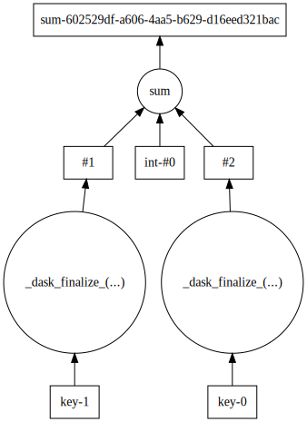

Custom Collections
==================

Dask provides a very general graph specification upon which we have built
several collections. Many problems fit into these collections, but sometimes
you might need something custom. Using ``dask.imperative`` is one way - another
is to create your own collection object. This allows your own classes to work
with general dask functions.

The Dask Interface
------------------

The dask interface requires 5 functions to be defined on your class:

1. ``_dask_graph_()``

   A function that takes no arguments and returns the dask graph for your
   object.

2. ``_dask_keys_()``

   A function that takes no arguments and returns the keys in the dask graph to
   be computed as outputs. Note that the output of this function can be a
   single key, a list of keys, or some nested combination of both.

3. ``_dask_optimize_(dsk, keys, **kwargs)``

   A function to optimize the graph before computing. This takes in a dask
   graph (as returned by ``_dask_graph_``), the output keys (as returned by
   ``_dask_keys_``), and any keyword arguments, and returns an optimized graph.

4. ``_dask_default_get_(dsk, key, **kwargs)``

   The default scheduler ``get`` function to use for this object. This takes in
   a dask graph , the output keys, and any keyword arguments, and returns the
   computed output. In most cases you probably want to just attach a scheduler
   ``get`` function as an attribute or property of the class.

5. ``_dask_finalize_(results)``

   A function that takes in the computed output keys, and returns some
   finalized result. For example, the ``_dask_finalize_`` for ``dask.array``
   takes in all the subarrays and concatenates them together into a big array,
   which is then returned.

   Note that if at all possible this function should be a ``staticmethod``,
   ``property``, or standard attribute on the object. This is because when use
   with ``dask.imperative``, the ``_dask_finalize_`` is inlined into the graph,
   and may be serialized between processes or machines. If defined as a normal
   method, it will contain a reference to ``self``, which will be serialized
   along with it (which can be **very** expensive).

By fulfilling this interface, your class should work with general functions
like ``dask.compute`` and ``dask.visualize``, as well as play nice with
``dask.imperative``.

Custom Collection Example
-------------------------

Here we'll create a simple (if contrived) class to demonstrate the interface:

.. code-block:: python

    from uuid import uuid4
    from dask.threaded import get as threaded_get

    class Duck(object):
        def __init__(self, val):
            self.key = str(uuid4())
            self.val = val

        def _dask_graph_(self):
            return {self.key: self.val}

        def _dask_keys_(self):
            return self.key

        def _dask_optimize_(self, dsk, keys, **kwargs):
            return dsk

        _dask_default_get_ = staticmethod(threaded_get)

        @staticmethod
        def _dask_finalize_(results):
            return results

This class takes in a python object as an argument and stores it as a value on
the object. We define ``_dask_graph_`` returns a simple graph mapping a uuid to
the wrapped value, and ``_dask_keys_`` returns the uuid. We don't do any
optimization of the graph (it's already just a single task), so
``_dask_optimize_`` returns the dask graph unchanged. The default scheduler is
set to ``dask.threaded.get``, which is a good default choice for many problems.
Since we're just enclosing a single value in our class, ``_dask_finalize_`` is
also the identity function. As discussed above, we define ``_dask_finalize_``
as a ``staticmethod`` to ensure that the graph doesn't contain any references
to the enclosing object.

After defining this interface, our class plays well with the rest of dask.

.. code-block:: python

    >>> from dask import compute, visualize, do, value

    >>> a = Duck(1)
    >>> b = Duck(2)

    # Can be passed to `dask.compute`
    >>> compute(a, b)
    (1, 2)

    # Works with `dask.imperative` objects
    >>> c = value(3)
    >>> res = do(sum)([a, b, c, 4])
    >>> compute(a, res)
    (1, 10)

    # Graphs can be visualized
    >>> visualize(a, res)

Here you can see that ``_dask_finalize_`` functions are indeed inlined into the
graph when used with ``dask.imperative``.
