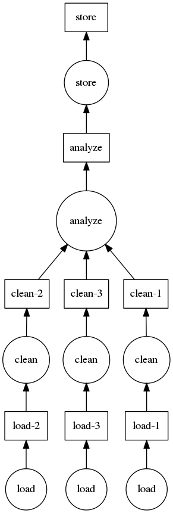

Custom Graphs
=============

There may be times that you want to do parallel computing, but your application
doesn't fit neatly into something like ``dask.array`` or ``dask.bag``.  In these
cases, you can interact directly with the dask schedulers.  These schedulers
operate well as standalone modules.

This separation provides a release valve for complex situations and allows
advanced projects additional opportunities for parallel execution, even if
those projects have an internal representation for their computations.  As dask
schedulers improve or expand to distributed memory, code written to use dask
schedulers will advance as well.

.. _custom-graph-example:

Example
-------

As discussed in the :doc:`motivation <graphs>` and :doc:`specification <spec>`
sections, the schedulers take a task graph which is a dict of tuples of
functions, and a list of desired keys from that graph.

Here is a mocked out example building a graph for a traditional clean and
analyze pipeline:

.. code-block:: python

   def load(filename):
       ...

   def clean(data):
       ...

   def analyze(sequence_of_data):
       ...

   def store(result):
       with open(..., 'w') as f:
           f.write(result)

   dsk = {'load-1': (load, 'myfile.a.data'),
          'load-2': (load, 'myfile.b.data'),
          'load-3': (load, 'myfile.c.data'),
          'clean-1': (clean, 'load-1'),
          'clean-2': (clean, 'load-2'),
          'clean-3': (clean, 'load-3'),
          'analyze': (analyze, ['clean-%d' % i for i in [1, 2, 3]]),
          'store': (store, 'analyze')}

   from dask.multiprocessing import get
   get(dsk, 'store')  # executes in parallel

Related Projects
----------------

The following excellent projects also provide parallel execution:

*  Joblib_
*  Multiprocessing_
*  `IPython Parallel`_
*  `Concurrent.futures`_
*  `Luigi`_

Each library lets you dictate how your tasks relate to each other with various
levels of sophistication.  Each library executes those tasks with some internal
logic.

Dask schedulers differ in the following ways:

1.  You specify the entire graph as a Python dict rather than using a
    specialized API
2.  You get a variety of schedulers ranging from single machine single core, to
    threaded, to multiprocessing, to distributed, and
3.  The dask single-machine schedulers have logic to execute the graph in a
    way that minimizes memory footprint.

But the other projects offer different advantages and different programming
paradigms.  One should inspect all such projects before selecting one.

.. _Joblib: https://pythonhosted.org/joblib/parallel.html
.. _Multiprocessing: https://docs.python.org/3/library/multiprocessing.html
.. _`IPython Parallel`: http://ipython.org/ipython-doc/dev/parallel/
.. _`Concurrent.futures`: https://docs.python.org/3/library/concurrent.futures.html
.. _Luigi: https://luigi.readthedocs.io
