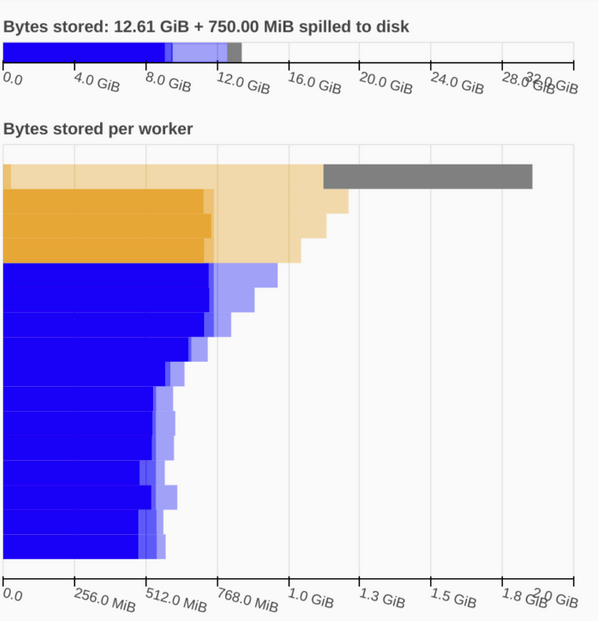

Dashboard Diagnostics
=====================

Profiling parallel code can be challenging, but the :doc:`Dask distributed scheduler <scheduling>` 
provides live feedback via its interactive dashboard. A link that redirects to the dashboard will prompt 
in the terminal where the scheduler is created, and it is also shown when you create a ``Client`` and connect 
the scheduler.

.. code-block:: python

   from dask.distributed import Client
   client = Client()  # start distributed scheduler locally. 
   client            

In a Jupyter Notebook or Jupyter Lab session displaying the client object will show the dashboard address
as following.

.. figure:: images/dashboard_link.png
    :alt: NEEDS ALT TEXT

The address of the dashboard will be displayed if you are in a Jupyter Notebook,
or, if you are in a terminal or IPython, it can be queried from ``client.dashboard_link``. By default, when starting a scheduler 
n your local machine the dashboard will be served at ``http://localhost:8787/status``, you
can type this address into your browser to access the dashboard but may be served 
elsewhere if port 8787 is taken. You can also configure the address by passing options to the 
scheduler, see ``dashboard_address`` in `LocalCluster <https://docs.dask.org/en/stable/deploying-python.html#reference>`__

The dashboard link redirects you to main dashboard page as shown below:

.. figure:: images/dashboard_status.png
    :alt: NEEDS ALT TEXT

In the entry point of the dashboard you can find multiple plots with information about your cluster 
as listed below:

- Bytes stored: Cluster memory. 
- Bytes per Worker: Memory per worker.
- Task Processing/CPU Utilization/Occupancy: Tasks being processed by each worker/ NEEDS INFO/ NEEDS INFO
- Task Stream: Individual task across threads.
- Progress: Progress of a set of tasks.

Bytes Stored and Bytes per Worker
---------------------------------
These two plots show a summary of the overall memory usage on the cluster (Bytes Stored),
as well as the individual usage on each worker (Bytes per Worker). The colors on these plots 
indicate the following.  

.. raw:: html

    <table>
        <tr>
            <td>
                
&#9632;

            </td>
            <td>Memory under target (default 60% of memory available) </td>
        </tr>
        <tr>
            <td>
                
&#9632;

            </td>
            <td> Memory is close to the spilling to disk target (default 70% of memory available)</td>
        </tr>
        <tr>
            <td>
                
&#9632;

            </td>
            <td>Memory spilled to disk</td>
        </tr>
    </table>

The different levels of transparency on these plot is related to the type of memory 
(Managed, Unmanaged and Unmanaged recent), and you can find a detailed explanation of them in the
`Worker Memory management documentation <https://distributed.dask.org/en/latest/worker.html#memory-management>`_

Processing/CPU/Occupancy
------------------------

**Task Processing** 

The *Processing* tab in the figure shows the number of tasks being processed by each worker with the blue bar. The scheduler will
try to ensure that the workers are processing the same number of tasks. If one of the bars is completely white it means that 
worker has no tasks and its waiting for them. This usually happens when the computations are close to finished (nothing 
to worry about), but it can also mean that the distribution of the task across workers is not optimized. 

.. figure:: images/dashboard_task_processing.png
    :alt: NEEDS ALT TEXT

There are three different colors that can appear in this plot (NEEDS TO FIGURE OUT HOW TO ADD ALT TEXT TO THIS TABLE):

.. raw:: html

    <table>
        <tr>
            <td>
                
&#9632;

            </td>
            <td>Processing tasks.</td>
        </tr>
        <tr>
            <td>
                
&#9632;

            </td>
            <td>Saturated: It has enough work to stay busy.</td>
        </tr>
        <tr>
            <td>
                
&#9632;

            </td>
            <td>Idle: Does not have enough work to stay busy.</td>
        </tr>
    </table>

In this plot on the dashboard we have two extra tabs with the following information:

**CPU Utilization**

The *CPU* tab shows the usage per-worker (this needs some love, haven't found a nice way of describing this) 

**Occupancy**

The *Occupancy* tab shows the occupancy, in time, per worker. The total occupancy for a worker is the total expected runtime
for all tasks currently on a worker. For example, an occupancy of 10s means an occupancy of 10s means that the worker 
estimates it will take 10s to execute all the tasks it has currently been assigned.

Task Stream
-----------

The task stream is a view of all the tasks across worker-threads. Each row represents a thread and each rectangle represents 
an individual tasks. The color for each rectangle corresponds to the task-prefix of the task being performed and it matches the color 
of the *Progress* plot (see Progress section). This means that all the individual tasks part of the `inc` task-prefix for example, will have 
the same randomly assigned color from the viridis color map. 

There are certain colors that are reserved for a specific kinds of tasks:

.. raw:: html

    <table>
        <tr>
            <td><b>Color</b></td><td><b>Meaning</b></td>
        </tr>
        <tr>
            <td>
                
&#9632;

            </td>
            <td>Transferring data between workers tasks.</td>
        </tr>
        <tr>
            <td>
                
&#9632;

            </td>
            <td>Reading from or writing to disk.</td>
        </tr>
        <tr>
            <td>
                
&#9632;

            </td>
            <td>Serializing/deserializing data.</td>
        </tr>
        <tr>
            <td>
                
&#9632;

            </td>
            <td>Erred tasks.</td>
        </tr>
    </table>

.. figure:: images/dashboard_taskstream_healthy.png
    :alt: NEEDS ALT TEXT

.. figure:: images/dashboard_task_stream_unhealthy.png
    :alt: NEEDS ALT TEXT

In some scenarios the dashboard will have white spaces between each rectangle, this means that during that time the worker-thread
is idle. Having too much white and red is an indication of not optimal use of resources.

Progress
--------

.. figure:: images/dashboard_progress.png
    :alt: NEEDS ALT TEXT

The progress bars plot shows the progress of each individual task-prefix. The color of the of each bar matches the color of the 
individual tasks on the task stream that correspond to the same task-prefix. Each horizontal bar has three different components:

.. raw:: html

    <table>
        <tr>
            <td>
                
&#9632;

            </td>
            <td>Tasks that are ready to run.</td>
        </tr>
        <tr>
            <td>
                
&#9632;

            </td>
            <td> Tasks that have been completed and are in memory.</td>
        </tr>
        <tr>
            <td>
                
&#9632;

            </td>
            <td>Tasks that have been completed, been in memory and have been released.</td>
        </tr>
    </table>

Dask JupyterLab Extension
--------------------------

The `JupyterLab Dask extension <https://github.com/dask/dask-labextension#dask-jupyterlab-extension>`__  
allows you to embed Dask's dashboard plots directly into JupyterLab panes. 

Once the JupyterLab Dask extension is installed you can choose any of the individual plots available and 
integrated as a pane in your JupyterLab session. For example, in the figure below we selected the *Task Stream*, 
the *Progress*, *Workers Memory*, and *Graph* plots. 

.. figure:: images/dashboard_jupyterlab.png
    :alt: NEEDS ALT TEXT
