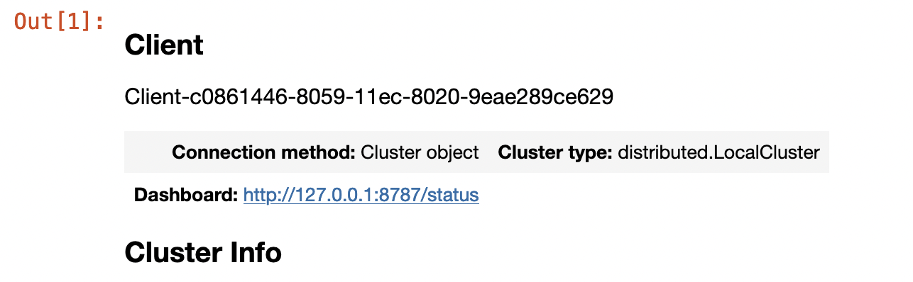
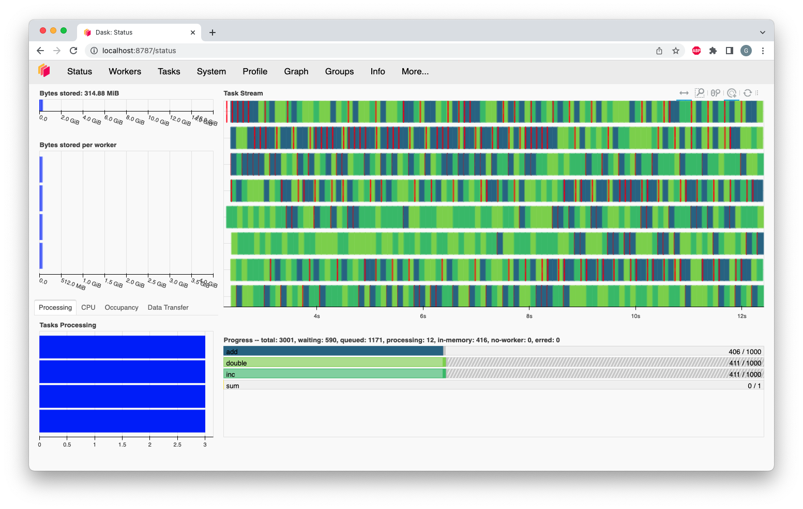
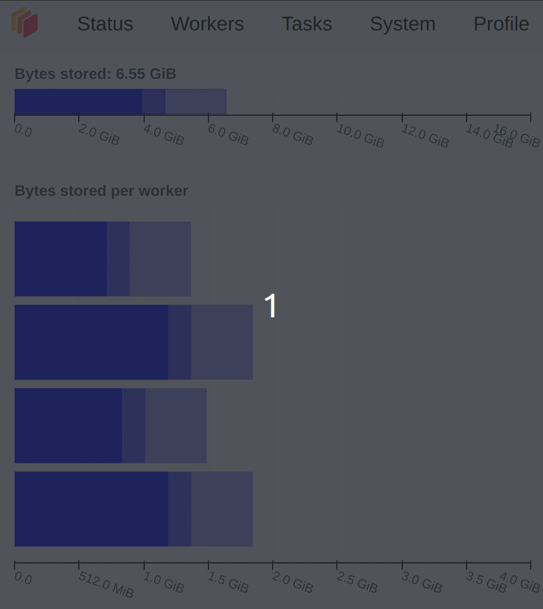
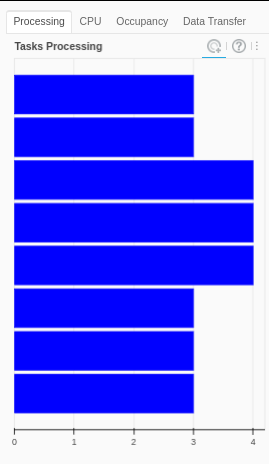
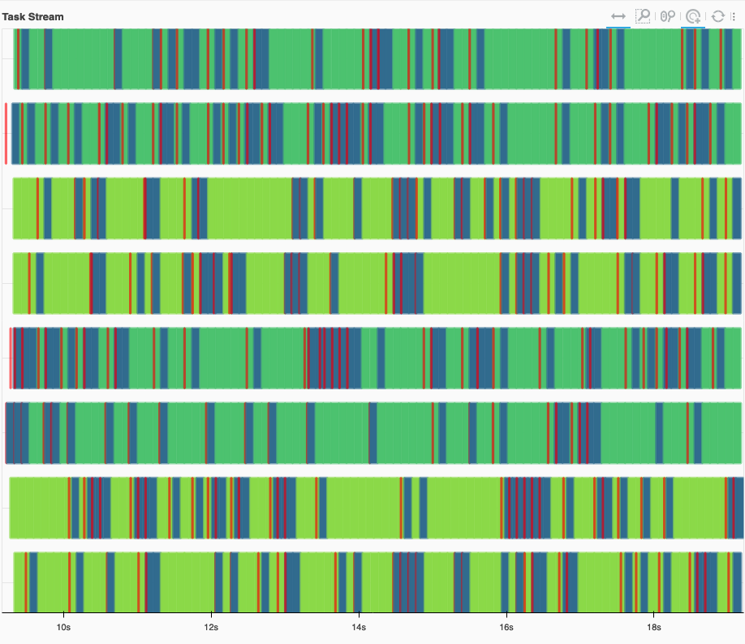
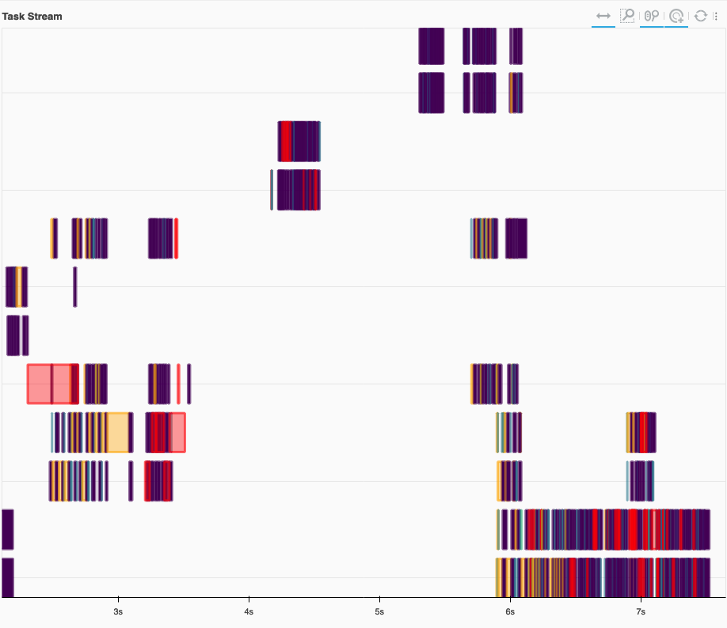
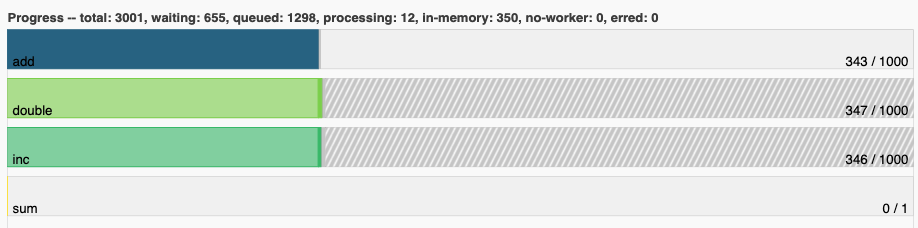
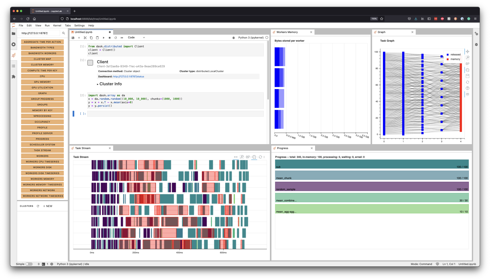

Dashboard Diagnostics
=====================

.. meta::
   :description: The interactive Dask dashboard provides numerous diagnostic plots for live monitoring of your Dask computation. It includes information about task runtimes, communication, statistical profiling, load balancing, memory use, and much more.

.. raw:: html

    <iframe width="560"
            height="315"
            src="https://www.youtube.com/embed/N_GqzcuGLCY"
            frameborder="0"
            allow="autoplay; encrypted-media"
            style="margin: 0 auto 20px auto; display: block;"
            allowfullscreen>
    </iframe>

Profiling parallel code can be challenging, but the interactive dashboard provided with
Dask's :doc:`distributed scheduler <scheduling>` makes this easier with live monitoring
of your Dask computations. The dashboard is built with `Bokeh <https://docs.bokeh.org>`_
and will start up automatically, returning a link to the dashboard whenever the scheduler is created.

Locally, this is when you create a :class:`Client <distributed.client.Client>` and connect the scheduler:

.. code-block:: python

   from dask.distributed import Client
   client = Client()  # start distributed scheduler locally.

In a Jupyter Notebook or JupyterLab session displaying the client object will show the dashboard address:

You can also query the address from ``client.dashboard_link`` (or for older versions of distributed, ``client.scheduler_info()['services']``).

By default, when starting a scheduler on your local machine the dashboard will be served at ``http://localhost:8787/status``. You can type this address into your browser to access the dashboard, but may be directed
elsewhere if port 8787 is taken. You can also configure the address using the ``dashboard_address``
parameter (see :class:`LocalCluster <distributed.deploy.local.LocalCluster>`).

There are numerous diagnostic plots available. In this guide you'll learn about some
of the most commonly used plots shown on the entry point for the dashboard:

- :ref:`dashboard.memory`: Cluster memory and Memory per worker
- :ref:`dashboard.proc-cpu-occ`:  Tasks being processed by each worker/ CPU Utilization per worker/ Expected runtime for all tasks currently on a worker.
- :ref:`dashboard.task-stream`: Individual task across threads.
- :ref:`dashboard.progress`: Progress of a set of tasks.

 In the right column, there are two bar charts with corresponding colors showing task activity over time, referred to as task stream and progress.

.. _dashboard.memory:

Bytes Stored and Bytes per Worker
---------------------------------

These two plots show a summary of the overall memory usage on the cluster (Bytes Stored),
as well as the individual usage on each worker (Bytes per Worker). The colors on these plots
indicate the following.

.. raw:: html

    <table>
        <tr>
            <td>
                
&#9632;

            </td>
            <td>Memory under target (default 60% of memory available) </td>
        </tr>
        <tr>
            <td>
                
&#9632;

            </td>
            <td> Memory is close to the spilling to disk target (default 70% of memory available)</td>
        </tr>
        <tr>
            <td>
                
&#9632;

            </td>
            <td>When the worker (or at least one worker) is paused (default 80% of memory available) or retiring</td>
        </tr>
        <tr>
            <td>
                
&#9632;

            </td>
            <td>Memory spilled to disk</td>
        </tr>
    </table>

g, and a small part of spilled to disk in grey. The bottom chart displays the memory usage per worker, with a separate bar for each of the four workers. The four bars can be seen in various colours as in blue when under target, orange as their worker's memory are close to the spilling to disk target, with the second and fourth worker standing out with a portion in grey that correspond to the amount spilled to disk, also fourth worker in red is paused or about to retire.

The different levels of transparency on these plot is related to the type of memory
(Managed, Unmanaged and Unmanaged recent), and you can find a detailed explanation of them in the
:doc:`Worker Memory management documentation <worker-memory>`

.. _dashboard.proc-cpu-occ:

Task Processing/CPU Utilization/Occupancy/Data Transfer
-------------------------------------------------------

**Task Processing**

The *Processing* tab in the figure shows the number of tasks that have been assigned to each worker. Not all of these
tasks are necessarily *executing* at the moment: a worker only executes as many tasks at once as it has threads. Any
extra tasks assigned to the worker will wait to run, depending on their :doc:`priority <priority>` and whether their
dependencies are in memory on the worker.

The scheduler will try to ensure that the workers are processing about the same number of tasks. If one of the bars is
completely white it means that worker has no tasks and is waiting for them. This usually happens when the computations
are close to finished (nothing to worry about), but it can also mean that the distribution of the task across workers is
not optimized.

There are three different colors that can appear in this plot:

.. raw:: html

    <table>
        <tr>
            <td>
                
&#9632;

            </td>
            <td>Processing tasks.</td>
        </tr>
        <tr>
            <td>
                
&#9632;

            </td>
            <td>Saturated: It has enough work to stay busy.</td>
        </tr>
        <tr>
            <td>
                
&#9632;

            </td>
            <td>Idle: Does not have enough work to stay busy.</td>
        </tr>
    </table>

In this plot on the dashboard we have two extra tabs with the following information:

**CPU Utilization**

The *CPU* tab shows the cpu usage per-worker as reported by ``psutil`` metrics.

**Occupancy**

The *Occupancy* tab shows the occupancy, in time, per worker. The total occupancy for a worker is the amount of time Dask expects it would take
to run all the tasks, and transfer any of their dependencies from other workers, *if the execution and transfers happened one-by-one*.
For example, if a worker has an occupancy of 10s, and it has 2 threads, you can expect it to take about 5s of wall-clock time for the worker
to complete all its tasks.

**Data Transfer**

The *Data Transfer* tab shows the size of open data transfers from/to other workers, per worker.

.. _dashboard.task-stream:

Task Stream
-----------

The task stream is a view of which tasks have been running on each thread of each worker. Each row represents a thread, and each rectangle represents
an individual task. The color for each rectangle corresponds to the task-prefix of the task being performed, and matches the color
of the :ref:`Progress plot <dashboard.progress>`. This means that all the individual tasks which are part of the ``inc`` task-prefix, for example, will have
the same color (which is chosen randomly from the viridis color map).

Note that when a new worker joins, it will get a new row, even if it's replacing a worker that recently left. So it's possible to temporarily
see more rows on the task stream than there are currently threads in the cluster, because both the history of the old worker and the new worker
will be displayed.

There are certain colors that are reserved for a specific kinds of operations:

.. raw:: html

    <table>
        <tr>
            <td>
                
&#9632;

            </td>
            <td>Transferring data between workers.</td>
        </tr>
        <tr>
            <td>
                
&#9632;

            </td>
            <td>Reading from or writing to disk.</td>
        </tr>
        <tr>
            <td>
                
&#9632;

            </td>
            <td>Serializing/deserializing data.</td>
        </tr>
        <tr>
            <td>
                
&#9632;

            </td>
            <td>Erred tasks.</td>
        </tr>
    </table>

In some scenarios, the dashboard will have white spaces between each rectangle. During that time, the worker thread was idle.
Having too much white space is an indication of sub-optimal use of resources. Additionally, a lot of long red bars (transfers) can indicate
a performance problem, due to anything from too large of chunksizes, too complex of a graph, or even poor scheduling choices.

    An example of a healthy Task Stream, with little to no white space. Transfers (red) are quick, and overlap with computation.

    An example of an unhealthy Task Stream, with a lot of white space. Workers were idle most of the time. Additionally, there are some long transfers (red) which don't overlap with computation. We also see spilling to disk (orange).

.. _dashboard.progress:

Progress
--------

The progress bars plot shows the progress of each individual task-prefix. The color of each bar matches the color of the
individual tasks on the task stream from the same task-prefix. Each horizontal bar has four different components, from left to right:

.. raw:: html

    <ul style="list-style-type: none">
        <li>
            
            Tasks that have completed, are not needed anymore, and now have been released from memory.
        </li>
        <li>
            
             Tasks that have completed and are in memory.
        </li>
        <li>
            
            Tasks that are ready to run.
        </li>
        <li>
            
            Tasks that are <a href="https://distributed.dask.org/en/stable/scheduling-policies.html#queuing">queued</a>. They are ready to run, but not assigned to workers yet, so higher-priority tasks can run first.
        </li>
        <li>
            
            Tasks that do not have a worker to run on due to <a href="https://distributed.dask.org/en/stable/locality.html#user-control">restrictions</a> or limited <a href="https://distributed.dask.org/en/stable/resources.html">resources</a>.
        </li>
    </ul>

erent transparency levels. The "double" and "inc" bars have a striped grey background, and the "sum" bar is empty.

Dask JupyterLab Extension
--------------------------

The `JupyterLab Dask extension <https://github.com/dask/dask-labextension#dask-jupyterlab-extension>`__
allows you to embed Dask's dashboard plots directly into JupyterLab panes.

Once the JupyterLab Dask extension is installed you can choose any of the individual plots available and
integrated as a pane in your JupyterLab session. For example, in the figure below we selected the *Task Stream*,
*Progress*, *Workers Memory*, and *Graph* plots.

