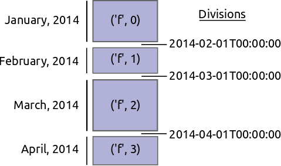

DataFrame
=========

Dask.dataframe is not ready for public use.  This document targets developers,
not users.

Dask dataframe implements a blocked DataFrame as a sequence of in-memory pandas
DataFrames, partitioned along the index.

Partitioning along the index is good because it tells us which blocks hold
which data.  This makes efficient implementations of complex operations like
join and arbitrary groupby possible in a blocked setting as long as we
join/group along the index.

Partitioning along the index is also hard because, when we re-index, we need to
shuffle all of our data between blocks.  This is tricky to code up and
expensive to compute.

Relevant Metadata
-----------------

Dask ``DataFrame`` objects contain the following data:

*  ``dask`` - The task dependency graph necessary to compute the dataframe
*  ``_name`` - String like ``'f'`` that is the prefix to all keys to define this dataframe
   like ``('f', 0)``
*  ``columns`` - list of column names to improve usability and error checking

    or

    ``name`` - a single name used in a Series

*  ``divisions`` - tuple of index values on which we partition our blocks

The ``divisions`` attribute, analogous to ``chunks`` in ``dask.array`` is
particularly important.  The values in divisions determine a partitioning of
left-inclusive / right-exclusive ranges on the index::

    divisions -- (0, 10, 20, 40, 50)
    ranges    -- [0, 10), [10, 20), [20, 40), [40, 50]

Alternatively if our data is not partitioned (as is unfortunately often the
case) then divisions will contain many instances of ``None``::

    divisions -- (None, None, None, None, None)

This is common if, for example, we read data from CSV files which don't have an
obvious ordering.

Example Partitioning
--------------------

Consider the following dataset of twelve entries in an account book separated
into three dataframes of size four.  We would like to organize them into
partitions arranged by name::

        name, balance                       name, balance
        Alice, 100                          Alice, 100
        Bob, 200                            Alice, 300
        Alice, 300                          Alice, 600
        Frank, 400                          Alice, 700
                                            Alice, 900
        name, balance
        Dan, 500                            name, balance
        Alice, 600       -> Shuffle ->      Bob, 200
        Alice, 700                          Dan, 500
        Charlie, 800                        Bob, 1200
                                            Charlie, 800
        name, balance
        Alice, 900                          name, balance
        Edith, 1000                         Frank, 400
        Frank, 1100                         Edith, 1000
        Bob, 1200                           Frank, 1100

Notice a few things

1.  On the right records are now organized by name; given any name (e.g. Bob)
    it is obvious to which block it belongs (the second).
2.  Blocks are roughly the same size (though not exactly).  We prefer evenly
    sized blocks over predictable partition values, (e.g. A, B, C).  Because
    this dataset has many Alices we have a block just for her.
3.  The blocks don't need to be sorted internally

Our divisions in this case are ``['Alice', 'Bob', 'Edith', 'Frank']``

Quantiles and Shuffle
---------------------

Many of the complex bits of ``dask.dataframe`` are about shuffling records to
obtain this nice arrangement of records along an index.  We do this in two
stages

1.  Find good values on which to partition our data
    (e.g. find, ``['Bob', 'Edith']``)
2.  Shuffle records from old blocks to new blocks

Find partition values by approximate quantiles
----------------------------------------------

The problem of finding approximate values that regularly divide our data is
exactly the problem of approximate quantiles.  This problem is somewhat
difficult due to the blocked nature of our storage, but has decent solutions.

Currently we compute percentiles/quantiles on the new index of each block and
then merge these together intelligently.

Shuffle without Partitioning
----------------------------

For large datasets one should endeavor to store data in a partitioned way.
Often this isn't possible and we need a sane fallback.

We can shuffle data into separate groups without the approximate quantile step
if we group by a decent hash function.  We can trust that idiosyncrasies in the
distribution of our data (e.g. far more Alices than Bobs) will be somewhat
smoothed over by the hash function.  This is a typical solution in many
databases.

Supported API
-------------

Dask dataframe supports the following API from pandas

* Trivially parallelizable (fast):
    *  Elementwise operations:  ``df.x + df.y``
    *  Row-wise selections:  ``df[df.x > 0]``
    *  Loc:  ``df.loc[4.0:10.5]``
    *  Common aggregations:  ``df.x.max()``
    *  Is in:  ``df[df.x.isin([1, 2, 3])]``
* Cleverly parallelizable (also fast):
    *  groupby-aggregate (with common aggregations): ``df.groupby(df.x).y.max()``
    *  value_counts:  ``df.x.value_counts``
    *  Drop duplicates:  ``df.x.drop_duplicates()``
* Requires shuffle (slow-ish, unless on index)
    *  Set index:  ``df.set_index(df.x)``
    *  groupby-apply (with anything):  ``df.groupby(df.x).apply(myfunc)``
* Ingest
    *  ``pd.read_csv``  (in all its glory)

Dask dataframe also introduces some new API

* Requires full dataset read, but otherwise fast
    *  Approximate quantiles:  ``df.x.quantiles([25, 50, 75])``
    *  Convert object dtypes to categoricals:  ``df.categorize()``
* Ingest
    *  Read from bcolz (efficient on-disk column-store):
      ``from_bcolz(x, index='mycol', categorize=True)``

Create Dask DataFrames
----------------------

From CSV files
~~~~~~~~~~~~~~

``dask.dataframe.read_csv`` uses ``pandas.read_csv`` and so inherits all of
that functions options.  Additionally it gains two new functionalities

1.  You can provide a globstring

.. code-block:: python

   >>> df = dd.read_csv('data.*.csv.gz', compression='gzip')

2.  You can specify the size of each block of data in bytes of uncompressed
    data.  Note that, especially for text data the size on disk may be much
    less than the number of bytes in memory.

.. code-block:: python

   >>> df = dd.read_csv('data.csv', chunkbytes=10000000)  # 1MB chunks

3.  You can ask to categorize your result.  This is slightly faster at read_csv
    time because we can selectively read the object dtype columns first.  This
    requires a full read of the dataset and may take some time

.. code-block:: python

   >>> df = dd.read_csv('data.csv', categorize=True)

so needs a docstring. Maybe we should have ``iris.csv`` somewhere in
the project.

From an Array
~~~~~~~~~~~~~

You can create a DataFrame from any sliceable array like object including both
NumPy arrays and HDF5 datasets.

.. code-block:: Python

   >>> dd.from_array(x, chunksize=1000000)

From BColz
~~~~~~~~~~

BColz_ is an on-disk, chunked, compressed, column-store.  These attributes make
it very attractive for dask.dataframe which can operate particularly well on
it.  There is a special ``from_bcolz`` function.

.. code-block:: Python

   >>> df = dd.from_bcolz('myfile.bcolz', chunksize=1000000)

In particular column access on a dask.dataframe backed by a ``bcolz.ctable``
will only read the necessary columns from disk.  This can provide dramatic
performance improvements.

Known Limitations
-----------------

Dask.dataframe is experimental and not to be used by the general public.
Additionally it has the following constraints

1.  Is uses the multiprocessing scheduler and so inherits those limitations
    (see shared_)
2.  The pandas API is large and dask.dataframe does not attempt to fill it.
    Many holes exist
3.  Operations like groupby and join may take some time, as they are much more
    challenging to do in parallel
4.  Some operations like ``iloc`` cease to make sense

Generally speakings users familiar with the mature and excellent functionality
of pandas should expect disappointment if they do not deeply understand the
current design and limitations of dask.dataframe.

.. _Chest: http://github.com/blaze/chest
.. _shared: shared.html
