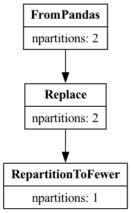

Optimizer
=========

.. currentmodule:: dask.dataframe

.. note::
    Dask DataFrame supports Query Planning since version 2024.03.0

Optimization steps
------------------

Dask DataFrame will run several optimizations before executing the computation. These
computations are aimed towards improving the efficiency of the query.

The optimizations entail the following steps (this list is not complete):

- **Projection Pushdown:**

  Select only the required columns in every step. This reduces the amount of data
  that needs to be read from storage but also the amount of data that is processed
  along the way. Columns are dropped at the earliest stage in the query.

- **Filter Pushdown:**

  Push filters down as far as possible, potentially into the IO step. Filters are
  executed in the earliest stage in the query.

- **Partition Pruning:**

  Partition selections are pushed down as far as possible, potentially into the IO
  step.

- **Avoiding Shuffles:**

  Dask DataFrame will try to avoid shuffling data between workers as much as possible.
  This can be achieved if the column layout is already known, i.e. if the DataFrame
  was shuffled on the same column before. For example, executing a
  ``df.groupby(...).apply(...)`` after a merge operation will not shuffle the data
  again if the groupby happens on the merge columns.

  .. figure:: images/optimizer/avoiding-shuffles.svg
    :align: center

    Similarly, performing two subsequent Joins/Merges on the same join-column(s) will avoid shuffling the
    data again. The optimizer identifies that the partitioning of the DataFrame is already as
    expected and thus simplifies the operation to a single Shuffle and a trivial merge operation.

- **Automatically resizing partitions:**

  The IO layers automatically adjust the partition count based on the column subset
  that is selected from the dataset. Very small partitions impact the scheduler and
  expensive operations like shuffling negatively. This is addressed by adjusting
  the partition count automatically.

  .. figure:: images/optimizer/automatic-repartitioning.svg
    :align: center

    Selecting two columns that together have 40 MB per 200 MB file. The optimizer reduces the number of partitions by a factor of 5.

Exploring the optimized query
-----------------------------

Dask will call ``df.optimize()`` before executing the computation. This method applies
the steps mentioned above and returns a new Dask DataFrame that represents the optimized
query.

A rudimentary representation of the optimized query can be obtained by calling
``df.pprint()``. This will print the query plan in a human-readable format to the
command line/console. The advantage of this method is that it doesn't require any
additional dependencies.

.. code-block::

    pdf = pd.DataFrame({"a": [1, 2, 3] * 5, "b": [1, 2, 3] * 5})
    df = dd.from_pandas(pdf, npartitions=2)
    df = df.replace(1, 5)[["a"]]

    df.optimize().pprint()

    Replace: to_replace=1 value=5
        FromPandas: frame='<pandas>' npartitions=2 columns=['a'] pyarrow_strings_enabled=True

A more advanced and easier to read reprepresentation can be obtained by calling
``df.explain()``. This method requires the ``graphviz`` package to be installed.
The method will return a graph that represents the query plan and create an image
from it.

.. code-block::

    df.explain()

We can see in both representations that ``FromPandas`` consumed the column
projection, only selecting the column ``a``.

The ``explain()`` method is significantly easier to understand for more complex
queries.
