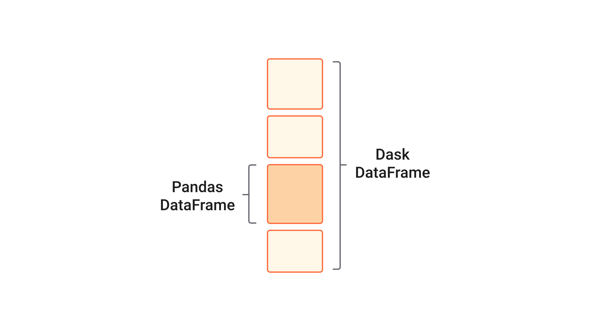

Overview
========

Dask Dataframe implements a subset of the Pandas Dataframe interface using
blocked algorithms, cutting up the large DataFrame into many small Pandas
DataFrames.  This lets us compute on dataframes that are larger than memory
using all of our cores or on many dataframes spread across a cluster.  One
operation on a dask.dataframe triggers many operations on the constituent
Pandas dataframes.

Design
------

Dask dataframes coordinate many Pandas DataFrames/Series arranged along the
index.  Dask.dataframe is partitioned *row-wise*, grouping rows by index value
for efficiency.  These Pandas objects may live on disk or on other machines.

Common Uses and Anti-Uses
-------------------------

Dask.dataframe is particularly useful in the following situations:

*  Manipulating large datasets on a single machine, even when those datasets
   don't fit comfortably into memory.
*  Fast computation on large workstation machines by parallelizing many Pandas
   calls across many cores.
*  Distributed computing of very large tables stored in the Hadoop File System
   (HDFS), S3, or other parallel file systems.
*  Parallel groupby, join, or time series computations

However in the following situations Dask.dataframe may not be the best choice:

*  If your dataset fits comfortably into RAM on your laptop then you may be
   better off just using Pandas_.  There may be simpler ways to improve
   performance than through parallelism.
*  If your dataset doesn't fit neatly into the Pandas tabular model then you
   might find more use in :doc:`dask.bag <bag>` or :doc:`dask.array <array>`
*  If you need functions that are not implemented in dask.dataframe then you
   might want to look at :doc:`dask.delayed <delayed>` which offers more
   flexibility.
*  If you need a proper database with all that databases offer you might prefer
   something like Postgres_

.. _Pandas: https://pandas.pydata.org/
.. _Postgres: https://www.postgresql.org/

Dask.dataframe copies the pandas API
------------------------------------

Because the ``dask.dataframe`` application programming interface (API) is a
subset of the pandas API it should be familiar to pandas users.  There are some
slight alterations due to the parallel nature of dask:

.. code-block:: python

   >>> import dask.dataframe as dd
   >>> df = dd.read_csv('2014-*.csv')
   >>> df.head()
      x  y
   0  1  a
   1  2  b
   2  3  c
   3  4  a
   4  5  b
   5  6  c

   >>> df2 = df[df.y == 'a'].x + 1

As with all dask collections (for example Array, Bag, DataFrame) one triggers
computation by calling the ``.compute()`` method:

.. code-block:: python

   >>> df2.compute()
   0    2
   3    5
   Name: x, dtype: int64

Scope
-----

Dask.dataframe covers a small but well-used portion of the pandas API.
This limitation is for two reasons:

1.  The pandas API is *huge*
2.  Some operations are genuinely hard to do in parallel (for example sort).

Additionally, some important operations like ``set_index`` work, but are slower
than in pandas because they may write out to disk.

The following class of computations works well:

* Trivially parallelizable operations (fast):
    *  Elementwise operations:  ``df.x + df.y``, ``df * df``
    *  Row-wise selections:  ``df[df.x > 0]``
    *  Loc:  ``df.loc[4.0:10.5]``
    *  Common aggregations:  ``df.x.max()``, ``df.max()``
    *  Is in:  ``df[df.x.isin([1, 2, 3])]``
    *  Datetime/string accessors:  ``df.timestamp.month``
* Cleverly parallelizable operations (fast):
    *  groupby-aggregate (with common aggregations): ``df.groupby(df.x).y.max()``,
       ``df.groupby('x').max()``
    *  value_counts:  ``df.x.value_counts()``
    *  Drop duplicates:  ``df.x.drop_duplicates()``
    *  Join on index:  ``dd.merge(df1, df2, left_index=True, right_index=True)``
    *  Join with Pandas DataFrames: ``dd.merge(df1, df2, on='id')``
    *  Elementwise operations with different partitions / divisions: ``df1.x + df2.y``
    *  Datetime resampling: ``df.resample(...)``
    *  Rolling averages:  ``df.rolling(...)``
    *  Pearson Correlations: ``df[['col1', 'col2']].corr()``
* Operations requiring a shuffle (slow-ish, unless on index)
    *  Set index:  ``df.set_index(df.x)``
    *  groupby-apply (with anything):  ``df.groupby(df.x).apply(myfunc)``
    *  Join not on the index:  ``dd.merge(df1, df2, on='name')``

See :doc:`DataFrame API documentation<dataframe-api>` for a more extensive
list.

Execution
---------

By default ``dask.dataframe`` uses the multi-threaded scheduler.
This exposes some parallelism when pandas or the underlying numpy operations
release the global interpreter lock (GIL).  Generally pandas is more GIL
bound than NumPy, so multi-core speed-ups are not as pronounced for
``dask.dataframe`` as they are for ``dask.array``.  This is changing, and
the pandas development team is actively working on releasing the GIL.

In some cases you may experience speedups by switching to the multiprocessing
or distributed scheduler.

.. code-block:: python

   >>> dask.set_options(get=dask.multiprocessing.get)

See :doc:`scheduler docs<scheduler-overview>` for more information.

Limitations
-----------

Dask.DataFrame does not implement the entire Pandas interface.  Users expecting this
will be disappointed.  Notably, dask.dataframe has the following limitations:

1.  Setting a new index from an unsorted column is expensive
2.  Many operations, like groupby-apply and join on unsorted columns require
    setting the index, which as mentioned above, is expensive
3.  The Pandas API is very large.  Dask.dataframe does not attempt to implement
    many pandas features or any of the more exotic data structures like NDFrames
