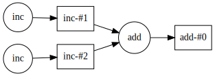
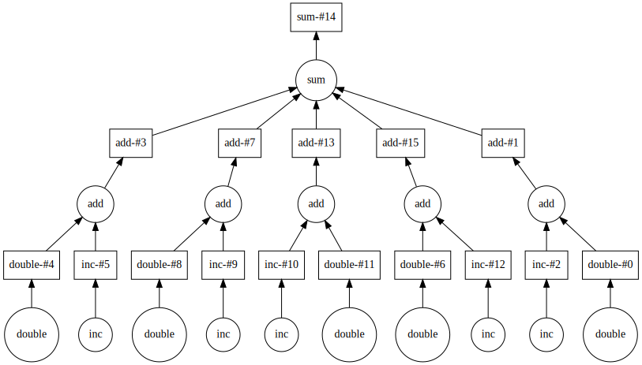

Delayed
=======

.. toctree::
   :maxdepth: 1
   :hidden:

   delayed-api.rst
   delayed-collections.rst
   delayed-best-practices.rst

Sometimes problems don't fit into one of the collections like ``dask.array`` or
``dask.dataframe``. In these cases, users can parallelize custom algorithms
using the simpler ``dask.delayed`` interface. This allows one to create graphs
directly with a light annotation of normal python code:

.. code-block:: python

   >>> x = dask.delayed(inc)(1)
   >>> y = dask.delayed(inc)(2)
   >>> z = dask.delayed(add)(x, y)
   >>> z.compute()
   5
   >>> z.vizualize()

Example
-------

Sometimes we face problems that are parallelizable, but don't fit into high-level
abstractions like Dask Array or Dask DataFrame.  Consider the following example:

.. code-block:: python

    def inc(x):
        return x + 1

    def double(x):
        return x + 2

    def add(x, y):
        return x + y

    data = [1, 2, 3, 4, 5]

    output = []
    for x in data:
        a = inc(x)
        b = double(x)
        c = add(a, b)
        output.append(c)

    total = sum(output)

There is clearly parallelism in this problem (many of the ``inc``,
``double``, and ``add`` functions can evaluate independently), but it's not
clear how to convert this to a big array or big DataFrame computation.

As written, this code runs sequentially in a single thread.  However, we see that
a lot of this could be executed in parallel.

The Dask ``delayed`` function decorates your functions so that they operate
*lazily*.  Rather than executing your function immediately, it will defer
execution, placing the function and its arguments into a task graph.

.. currentmodule:: dask.delayed

.. autosummary::
    delayed

We slightly modify our code by wrapping functions in ``delayed``.
This delays the execution of the function and generates a Dask graph instead:

.. code-block:: python

    import dask

    output = []
    for x in data:
        a = dask.delayed(inc)(x)
        b = dask.delayed(double)(x)
        c = dask.delayed(add)(a, b)
        output.append(c)

    total = dask.delayed(sum)(output)

We used the ``dask.delayed`` function to wrap the function calls that we want
to turn into tasks.  None of the ``inc``, ``double``, ``add``, or ``sum`` calls
have happened yet. Instead, the object ``total`` is a ``Delayed`` result that
contains a task graph of the entire computation.  Looking at the graph we see
clear opportunities for parallel execution.  The Dask schedulers will exploit
this parallelism, generally improving performance (although not in this
example, because these functions are already very small and fast.)

.. code-block:: python

   total.visualize()  # see image to the right

We can now compute this lazy result to execute the graph in parallel:

.. code-block:: python

   >>> total.compute()
   45

Decorator
---------

It is also common to see the delayed function used as a decorator.  Here is a
reproduction of our original problem as a parallel code:

.. code-block:: python

    import dask

    @dask.delayed
    def inc(x):
        return x + 1

    @dask.delayed
    def double(x):
        return x + 2

    @dask.delayed
    def add(x, y):
        return x + y

    data = [1, 2, 3, 4, 5]

    output = []
    for x in data:
        a = inc(x)
        b = double(x)
        c = add(a, b)
        output.append(c)

    total = dask.delayed(sum)(output)

Real time
---------

Sometimes you want to create and destroy work during execution, launch tasks
from other tasks, etc.  For this, see the :doc:`Futures <futures>` interface.

Best Practices
--------------

For a list of common problems and recommendations see :doc:`Delayed Best
Practices <delayed-best-practices>`.
