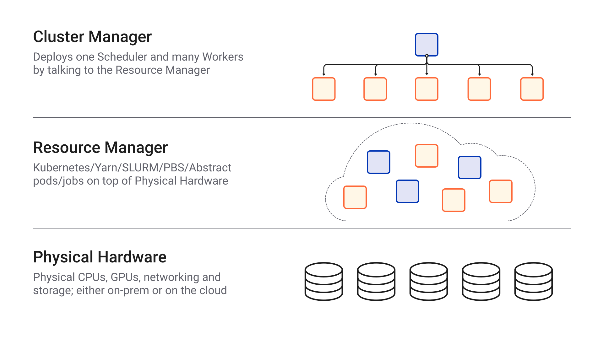

Deploy Dask Clusters
====================

.. toctree::
   :maxdepth: 1
   :hidden:

   deploying-python.rst
   deploying-cli.rst
   deploying-ssh.rst
   deploying-docker.rst
   deploying-hpc.rst
   deploying-kubernetes.rst
   deploying-cloud.rst
   deploying-python-advanced.rst

The ``dask.distributed`` scheduler works well on a single machine and scales to many machines
in a cluster. We recommend using ``dask.distributed`` clusters at all scales for the following
reasons:

1.  It provides access to asynchronous API, notably :doc:`Futures <../../futures>`
2.  It provides a diagnostic dashboard that can provide valuable insight on
    performance and progress
3.  It handles data locality with sophistication, and so can be more
    efficient than the multiprocessing scheduler on workloads that require
    multiple processes

This page describes various ways to set up Dask clusters on different hardware, either
locally on your own machine or on a distributed cluster.  If you are just
getting started then you can save this page for later as Dask runs perfectly well on a single machine
without a distributed scheduler. But once you start using Dask in anger you'll find a lot of benefit
both in terms of scaling and debugging by using the distributed scheduler.

You can continue reading or watch the screencast below:

.. raw:: html

   <iframe width="560"
           height="315"
           src="https://www.youtube.com/embed/TQM9zIBzNBo"
           style="margin: 0 auto 20px auto; display: block;"
           frameborder="0"
           allow="accelerometer; autoplay; encrypted-media; gyroscope; picture-in-picture"
           allowfullscreen></iframe>

If you import Dask, set up a computation, and call ``compute``, then you
will use the single-machine scheduler by default.  To use the ``dask.distributed``
scheduler you must set up a ``Client``.

.. code-block:: python

   import dask.dataframe as dd
   df = dd.read_csv(...)
   df.x.sum().compute()  # This uses the single-machine scheduler by default

.. code-block:: python

   from dask.distributed import Client
   client = Client(...)  # Connect to distributed cluster and override default
   df.x.sum().compute()  # This now runs on the distributed system

There are many ways to start the distributed scheduler and worker components that your client
needs to connect to. You can run them manually using :doc:`command line tools <deploying-cli>`
but often the most straight forward way is to use a *cluster manager* utility class.

.. code-block:: python

   from dask.distributed import Client, LocalCluster
   cluster = LocalCluster()  # Launches a scheduler and workers locally
   client = Client(cluster)  # Connect to distributed cluster and override default
   df.x.sum().compute()  # This now runs on the distributed system

There are a number of different *cluster managers* available, so you can use
Dask distributed with a range of platforms. These *cluster managers* deploy a scheduler
and the necessary workers as determined by communicating with the *resource manager*.
All *cluster managers* follow the same interface but have platform specific configuration
options. This makes it convenient to switch from your local machine to a remote multi-node
cluster without sacrificing the flexibility of the platform you are deploying on.

`Dask Jobqueue <https://github.com/dask/dask-jobqueue>`_, for example, is a set of
*cluster managers* for HPC users and works with job queueing systems
(in this case, the *resource manager*) such as `PBS <https://en.wikipedia.org/wiki/Portable_Batch_System>`_,
`Slurm <https://en.wikipedia.org/wiki/Slurm_Workload_Manager>`_,
and `SGE <https://en.wikipedia.org/wiki/Oracle_Grid_Engine>`_.
Those workers are then allocated physical hardware resources.

.. code-block:: python

   from dask.distributed import Client
   from dask_jobqueue import PBSCluster
   cluster = PBSCluster()  # Launches a scheduler and workers on HPC via PBS
   client = Client(cluster)  # Connect to distributed cluster and override default
   df.x.sum().compute()  # This now runs on the distributed system

   An overview of cluster management with Dask distributed.

To summarize, you can use the default, single-machine scheduler to use Dask
on your local machine. If you'd like use a cluster *or* simply take advantage
of the :doc:`extensive diagnostics <../diagnostics-distributed>`,
you can use Dask distributed. The following resources explain
in more detail how to set up Dask on a variety of local and distributed hardware:

- Single Machine:
    - :doc:`Default Scheduler <scheduling>`: The no-setup default.
      Uses local threads or processes for larger-than-memory processing
    - :doc:`dask.distributed <deploying-python>`: The sophistication of
      the newer system on a single machine.  This provides more advanced
      features while still requiring almost no setup.
- Distributed computing:
    - `Beginner's Guide to Configuring a Dask distributed Cluster <https://blog.dask.org/2020/07/30/beginners-config>`_
    - `Overview of cluster management options <https://blog.dask.org/2020/07/23/current-state-of-distributed-dask-clusters>`_
    - :doc:`Manual Setup <deploying-cli>`: The command line interface to set up
      ``dask-scheduler`` and ``dask-worker`` processes.  Useful for IT or
      anyone building a deployment solution.
    - :doc:`SSH <deploying-ssh>`: Use SSH to set up Dask across an un-managed
      cluster.
    - :doc:`High Performance Computers <deploying-hpc>`: How to run Dask on
      traditional HPC environments using tools like MPI, or job schedulers like
      SLURM, SGE, TORQUE, LSF, and so on.
    - :doc:`Kubernetes <deploying-kubernetes>`: Deploy Dask with the
      popular Kubernetes resource manager using either Helm or a native deployment.
    - `YARN / Hadoop <https://yarn.dask.org/en/latest/>`_: Deploy
      Dask on YARN clusters, such as are found in traditional Hadoop
      installations.
    - `Dask Gateway <https://gateway.dask.org/>`_ provides a secure,
      multi-tenant server for managing Dask clusters and allows users to launch
      and use Dask clusters in a shared cluster environment.
    - :doc:`Python API (advanced) <deploying-python-advanced>`: Create
      ``Scheduler`` and ``Worker`` objects from Python as part of a distributed
      Tornado TCP application.  This page is useful for those building custom
      frameworks.
    - :doc:`Docker <deploying-docker>` images are available and may be useful
      in some of the solutions above.
    - :doc:`Cloud <deploying-cloud>` for current recommendations on how to
      deploy Dask and Jupyter on common cloud providers like Amazon, Google, or
      Microsoft Azure.
- Hosted / managed Dask clusters (listed in alphabetical order):
    - `Coiled <https://coiled.io/>`_ handles the creation and management of
      Dask clusters on cloud computing environments (AWS, Azure, and GCP).
    - `Domino Data Lab <https://www.dominodatalab.com/>`_ lets users create
      Dask clusters in a hosted platform.
    - `Saturn Cloud <https://saturncloud.io/>`_ lets users create
      Dask clusters in a hosted platform or within their own AWS accounts.
