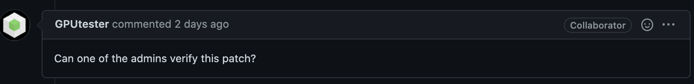

Development Guidelines
======================

Dask is a community maintained project.  We welcome contributions in the form
of bug reports, documentation, code, design proposals, and more.
This page provides resources on how best to contribute.

.. note:: Dask strives to be a welcoming community of individuals with diverse
   backgrounds. For more information on our values, please see our
   `code of conduct
   <https://github.com/dask/governance/blob/main/code-of-conduct.md>`_
   and
   `diversity statement <https://github.com/dask/governance/blob/main/diversity.md>`_

Where to ask for help
---------------------

Dask conversation happens in the following places:

#.  `Dask Discourse forum`_: for usage questions and general discussion
#.  `Stack Overflow #dask tag`_: for usage questions
#.  `GitHub Issue Tracker`_: for discussions around new features or established bugs
#.  `Dask Community Slack`_: for real-time discussion

For usage questions and bug reports we prefer the use of Discourse, Stack Overflow
and GitHub issues over Slack chat.  Discourse, GitHub and Stack Overflow are more easily
searchable by future users, so conversations had there can be useful to many more people
than just those directly involved.

.. _`Dask Discourse forum`: https://dask.discourse.group
.. _`Stack Overflow  #dask tag`: https://stackoverflow.com/questions/tagged/dask
.. _`GitHub Issue Tracker`: https://github.com/dask/dask/issues/
.. _`Dask Community Slack`: https://join.slack.com/t/dask/shared_invite/zt-mfmh7quc-nIrXL6ocgiUH2haLYA914g

Separate Code Repositories
--------------------------

Dask maintains code and documentation in a few git repositories hosted on the
GitHub ``dask`` organization, https://github.com/dask.  This includes the primary
repository and several other repositories for different components.  A
non-exhaustive list follows:

*  https://github.com/dask/dask: The main code repository holding parallel
   algorithms, the single-machine scheduler, and most documentation
*  https://github.com/dask/distributed: The distributed memory scheduler
*  https://github.com/dask/dask-ml: Machine learning algorithms
*  https://github.com/dask/s3fs: S3 Filesystem interface
*  https://github.com/dask/gcsfs: GCS Filesystem interface
*  https://github.com/dask/hdfs3: Hadoop Filesystem interface
*  ...

Git and GitHub can be challenging at first.  Fortunately good materials exist
on the internet.  Rather than repeat these materials here, we refer you to
Pandas' documentation and links on this subject at
https://pandas.pydata.org/pandas-docs/stable/contributing.html

Issues
------

The community discusses and tracks known bugs and potential features in the
`GitHub Issue Tracker`_.  If you have a new idea or have identified a bug, then
you should raise it there to start public discussion.

If you are looking for an introductory issue to get started with development,
then check out the `"good first issue" label`_, which contains issues that are good
for starting developers.  Generally, familiarity with Python, NumPy, Pandas, and
some parallel computing are assumed.

.. _`"good first issue" label`: https://github.com/dask/dask/labels/good%20first%20issue

Development Environment
-----------------------

Download code
~~~~~~~~~~~~~

Make a fork of the main `Dask repository <https://github.com/dask/dask>`_ and
clone the fork::

   git clone https://github.com/<your-github-username>/dask.git
   cd dask

You should also pull the latest git tags (this ensures ``pip``'s dependency resolver
can successfully install Dask)::

   git remote add upstream https://github.com/dask/dask.git
   git pull upstream main --tags

Contributions to Dask can then be made by submitting pull requests on GitHub.

Install
~~~~~~~

From the top level of your cloned Dask repository you can install a
local version of Dask, along with all necessary dependencies, using
pip or conda_

.. _conda: https://conda.io/

``pip``::

  python -m pip install -e ".[complete,test]"

``conda``::

  conda env create -n dask-dev -f continuous_integration/environment-3.9.yaml
  conda activate dask-dev
  python -m pip install --no-deps -e .

Run Tests
~~~~~~~~~

Dask uses py.test_ for testing.  You can run tests from the main dask directory
as follows::

   py.test dask --verbose --doctest-modules

.. _py.test: https://docs.pytest.org/en/latest/

Contributing to Code
--------------------

Dask maintains development standards that are similar to most PyData projects.  These standards include
language support, testing, documentation, and style.

Python Versions
~~~~~~~~~~~~~~~

Dask supports Python versions 3.8, 3.9 and 3.10.
Name changes are handled by the :file:`dask/compatibility.py` file.

Test
~~~~

Dask employs extensive unit tests to ensure correctness of code both for today
and for the future.  Test coverage is expected for all code contributions.

Tests are written in a py.test style with bare functions:

.. code-block:: python

   def test_fibonacci():
       assert fib(0) == 0
       assert fib(1) == 0
       assert fib(10) == 55
       assert fib(8) == fib(7) + fib(6)

       for x in [-3, 'cat', 1.5]:
           with pytest.raises(ValueError):
               fib(x)

These tests should compromise well between covering all branches and fail cases
and running quickly (slow test suites get run less often).

You can run tests locally by running ``py.test`` in the local dask directory::

   py.test dask

You can also test certain modules or individual tests for faster response::

   py.test dask/dataframe

   py.test dask/dataframe/tests/test_dataframe.py::test_rename_index

If you want the tests to run faster, you can run them in parallel using
``pytest-xdist``::

   py.test dask -n auto

Tests run automatically on the Travis.ci and Appveyor continuous testing
frameworks on every push to every pull request on GitHub.

Tests are organized within the various modules' subdirectories::

    dask/array/tests/test_*.py
    dask/bag/tests/test_*.py
    dask/bytes/tests/test_*.py
    dask/dataframe/tests/test_*.py
    dask/diagnostics/tests/test_*.py

For the Dask collections like Dask Array and Dask DataFrame, behavior is
typically tested directly against the NumPy or Pandas libraries using the
``assert_eq`` functions:

.. code-block:: python

   import numpy as np
   import dask.array as da
   from dask.array.utils import assert_eq

   def test_aggregations():
       nx = np.random.random(100)
       dx = da.from_array(nx, chunks=(10,))

       assert_eq(nx.sum(), dx.sum())
       assert_eq(nx.min(), dx.min())
       assert_eq(nx.max(), dx.max())
       ...

This technique helps to ensure compatibility with upstream libraries and tends
to be simpler than testing correctness directly.  Additionally, by passing Dask
collections directly to the ``assert_eq`` function rather than call compute
manually, the testing suite is able to run a number of checks on the lazy
collections themselves.

Docstrings
~~~~~~~~~~

User facing functions should roughly follow the numpydoc_ standard, including
sections for ``Parameters``, ``Examples``, and general explanatory prose.

By default, examples will be doc-tested.  Reproducible examples in documentation
is valuable both for testing and, more importantly, for communication of common
usage to the user.  Documentation trumps testing in this case and clear
examples should take precedence over using the docstring as testing space.
To skip a test in the examples add the comment ``# doctest: +SKIP`` directly
after the line.

.. code-block:: python

   def fib(i):
       """ A single line with a brief explanation

       A more thorough description of the function, consisting of multiple
       lines or paragraphs.

       Parameters
       ----------
       i: int
            A short description of the argument if not immediately clear

       Examples
       --------
       >>> fib(4)
       3
       >>> fib(5)
       5
       >>> fib(6)
       8
       >>> fib(-1)  # Robust to bad inputs
       ValueError(...)
       """

.. _numpydoc: https://numpydoc.readthedocs.io/en/latest/format.html#docstring-standard

Docstrings are tested under Python 3.8 on GitHub Actions. You can test
docstrings with pytest as follows::

   py.test dask --doctest-modules

Docstring testing requires ``graphviz`` to be installed. This can be done via::

   conda install -y graphviz

Code Formatting
~~~~~~~~~~~~~~~

Dask uses several code linters (flake8, black, isort, pyupgrade, mypy), which are
enforced by CI. Developers should run them locally before they submit a PR, through the
single command ``pre-commit run --all-files``. This makes sure that linter versions and
options are aligned for all developers.

Optionally, you may wish to setup the `pre-commit hooks <https://pre-commit.com/>`_ to
run automatically when you make a git commit. This can be done by running::

   pre-commit install

from the root of the Dask repository. Now the code linters will be run each time you
commit changes. You can skip these checks with ``git commit --no-verify`` or with the
short version ``git commit -n``.

Contributing to Documentation
-----------------------------

Dask uses Sphinx_ for documentation, hosted on https://readthedocs.org .
Documentation is maintained in the RestructuredText markup language (``.rst``
files) in ``dask/docs/source``.  The documentation consists both of prose
and API documentation.

The documentation is automatically built, and a live preview is available,
for each pull request submitted to Dask. Additionally, you may also
build the documentation yourself locally by following the instructions outlined
below.

How to build the Dask documentation
~~~~~~~~~~~~~~~~~~~~~~~~~~~~~~~~~~~

To build the documentation locally, make a fork of the main
`Dask repository <https://github.com/dask/dask>`_, clone the fork::

  git clone https://github.com/<your-github-username>/dask.git
  cd dask/docs

Install the packages in ``requirements-docs.txt``.

Optionally create and activate a ``conda`` environment first::

  conda create -n daskdocs -c conda-forge python=3.8
  conda activate daskdocs

Install the dependencies with ``pip``::

  python -m pip install -r requirements-docs.txt

Then build the documentation with ``make``::

   make html

The resulting HTML files end up in the ``build/html`` directory.

You can now make edits to rst files and run ``make html`` again to update
the affected pages.

Dask CI Infrastructure
----------------------

Github Actions
~~~~~~~~~~~~~~

Dask uses Github Actions for Continuous Integration (CI) testing for each PR.
These CI builds will run the test suite across a variety of Python versions, operating
systems, and package dependency versions.  Additionally, if a commit message
includes the phrase ``test-upstream``, then an additional CI build will be
triggered which uses the development versions of several dependencies
including: NumPy, pandas, fsspec, etc.

The CI workflows for Github Actions are defined in
`.github/workflows <https://github.com/dask/dask/tree/main/.github/workflows>`_
with additional scripts and metadata located in `continuous_integration
<https://github.com/dask/dask/tree/main/continuous_integration>`_

GPU CI
~~~~~~

Pull requests are also tested with a GPU enabled CI environment provided by
NVIDIA: `gpuCI <https://gpuci.gpuopenanalytics.com/>`_.
Unlike Github Actions, the CI environment for gpuCI is controlled with the
`rapidsai/dask-build-environment <https://github.com/rapidsai/dask-build-environment/>`_
docker image.  When making commits to the
`dask-build-environment repo <https://github.com/rapidsai/dask-build-environment/>`_ , a new image is built.
The docker image building process can be monitored
`here <https://gpuci.gpuopenanalytics.com/job/dask/job/dask-build-environment/job/branch/job/dask-build-env-main/>`_.
Note, the ``dask-build-environment`` has two separate Dockerfiles for Dask
and Distributed similiarlly, gpuCI will run for both `Dask
<https://gpuci.gpuopenanalytics.com/job/dask/job/dask/job/prb/job/dask-prb/>`_
and `Distributed
<https://gpuci.gpuopenanalytics.com/job/dask/job/distributed/job/prb/job/distributed-prb/>`_

For each PR, gpuCI will run all tests decorated with the pytest marker
``@pytest.mark.gpu``.  This is configured in the `gpuci folder
<https://github.com/dask/dask/tree/main/continuous_integration/gpuci>`_ .
Like Github Actions, gpuCI will not run when first time contributors to Dask or
Distributed submit PRs.  In this case, the gpuCI bot will comment on the PR:

.. note:: Can one of the admins verify this patch?

Dask Maintainers can then approve gpuCI builds for these PRs with following choices:

- To only approve the PR contributor for the current PR, leave a comment which states ``ok to test``
- To approve the current PR and all future PRs from the contributor, leave a comment which states ``add to allowlist``

For more information about gpuCI please consult the `docs page
<https://docs.rapids.ai/gpuci>`_

.. _Sphinx: https://www.sphinx-doc.org/
