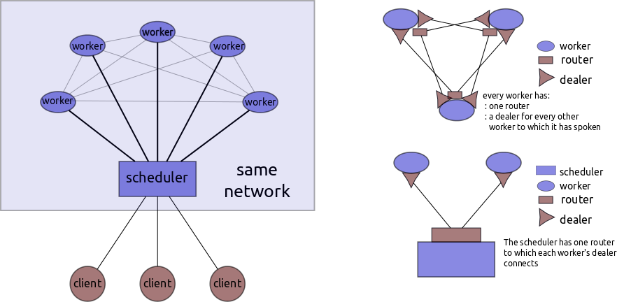

Distributed Scheduling Details
==============================

*Dask.distributed has not been battle tested. It is for experimental use only*

Client-Scheduler, Scheduler-Worker and Worker-Worker interactions can be
complex and deserve prose documentation. Because this code lives in
three separate files we consolidate some documentation here.

Protocol
--------

Most communications between two nodes (e.g. scheduler to worker) are a form of
asynchronous RPC.  Node A tells node B to take some action; that action
may in turn send an action back to node A or to some other node.
Messages between two nodes have two frames, a *header* and a *payload*.

A **Header** is a pickled Python dict with the following keys:

::

    address:  Return address of the sender
    function: The name of the operation to execute on the recipient node
    jobid: Some identifier (optional)
    timestamp: not yet implemented, but we should send datetimes

    {'address': 'tcp://alice:5000',
     'function': 'setitem',
     'jobid': 123,
     'timestamp', datetime.utcnow()}

The **Payload** can be anything, but is generally also a pickled dict
with arguments for the remote function. This depends on the operation.
For example the ``setitem`` function's payload consists of a pickled dict with
a key and value.

::

    {'key': 'x', 'value': 100}

Both workers and schedulers maintain dictionaries of functions that they
expose to other workers or schedulers, e.g.

::

    Worker.scheduler_funcitons = {'setitem': self.setitem_scheduler, ...}
    Worker.worker_functions = {'status': self.status, ...}

Often operations are paired with an acknowledgement callback on the
caller side.

::

    Scheduler.worker_functions = {'setitem-ack': self.setitem_ack, ...}

The threads that listen for events fire these functions asynchronously
using a local threadpool.

Example
-------

A scheduler Alice sends a message to a worker Bob to get the value of key
``'x'`` stored on Bob.

::

    header = {'function': 'getitem', 'address': 'ipc://alice'}
    payload = {'key': 'x', 'queue': 'name-of-queue-on-alice'}

Bob gets this information, unpickles the header and matches it against
his dictionary of functions

::

    >>> Bob.scheduler_functions['getitem']
    Bob.getitem_scheduler

So Bob calls this function in a separate thread with the header an payload as
arguments.

::

    Bob.pool.apply_async(Bob.getitem_scheduler, args=(header, payload))

That function might go ahead and trigger computation or future
communication, in which case Alice goes through a similar sequence to
what Bob just did.

Getitem Scheduler -> [Workers]
------------------------------

::

    worker: 'getitem'
    scheduler: 'getitem-ack'

While that example is fresh in our minds, lets look at that pattern.

Schedulers often need to grab lots of data from many workers, give up
control, and then gain control again when all of the data has arrived.
We do this by creating a queue on the scheduler for each batch of
received messages.

::

    Alice.queues['unique-identifier'] = Queue()

Alice now sends off a bunch of messages to many workers

::

    header: {'function': 'getitem', 'address': 'ipc://alice'}
    payload1: {'key': 'x', 'queue': 'unique-identifier'}
    payload2: {'key': 'y', 'queue': 'unique-identifier'}

Bob and Charlie and company handle many of these, returning payloads
like the following:

::

    payload1: {'key': 'x', 'value': 10, 'queue': 'unique-identifier'}
    payload2: {'key': 'y', 'value': 20, 'queue': 'unique-identifier'}

Alice watches the queue, and when the right number of results have come
in does whatever she wanted to do in the first place.

Collect Worker -> [Worker]
--------------------------

Workers go through a very similar process with the ``Worker.collect``
function. They maintain similar queues and fire of similar numbers of
messages. This occurs whenever they are asked to ``compute`` anything.

Compute Scheduler -> Worker
---------------------------

::

    worker: 'compute'
    scheduler: 'finished-task'

During active scheduling the Scheduler maintains what tasks should be
run next and maintains a queue of available workers. General flow is as
follows:

Scheduler selects task ``{'x': (inc, 'y')}``, selects worker
``'tcp://bob'``, and sends to the worker the following information under
the function name, ``'compute'``

::

    key: identifier of the task in the dask graph
         e.g. 'x' in {'x': (inc, 'y')}
    task: task in the dask graph
         e.g. (inc, 'y') in {'x': (inc, 'y')}
    locations: locations of where data might live in the network of dependencies
         e.g. {'y': ['tcp://charlie', 'tcp://dennis']}

    {'key': 'x',
     'task': (inc, 'y'),
     'locations': {'y': ['tcp://charlie', 'tcp://dennis']}

The worker receives this and goes through a collect phase as described
above, gathering the necessary dependencies to its local data store.

The worker then does actual computation.

The worker reports back to the scheduler under the function
``'finished-task'``

::

    key: identifier of the dask in the dask graph
    duration: the time in seconds that it took to complete the task
    status: Hopefully the text 'OK'
    dependencies: The keys of the data that it had to collect `list(locations)`

    {'key': 'x',
     'duration': 0.0001,
     'status': 'OK',
     'dependencies': ['y']}

Notably, the worker *does not* send back the result. The scheduler
merely notes that the worker has the result and will send other workers
there if necessary.

When the scheduler receives the ``'finished-task'`` response it updates
its bookkeeping data structures showing what data lives where, and puts
the worker back on the ``available_workers`` queue.

Queues and Callbacks
--------------------

Machines coordinate by calling functions on each other. Consider two
machines Alice and Bob. When Alice needs Bob to send her a result she
fires off a request to Bob, has to wait around for it to return, and
then needs to wake up right when it gets back. Furthermore, the
centralized message listener needs to know to direct the message to
the right thread on Alice waiting for the results. We accomplish this with
queues.

1. Alice sets up a new local queue with a unique ID::

       qkey = str(uuid.uuid1())
       Alice.queues[qkey] = Queue()

2. The calling function on Alice sends off her request to Bob with the
   queue key, and then waits on that queue.::

       header = {..., 'function': 'f'}
       payload = {..., 'queue': qkey}

3. Bob does his work and then sends back the result, passing the queue
   key through::

       header = {..., 'function': 'f-ack'}
       payload = {..., 'queue': qkey}

4. Alice's central listening thread gets this message and passes it to
   the ``f_ack`` function, which knows to look for the ``'queue'`` data
   and passes the result into the right queue::

        Alice.queues[payload['queue']].put(...)

5. The calling function on Alice wakes up and continues execution
6. The calling function cleans up the queue

This approach is effective but does require coordination between three
different functions.

1. The calling function on Alice
2. The called function on Bob, ``f``
3. The acknowledgement function on Alice, ``f_ack``

In practice I've found this to be relatively straightforward, but
welcome better solutions.

Clients and Schedulers
----------------------

.. figure:: images/distributed-layout.png
   :alt:
   :align: right

The client and scheduler are different processes and can live on
different machines. This is mainly to support the situation where you
have a scheduler and cluster on some remote resource, like EC2, but want
to drive it from your local machine without suffering terrible
scheduler-worker latency issues. This also opens up options for
registering and sharing collections between clients on a centralized
scheduler.

The ``Client`` is simpler than either the ``Worker`` or ``Scheduler``. The
client is fully synchronous/blocking and really only has one main operation,
"ask scheduler to execute dask graph".

The Client can only talk to the Scheduler, it does not talk to the
workers.

Socket connections
------------------

The scheduler maintains two routers, one for clients, and one for
workers.

Each worker has a dealer socket to the scheduler. A worker connects to
only one scheduler. Each worker has a router socket to manage requests
from other workers. Each worker has dealers to connect to other workers.
It creates these dealer sockets on demand; it does not create all N-N
connections on creation. It stores these sockets for reuse later. To
avoid having too many open file descriptors workers clear their cache of
dealer sockets after they reach some predefined limit (100 by default).
Workers discover each other only when told to do so by the scheduler (see
``collect/compute`` patterns above).

Each client has a dealer socket to the scheduler. Clients do not talk to
workers or to each other.

What dask.distributed doesn't do
--------------------------------

Currently ``dask.distributed`` doesn't do any of the following:

1.  Launch worker and scheduler processes on your cluster.  See Yarn/Mesos
2.  Ensure a uniform software environment among workers.  See ``conda env``,
    ``conda cluster``.
3.  Handle failed Workers (though this is doable in the future)
4.  Handle a failed Scheduler (this is unlikely in moderate term)
5.  Interact intelligently with data-local file-systems like HDFS
