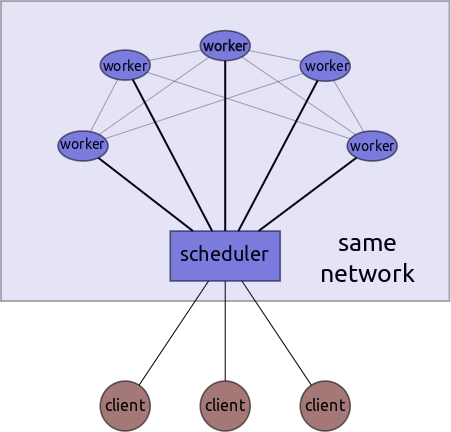

Distributed Scheduling
======================

*Dask.distributed has not been battle tested. It is for experimental use only*

Dask includes a scheduler for distributed computation in ``dask.distributed``.
This executes dask graphs in parallel on multiple nodes.  A centralized
scheduler manages distributed workers communicating tasks and results over
ZeroMQ sockets.  Task management is centralized in a single scheduler but peers
communicate data between each other in a distributed fashion.




Pieces
------

Dask.distributed consists of three pieces

1.  One centralized scheduler
2.  Many distributed workers
3.  Potentially many clients

The scheduler manages workers to execute dask graphs.  The workers communicate
to each other to share intermediate results.  The clients communicate to the
scheduler periodically when they deliver full dask graphs for scheduling.  The
clients do not talk directly to the workers.


Setup
-----

The scheduler and workers should be close-by in order to minimize scheduling
overhead from network latency.  The client is generally on the users' personal
machines and does not need to be as close to the worker nodes.

Scheduler
`````````

When we build a scheduler we may specify two addresses, one to be given to the
workers and one for the clients.

.. code-block:: python

   from dask.distributed import Scheduler
   s = Scheduler(hostname='scheduler-hostname',
                 port_to_workers=4444,
                 port_to_clients=5555)

Alternatively ZeroMQ can choose these for you:

.. code-block:: python

   >>> s = Scheduler()
   >>> s.address_to_workers
   'tcp://scheduler-hostname:4444'
   >>> s.address_to_clients
   'tcp://scheduler-hostname:5555'

Schedulers start listening for communications once they're started up.  You can
close down a scheduler with the ``close`` method::

   s.close()


Workers
```````

Workers must be given the address of the scheduler as well as a
``MutableMapping`` to store data.  The mutable mapping can be a ``dict``
(default) or something more sophisticated like an on-disk chest_  You can
optionally select an address for the worker:

.. code-block:: python

   from dask.distributed import Worker
   w = Worker(scheduler='tcp://scheduler-hostname:4444',
              hostname='worker-hostname', port_to_workers=1234,
              data={})

Alternatively we can create a dict and address for you:

.. code-block:: python

   w = Worker(scheduler='tcp://scheduler-hostname:4444')

Workers register themselves with the scheduler once they start up and no
further configuration is necessary.  You may create new workers at any time,
including before the scheduler is created as long as you coordinate the correct
address.

You can shut down a worker with the ``close`` method::

   w.close()

You will want to start up several workers.


Client
``````

Clients, like workers, must know the address of the scheduler.  Note that
clients and workers connect to *different addresses*.

.. code-block:: python

   from dask.distributed import Client
   c = Client('tcp://scheduler-hostname:5555')

Clients provide a ``get`` method to request the computation of a dask graph

.. code-block:: python

   >>> from operator import add
   >>> dsk = {'x': 1, 'y': (add, 'x', 2)}

   >>> c.get(dsk, 'y')  # causes distributed work
   3

Multiple clients can connect to the same scheduler.


Screencast
----------

This screencast demonstrates how to set up and connect dask.distributed
Schedulers, Clients, and Workers.

.. raw:: html

   <iframe width="560" height="315"
           src="https://www.youtube.com/embed/uQro_CaP9Fo?rel=0" frameborder="0"
           allowfullscreen=""></iframe>


Store Collections
-----------------

A Client can store a dask graph on the Scheduler for future use by others.

.. code-block:: python

   import dask.bag as db
   b = db.from_sequence(range(5)).map(lambda x: x + 1)

   from dask.distributed import Client
   c = Client('tcp://scheduler-hostname:5555')

   c.set_collection('mybag', b)

Other clients on different machines can retrieve this collection:

.. code-block:: python

   from dask.distributed import Client
   c = Client('tcp://scheduler-hostname:5555')
   b = c.get_collection('mybag')

This only stores the dask graph and not any underlying data that this graph
might open.  Usually these graphs are small and easy to pass around.


IPython.parallel
----------------

Users familiar with ``IPython.parallel`` can use an ``IPython.parallel.Client``
object, connected to a running ``ipcluster`` to bootstrap a dask distributed
cluster.

.. code-block:: python

    # Setup your IPython cluster...
    # Create a client.
    from IPython.parallel import Client
    ipclient = Client()

    # Now use IPython parallel to set up dask.distributed
    from dask.distributed import dask_client_from_ipclient
    dclient = dask_client_from_ipclient(ipclient)

    # Dask Client.get method computes dask graphs on the cluster.
    dclient.get({'a': 41, 'b': (lambda x: x + 1, 'a')}, 'b')

More info about setting up an IPython cluster can be found at the
`IPython docs`_.

.. _`IPython docs`: http://ipython.org/ipython-doc/dev/parallel/parallel_process.html


Known Limitations
-----------------

1.  The distributed scheduler is new and buggy
2.  It is not fault tolerant.  The failure of any worker is likely to crash the
    system.
3.  It assumes that workers can see each other over the network
4.  It does not fail gracefully in case of errors
5.  It does not think about data locality.  Linear chains avoid this limitation
    by fusing into a single task beforehand but tasks with multiple inputs will
    run on whatever worker is available first and not necessarily on a worker
    that already has local data.
6.  It does not integrate natively with data-local file systems like HDFS
7.  It is a dynamic scheduler and will likely never reach the
    performance of hand-tuned MPI codes for HPC workloads


Additional Notes
----------------

There are some more detailed notes on the distributed scheduler here_

.. _chest: https://github.com/blaze/chest
.. _here: distributed-details.html
