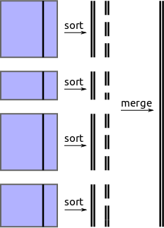
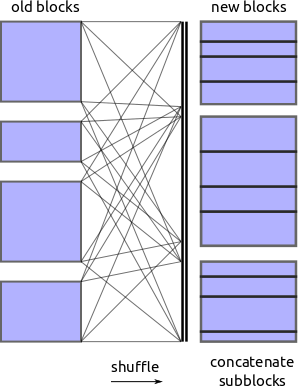

A Plan for DataFrames
=====================

.. image:: images/array.png
   :width: 20%
   :align: right
   :alt: A dask array

Dask.array implements the NumPy interface using a grid of in-memory NumPy
arrays to represent the full array.  Task scheduling provides a pleasant,
performant drop-in replacement for a subset of the NumPy library.

*Can we implement a large DataFrame as a sequence of smaller in-memory DataFrames and use task scheduling for execution?*

Maybe.  In some ways pandas is simpler than NumPy

*  The single index dimension removes the need for most complex communication patterns like tensor contraction or QR decompositions.

But in other ways pandas is more complex

*  We index DataFrames dimensions with values other than ``0, 1, 2, ...``
*  Some algorithms depend on data values and not just the shape of the data.
   This requires occasional computation of our graph.

Note that all dask.array operations produce new dask arrays without having to look at our values.  This invariant enables users to perpetually create new dask.arrays given only the following metadata:

*  A dask graph
*  A name
*  A chunks tuple like ``((8, 8, 8, 8), (5, 5, 5))`` to encode dimension, shape, and blockshape.

That ``chunks`` is sufficient metadata to make dask.array closed under NumPy operations is key to its success.  What is the equivalent set of metadata for frames?

DataFrame Metadata
------------------

.. image:: images/frame.png
   :width: 30%
   :align: right
   :alt: A dask frame

*We separate blocks over the index.  Our new equivalent of ``chunks``
involves ranges of index values, not locations.*

The ``chunks`` tuple represents the block structure of a dask array in all dimensions.  In Frames we have only one dimension (simpler) but that dimension may be within other ordered dimensions like time or text.  Additionally there is no clear way to determine how many elements may be within two bounds from the metadata alone (e.g. how many records in the month of July).

We define a Frame as a sequence of blocks, where each block is a pandas DataFrame.  This sequence is sorted along an index column so that the index of all records in block ``i`` is less than the index of all records in block ``i+1``.  We store this information in a ``divisions`` attribute.  In the example to the right we index our frame by time and separate blocks by month.  Note that blocks may be of varying size.

We store the separation points (e.g. ``2014-02-01T00:00:00``) in the
``divisions`` attribute.

Easy Operations
---------------

*Easy operations are easy to implement.  Hard operations are easy if they align
with the index*

Embarrassingly parallel operations between frames with identical block structure is trivial to implement with this setup.  This includes operations like arithmetic and filtering of rows or columns.

Embarrassingly parallel operations between frames with the same index value but different block structures (e.g. both indexed by time but one by month and one by week) is easy to implement if we shard each frame more finely.  This is a straightforward operation to write up and computationally efficient if not done to excess.

Reductions and a broad class of split-apply-combine operations can be done with
an embarrassingly parallel step followed by a gather, followed by another
reduction/split-apply-combine step.  This is tricky to code up but
computationally efficient.  This is already done in Blaze and powers our
current experimental out-of-core work.

Join operations between tables on the same index (e.g. both indexed on time and we want to join on time) are efficient because we know exactly which blocks from one side need to communicate with which blocks from the other.

Explicit grouping operations on the index are cheap because we're guaranteed that groups are entirely localized to one block.

Re-Indexing
-----------

Careful review of the above operations reveals a common theme:

*Work is easy if your logic is aligned with the index*

E.g. joining two tables is easy if they are indexed in the same way.  Unfortunately normal workflows often involve logic on columns other than the index.  We need an efficient way to re-index a blocked dataframe.

This is challenging in two regards

1.  Computationally: We need an efficient out-of-core sort
2.  Organizationally: We need to evaluate our current task graph to inspect values

We'll discuss external sorting and then dask organization.

Sorting
-------

*We sort a large index from disk through a variant of merge sort.*

Out-of-core or `External sorts`_ are straightforward.   There is a rich
literature on doing this well but I suspect that a naive solution would be
sufficient to start.  Naive external sort executes roughly as follows:

1.  Select the new index column from each block and sort locally.  Emit result to disk in several smaller blocks.  Also keep track of the original location of the sorted values.  NumPy+Dask+Chest machinery can do this happily.
2.  Merge these sequences of sorted blocks, streaming them through memory and storing the result again to disk in some ordered storage (HDF5/BColz).  We need to build this; no solution currently exists in the PyData ecosystem.  See dask `Issue 52`_.
3.  Block this large index into chunks and select new partitions.  For each new partition for each old block emit the overlap.  Concatenate results into new blocks.  This is a shuffle operation and possibly expensive in a distributed context.

External sorting does not require creativity on our part.  There are straightforward algorithms to do this.  We might want to create a fast merge-sorted routine in Cython but other than that this is not more than a few days' work.

Encoding the shuffle in dask is a bit complex but relatively tame when compared to some of the things we've had to do with ndarrays.

Approximate Quantiles
---------------------

*Maybe there are cheaper ways to find ``divisions`` than sorting*

After playing around with this I'm no longer certain that we need an
external sort.  If we don't need very well balanced block sizes then it may
be sufficient to provide approximate quantiles.  This can likely be done
through sampling and sorting in-core.

Evaluation
----------

*Every time we re-index our data we need to evaluate the whole graph.*

To do the above sort we need to evaluate our current dask graph; this is
unfortuante and breaks with the style set by ``dask.array`` that we could
create a graph separately from our execution strategy.  A single dask.frame computation may involve several evaluations.

New metadata after re-indexing depends on the values in our frame.  This forces us to evaluate the dask graph and breaks the convenience that we had in ``dask.array`` where we could endlessly compound array operations separately from our computation.  Frames are more tied in to immediate computation than arrays.  Still, this is doable.

As we approach a re-index event we evaluate our blocks, and perform the sorting
operation as described above.  This determines new block boundaries for the new frame.  We can leave the shuffling and concatenation work to the new dask.  Probably the base of the new dask is the blocks of the old and appropriate tasks to perform the shuffle.
From this point we can start a new Frame and continue building up a dask
graph until the next re-indexing event.

Note that at we can still be fully laze at the Blaze expression level.  This
might be good motivation to use both projects at the same time.

Some open questions
-------------------

*  Should we include other metadata like column names and dtypes?
*  What are some other pandas operations that trigger re-indexing events?
*  What about multi-indices?  Do we need any special consideration here or is
   it sufficient to partition on the outer-most index and have the internal
   blocks think about the rest of the multi-index at a per-block level?

TODO
----

What are some bite-sized tasks?

1.  External merge-sorted operation (see `Issue 52`_)
2.  Make a basic prototype with embarrassingly parallel operations
3.  Replicate some of the logic within ``blaze.expr.split`` to implement
    reductions and ``groupby.aggregate``
4.  Sequential CSV reading.  This is a bit trickier because we don't have
    random access.  We'll need to know how many lines are in the file and pass
    along a token to ensure sequentiality in the graph.

.. _`External sorts`: http://en.wikipedia.org/wiki/External_sorting
.. _`Issue 52`: https://github.com/blaze/dask/issues/52
