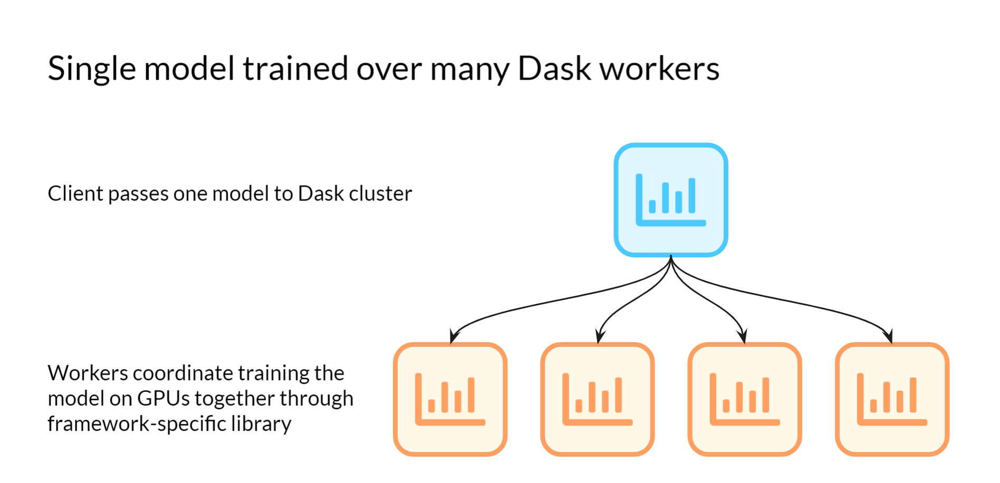
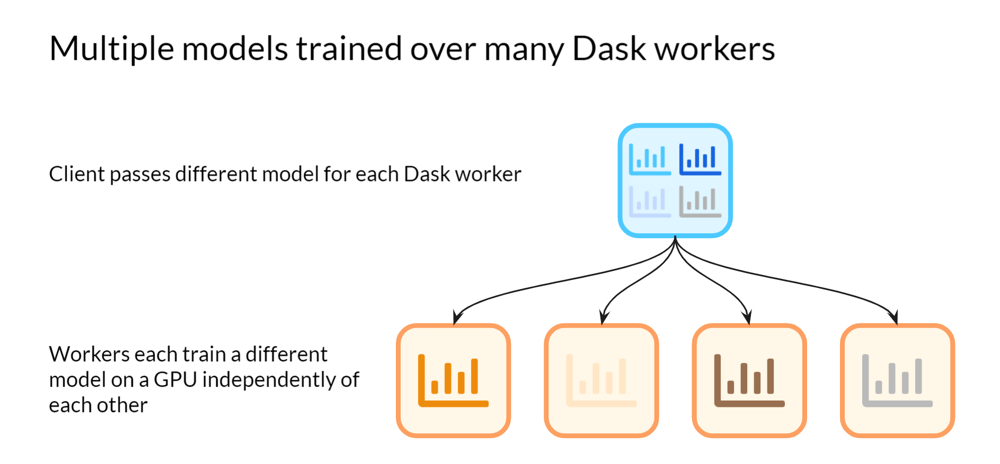
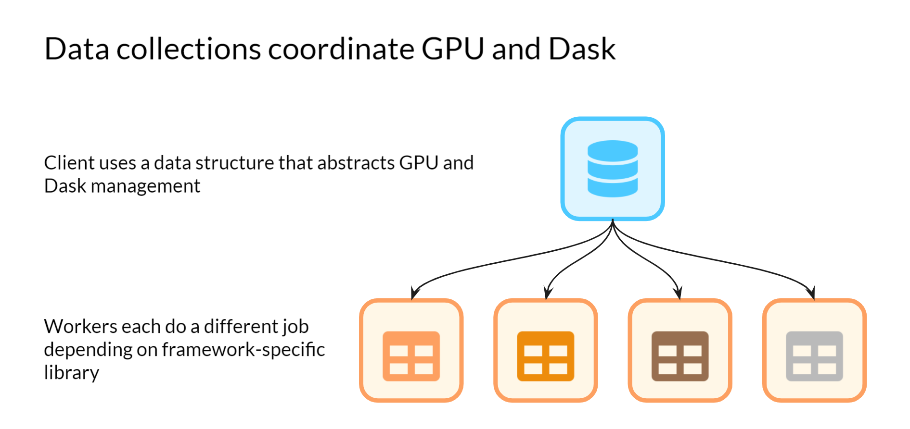

GPUs
====

Graphics Processing Units (GPUs) can dramatically speed up certain numerical computations like
machine learning model training. Tools like RAPIDS, TensorFlow, and PyTorch can be run on
GPUs instead of a standard CPU to produce results an order of magnitude faster (or more).
Dask connects nicely with these different tools--while the particular hardware might be different
when using GPUs, so long as the Python code can run on a set of machines
Dask can coordinate running that code.

There are many different ways to use Dask and GPUs--from training one large machine learning model
across many workers concurrently, to doing hyperparameter tuning where each worker has a different
set of hyperparameters to test. This page will walk through a few of them.

GPU-accelerated libraries for large computations
------------------------------------------------

Tools like PyTorch and TensorFlow both have the capability to use GPUs as well as the ability to
train a single model across many machines. This has very practical applications: large models like
`GPT-3 <https://arxiv.org/abs/2005.14165>`_ are trained on clusters of computers in this manner.
Dask can be used as a straightforward manner of coordinating such a cluster to train a model. while
there are benefits to using Dask for training very large models, there may still be speed
improvements for training models with fewer parameters as well.

To take one example, PyTorch has the
`DistributedDataParallel <https://pytorch.org/tutorials/intermediate/ddp_tutorial.html>`_ (DDP)
library that allows machines to concurrently train the same model and share results after each data
batch. With Dask, each worker can be passed the Python code to train a machine learning model, then
the DDP library will share the results so the model trains faster.

Dask does not need to know that any of its tasks use GPUs. As long as the worker has access to GPUs
and the environment has been configured with the necessary packages, Dask will work.

Here is a talk from the GTC Silicon Valley 2019 conference
by Danielle Dean and Mathew Salvaris of Microsoft that discusses using Dask and V100 GPUs for 
distributed scoring of machine learning models for vision.

.. raw:: html

    <video width="560" height="315" controls>
        <source src="https://developer.download.nvidia.com/video/gputechconf/gtc/2019/video/S9198/s9198-dask-and-v100s-for-fast-distributed-batch-scoring-of-computer-vision-workloads.mp4"
                type="video/mp4">
    </video>

`Dask and V100s for Fast, Distributed Batch Scoring of Computer Vision Workloads <https://developer.nvidia.com/gtc/2019/video/s9198>`_

Having parallel tasks use GPUs
------------------------------

Tasks like running experiments of different parameters of a machine learning model on a GPU
are embarrassingly parallelizable. Dask can be used to run each experiment trial concurrently,
dramatically speeding up the process. Parallelizing experiment runs can be useful with or without
GPUs, however because models that are trained on GPUs often take an especially long time to train
there is a lot of benefit in this situation especially. If you have n different trials that you were
previously running sequentially then parallelizing them is useful, regardless of if it's on a CPU or GPU.

Data collections
---------------------------

Collections of data like Dask Array and Dask DataFrame can be improved with by using GPUs as well
with the help of external libraries. :doc:`Dask Array <array>` creates a large array out of many NumPy
arrays and :doc:`Dask DataFrame <dataframe>` creates a large dataframe out of
many pandas dataframes.  We can use these same systems with GPUs if we swap out
the NumPy/pandas components with GPU-accelerated versions of those same
libraries, as long as the GPU accelerated version looks enough like
NumPy/pandas in order to interoperate with Dask.

Fortunately, libraries that mimic NumPy, Pandas, and Scikit-Learn on the GPU do
exist.

DataFrames
~~~~~~~~~~

The `RAPIDS <https://rapids.ai>`_ libraries provide a GPU accelerated
pandas-like library,
`cuDF <https://github.com/rapidsai/cudf>`_,
which interoperates well and is tested against Dask DataFrame.

If you have cuDF installed then you should be able to convert a Pandas-backed
Dask DataFrame to a cuDF-backed Dask DataFrame as follows:

.. code-block:: python

   import cudf

   df = df.map_partitions(cudf.from_pandas)  # convert pandas partitions into cudf partitions

However, cuDF does not support the entire Pandas interface, and so a variety of
Dask DataFrame operations will not function properly. Check the
`cuDF API Reference <https://docs.rapids.ai/api/cudf/stable/>`_
for currently supported interface.

Arrays
~~~~~~

.. note:: Dask's integration with CuPy relies on features recently added to
   NumPy and CuPy, particularly in version ``numpy>=1.17`` and ``cupy>=6``

`Chainer's CuPy <https://cupy.chainer.org/>`_ library provides a GPU
accelerated NumPy-like library that interoperates nicely with Dask Array.

If you have CuPy installed then you should be able to convert a NumPy-backed
Dask Array into a CuPy backed Dask Array as follows:

.. code-block:: python

   import cupy

   x = x.map_blocks(cupy.asarray)

CuPy is fairly mature and adheres closely to the NumPy API.  However, small
differences do exist and these can cause Dask Array operations to function
improperly. Check the
`CuPy Reference Manual <https://docs-cupy.chainer.org/en/stable/reference/index.html>`_
for API compatibility.

Scikit-Learn
~~~~~~~~~~~~

There are a variety of GPU accelerated machine learning libraries that follow
the Scikit-Learn Estimator API of fit, transform, and predict.  These can
generally be used within `Dask-ML's <https://ml.dask.org>`_ meta estimators,
such as `hyper parameter optimization <https://ml.dask.org/hyper-parameter-search.html>`_.

Some of these include:

-  `Skorch <https://skorch.readthedocs.io/>`_
-  `cuML <https://rapidsai.github.io/projects/cuml/en/latest/>`_
-  `LightGBM <https://github.com/Microsoft/LightGBM>`_
-  `XGBoost <https://xgboost.readthedocs.io/en/latest/>`_
-  `Thunder SVM <https://github.com/Xtra-Computing/thundersvm>`_
-  `Thunder GBM <https://github.com/Xtra-Computing/thundergbm>`_

Setting up Dask for using GPUs
------------------------------

From the examples above we can see that the user experience of using Dask with
GPU-backed libraries isn't very different from using it with CPU-backed
libraries.  However, there are some changes you might consider making when
setting up your Dask cluster.

Restricting Work
~~~~~~~~~~~~~~~~

By default Dask allows as many tasks as you have CPU cores to run concurrently.
However if your tasks primarily use a GPU then you probably want far fewer
tasks running at once.  There are a few ways to limit parallelism here:

-   Limit the number of threads explicitly on your workers using the
    ``--nthreads`` keyword in the CLI or the ``ncores=`` keyword the
    Cluster constructor.
-   Use `worker resources <https://distributed.dask.org/en/latest/resources.html>`_ and tag certain
    tasks as GPU tasks so that the scheduler will limit them, while leaving the
    rest of your CPU cores for other work

Specifying GPUs per Machine
~~~~~~~~~~~~~~~~~~~~~~~~~~~

Some configurations may have many GPU devices per node.  Dask is often used to
balance and coordinate work between these devices.

In these situations it is common to start one Dask worker per device, and use
the CUDA environment variable ``CUDA_VISIBLE_DEVICES`` to pin each worker to
prefer one device.

.. code-block:: bash

   # If we have four GPUs on one machine
   CUDA_VISIBLE_DEVICES=0 dask-worker ...
   CUDA_VISIBLE_DEVICES=1 dask-worker ...
   CUDA_VISIBLE_DEVICES=2 dask-worker ...
   CUDA_VISIBLE_DEVICES=3 dask-worker ...

The `Dask CUDA <https://github.com/rapidsai/dask-cuda>`_ project contains some
convenience CLI and Python utilities to automate this process.

Work in Progress
----------------

GPU computing is a quickly moving field today and as a result the information
in this page is likely to go out of date quickly.  We encourage interested
readers to check out `Dask's Blog <https://blog.dask.org>`_ which has more
timely updates on ongoing work.
