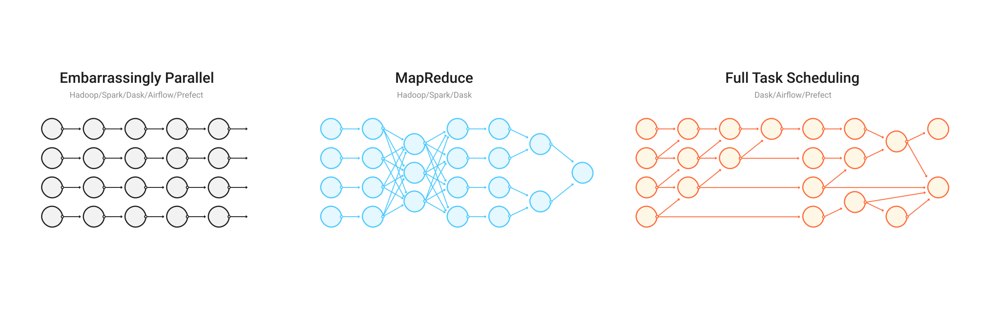

.. _graphs:

Task Graphs
===========

Internally, Dask encodes algorithms in a simple format involving Python dicts,
tuples, and functions. This graph format can be used in isolation from the
dask collections. Working directly with dask graphs is rare, though, unless you intend
to develop new modules with Dask.  Even then, :doc:`dask.delayed <delayed>` is
often a better choice. If you are a *core developer*, then you should start here.

.. toctree::
   :maxdepth: 1

   spec.rst
   custom-graphs.rst
   optimize.rst
   graph_manipulation.rst
   custom-collections.rst
   high-level-graphs.rst

Motivation
----------

Normally, humans write programs and then compilers/interpreters interpret them
(for example, ``python``, ``javac``, ``clang``).  Sometimes humans disagree with how
these compilers/interpreters choose to interpret and execute their programs.
In these cases, humans often bring the analysis, optimization, and execution of
code into the code itself.

Commonly a desire for parallel execution causes this shift of responsibility
from compiler to human developer.  In these cases, we often represent the
structure of our program explicitly as data within the program itself.

A common approach to parallel execution in user-space is *task scheduling*.  In
task scheduling we break our program into many medium-sized tasks or units of
computation, often a function call on a non-trivial amount of data.  We
represent these tasks as nodes in a graph with edges between nodes if one task
depends on data produced by another.  We call upon a *task scheduler* to
execute this graph in a way that respects these data dependencies and leverages
parallelism where possible, so multiple independent tasks can be run
simultaneously.

|

   There are a number of methods for task scheduling, including embarrassingly parallel, MapReduce, and full task scheduling.

|

Many solutions exist.  This is a common approach in parallel execution
frameworks.  Often task scheduling logic hides within other larger frameworks
(e.g. Luigi, Storm, Spark, IPython Parallel, etc.) and so is often reinvented.
Dask is a specification that encodes full task scheduling with minimal incidental
complexity using terms common to all Python projects, namely, dicts, tuples,
and callables.  Ideally this minimum solution is easy to adopt and understand
by a broad community.

Example
-------

Consider the following simple program:

.. code-block:: python

   def inc(i):
       return i + 1

   def add(a, b):
       return a + b

   x = 1
   y = inc(x)
   z = add(y, 10)

We encode this as a dictionary in the following way:

.. code-block:: python

   d = {'x': 1,
        'y': (inc, 'x'),
        'z': (add, 'y', 10)}

Which is represented by the following Dask graph:

.. image:: _static/dask-simple.png
   :height: 400px
   :alt: A simple dask dictionary

|

While less pleasant than our original code, this representation can be analyzed
and executed by other Python code, not just the CPython interpreter.  We don't
recommend that users write code in this way, but rather that it is an
appropriate target for automated systems.  Also, in non-toy examples, the
execution times are likely much larger than for ``inc`` and ``add``, warranting
the extra complexity.

Schedulers
----------

The Dask library currently contains a few schedulers to execute these
graphs.  Each scheduler works differently, providing different performance
guarantees and operating in different contexts.  These implementations are not
special and others can write different schedulers better suited to other
applications or architectures easily.  Systems that emit dask graphs (like
Dask Array, Dask Bag, and so on) may leverage the appropriate scheduler for
the application and hardware.

Task Expectations
-----------------

When a task is submitted to Dask for execution, there are a number of assumptions
that are made about that task.

Don't Modify Data In-Place
~~~~~~~~~~~~~~~~~~~~~~~~~~

In general, tasks with side-effects that alter the state of a future in-place
are not recommended. Modifying data that is stored in Dask in-place can have
unintended consequences. For example, consider a workflow involving a Numpy
array:

.. code-block:: python

   from dask.distributed import Client
   import numpy as np

   client = Client()
   x = client.submit(np.arange, 10)  # [0, 1, 2, 3, ...]

   def f(arr):
       arr[arr > 5] = 0  # modifies input directly without making a copy
       arr += 1          # modifies input directly without making a copy
       return arr

   y = client.submit(f, x)

In the example above Dask will update the values of the Numpy array
``x`` in-place.  While efficient, this behavior can have unintended consequences,
particularly if other tasks need to use ``x``, or if Dask needs to rerun this
computation multiple times because of worker failure.

Avoid Holding the GIL
~~~~~~~~~~~~~~~~~~~~~

Some Python functions that wrap external C/C++ code can hold onto the GIL,
which stops other Python code from running in the background.  This is
troublesome because while Dask workers run your function, they also need to
communicate to each other in the background.

If you wrap external code then please try to release the GIL.  This is usually
easy to do if you are using any of the common solutions to code-wrapping like
Cython, Numba, ctypes or others.
