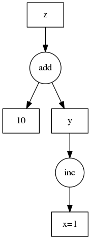

Overview
========

An explanation of dask task graphs.

Motivation
----------

Normally, humans write programs and then compilers/interpreters interpret them
(for example  ``python``, ``javac``, ``clang``).  Sometimes humans disagree with how
these compilers/interpreters choose to interpret and execute their programs.
In these cases humans often bring the analysis, optimization, and execution of
code into the code itself.

Commonly a desire for parallel execution causes this shift of responsibility
from compiler to human developer.  In these cases, we often represent the
structure of our program explicitly as data within the program itself.

A common approach to parallel execution in user-space is *task scheduling*.  In
task scheduling we break our program into many medium-sized tasks or units of
computation, often a function call on a non-trivial amount of data.  We
represent these tasks as nodes in a graph with edges between nodes if one task
depends on data produced by another.  We call upon a *task scheduler* to
execute this graph in a way that respects these data dependencies and leverages
parallelism where possible, multiple independent tasks can be run
simultaneously.

Many solutions exist.  This is a common approach in parallel execution
frameworks.  Often task scheduling logic hides within other larger frameworks
(Luigi, Storm, Spark, IPython Parallel, and so on) and so is often reinvented.

Dask is a specification that encodes task schedules with minimal incidental
complexity using terms common to all Python projects, namely dicts, tuples,
and callables.  Ideally this minimum solution is easy to adopt and understand
by a broad community.

Example
-------

Consider the following simple program:

.. code-block:: python

   def inc(i):
       return i + 1

   def add(a, b):
       return a + b

   x = 1
   y = inc(x)
   z = add(y, 10)

We encode this as a dictionary in the following way:

.. code-block:: python

   d = {'x': 1,
        'y': (inc, 'x'),
        'z': (add, 'y', 10)}

While less pleasant than our original code, this representation can be analyzed
and executed by other Python code, not just the CPython interpreter.  We don't
recommend that users write code in this way, but rather that it is an
appropriate target for automated systems.  Also, in non-toy examples, the
execution times are likely much larger than for ``inc`` and ``add``, warranting
the extra complexity.

Schedulers
----------

The ``dask`` library currently contains a few schedulers to execute these
graphs.  Each scheduler works differently, providing different performance
guarantees and operating in different contexts.  These implementations are not
special and others can write different schedulers better suited to other
applications or architectures easily.  Systems that emit dask graphs (like
``dask.array``, ``dask.bag``, and so on) may leverage the appropriate scheduler for
the application and hardware.
