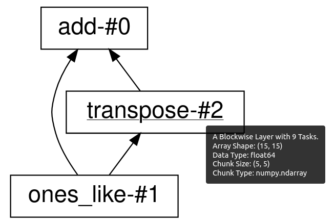
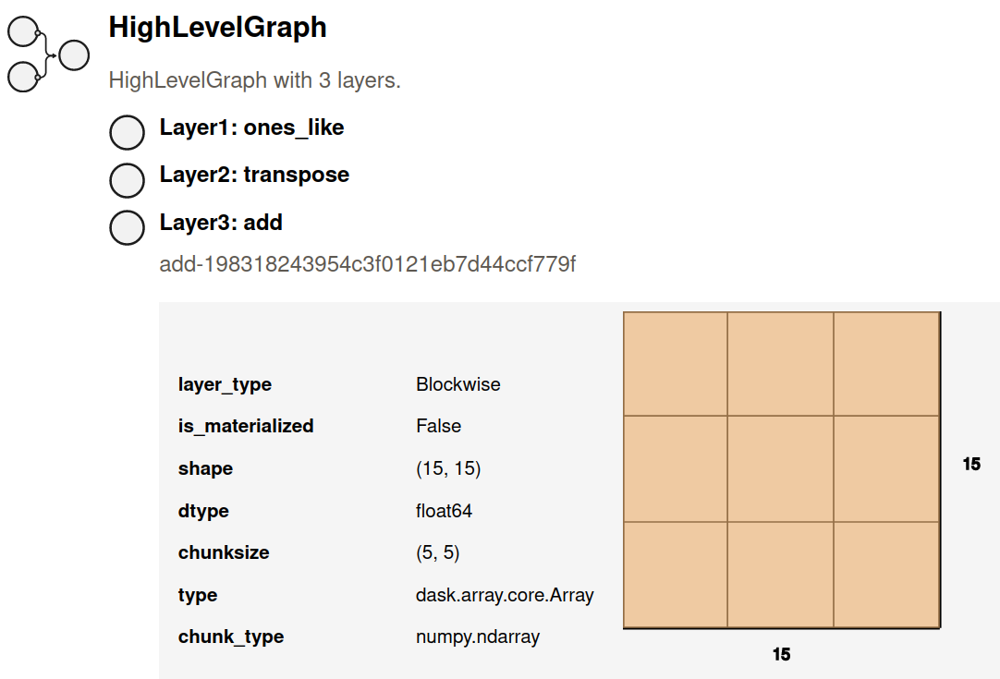

:orphan:

Visualize task graphs
---------------------

.. currentmodule:: dask

.. autosummary::
   visualize

Before executing your computation you might consider visualizing the underlying task graph.
By looking at the inter-connectedness of tasks
you can learn more about potential bottlenecks
where parallelism may not be possible,
or areas where many tasks depend on each other,
which may cause a great deal of communication.

Visualize the low level graph
^^^^^^^^^^^^^^^^^^^^^^^^^^^^^

The ``.visualize`` method and ``dask.visualize`` function works like
the ``.compute`` method and ``dask.compute`` function,
except that rather than computing the result,
they produce an image of the task graph.
These images are written to files, and if you are within a Jupyter notebook
context they will also be displayed as cell outputs.

By default the task graph is rendered from top to bottom.
In the case that you prefer to visualize it from left to right, pass
``rankdir="LR"`` as a keyword argument to ``.visualize``.

.. code-block:: python

   import dask.array as da
   x = da.ones((15, 15), chunks=(5, 5))

   y = x + x.T

   # y.compute()

   # visualize the low level Dask graph
   y.visualize(filename='transpose.svg')

.. image:: images/transpose.svg
   :alt: Dask low level task graph for adding an array to its transpose

It is often helpful to inspect the task graph before and after graph optimizations
are applied. You can do that by setting the ``optimize_graph`` keyword.
So the above example becomes:

.. code-block:: python

   import dask.array as da
   x = da.ones((15, 15), chunks=(5, 5))

   y = x + x.T

   # visualize the low level Dask graph after optimizations
   y.visualize(filename="transpose_opt.svg", optimize_graph=True)

.. image:: images/transpose_opt.svg
   :alt: Dask low level task graph for adding an array to its transpose.
         Compared to the unoptimized graph it is simpler, as a number of
         the tasks have been fused together.

The ``visualize`` function supports two different graph rendering engines: ``graphviz``
(the default), and ``cytoscape``. In order to change the engine that is used, pass the
name of the engine for the ``engine`` argument to ``visualize``:

.. code-block:: python

   import dask.array as da
   x = da.ones((15, 15), chunks=(5, 5))

   y = x + x.T

   # visualize the low level Dask graph using cytoscape
   y.visualize(engine="cytoscape")

.. raw:: html

    <iframe src="_static/transpose_cyto.html"
            marginwidth="0" marginheight="0" scrolling="no"
            width="100%" height="400" style="border:none"></iframe>

You can also set the default visualization engine by setting the ``visualization.engine``
configuration option:

.. code-block:: python

   import dask.array as da
   x = da.ones((15, 15), chunks=(5, 5))

   y = x + x.T

   with dask.config.set({"visualization.engine": "cytoscape"}):
       y.visualize()

Note that the both visualization engines require optional dependencies to be installed.
The ``graphviz`` engine is powered by the `GraphViz <https://www.graphviz.org/>`_
system library. This library has a few considerations:

1.  You must install both the graphviz system library (with tools like apt-get, yum, or brew)
    *and* the graphviz Python library.
    If you use Conda then you need to install ``python-graphviz``,
    which will bring along the ``graphviz`` system library as a dependency.
2.  Graphviz takes a while on graphs larger than about 100 nodes.
    For large computations you might have to simplify your computation a bit
    for the visualize method to work well.

The ``cytoscape`` engine uses the `Cytoscape <https://js.cytoscape.org/>`_ javascript
library for rendering, and is driven on the Python side by the ``ipycytoscape``
library. Because it doesn't rely on any system libraries, this engine may be easier
to install than graphviz in some deployment settings.

Visualize the high level graph
^^^^^^^^^^^^^^^^^^^^^^^^^^^^^^
The low level Dask task graph can be overwhelimg, especially for large computations.
A more concise alternative is to look at the Dask high level graph instead.
The high level graph can be visualized using ``.dask.visualize()``.

.. code-block:: python

   import dask.array as da
   x = da.ones((15, 15), chunks=(5, 5))
   y = x + x.T

   # visualize the high level Dask graph
   y.dask.visualize(filename='transpose-hlg.svg')

Hovering your mouse above each high level graph label will bring up
a tooltip with more detailed information about that layer.
Note that if you save the graph to disk using the ``filename=`` keyword argument
in ``visualize``, then the tooltips will only be preserved by the SVG image format.

High level graph HTML representation
^^^^^^^^^^^^^^^^^^^^^^^^^^^^^^^^^^^^
Dask high level graphs also have their own HTML representation,
which is useful if you like to work with Jupyter notebooks.

.. code-block:: python

   import dask.array as da
   x = da.ones((15, 15), chunks=(5, 5))
   y = x + x.T

   y.dask  # shows the HTML representation in a Jupyter notebook

You can click on any of the layer names to expand or collapse more detailed
information about each layer.
