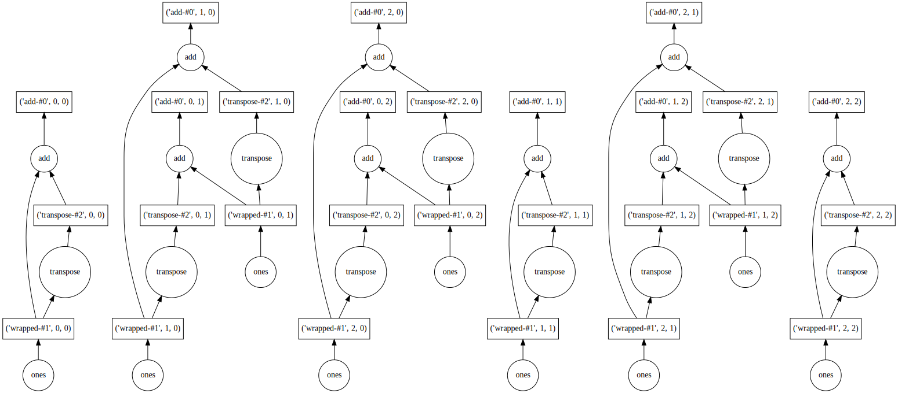

Visualize task graphs
---------------------

.. currentmodule:: dask

.. autosummary::
   visualize

Before executing your computation you might consider visualizing the underlying task graph.
By looking at the inter-connectedness of tasks
you can learn more about potential bottlenecks
where parallelism may not be possile,
or areas where many tasks depend on each other,
which may cause a great deal of communication.

The ``.visualize`` method and ``dask.visualize`` function work exactly like
the ``.compute`` method and ``dask.compute`` function,
except that rather than computing the result,
they produce an image of the task graph.

By default the task graph is rendered from top to bottom.
In the case that you prefer to visualize it from left to right, pass
``rankdir="LR"`` as a keyword argument to ``.visualize``.

.. code-block:: python

   import dask.array as da
   x = da.ones((15, 15), chunks=(5, 5))

   y = x + x.T

   # y.compute()
   y.visualize(filename='transpose.svg')

Note that the ``visualize`` function is powered by the `GraphViz <https://www.graphviz.org/>`_
system library.  This library has a few considerations:

1.  You must install both the graphviz system library (with tools like apt-get, yum, or brew)
    *and* the graphviz Python library.
    If you use Conda then you need to install ``python-graphviz``,
    which will bring along the ``graphviz`` system library as a dependency.
2.  Graphviz takes a while on graphs larger than about 100 nodes.
    For large computations you might have to simplify your computation a bit
    for the visualize method to work well.

