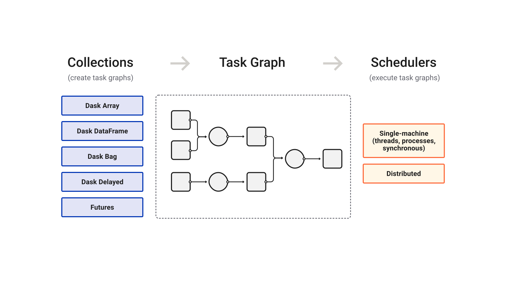

====
Dask
====

*Dask is a flexible library for parallel computing in Python.*

Dask is composed of two parts:

1.  **Dynamic task scheduling** optimized for computation. This is similar to
    *Airflow, Luigi, Celery, or Make*, but optimized for interactive
    computational workloads.
2.  **"Big Data" collections** like parallel arrays, dataframes, and lists that
    extend common interfaces like *NumPy, Pandas, or Python iterators* to
    larger-than-memory or distributed environments. These parallel collections
    run on top of dynamic task schedulers.

Dask emphasizes the following virtues:

*  **Familiar**: Provides parallelized NumPy array and Pandas DataFrame objects
*  **Flexible**: Provides a task scheduling interface for more custom workloads
   and integration with other projects.
*  **Native**: Enables distributed computing in pure Python with access to
   the PyData stack.
*  **Fast**: Operates with low overhead, low latency, and minimal serialization
   necessary for fast numerical algorithms
*  **Scales up**: Runs resiliently on clusters with 1000s of cores
*  **Scales down**: Trivial to set up and run on a laptop in a single process
*  **Responsive**: Designed with interactive computing in mind, it provides rapid
   feedback and diagnostics to aid humans

|

   High level collections are used to generate task graphs which can be executed by schedulers on a single machine or a cluster.

|

See the `dask.distributed documentation (separate website)
<https://distributed.dask.org/en/latest/>`_ for more technical information
on Dask's distributed scheduler.

Familiar user interface
-----------------------

**Dask DataFrame** mimics Pandas - :doc:`documentation <dataframe>`

.. code-block:: python

    import pandas as pd                     import dask.dataframe as dd
    df = pd.read_csv('2015-01-01.csv')      df = dd.read_csv('2015-*-*.csv')
    df.groupby(df.user_id).value.mean()     df.groupby(df.user_id).value.mean().compute()

**Dask Array** mimics NumPy - :doc:`documentation <array>`

.. code-block:: python

   import numpy as np                       import dask.array as da
   f = h5py.File('myfile.hdf5')             f = h5py.File('myfile.hdf5')
   x = np.array(f['/small-data'])           x = da.from_array(f['/big-data'],
                                                              chunks=(1000, 1000))
   x - x.mean(axis=1)                       x - x.mean(axis=1).compute()

**Dask Bag** mimics iterators, Toolz, and PySpark - :doc:`documentation <bag>`

.. code-block:: python

   import dask.bag as db
   b = db.read_text('2015-*-*.json.gz').map(json.loads)
   b.pluck('name').frequencies().topk(10, lambda pair: pair[1]).compute()

**Dask Delayed** mimics for loops and wraps custom code - :doc:`documentation <delayed>`

.. code-block:: python

   from dask import delayed
   L = []
   for fn in filenames:                  # Use for loops to build up computation
       data = delayed(load)(fn)          # Delay execution of function
       L.append(delayed(process)(data))  # Build connections between variables

   result = delayed(summarize)(L)
   result.compute()

The **concurrent.futures** interface provides general submission of custom
tasks: - :doc:`documentation <futures>`

.. code-block:: python

   from dask.distributed import Client
   client = Client('scheduler:port')

   futures = []
   for fn in filenames:
       future = client.submit(load, fn)
       futures.append(future)

   summary = client.submit(summarize, futures)
   summary.result()

Scales from laptops to clusters
-------------------------------

Dask is convenient on a laptop.  It :doc:`installs <install>` trivially with
``conda`` or ``pip`` and extends the size of convenient datasets from "fits in
memory" to "fits on disk".

Dask can scale to a cluster of 100s of machines. It is resilient, elastic, data
local, and low latency.  For more information, see the documentation about the
`distributed scheduler`_.

This ease of transition between single-machine to moderate cluster enables
users to both start simple and grow when necessary.

Complex Algorithms
------------------

Dask represents parallel computations with :doc:`task graphs<graphs>`. These
directed acyclic graphs may have arbitrary structure, which enables both
developers and users the freedom to build sophisticated algorithms and to
handle messy situations not easily managed by the ``map/filter/groupby``
paradigm common in most data engineering frameworks.

We originally needed this complexity to build complex algorithms for
n-dimensional arrays but have found it to be equally valuable when dealing with
messy situations in everyday problems.

.. toctree::
   :maxdepth: 1
   :hidden:
   :caption: Getting Started

   install.rst
   10-minutes-to-dask.rst
   presentations.rst
   best-practices.rst
   faq.rst

.. toctree::
   :maxdepth: 1
   :hidden:
   :caption: Fundamentals

   array.rst
   bag.rst
   dataframe.rst
   delayed.rst
   futures.rst
   deploying.rst

.. toctree::
   :maxdepth: 1
   :hidden:
   :caption: Internals

   understanding-performance.rst
   scheduling.rst
   graphs.rst
   debugging-performance.rst
   internals.rst

.. toctree::
   :maxdepth: 1
   :hidden:
   :caption: Reference

   api.rst
   develop.rst
   changelog.rst
   configuration.rst
   how-to/index.rst

.. _`Anaconda Inc`: https://www.anaconda.com
.. _`3-clause BSD license`: https://github.com/dask/dask/blob/main/LICENSE.txt

.. _`#dask tag`: https://stackoverflow.com/questions/tagged/dask
.. _`GitHub issue tracker`: https://github.com/dask/dask/issues
.. _`xarray`: https://xarray.pydata.org/en/stable/
.. _`scikit-image`: https://scikit-image.org/docs/stable/
.. _`scikit-allel`: https://scikits.appspot.com/scikit-allel
.. _`pandas`: https://pandas.pydata.org/pandas-docs/version/0.17.0/
.. _`distributed scheduler`: https://distributed.dask.org/en/latest/
