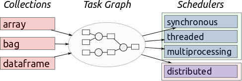

====
Dask
====

*Dask is a flexible library for parallel computing in Python.*

Dask is composed of two parts:

1.  **Dynamic task scheduling** optimized for computation. This is similar to
    *Airflow, Luigi, Celery, or Make*, but optimized for interactive
    computational workloads.
2.  **"Big Data" collections** like parallel arrays, dataframes, and lists that
    extend common interfaces like *NumPy, Pandas, or Python iterators* to
    larger-than-memory or distributed environments. These parallel collections
    run on top of dynamic task schedulers.

Dask emphasizes the following virtues:

*  **Familiar**: Provides parallelized NumPy array and Pandas DataFrame objects
*  **Flexible**: Provides a task scheduling interface for more custom workloads
   and integration with other projects.
*  **Native**: Enables distributed computing in pure Python with access to
   the PyData stack.
*  **Fast**: Operates with low overhead, low latency, and minimal serialization
   necessary for fast numerical algorithms
*  **Scales up**: Runs resiliently on clusters with 1000s of cores
*  **Scales down**: Trivial to set up and run on a laptop in a single process
*  **Responsive**: Designed with interactive computing in mind, it provides rapid
   feedback and diagnostics to aid humans

See the `dask.distributed documentation (separate website)
<https://distributed.dask.org/en/latest/>`_ for more technical information
on Dask's distributed scheduler.

Familiar user interface
-----------------------

**Dask DataFrame** mimics Pandas - :doc:`documentation <dataframe>`

.. code-block:: python

    import pandas as pd                     import dask.dataframe as dd
    df = pd.read_csv('2015-01-01.csv')      df = dd.read_csv('2015-*-*.csv')
    df.groupby(df.user_id).value.mean()     df.groupby(df.user_id).value.mean().compute()

**Dask Array** mimics NumPy - :doc:`documentation <array>`

.. code-block:: python

   import numpy as np                       import dask.array as da
   f = h5py.File('myfile.hdf5')             f = h5py.File('myfile.hdf5')
   x = np.array(f['/small-data'])           x = da.from_array(f['/big-data'],
                                                              chunks=(1000, 1000))
   x - x.mean(axis=1)                       x - x.mean(axis=1).compute()

**Dask Bag** mimics iterators, Toolz, and PySpark - :doc:`documentation <bag>`

.. code-block:: python

   import dask.bag as db
   b = db.read_text('2015-*-*.json.gz').map(json.loads)
   b.pluck('name').frequencies().topk(10, lambda pair: pair[1]).compute()

**Dask Delayed** mimics for loops and wraps custom code - :doc:`documentation <delayed>`

.. code-block:: python

   from dask import delayed
   L = []
   for fn in filenames:                  # Use for loops to build up computation
       data = delayed(load)(fn)          # Delay execution of function
       L.append(delayed(process)(data))  # Build connections between variables

   result = delayed(summarize)(L)
   result.compute()

The **concurrent.futures** interface provides general submission of custom
tasks: - :doc:`documentation <futures>`

.. code-block:: python

   from dask.distributed import Client
   client = Client('scheduler:port')

   futures = []
   for fn in filenames:
       future = client.submit(load, fn)
       futures.append(future)

   summary = client.submit(summarize, futures)
   summary.result()

Scales from laptops to clusters
-------------------------------

Dask is convenient on a laptop.  It :doc:`installs <install>` trivially with
``conda`` or ``pip`` and extends the size of convenient datasets from "fits in
memory" to "fits on disk".

Dask can scale to a cluster of 100s of machines. It is resilient, elastic, data
local, and low latency.  For more information, see the documentation about the
`distributed scheduler`_.

This ease of transition between single-machine to moderate cluster enables
users to both start simple and grow when necessary.

Complex Algorithms
------------------

Dask represents parallel computations with :doc:`task graphs<graphs>`. These
directed acyclic graphs may have arbitrary structure, which enables both
developers and users the freedom to build sophisticated algorithms and to
handle messy situations not easily managed by the ``map/filter/groupby``
paradigm common in most data engineering frameworks.

We originally needed this complexity to build complex algorithms for
n-dimensional arrays but have found it to be equally valuable when dealing with
messy situations in everyday problems.

Index
-----

**Getting Started**

* :doc:`install`
* :doc:`setup`
* :doc:`use-cases`
* :doc:`support`
* :doc:`why`

.. toctree::
   :maxdepth: 1
   :hidden:
   :caption: Getting Started

   install.rst
   setup.rst
   use-cases.rst
   support.rst
   why.rst

**Collections**

Dask collections are the main interaction point for users. They look like
NumPy and Pandas but generate dask graphs internally. If you are a dask *user*
then you should start here.

* :doc:`array`
* :doc:`bag`
* :doc:`dataframe`
* :doc:`delayed`
* :doc:`futures`

.. toctree::
   :maxdepth: 1
   :hidden:
   :caption: User Interface

   user-interfaces.rst
   array.rst
   bag.rst
   dataframe.rst
   delayed.rst
   futures.rst
   Machine Learning <https://ml.dask.org>
   best-practices.rst
   api.rst

**Scheduling**

Schedulers execute task graphs. Dask currently has two main schedulers: one
for local processing using threads or processes; and one for
distributed memory clusters.

* :doc:`scheduling`
* :doc:`distributed`

.. toctree::
   :maxdepth: 1
   :hidden:
   :caption: Scheduling

   scheduling.rst
   distributed.rst

**Diagnosing Performance**

Parallel code can be tricky to debug and profile. Dask provides several tools
to help make debugging and profiling graph execution easier.

* :doc:`understanding-performance`
* :doc:`graphviz`
* :doc:`diagnostics-local`
* :doc:`diagnostics-distributed`
* :doc:`debugging`

.. toctree::
   :maxdepth: 1
   :hidden:
   :caption: Diagnostics

   understanding-performance.rst
   graphviz.rst
   diagnostics-local.rst
   diagnostics-distributed.rst
   debugging.rst

**Graph Internals**

Internally, Dask encodes algorithms in a simple format involving Python dicts,
tuples, and functions. This graph format can be used in isolation from the
dask collections. Working directly with dask graphs is rare, unless you intend
to develop new modules with Dask.  Even then, :doc:`dask.delayed <delayed>` is
often a better choice. If you are a *core developer*, then you should start here.

* :doc:`graphs`
* :doc:`spec`
* :doc:`custom-graphs`
* :doc:`optimize`
* :doc:`custom-collections`
* :doc:`high-level-graphs`

.. toctree::
   :maxdepth: 1
   :hidden:
   :caption: Graphs

   graphs.rst
   spec.rst
   custom-graphs.rst
   optimize.rst
   custom-collections.rst
   high-level-graphs.rst

**Help & reference**

* :doc:`develop`
* :doc:`changelog`
* :doc:`configuration`
* :doc:`presentations`
* :doc:`cheatsheet`
* :doc:`spark`
* :doc:`caching`
* :doc:`bytes`
* :doc:`remote-data-services`
* :doc:`gpu`
* :doc:`cite`
* :doc:`funding`
* :doc:`logos`

.. toctree::
   :maxdepth: 1
   :hidden:
   :caption: Help & reference

   develop.rst
   changelog.rst
   configuration.rst
   presentations.rst
   cheatsheet.rst
   spark.rst
   caching.rst
   bytes.rst
   remote-data-services.rst
   gpu.rst
   cite.rst
   funding.rst
   logos.rst

Dask is supported by `Anaconda Inc`_ and develops under the BSD 3-clause license.

.. _`Anaconda Inc`: https://www.anaconda.com
.. _`3-clause BSD license`: https://github.com/dask/dask/blob/master/LICENSE.txt

.. _`#dask tag`: https://stackoverflow.com/questions/tagged/dask
.. _`GitHub issue tracker`: https://github.com/dask/dask/issues
.. _`gitter chat room`: https://gitter.im/dask/dask
.. _`xarray`: https://xarray.pydata.org/en/stable/
.. _`scikit-image`: https://scikit-image.org/docs/stable/
.. _`scikit-allel`: https://scikits.appspot.com/scikit-allel
.. _`pandas`: https://pandas.pydata.org/pandas-docs/version/0.17.0/
.. _`distributed scheduler`: https://distributed.dask.org/en/latest/
