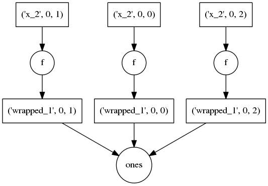

Inspecting Dask objects
=======================

Dask itself is just a specification on top of normal Python dictionaries.
Objects like ``dask.Array`` are just a thin wrapper around these dictionaries
with a little bit of shape metadata.

Users should only have to interact with the higher-level ``Array`` objects.
Developers may want to dive more deeply into the dictionaries/task graphs
themselves

``dask`` attribute
------------------

The first step is to look at the ``.dask`` attribute of an array

.. code-block:: python

   >>> import dask.array as da
   >>> x = da.ones((5, 15), chunks=(5, 5))
   >>> x.dask
   {('wrapped_1', 0, 0): (ones, (5, 5)),
    ('wrapped_1', 0, 1): (ones, (5, 5)),
    ('wrapped_1', 0, 2): (ones, (5, 5))}

This attribute becomes more interesting as you perform operations on your Array
objects

.. code-block:: python

   >>> (x + 1).dask
   {('wrapped_1', 0, 0): (ones, (5, 5)),
    ('wrapped_1', 0, 1): (ones, (5, 5)),
    ('wrapped_1', 0, 2): (ones, (5, 5))
    ('x_1', 0, 0): (add, ('wrapped_1', 0, 0), 1),
    ('x_1', 0, 1): (add, ('wrapped_1', 0, 1), 1),
    ('x_1', 0, 2): (add, ('wrapped_1', 0, 2), 1)}

Visualize graphs with DOT
-------------------------

If you have basic graphviz tools like ``dot`` installed then dask can also
generate visual graphs from your task graphs.

.. code-block:: python

   >>> d = (x + 1).dask
   >>> from dask.dot import dot_graph
   >>> dot_graph(d)
   Writing graph to mydask.pdf

The result is shown to the right.
