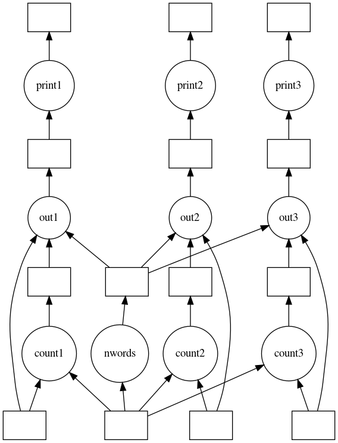
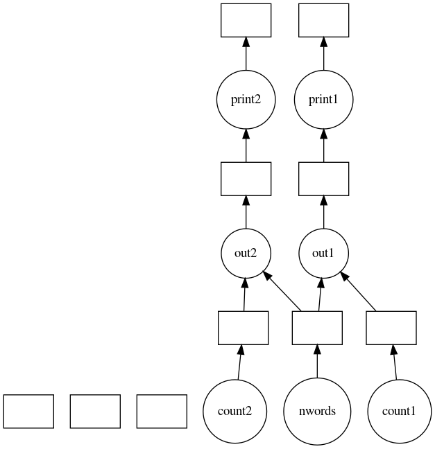
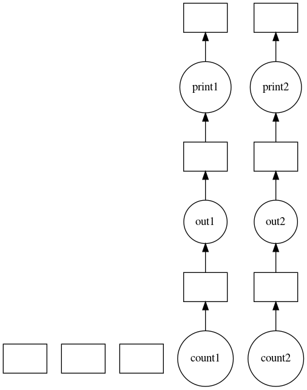
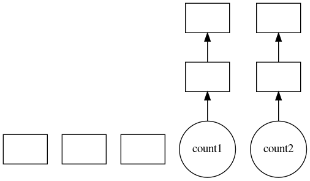

Optimization
============

Performance can be significantly improved in different contexts by making
small optimizations on the dask graph before calling the scheduler.

The ``dask.optimize`` module contains several functions to transform graphs in
a variety of useful ways. In most cases, users won't need to interact with
these functions directly, as specialized subsets of these transforms are done
automatically in the dask collections (``dask.array``, ``dask.bag``, and
``dask.dataframe``). However, users working with custom graphs or computations
may find that applying these methods results in substantial speedups.

In general, there are two goals when doing graph optimizations:

1. Simplify computation
2. Improve parallelism.

Simplifying computation can be done on a graph level by removing unnecessary
tasks (``cull``), or on a task level by replacing expensive operations with
cheaper ones (``RewriteRule``).

Parallelism can be improved by reducing
inter-task communication, whether by fusing many tasks into one (``fuse``), or
by inlining cheap operations (``inline``, ``inline_functions``).

Below, we show an example walking through the use of some of these to optimize
a task graph.

Example
-------

Suppose you had a custom dask graph for doing a word counting task:

.. code-block:: python

    >>> from __future__ import print_function

    >>> def print_and_return(string):
    ...     print(string)
    ...     return string

    >>> def format_str(count, val, nwords):
    ...     return ('word list has {0} occurrences of {1}, '
    ...             'out of {2} words').format(count, val, nwords)

    >>> dsk = {'words': 'apple orange apple pear orange pear pear',
    ...        'nwords': (len, (str.split, 'words')),
    ...        'val1': 'orange',
    ...        'val2': 'apple',
    ...        'val3': 'pear',
    ...        'count1': (str.count, 'words', 'val1'),
    ...        'count2': (str.count, 'words', 'val2'),
    ...        'count3': (str.count, 'words', 'val3'),
    ...        'out1': (format_str, 'count1', 'val1', 'nwords'),
    ...        'out2': (format_str, 'count2', 'val2', 'nwords'),
    ...        'out3': (format_str, 'count3', 'val3', 'nwords'),
    ...        'print1': (print_and_return, 'out1'),
    ...        'print2': (print_and_return, 'out2'),
    ...        'print3': (print_and_return, 'out3')}

Here we're counting the occurrence of the words ``'orange``, ``'apple'``, and
``'pear'`` in the list of words, formatting an output string reporting the
results, printing the output, then returning the output string.

To perform the computation, we pass the dask graph and the desired output keys
to a scheduler ``get`` function:

.. code-block:: python

    >>> from dask.threaded import get

    >>> results = get(dsk, ['print1', 'print2'])
    word list has 2 occurrences of apple, out of 7 words
    word list has 2 occurrences of orange, out of 7 words

    >>> results
    ('word list has 2 occurrences of orange, out of 7 words',
     'word list has 2 occurrences of apple, out of 7 words')

As can be seen above, the scheduler computed only the requested outputs
(``'print3'`` was never computed). This is because the scheduler internally
calls ``cull``, which removes the unnecessary tasks from the graph. Even though
this is done internally in the scheduler, it can be beneficial to call it at
the start of a series of optimizations to reduce the amount of work done in
later steps:

.. code-block:: python

    >>> from dask.optimize import cull
    >>> dsk1, dependencies = cull(dsk, ['print1', 'print2'])

.. image:: images/optimize_dask2.png
   :width: 60 %
   :alt: After culling

Looking at the task graph above, there are multiple accesses to constants such
as ``'val1'`` or ``'val2'`` in the dask graph. These can be inlined into the
tasks to improve efficiency using the ``inline`` function. For example:

.. code-block:: python

    >>> from dask.optimize import inline
    >>> dsk2 = inline(dsk1, dependencies=dependencies)
    >>> results = get(dsk2, ['print1', 'print2'])
    word list has 2 occurrences of apple, out of 7 words
    word list has 2 occurrences of orange, out of 7 words

Now we have two sets of *almost* linear task chains. The only link between them
is the word counting function. For cheap operations like this, the
serialization cost may be larger than the actual computation, so it may be
faster to do the computation more than once, rather than passing the results to
all nodes. To perform this function inlining, the ``inline_functions`` function
can be used:

.. code-block:: python

    >>> from dask.optimize import inline_functions
    >>> dsk3 = inline_functions(dsk2, [len, str.split], dependencies=dependencies)
    >>> results = get(dsk3, ['print1', 'print2'])
    word list has 2 occurrences of apple, out of 7 words
    word list has 2 occurrences of orange, out of 7 words

Now we have a set of purely linear tasks. We'd like to have the scheduler run
all of these on the same worker to reduce data serialization between workers.
One option is just to merge these linear chains into one big task using the
``fuse`` function:

.. code-block:: python

    >>> from dask.optimize import fuse
    >>> dsk4, dependencies = fuse(dsk3)
    >>> results = get(dsk4, ['print1', 'print2'])
    word list has 2 occurrences of apple, out of 7 words
    word list has 2 occurrences of orange, out of 7 words

Putting it all together:

.. code-block:: python

    >>> def optimize_and_get(dsk, keys):
    ...     dsk1, deps = cull(dsk, keys)
    ...     dsk2 = inline(dsk1, dependencies=deps)
    ...     dsk3 = inline_functions(dsk2, [len, str.split], dependencies=deps)
    ...     dsk4, deps = fuse(dsk2)
    ...     return get(dsk4, keys)

    >>> optimize_and_get(dsk, ['print1', 'print2'])
    word list has 2 occurrences of apple, out of 7 words
    word list has 2 occurrences of orange, out of 7 words

In summary, the above operations accomplish the following:

1. Removed tasks unnecessary for the desired output using ``cull``.
2. Inlined constants using ``inline``.
3. Inlined cheap computations using ``inline_functions``, improving parallelism.
4. Fused linear tasks together to ensure they run on the same worker using ``fuse``.

As stated previously, these optimizations are already performed automatically
in the dask collections. Users not working with custom graphs or computations
should rarely need to directly interact with them.

These are just a few of the optimizations provided in ``dask.optimize``. For
more information, see the API below.

Rewrite Rules
-------------

For context based optimizations, ``dask.rewrite`` provides functionality for
pattern matching and term rewriting. This is useful for replacing expensive
computations with equivalent, cheaper computations. For example, ``dask.array``
uses the rewrite functionality to replace series of array slicing operations
with a more efficient single slice.

The interface to the rewrite system consists of two classes:

1. ``RewriteRule(lhs, rhs, vars)``

    Given a left-hand-side (``lhs``), a right-hand-side (``rhs``), and a set of
    variables (``vars``), a rewrite rule declaratively encodes the following
    operation:

    ``lhs -> rhs if task matches lhs over variables``

2. ``RuleSet(*rules)``

    A collection of rewrite rules. The design of ``RuleSet`` class allows for
    efficient "many-to-one" pattern matching, meaning that there is minimal
    overhead for rewriting with multiple rules in a rule set.

Example
~~~~~~~

Here we create two rewrite rules expressing the following mathematical transformations:

1. ``a + a -> 2*a``
2. ``a * a -> a**2``

where ``'a'`` is a variable:

.. code-block:: python

    >>> from dask.rewrite import RewriteRule, RuleSet
    >>> from operator import add, mul, pow

    >>> variables = ('a',)

    >>> rule1 = RewriteRule((add, 'a', 'a'), (mul, 'a', 2), variables)

    >>> rule2 = RewriteRule((mul, 'a', 'a'), (pow, 'a', 2), variables)

    >>> rs = RuleSet(rule1, rule2)

The ``RewriteRule`` objects describe the desired transformations in a
declarative way, and the ``RuleSet`` builds an efficient automata for applying
that transformation. Rewriting can then be done using the ``rewrite`` method:

.. code-block:: python

    >>> rs.rewrite((add, 5, 5))
    (mul, 5, 2)

    >>> rs.rewrite((mul, 5, 5))
    (pow, 5, 2)

    >>> rs.rewrite((mul, (add, 3, 3), (add, 3, 3)))
    (pow, (mul, 3, 2), 2)

The whole task is traversed by default. If you only want to apply a transform
to the top-level of the task, you can pass in ``strategy='top_level'`` as shown:

.. code-block:: python

    # Transforms whole task
    >>> rs.rewrite((sum, [(add, 3, 3), (mul, 3, 3)]))
    (sum, [(mul, 3, 2), (pow, 3, 2)])

    # Only applies to top level, no transform occurs
    >>> rs.rewrite((sum, [(add, 3, 3), (mul, 3, 3)]), strategy='top_level')
    (sum, [(add, 3, 3), (mul, 3, 3)])

The rewriting system provides a powerful abstraction for transforming
computations at a task level. Again, for many users, directly interacting with
these transformations will be unnecessary.

Keyword Arguments
-----------------

Some optimizations take optional keyword arguments.  To pass keywords from the
compute call down to the right optimization, prepend the keyword with the name
of the optimization.  For example to send a ``keys=`` keyword argument to the
``fuse`` optimization from a compute call, use the ``fuse_keys=`` keyword:

.. code-block:: python

   def fuse(dsk, keys=None):
       ...

   x.compute(fuse_keys=['x', 'y', 'z'])

API
---

.. currentmodule:: dask.optimize

**Top level optimizations**

.. autosummary::
   cull
   fuse
   inline
   inline_functions

**Utility functions**

.. autosummary::
   dealias
   dependency_dict
   equivalent
   functions_of
   merge_sync
   sync_keys

**Rewrite Rules**

.. currentmodule:: dask.rewrite

.. autosummary::
    RewriteRule
    RuleSet

Definitions
~~~~~~~~~~~

.. currentmodule:: dask.optimize

.. autofunction:: cull
.. autofunction:: fuse
.. autofunction:: inline
.. autofunction:: inline_functions

.. autofunction:: dealias
.. autofunction:: dependency_dict
.. autofunction:: equivalent
.. autofunction:: functions_of
.. autofunction:: merge_sync
.. autofunction:: sync_keys

.. currentmodule:: dask.rewrite

.. autofunction:: RewriteRule
.. autofunction:: RuleSet
