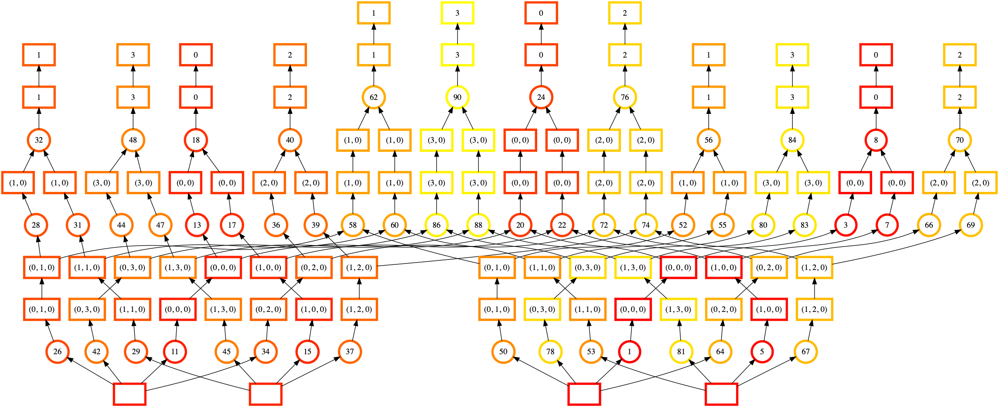
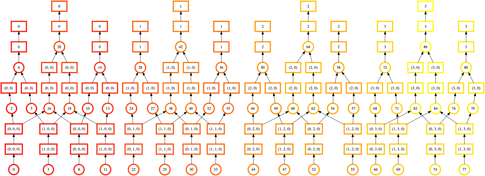

.. _order:

Ordering
========

.. note::

   This is an advanced topic that most users won't need to worry about.

When Dask is given a task graph to compute, it needs to choose an order to
execute the tasks in. We have some constraints: dependencies must be executed
before their dependants. But beyond that there's a large space of options. We
want Dask to choose an ordering that maximizes parallelism while minimizing
the footprint necessary to run a computation.

At a high level, Dask has a policy that works towards *small goals* with *big steps*.

1.  **Small goals**: prefer tasks that have few total dependents and whose final
    dependents have few total dependencies.

    We prefer to prioritize those tasks that help branches of computation that
    can terminate quickly.

    With more detail, we compute the total number of dependencies that each
    task depends on (both its own dependencies, the dependencies of its
    dependencies, and so on), and then we choose those tasks that drive towards
    results with a low number of total dependencies.  We choose to prioritize
    tasks that work towards finishing shorter computations first.

2.  **Big steps**: prefer tasks with many dependents

    However, many tasks work towards the same final dependents.  Among those,
    we choose those tasks with the most work left to do.  We want to finish
    the larger portions of a sub-computation before we start on the smaller
    ones.

This is done with :func:`dask.order.order`. A more technical discussion is available
in :ref:`scheduling-policy`. https://distributed.dask.org/en/latest/scheduling-policies.html
also discusses scheduling with a focus on the distributed scheduler, which includes
additional choices beyond the static ordering documented here.

Debugging
---------

Most of the time Dask's ordering does well. But this is a genuinely hard problem
and there might be cases where you observe unexpectedly high memory usage or
communication, which may be a result of poor ordering. This section describes
how you would identify an ordering problem, and some steps you can take to
mitigate the problem.

Consider a computation that loads several chains of data from disk independently,
stacks pieces of them together, and does some reduction:

.. code-block:: python

   >>> # create data on disk
   >>> import dask.array as da
   >>> x = da.zeros((12500, 10000), chunks=('10MB', -1))
   >>> da.to_zarr(x, 'saved_x1.zarr', overwrite=True)
   >>> da.to_zarr(x, 'saved_y1.zarr', overwrite=True)
   >>> da.to_zarr(x, 'saved_x2.zarr', overwrite=True)
   >>> da.to_zarr(x, 'saved_y2.zarr', overwrite=True)

We can load the data

.. code-block:: python

   >>> # load the data.
   >>> x1 = da.from_zarr('saved_x1.zarr')
   >>> y1 = da.from_zarr('saved_x2.zarr')
   >>> x2 = da.from_zarr('saved_y1.zarr')
   >>> y2 = da.from_zarr('saved_y2.zarr')

And do some computation on it

.. code-block:: python

   >>> def evaluate(x1, y1, x2, y2):
   ...     u = da.stack([x1, y1])
   ...     v = da.stack([x2, y2])
   ...     components = [u, v, u ** 2 + v ** 2]
   ...     return [
   ...         abs(c[0] - c[1]).mean(axis=-1)
   ...         for c in components
   ...     ]
   >>> results = evaluate(x1, y1, x2, y2)

You can use :func:`dask.visualize` with ``color="order"`` to visualize a
task graph with the static ordering included as node labels. As usual with
``dask.visualize``, you may need to trim down the problem to a smaller size,
so we'll slice off a subset of the data. Make sure to include ``optimize_graph=True``
to get a true representation of what order the tasks will be executed in.

.. code-block:: python

   >>> import dask
   >>> n = 125 * 4
   >>> dask.visualize(evaluate(x1[:n], y1[:n], x2[:n], y2[:n]),
   ...                optimize_graph=True, color="order",
   ...                cmap="autumn", node_attr={"penwidth": "4"})

sion.

In this visualization the nodes are colored by order of execution (from dark red
to light yellow) and the node labels are the order Dask's assigned to each task.

It's a bit hard to see, but there are actually four mostly independent "towers"
of execution here. We start at the middle-right array (label 1, bottom), move
up to the right (label 8, top-right) and then jump to a completely different
array (label 11, bottom-left). However, computing the first tower (downstream
of label 8, top-right) required loading some data from our second input array
(label 5, bottom-right). We'd much prefer to finish tasks downstream of it.

When Dask is executing that task graph, you might observe high memory usage.
The poor static ordering means we fail to complete tasks that would let us
release pieces of data. We load more pieces into memory at once, leading to
higher memory usage.

This specific ordering failure (which may be fixed) comes from the shared
dependencies (the boxes at the bottom of each task, which represent the input
Zarr arrays) at the bottom of each computation chain. We can inline those and
see the effect of ordering:

.. code-block:: python

   >>> # load and profile data
   >>> x1 = da.from_zarr('saved_x1.zarr', inline_array=True)
   >>> y1 = da.from_zarr('saved_x2.zarr', inline_array=True)
   >>> x2 = da.from_zarr('saved_y1.zarr', inline_array=True)
   >>> y2 = da.from_zarr('saved_y2.zarr', inline_array=True)

   >>> import dask
   >>> n = 125 * 4
   >>> dask.visualize(evaluate(x1[:n], y1[:n], x2[:n], y2[:n]),
   ...                optimize_graph=True, color="order",
   ...                cmap="autumn", node_attr={"penwidth": "4"})

coding of the output chains shows clear progression in the order of execution with each output color having a corresponding input of the same color.

At a glance, we can see that this ordering is looks much more regular and
uniform. There's fewer lines crossing, and the color of the ordering moves
smoothly from bottom to top, left to right. This shows that Dask is completing
one chain of computation before moving onto the next.

The lesson here is *not* "always use ``inline_array=True``". While the static
ordering looks better, there are other :ref:`phases-of-computation` to consider.
Whether the actual performance is better will depend on more factors than we
can consider here. See :func:`dask.array.from_array` for more.

Instead, the lessons to take away here are:

1. What symptoms might lead you to diagnose Dask's ordering as a problem (e.g.
   high memory usage)
2. How to generate and read task graphs with Dask's ordering information
   included.
