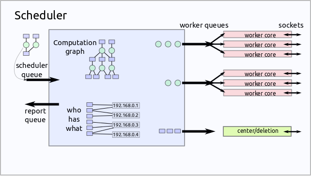

Scheduler
=========

The scheduler orchestrates which workers work on which tasks in what order.
It tracks the current state of the entire cluster.  It consists of several
coroutines rounning in a single event loop.

.. currentmodule:: distributed.scheduler

.. autoclass:: Scheduler
   :members:
.. autofunction:: decide_worker
