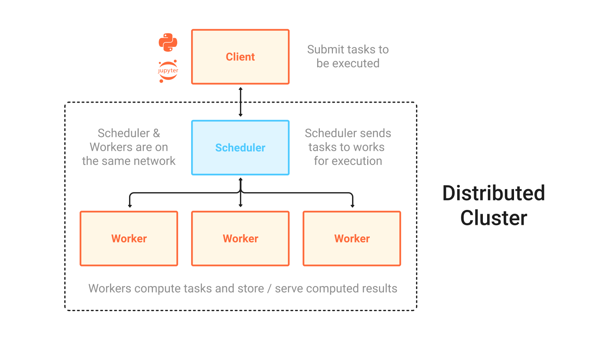

Distributed Clusters
--------------------

To use the ``dask.distributed`` scheduler you must set up a ``Client`` that connects to a ``Cluster`` which consists
of a ``Scheduler`` and one or more ``Workers``.

The distributed scheduler is designed to scale from utilizing all the cores on a single machine to many machines all
working together. To create a simple single-machine cluster you can import the :class:`distributed.Client` and instantiate it with
no arguments. This will create a cluster on your machine and connect to it.

.. code-block:: python

   >>> from dask.distributed import Client
   >>> client = Client()  # Create a local distributed cluster and override default
   >>> df.x.sum().compute()  # This now runs on the distributed system

Creating a ``Client`` is often pragmatic on local machines for a few reasons:

1.  It provides access to asynchronous API, notably :doc:`Futures <futures>`
2.  It provides a diagnostic dashboard that can provide valuable insight on
    performance and progress
3.  It handles data locality with more sophistication, and so can be more
    efficient than the multiprocessing scheduler on workloads that require
    multiple processes

Creating a bare client like this creates a :class:`distributed.LocalCluster` object for us
under the hood. We can create this ourselves if we wish and see what this consists of under the hood.

.. code-block:: python

   >>> from dask.distributed import Client, LocalCluster
   >>> cluster = LocalCluster()

   >>> cluster.scheduler
   <Scheduler: "tcp://127.0.0.1:64619" workers: 4 cores: 12, tasks: 0>

   >>> cluster.workers
   {0: <Nanny: tcp://127.0.0.1:64634, threads: 3>,
    1: <Nanny: tcp://127.0.0.1:64635, threads: 3>,
    2: <Nanny: tcp://127.0.0.1:64632, threads: 3>,
    3: <Nanny: tcp://127.0.0.1:64633, threads: 3>}

   >>> client = Client(cluster)

We can see here that our ``cluster`` object has a ``scheduler`` which our ``Client`` connects to and handles
distributing our task graph. We can also see a number of workers that have been created for us automatically based on the
resources in the machine. These workers will do the processing of each task for us.

Multi-machine clusters
----------------------

You can also run Dask on a distributed cluster using multiple machines.
There are a variety of ways to set this up depending on your cluster.

.. _scheduling-configuration:

- Deploying with Dask tools:
    - :doc:`Manual Setup <how-to/deploy-dask/cli>`: The command line interface to set up
      ``dask-scheduler`` and ``dask-worker`` processes.  Useful for IT or
      anyone building a deployment solution.
    - :doc:`SSH <how-to/deploy-dask/ssh>`: Use SSH to set up Dask across an un-managed
      cluster.
    - :doc:`High Performance Computers <how-to/deploy-dask/hpc>`: How to run Dask on
      traditional HPC environments using tools like MPI, or job schedulers like
      SLURM, SGE, TORQUE, LSF, and so on.
    - :doc:`Kubernetes <how-to/deploy-dask/kubernetes>`: Deploy Dask with the
      popular Kubernetes resource manager using either Helm or a native deployment.
    - `YARN / Hadoop <https://yarn.dask.org/en/latest/>`_: Deploy
      Dask on YARN clusters, such as are found in traditional Hadoop
      installations.
    - `Dask Gateway <https://gateway.dask.org/>`_ provides a secure,
      multi-tenant server for managing Dask clusters and allows users to launch
      and use Dask clusters in a shared cluster environment.
    - :doc:`Python API (advanced) <how-to/deploy-dask/python-advanced>`: Create
      ``Scheduler`` and ``Worker`` objects from Python as part of a distributed
      Tornado TCP application.  This page is useful for those building custom
      frameworks.
    - :doc:`Docker <how-to/deploy-dask/docker>` images are available and may be useful
      in some of the solutions above.
    - :doc:`Cloud <how-to/deploy-dask/cloud>` for current recommendations on how to
      deploy Dask and Jupyter on common cloud providers like Amazon, Google, or
      Microsoft Azure.
- Hosted / managed Dask clusters (listed in alphabetical order):
    - `Coiled <https://coiled.io/>`_ handles the creation and management of
      Dask clusters on cloud computing environments (AWS, Azure, and GCP).
    - `Saturn Cloud <https://saturncloud.io/>`_ lets users create
      Dask clusters in a hosted platform or within their own AWS accounts.
