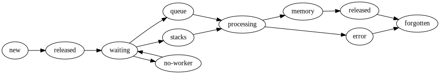

Scheduling State
================

Overview
--------

The life of a computation with Dask can be described in the following stages:

1.  The user authors a graph using some library, perhaps Dask.delayed or
    dask.dataframe or the ``submit/map`` functions on the client.  They submit
    these tasks to the scheduler.
2.  The schedulers assimilates these tasks into its graph of all tasks to track
    and as their dependencies become available it asks workers to run each of
    these tasks.
3.  The worker receives information about how to run the task, communicates
    with its peer workers to collect dependencies, and then runs the relevant
    function on the appropriate data.  It reports back to the scheduler that it
    has finished.
4.  The scheduler reports back to the user that the task has completed.  If the
    user desires, it then fetches the data from the worker through the
    scheduler.

Most relevant logic is in tracking tasks as they evolve from newly submitted,
to waiting for dependencies, to actively running on some worker, to finished in
memory, to garbage collected.  Tracking this process, and tracking all effects
that this task has on other tasks that might depend on it, is the majority of
the complexity of the dynamic task scheduler.  This section describes the
system used to perform this tracking.

For more abstract information about the policies used by the scheduler, see
:doc:`Scheduling Policies<scheduling-policies>`.

State Variables
---------------

We start with a description of the state that the scheduler keeps on each task.
Each of the following is a dictionary keyed by task name (described below).

Task description variables
''''''''''''''''''''''''''

These containers keep task information accross a task's whole lifetime.

* **tasks:** ``{key: task}``:

   Dictionary mapping key to a serialized task.

   A key is the name of a task, generally formed from the name of the
   function, followed by a hash of the function and arguments, like
   ``'inc-ab31c010444977004d656610d2d421ec'``.

   The value of this dictionary is the task, which is an unevaluated function
   and arguments.  This is stored in one of two forms:

   * ``{'function': inc, 'args': (1,), 'kwargs': {}}``; a dictionary with the
     function, arguments, and keyword arguments (kwargs).  However in the
     scheduler these are stored serialized, as they were sent from the client,
     so it looks more like ``{'function': b'\x80\x04\x95\xcb\...', 'args':
     b'...', }``

   * ``(inc, 1)``: a tuple satisfying the `dask graph protocol
     <http://dask.pydata.org/en/latest/graphs.html>`_.  This
     again is stored serialized.

   These are the values that will eventually be sent to a worker when the task
   is ready to run.

* **dependencies and dependents:** ``{key: {keys}}``:

   These are dictionaries which show which tasks depend on which others.  They
   contain redundant information.  If ``dependencies[a] == {b, c}`` then the
   task with the name of ``a`` depends on the results of the two tasks with the
   names of ``b`` and ``c``.  There will be complimentary entries in dependents
   such that ``a in dependents[b]`` and ``a in dependents[c]`` such as
   ``dependents[b] == {a, d}``.  Keeping the information around twice allows
   for constant-time access for either direction of query, so we can both look
   up a task's out-edges or in-edges efficiently.

* **priority:** ``{key: tuple}``:

   The ``priority`` dictionary provides each key with a relative ranking
   which is used to break ties when many keys are being
   considered for execution.

   This ranking is generally a tuple of two parts.  The first (and dominant)
   part corresponds to when it was submitted.  Generally earlier tasks take
   precedence.  The second part is determined by the client, and is a way to
   prioritize tasks within a large graph that may be important, such as if
   they are on the critical path, or good to run in order to release many
   dependencies.  This is explained further in :doc:`Scheduling Policy
   <scheduling-policies>`.

* **host_restrictions:** ``{key: {hostnames}}``:

   A set of hostnames per key of where that key can be run.  Usually this
   is empty unless a key has been specifically restricted to only run on
   certain hosts.  A hostname may correspond to one or several connected
   workers.

* **worker_restrictions:** ``{key: {worker addresses}}``:

   A set of complete worker addresses per key of where that key can
   be run.  Usually this is empty unless a key has been specifically
   restricted to only run on certain workers.

* **resource_restrictions:** ``{key: {resource: quantity}}``:

   Resources required by a task, such as ``{'gpu': 1}`` or ``{'memory': 1e9}``.
   These are user-defined names and are matched against the contents
   of the ``worker_resources`` dictionary.

* **loose_restrictions:** ``{key}``:

   Set of keys for which we are allowed to violate restrictions (see above)
   if no valid workers are present and the task would otherwise go into the
   ``unrunnable`` set.  In other words, if a key is in ``loose_restrictions``,
   then its restrictions become mere preferences, otherwise they are mandatory.

* **who_wants:** ``{key: {client}}``:

   When a client submits a graph to the scheduler it also specifies which
   output keys it desires.  Those keys are tracked here where each desired key
   knows which clients want it.  These keys will not be released from memory
   and, when they complete, messages will be sent to all of these clients that
   the task is ready.

* **wants_what:** ``{client: {key}}``:

   The transpose of ``who_wants``.

Task state flow
'''''''''''''''

These state variables reflect the current status of a task and may
get updated at each state transition.

* **task_state:** ``{key: string}``:

   The ``task_state`` dictionary holds the current state of every key.
   Current valid states include ``released``, ``waiting``, ``no-worker``,
   ``processing``, ``memory``, and ``erred``.  These states are explained
   :ref:`further below <task-states>`.

* **waiting and waiting_data:** ``{key: {keys}}``:

   These dictionaries are a subset of ``dependencies`` and ``dependents``
   respectively, as they only track keys that are still in play.

   For example ``waiting`` looks like ``dependencies``, tracking all of the
   tasks that a certain task requires before it can run.  However, as tasks
   are completed and arrive in memory they are removed from their dependents
   sets in ``waiting``, so that when a set becomes empty we know that a
   key is ready to run and ready to be allocated to a worker.

   Similarly, the ``waiting_data`` dictionary holds all of the dependents
   of a key that have yet to run and still require that this task
   stay in memory in services of tasks that may depend on it (its
   ``dependents``).  When a value set in this dictionary becomes empty
   its task may be garbage-collected (unless some client actively desires
   that this task stay in memory, as tracked in ``who_wants``).

* **processing:** ``{worker: {key: cost}}``:

   Keys that are currently allocated to a worker.  This is keyed by worker
   address and contains the expected cost in seconds of running each task,
   summing both the task's expected computation time and the expected
   communication time of its result.

   Multiple tasks may be submitted to a worker in advance and the worker
   will run them eventually, depending on its execution resources
   (but see :doc:`work-stealing`).

* **rprocessing:** ``{key: worker}``:

   The reverse of the ``processing`` dictionary.  This tracks the worker
   processing each task that is currently running.  This is redundant
   with ``processing`` and just here for faster indexed querying.

* **who_has:** ``{key: {worker}}``:

   For keys that are in memory this shows on which workers they currently
   reside.

* **has_what:** ``{worker: {key}}``:

   This is the transpose of ``who_has``, showing all keys that currently
   reside on each worker.

* **released:** ``{keys}``

   The set of keys that are neither waiting to be processed, nor in memory.
   These typically are just-initialized tasks, or tasks that have already
   been computed but which it is not necessary to keep in memory.

* **unrunnable:** ``{key}``

   The set of keys that are not currently able to run, either because they
   have a user-defined restriction (described in ``host_restrictions``,
   ``worker_restrictions`` and ``resource_restrictions``) that is not met
   by any connected worker, or because no worker is connected at all.

   These keys already have all their ``dependencies`` satisfied (their
   ``waiting`` set is empty), and are waiting for an appropriate worker
   to join the network before computing.

* **exceptions and tracebacks:** ``{key: Exception/Traceback}``:

   Dictionaries mapping keys to remote exceptions and tracebacks.  When tasks
   fail we store their exceptions and tracebacks (serialized from the worker)
   here so that users may gather the exceptions to see the error.

* **exceptions_blame:** ``{key: key}``:

   If a task fails then we mark all of its dependent tasks as failed as well.
   This dictionary lets any failed task see which task was the origin of its
   failure.

* **suspicious_tasks:** ``{key: int}``

   Number of times a task has been involved in a worker failure.  Some tasks
   may cause workers to fail (such as ``sys.exit(0)``).  When a worker fails
   all of the tasks on that worker are reassigned to others.  This combination
   of behaviors can cause a bad task to catastrophically destroy all workers
   on the cluster, one after another.  Whenever a worker fails we mark each
   task currently running on that worker as suspicious.  If a task is involved
   in three failures (or some other fixed constant) then we mark the task as
   ``erred``.

* **retries:** ``{key: int}``

   Number of times a task is automatically retried in case of failure.
   If present, this is decremented each time a task's execution failed,
   until it reaches 0.

* **nbytes:** ``{key: int}``:

   The number of bytes, as determined by ``sizeof``, of the result of each
   finished task.  This number is used for diagnostics and to help prioritize
   work.

Worker state variables
''''''''''''''''''''''

These state variables track the current state of each worker, and are involved
in deciding :ref:`which worker to run a task on <decide-worker>`.

* **ncores:** ``{worker: int}``

   The number of CPU cores made available on each worker.

* **worker_resources:** ``{worker: {str: Number}}``:

   The available resources on each worker like ``{'gpu': 2, 'mem': 1e9}``.
   These are abstract quantities that constrain certain tasks from running at
   the same time on a given worker.

* **used_resources:** ``{worker: {str: Number}}``:

   The sum of each resource used by all tasks allocated to a particular
   worker.  The numbers in this dictionary can only be less or equal than
   those in ``worker_resources``.

* **worker_bytes:** ``{worker: int}``:

   The total memory size, in bytes, used by the keys currently held in memory
   on each given worker.

* **occupancy:** ``{worker: duration}``:

   The total expected runtime, in seconds, of all tasks currently processing
   on a worker.

* **idle and saturated:** ``{worker}``:

   Two sets of workers indicating their ability to start computing a new
   task in a relatively short timespan.  "Idle" workers will be preferred
   when :ref:`deciding a suitable worker <decide-worker>` to run a new
   task on.  Conversely, "saturated" workers may see their workload
   lightened through :doc:`work-stealing`.

   These two sets are computed based on each worker's number of cores
   (``ncores``), task queue (``processing``) and ``occupancy`` numbers.

   These two sets are disjoint.  Also, some workers may be *neither* "idle"
   nor "saturated".

.. XXX list invariants somewhere?

   For every worker ``w``,
   * ``worker_bytes[w] == sum(nbytes[k] for k in has_what[w])``
   * ``occupancy[w] == sum(processing[w].values())``

Example Event and Response
--------------------------

Whenever an event happens, like when a client sends up more tasks, or when a
worker finishes a task, the scheduler changes the state above.  For example
when a worker reports that a task has finished we perform actions like the
following:

**Task `key` finished by `worker`**:

.. code-block:: python

   # Update task state
   task_state[key] = 'memory'

   processing[worker].remove(key)
   del rprocessing[key]

   who_has[key].add(worker)
   has_what[worker].add(key)

   # Update memory / resource / occupancy counters
   nbytes[key] = nbytes
   worker_bytes[worker] += nbytes

   for key, value in resource_restrictions[key]:
       used_resources[key] -= value

   update_worker_occupancy_and_idleness(worker)

   # Notify clients interested in this task's result
   if key in who_wants:
       send_done_message_to_clients(who_wants[key])

   # Transitively update dependent tasks
   for dep in dependencies[key]:
       waiting_data[dep].remove(key)

   for dep in dependents[key]:
       waiting[dep].remove(key)

   for task in ready_tasks():
       worker = best_worker(task):
       send_task_to_worker(task, worker)

.. _task-states:

State Transitions
-----------------

The code presented in the section above is just for demonstration.  In practice
writing this code for every possible event is highly error prone, resulting in
hard-to-track-down bugs.  Instead the scheduler moves tasks between a fixed
set of states, notably ``released``, ``waiting``, ``no-worker``, ``processing``,
``memory``, ``error``.

Tasks fall into the following states with the following allowed transitions

*  *Released*: Known but not actively computing or in memory
*  *Waiting*: On track to be computed, waiting on dependencies to arrive in
   memory
*  *No-worker* (ready, rare): Ready to be computed, but no appropriate worker
   exists
*  *Processing*: Actively being computed by one or more workers
*  *Memory*: In memory on one or more workers
*  *Erred*: Task computation, or one of its dependencies, has encountered an error
*  Forgotten (not actually a state): Task is no longer needed by any client and
   so is removed from state

Tasks and task states
'''''''''''''''''''''

The table below shows which state variable a task is in, depending on the
task's state.  Cells with a check mark (`✓`) indicate the task key *must*
be present in the given state variable; cells with an question mark (`?`)
indicate the task key *may* be present in the given state variable.

======================= ======== ======= ========= ========== ====== =====
State variable          Released Waiting No-worker Processing Memory Erred
======================= ======== ======= ========= ========== ====== =====
tasks                   ✓        ✓       ✓         ✓          ✓      ✓
priority                ✓        ✓       ✓         ✓          ✓      ✓
dependencies            ✓        ✓       ✓         ✓          ✓      ✓
dependents              ✓        ✓       ✓         ✓          ✓      ✓
----------------------- -------- ------- --------- ---------- ------ -----
host_restrictions       ?        ?       ?         ?          ?      ?
worker_restrictions     ?        ?       ?         ?          ?      ?
resource_restrictions   ?        ?       ?         ?          ?      ?
loose_restrictions      ?        ?       ?         ?          ?      ?
----------------------- -------- ------- --------- ---------- ------ -----
released                ✓
waiting                          ✓
waiting_data                     ✓
unrunnable                               ✓
processing                                         ✓
rprocessing                                        ✓
who_has                                                       ✓
has_what                                                      ✓
nbytes *(1)*            ?        ?       ?         ?          ✓      ?
exceptions                                                           ✓
tracebacks                                                           ✓
exceptions_blame                                                     ✓
retries                 ?        ?       ?         ?          ?      ?
suspicious_tasks        ?        ?       ?         ?          ?      ?
======================= ======== ======= ========= ========== ====== =====

Notes:

1. **nbytes**: a task can be in this collection as long as it was already
   computed, even if not currently held in a worker's memory.

Transitions and worker state
''''''''''''''''''''''''''''

The table below shows which worker state variables are updated on each
task state transition.

==================================== ==========================================================
Transition                           Affected worker state
==================================== ==========================================================
released → waiting                   occupancy, idle, saturated
waiting → processing                 occupancy, idle, saturated, used_resources
waiting → memory                     idle, saturated, worker_bytes
processing → memory                  occupancy, idle, saturated, used_resources, worker_bytes
processing → erred                   occupancy, idle, saturated, used_resources
processing → released                occupancy, idle, saturated, used_resources
memory → released                    worker_bytes
memory → forgotten                   worker_bytes
==================================== ==========================================================

.. note::
   Another way of understanding this table is to observe that entering or
   exiting a specific task state updates a well-defined set of worker state
   variables.  For example, entering and exiting the Memory state updates
   ``worker_bytes``.

Implementation
--------------

Every transition between states is a separate method in the scheduler.  These
task transition functions are prefixed with ``transition`` and then have the
name of the start and finish task state like the following.

.. code-block:: python

   def transition_released_waiting(self, key):

   def transition_processing_memory(self, key):

   def transition_processing_erred(self, key):

These functions each have three effects.

1.  They perform the necessary transformations on the scheduler state (the 20
    dicts/lists/sets) to move one key between states.
2.  They return a dictionary of recommended ``{key: state}`` transitions to
    enact directly afterwards on other keys.  For example after we transition a
    key into memory we may find that many waiting keys are now ready to
    transition from waiting to a ready state.
3.  Optionally they include a set of validation checks that can be turned on
    for testing.

Rather than call these functions directly we call the central function
``transition``:

.. code-block:: python

   def transition(self, key, final_state):
       """ Transition key to the suggested state """

This transition function finds the appropriate path from the current to the
final state.  It also serves as a central point for logging and diagnostics.

Often we want to enact several transitions at once or want to continually
respond to new transitions recommended by initial transitions until we reach a
steady state.  For that we use the ``transitions`` function (note the plural ``s``).

.. code-block:: python

   def transitions(self, recommendations):
       recommendations = recommendations.copy()
       while recommendations:
           key, finish = recommendations.popitem()
           new = self.transition(key, finish)
           recommendations.update(new)

This function runs ``transition``, takes the recommendations and runs them as
well, repeating until no further task-transitions are recommended.

Stimuli
-------

Transitions occur from stimuli, which are state-changing messages to the
scheduler from workers or clients.  The scheduler responds to the following
stimuli:

* **Workers**
    * Task finished: A task has completed on a worker and is now in memory
    * Task erred: A task ran and erred on a worker
    * Task missing data: A task tried to run but was unable to find necessary
      data on other workers
    * Worker added: A new worker was added to the network
    * Worker removed: An existing worker left the network

* **Clients**
    * Update graph: The client sends more tasks to the scheduler
    * Release keys: The client no longer desires the result of certain keys

Stimuli functions are prepended with the text ``stimulus``, and take a variety
of keyword arguments from the message as in the following examples:

.. code-block:: python

   def stimulus_task_finished(self, key=None, worker=None, nbytes=None,
                              type=None, compute_start=None, compute_stop=None,
                              transfer_start=None, transfer_stop=None):

   def stimulus_task_erred(self, key=None, worker=None,
                           exception=None, traceback=None)

These functions change some non-essential administrative state and then call
transition functions.

Note that there are several other non-state-changing messages that we receive
from the workers and clients, such as messages requesting information about the
current state of the scheduler.  These are not considered stimuli.

API
---

.. currentmodule:: distributed.scheduler

.. autoclass:: Scheduler
   :members:

.. autofunction:: decide_worker
