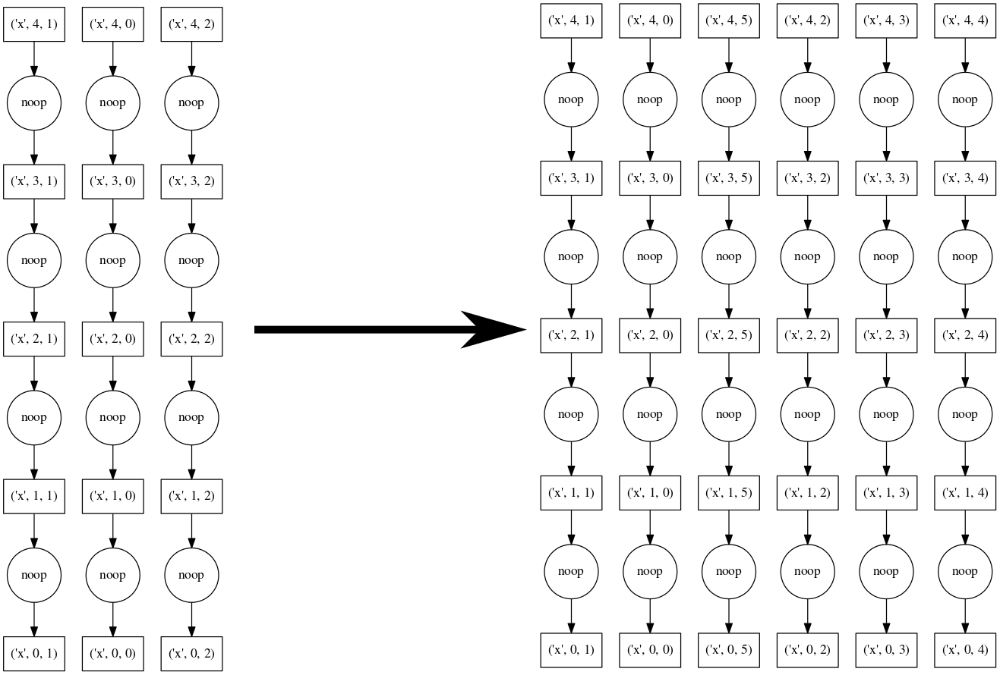
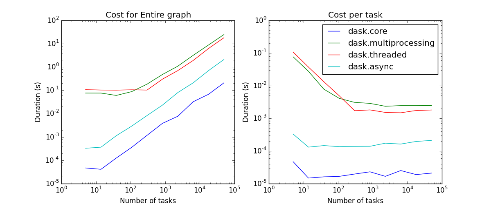
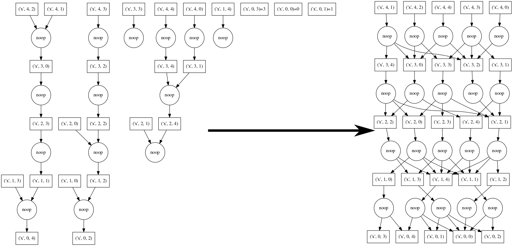
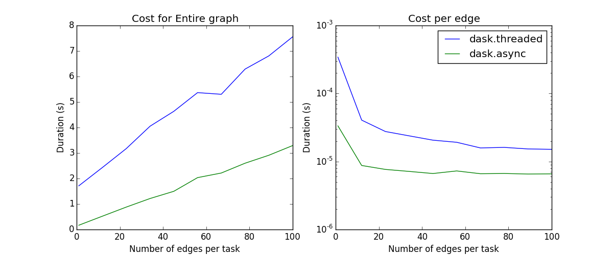

Shared Memory
=============

The asynchronous scheduler requires an ``apply_async`` function and a
``Queue``.  These determine the kind of worker and parallelism that we exploit.
``apply_async`` functions can be found in the following places:

*  ``multithreading.Pool().apply_async`` - uses multiple processes
*  ``multithreading.pool.ThreadPool().apply_async`` - uses multiple threads
*  ``dask.async.apply_sync`` - uses only the main thread (useful for debugging)

Full dask ``get`` functions exist in each of ``dask.threaded.get``,
``dask.multiprocessing.get`` and ``dask.async.get_sync`` respectively.


Policy
------

The asynchronous scheduler maintains indexed data structures that show which
tasks depend on which data, what data is available, and what data is waiting on
what tasks to complete before it can be released, and what tasks are currently
running.  It can update these in constant time relative to the number of total
and available tasks.  These indexed structures make the dask async scheduler
scalable to very many tasks on a single machine.


To keep the memory footprint small, we choose to keep ready-to-run tasks in a
LIFO stack such that the most recently made available tasks get priority.  This
encourages the completion of chains of related tasks before new chains are started.
This can also be queried in constant time.

More info: :doc:`scheduling policy <scheduling-policy>`.


Performance
-----------

*EDIT: The experiments run in this section are now outdated.  Anecdotal testing
shows that performance has improved significantly.  There is now about 200 us
overhead per task and about 1 ms startup time.*

**tl;dr** The threaded scheduler overhead behaves roughly as follows:

*  1ms overhead per task
*  100ms startup time (if you wish to make a new ThreadPool each time)
*  Constant scaling with number of tasks
*  Linear scaling with number of dependencies per task

Schedulers introduce overhead.  This overhead effectively limits the
granularity of our parallelism.  Below we measure overhead of the async
scheduler with different apply functions (threaded, sync, multiprocessing), and
under different kinds of load (embarrassingly parallel, dense communication).

The quickest/simplest test we can do it to use IPython's ``timeit`` magic:

.. code-block:: python

   In [1]: import dask.array as da

   In [2]: x = da.ones(1000, chunks=(2,)).sum()

   In [3]: len(x.dask)
   Out[3]: 1001

   In [4]: %timeit x.compute()
   1 loops, best of 3: 550 ms per loop

So this takes about 500 microseconds per task.  About 100ms of this is from overhead:

.. code-block:: python

   In [6]: x = da.ones(1000, chunks=(1000,)).sum()
   In [7]: %timeit x.compute()
   10 loops, best of 3: 103 ms per loop

Most of this overhead is from spinning up a ThreadPool each time.  This may be
mediated by using a global or contextual pool:

.. code-block:: python

   >>> from multiprocessing.pool import ThreadPool
   >>> pool = ThreadPool()
   >>> da.set_options(pool=pool)  # set global threadpool

   or

   >>> with set_options(pool=pool)  # use threadpool throughout with block
   ...     ...

We now measure scaling the number of tasks and scaling the density of the
graph:



Linear scaling with number of tasks
```````````````````````````````````

As we increase the number of tasks in a graph, we see that the scheduling
overhead grows linearly.  The asymptotic cost per task depends on the scheduler.
The schedulers that depend on some sort of asynchronous pool have costs of a few
milliseconds and the single threaded schedulers have costs of a few microseconds.





Linear scaling with number of edges
```````````````````````````````````

As we increase the number of edges per task, the scheduling overhead
again increases linearly.

Note: Neither the naive core scheduler nor the multiprocessing scheduler
are good at workflows with non-trivial cross-task
communication; they have been removed from the plot.



`Download scheduling script`_


Known Limitations
-----------------

The shared memory scheduler has some notable limitations:

1.  It works on a single machine
2.  The threaded scheduler is limited by the GIL on Python code, so if your
    operations are pure python functions, you should not expect a multi-core
    speedup
3.  The multiprocessing scheduler must serialize functions between workers,
    which can fail
4.  The multiprocessing scheduler must serialize data between workers and the
    central process, which can be expensive
5.  The multiprocessing scheduler cannot transfer data directly between worker
    processes; all data routes through the master process.


.. _`Download scheduling script`: https://github.com/dask/dask/tree/master/docs/source/scripts/scheduling.py
