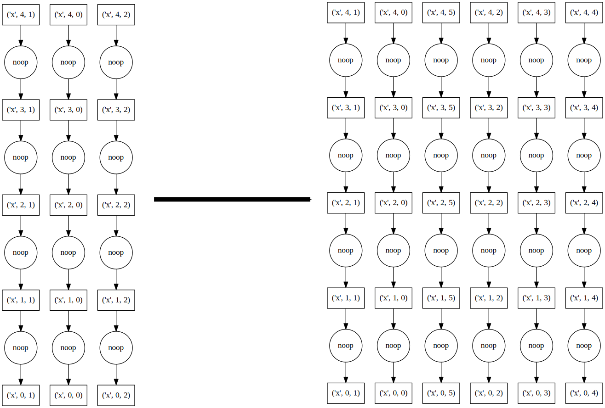
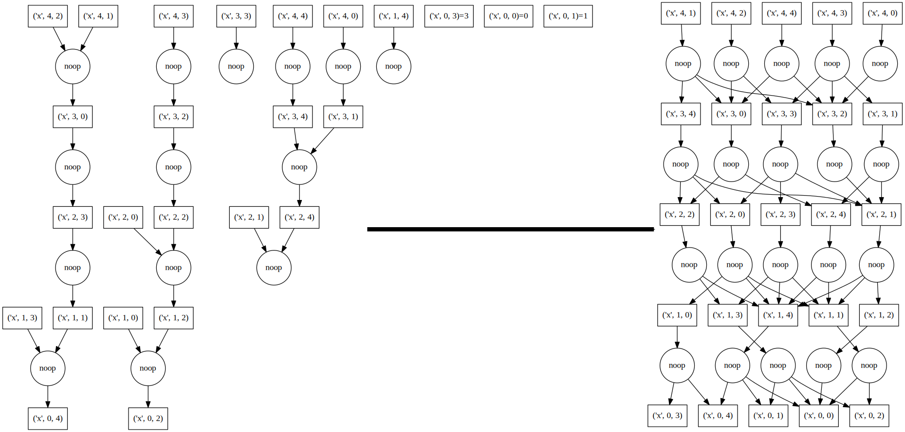

Shared Memory
=============

The asynchronous scheduler accepts any ``concurrent.futures.Executor``
instance. This includes instances of the ``ThreadPoolExecutor`` and
``ProcessPoolExecutor`` defined in the Python standard library as well as any
other subclass from a 3rd party library. Dask also defines its own
``SynchronousExecutor`` for that simply runs functions on the main thread
(useful for debugging).

Full dask ``get`` functions exist in each of ``dask.threaded.get``,
``dask.multiprocessing.get`` and ``dask.get`` respectively.


Policy
------

The asynchronous scheduler maintains indexed data structures that show which
tasks depend on which data, what data is available, and what data is waiting on
what tasks to complete before it can be released, and what tasks are currently
running.  It can update these in constant time relative to the number of total
and available tasks.  These indexed structures make the dask async scheduler
scalable to very many tasks on a single machine.

.. image:: images/async-embarrassing.gif
   :width: 50 %
   :align: right
   :alt: Embarrassingly parallel dask flow

To keep the memory footprint small, we choose to keep ready-to-run tasks in a
last-in-first-out stack such that the most recently made available tasks get
priority.  This encourages the completion of chains of related tasks before new
chains are started.  This can also be queried in constant time.


Performance
-----------

**tl;dr** The threaded scheduler overhead behaves roughly as follows:

*  200us overhead per task
*  10us startup time (if you wish to make a new ThreadPoolExecutor each time)
*  Constant scaling with number of tasks
*  Linear scaling with number of dependencies per task

Schedulers introduce overhead.  This overhead effectively limits the
granularity of our parallelism.  Below we measure overhead of the async
scheduler with different apply functions (threaded, sync, multiprocessing), and
under different kinds of load (embarrassingly parallel, dense communication).

The quickest/simplest test we can do it to use IPython's ``timeit`` magic:

.. ipython::

   In [1]: import dask.array as da

   In [2]: x = da.ones(1000, chunks=(2,)).sum()

   In [3]: len(x.dask)
   Out[3]: 1168

   In [4]: %timeit x.compute()
   92.1 ms ± 2.61 ms per loop (mean ± std. dev. of 7 runs, 10 loops each)

So this takes ~90 microseconds per task.  About 100ms of this is from overhead:

.. ipython::

   In [5]: x = da.ones(1000, chunks=(1000,)).sum()
   
   In [6]: %timeit x.compute()
   1.18 ms ± 8.64 µs per loop (mean ± std. dev. of 7 runs, 1000 loops each)

There is some overhead from spinning up a ThreadPoolExecutor each time.
This may be mediated by using a global or contextual pool:

.. code-block:: python

   >>> from concurrent.futures import ThreadPoolExecutor
   >>> pool = ThreadPoolExecutor()
   >>> dask.config.set(pool=pool)  # set global ThreadPoolExecutor

   or

   >>> with dask.config.set(pool=pool)  # use ThreadPoolExecutor throughout with block
   ...     ...

We now measure scaling the number of tasks and scaling the density of the
graph:



Linear scaling with number of tasks
```````````````````````````````````

As we increase the number of tasks in a graph, we see that the scheduling
overhead grows linearly.  The asymptotic cost per task depends on the scheduler.
The schedulers that depend on some sort of asynchronous pool have costs of a few
milliseconds and the single threaded schedulers have costs of a few microseconds.

.. figure:: images/scaling-nodes.png
   :alt: Graph depicting how well Dask scales with the number of nodes in the task graph. Graph shows the duration in seconds on the y-axis versus number of edges per task on the x-axis. The time to schedule the entire graph is constant initially, followed by a linear increase after roughly 500 tasks for multiprocessing and threaded schedulers and 10 tasks for async and core schedulers. The inverse is true for the cost per task, with a linear cost decrease, followed by more or less constant cost.
   
   Scheduling overhead for the entire graph (left) vs. per task (right)



Linear scaling with number of edges
```````````````````````````````````

As we increase the number of edges per task, the scheduling overhead
again increases linearly.

Note: Neither the naive core scheduler nor the multiprocessing scheduler
are good at workflows with non-trivial cross-task
communication; they have been removed from the plot.

.. figure:: images/scaling-edges.png
   :alt: Graph depicting how well Dask scales with the number of edges in the task graph. Graph shows the duration in seconds on the y-axis versus number of edges per task on the x-axis. As the number of edges increases from 0 to 100, the time to schedule the entire graph using the threaded scheduler goes from 2 to 8 seconds whereas using the async scheduler goes from 0 to 3 seconds. The cost per edge decreases up until about 10 edges, after which the cost plateaus for both the threaded and async schedulers, with the async scheduler being consistently faster.
   
   Scheduling overhead of the entire graph (left) vs. per edge (right)

`Download scheduling script`_


Known Limitations
-----------------

The shared memory scheduler has some notable limitations:

1.  It works on a single machine
2.  The threaded scheduler is limited by the GIL on Python code, so if your
    operations are pure python functions, you should not expect a multi-core
    speedup
3.  The multiprocessing scheduler must serialize functions between workers,
    which can fail
4.  The multiprocessing scheduler must serialize data between workers and the
    central process, which can be expensive
5.  The multiprocessing scheduler cannot transfer data directly between worker
    processes; all data routes through the main process.


.. _`Download scheduling script`: https://github.com/dask/dask/tree/main/docs/source/scripts/scheduling.py
