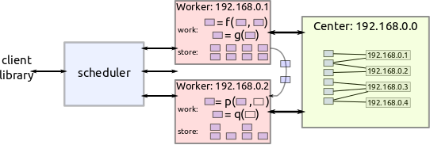

Worker
======

We build a distributed network from two kinds of nodes.

*  A single scheduler node
*  Several Worker nodes

This page describes the worker nodes.

Serve Data
~~~~~~~~~~

Workers serve data from a local dictionary of data::

   {'x': np.array(...),
    'y': pd.DataFrame(...)}

Operations include normal dictionary operations, like get, set, and delete
key-value pairs.  In the following example we connect to two workers, collect
data from one worker and send it to another.

.. code-block:: python

   alice = rpc(ip='192.168.0.101', port=8788)
   d = yield alice.get_data(keys=['x', 'y'])

   bob = rpc(ip='192.168.0.102', port=8788)
   yield bob.update_data(data=d)

However, this is only an example, typically one does not manually manage data
transfer between workers.  They handle that as necessary on their own.

Compute
~~~~~~~

Workers evaluate functions provided by the user on their data.  They evaluate
functions either on their data or can automatically collect data from peers (as
shown above) if they don't have the necessary data but their peers do::

    z <- add(x, y)  # can be done with only local data
    z <- add(x, a)  # need to find out where we can get 'a'

The result of such a computation on our end is just a response ``b'OK'``.  The
actual result stays on the remote worker.

.. code-block:: python

   >>> response, metadata = yield alice.compute(function=add, keys=['x', 'a'])
   >>> response
   b'OK'
   >>> metadata
   {'nbytes': 1024}

The worker also reports back to the center/scheduler whenever it completes a
computation.  Metadata storage is centralized but all data transfer is
peer-to-peer.  Here is a quick example of what happens during a call to
``compute``::

   client:  Hey Alice!   Compute ``z <- add(x, a)``

   Alice:   Hey Center!  Who has a?
   Center:  Hey Alice!   Bob has a.
   Alice:   Hey Bob!     Send me a!
   Bob:     Hey Alice!   Here's a!

   Alice:   Hey Client!  I've computed z and am holding on to it!
   Alice:   Hey Center!  I have z!

.. autoclass:: distributed.worker.Worker
