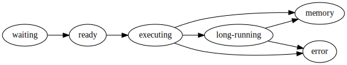
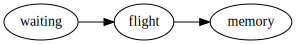

Worker
======

Overview
--------

Workers provide two functions:

1.  Compute tasks as directed by the scheduler
2.  Store and serve computed results to other workers or clients

Each worker contains a ThreadPool that it uses to evaluate tasks as requested
by the scheduler.  It stores the results of these tasks locally and serves them
to other workers or clients on demand.  If the worker is asked to evaluate a
task for which it does not have all of the necessary data then it will reach
out to its peer workers to gather the necessary dependencies.

A typical conversation between a scheduler and two workers Alice and Bob may
look like the following::

   Scheduler -> Alice:  Compute ``x <- add(1, 2)``!
   Alice -> Scheduler:  I've computed x and am holding on to it!

   Scheduler -> Bob:    Compute ``y <- add(x, 10)``!
                        You will need x.  Alice has x.
   Bob -> Alice:        Please send me x.
   Alice -> Bob:        Sure.  x is 3!
   Bob -> Scheduler:    I've computed y and am holding on to it!

Storing Data
------------

Data is stored locally in a dictionary in the ``.data`` attribute that
maps keys to the results of function calls.

.. code-block:: python

   >>> worker.data
   {'x': 3,
    'y': 13,
    ...
    '(df, 0)': pd.DataFrame(...),
    ...
    }

This ``.data`` attribute is a ``MutableMapping`` that is typically a
combination of in-memory and on-disk storage with an LRU policy to move data
between them.

Thread Pool
-----------

Each worker sends computations to a thread in a
`concurrent.futures.ThreadPoolExecutor <https://docs.python.org/3/library/concurrent.futures.html#concurrent.futures.ThreadPoolExecutor>`_
for computation.  These computations occur in the same process as the Worker
communication server so that they can access and share data efficiently between
each other.  For the purposes of data locality all threads within a worker are
considered the same worker.

If your computations are mostly numeric in nature (for example NumPy and Pandas
computations) and release the GIL entirely then it is advisable to run
``dask-worker`` processes with many threads and one process.  This reduces
communication costs and generally simplifies deployment.

If your computations are mostly Python code and don't release the GIL then it
is advisable to run ``dask-worker`` processes with many processes and one
thread per core::

   $ dask-worker scheduler:8786 --nprocs 8

If your computations are external to Python and long-running and don't release
the GIL then beware that while the computation is running the worker process
will not be able to communicate to other workers or to the scheduler.  This
situation should be avoided.  If you don't link in your own custom C/Fortran
code then this topic probably doesn't apply to you.

Command Line tool
-----------------

Use the ``dask-worker`` command line tool to start an individual worker.  Here
are the available options::

   $ dask-worker --help
   Usage: dask-worker [OPTIONS] SCHEDULER

   Options:
     --worker-port INTEGER  Serving worker port, defaults to randomly assigned
     --http-port INTEGER    Serving http port, defaults to randomly assigned
     --nanny-port INTEGER   Serving nanny port, defaults to randomly assigned
     --port INTEGER         Deprecated, see --nanny-port
     --host TEXT            Serving host. Defaults to an ip address that can
                            hopefully be visible from the scheduler network.
     --nthreads INTEGER     Number of threads per process. Defaults to number of
                            cores
     --nprocs INTEGER       Number of worker processes.  Defaults to one.
     --name TEXT            Alias
     --memory-limit TEXT     Number of bytes before spilling data to disk
     --no-nanny
     --help                 Show this message and exit.

Internal Scheduling
-------------------

Internally tasks that come to the scheduler proceed through the following
pipeline:

The worker also tracks data dependencies that are required to run the tasks
above.  These follow through a simpler pipeline:

As tasks arrive they are prioritized and put into a heap.  They are then taken
from this heap in turn to have any remote dependencies collected.  For each
dependency we select a worker at random that has that data and collect the
dependency from that worker.  To improve bandwidth we opportunistically gather
other dependencies of other tasks that are known to be on that worker, up to a
maximum of 200MB of data (too little data and bandwidth suffers, too much data
and responsiveness suffers).  We use a fixed number of connections (around
10-50) so as to avoid overly-fragmenting our network bandwidth.  After all
dependencies for a task are in memory we transition the task to the ready state
and put the task again into a heap of tasks that are ready to run.

We collect from this heap and put the task into a thread from a local thread
pool to execute.

Optionally, this task may identify itself as a long-running task (see
:doc:`Tasks launching tasks <task-launch>`), at which point it secedes from the
thread pool.

A task either errs or its result is put into memory.  In either case a response
is sent back to the scheduler.

Memory Management
-----------------

Workers are given a target memory limit to stay under with the
command line ``--memory-limit`` keyword or the ``memory_limit=`` Python
keyword argument.::

    $ dask-worker tcp://scheduler:port --memory-limit=auto  # total available RAM
    $ dask-worker tcp://scheduler:port --memory-limit=4e9  # four gigabytes

Workers use a few different policies to keep memory use beneath this limit:

1.  At 60% of memory load (as estimated by ``sizeof``), spill least recently used data to disk
2.  At 70% of memory load, spill least recently used data to disk regardless of
    what is reported by ``sizeof``
3.  At 80% of memory load, stop accepting new work on local thread pool
4.  At 95% of memory load, terminate and restart the worker

These values can be configured by modifying the ``~/.dask/config.yaml`` file

.. code-block:: yaml

   # Fractions of worker memory at which we take action to avoid memory blowup
   # Set any of the lower three values to False to turn off the behavior entirely
   worker-memory-target: 0.60  # target fraction to stay below
   worker-memory-spill: 0.70  # fraction at which we spill to disk
   worker-memory-pause: 0.80  # fraction at which we pause worker threads
   worker-memory-terminate: 0.95  # fraction at which we terminate the worker

Spill data to Disk
~~~~~~~~~~~~~~~~~~

Every time the worker finishes a task it estimates the size in bytes that the
result costs to keep in memory using the ``sizeof`` function.  This function
defaults to ``sys.getsizeof`` for arbitrary objects which uses the standard
Python `__sizeof__ protocol
<https://docs.python.org/3/library/sys.html#sys.getsizeof>`_, but also has
special-cased implementations for common data types like NumPy arrays and
Pandas dataframes.

When the sum of the number of bytes of the data in memory exceeds 60% of the
available threshold the worker will begin to dump the least recently used data
to disk.  You can control this location with the ``--local-directory``
keyword.::

   $ dask-worker tcp://scheduler:port --memory-limit 4e9 --local-directory /scratch

That data is still available and will be read back from disk when necessary.
On the diagnostic dashboard status page disk I/O will show up in the task
stream plot as orange blocks.  Additionally the memory plot in the upper left
will become orange and then red.

Monitor process memory load
~~~~~~~~~~~~~~~~~~~~~~~~~~~

The approach above can fail for a few reasons

1.  Custom objects may not report their memory size accurately
2.  User functions may take up more RAM than expected
3.  Significant amounts of data may accumulate in network I/O buffers

To address this we periodically monitor the memory of the worker process every
200 ms.  If the system reported memory use is above 70% of the target memory
usage then the worker will start dumping unused data to disk, even if internal
``sizeof`` recording hasn't yet reached the normal 60% limit.

Halt worker threads
~~~~~~~~~~~~~~~~~~~

At 80% load the worker's thread pool will stop accepting new tasks.  This
gives time for the write-to-disk functionality to take effect even in the face
of rapidly accumulating data.

Kill Worker
~~~~~~~~~~~

At 95% memory load a worker's nanny process will terminate it.  This is to
avoid having our worker job being terminated by an external job scheduler (like
YARN, Mesos, SGE, etc..).  After termination the nanny will restart the worker
in a fresh state.

API Documentation
-----------------

.. autoclass:: distributed.worker.Worker
